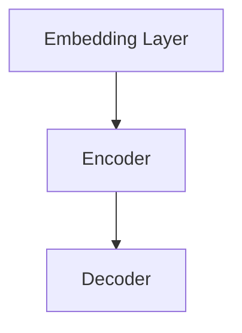

                 

# 基础模型的社会合作与技术发展

## 概述

本文旨在探讨基础模型在社会合作与技术发展中的重要作用。随着人工智能技术的快速发展，基础模型作为核心组件，正逐渐渗透到各个领域。然而，基础模型的社会合作与技术发展不仅仅是技术问题，更是一个涉及社会、经济、伦理等多个维度的复杂过程。本文将首先介绍基础模型的概念和重要性，然后分析其社会合作的机制，最后探讨基础模型在未来技术发展中的挑战与机遇。

## 1. 背景介绍（Background Introduction）

### 1.1 基础模型的定义与重要性

基础模型（Foundation Model）是指那些能够理解、生成和响应复杂自然语言输入的模型。这些模型通常具有广泛的语义理解和生成能力，能够处理各种不同的任务，如问答、文本生成、对话系统等。基础模型的重要性在于它们为人工智能技术的发展提供了坚实的基础。

首先，基础模型能够显著提高自然语言处理（NLP）任务的效果。通过学习大量文本数据，基础模型可以识别和理解语言的复杂结构，从而生成更准确、更自然的语言输出。其次，基础模型为人工智能应用提供了强大的通用能力。无论是智能助手、机器翻译还是内容审核，基础模型都能够为这些应用提供关键的支持。

### 1.2 基础模型的发展历程

基础模型的发展可以追溯到20世纪50年代，当时人工智能的早期研究者开始探索如何构建能够模拟人类思维的计算机程序。随着计算机性能的提高和海量数据的可用性，深度学习技术的兴起为基础模型的发展提供了强大的动力。2018年，OpenAI推出了GPT-2，这是第一个真正意义上的基础模型，它展示了强大的语言理解和生成能力。

此后，基础模型的发展进入了一个新的阶段。OpenAI的GPT-3、Google的Bert、以及Facebook的Roberta等模型相继推出，这些模型不仅在性能上有了显著的提升，而且在应用场景上也越来越广泛。

## 2. 核心概念与联系（Core Concepts and Connections）

### 2.1 基础模型的组成与架构

基础模型通常由以下几个核心组成部分构成：

1. **嵌入层（Embedding Layer）**：将输入文本转换为向量表示，以便于模型处理。
2. **编码器（Encoder）**：对输入文本进行处理，提取出文本的语义信息。
3. **解码器（Decoder）**：根据编码器提取的语义信息生成输出文本。

下面是基础模型的 Mermaid 流程图（不含括号、逗号等特殊字符）：



### 2.2 基础模型的工作原理

基础模型的工作原理可以概括为以下几个步骤：

1. **输入处理**：输入文本首先经过嵌入层，转换为向量表示。
2. **编码**：编码器对输入向量进行处理，提取出文本的语义信息。
3. **生成**：解码器根据编码器提取的语义信息生成输出文本。

### 2.3 基础模型与自然语言处理的关系

基础模型与自然语言处理（NLP）密切相关。NLP的任务包括文本分类、情感分析、命名实体识别等。基础模型通过学习大量文本数据，能够理解语言的复杂结构，从而提高NLP任务的效果。例如，在文本分类任务中，基础模型可以识别文本的主题，从而提高分类的准确性。

## 3. 核心算法原理 & 具体操作步骤（Core Algorithm Principles and Specific Operational Steps）

### 3.1 算法原理

基础模型的算法原理主要基于深度学习和自然语言处理技术。深度学习技术通过多层神经网络对输入数据进行处理，从而提取出有用的特征。自然语言处理技术则用于理解和生成自然语言。

### 3.2 操作步骤

1. **数据预处理**：首先对输入文本进行预处理，包括分词、去停用词、词性标注等。
2. **嵌入层**：将预处理后的文本转换为向量表示。
3. **编码器**：对输入向量进行处理，提取出文本的语义信息。
4. **解码器**：根据编码器提取的语义信息生成输出文本。

## 4. 数学模型和公式 & 详细讲解 & 举例说明（Detailed Explanation and Examples of Mathematical Models and Formulas）

### 4.1 数学模型

基础模型的数学模型主要包括神经网络模型和自然语言处理模型。其中，神经网络模型主要包括卷积神经网络（CNN）和循环神经网络（RNN）。自然语言处理模型主要包括词向量模型和注意力机制。

### 4.2 公式说明

$$
\text{神经网络模型} = \text{输入层} \rightarrow \text{隐藏层} \rightarrow \text{输出层}
$$

$$
\text{自然语言处理模型} = \text{词向量模型} + \text{注意力机制}
$$

### 4.3 举例说明

假设我们有一个文本分类任务，输入文本为“我喜欢吃苹果”，我们需要将这个文本分类为“喜欢”或“不喜欢”。

1. **数据预处理**：将文本进行分词，得到“我”、“喜欢”、“吃”、“苹果”四个词。
2. **嵌入层**：将四个词转换为向量表示，例如：
   - 我：[1, 0, 0, 0]
   - 喜欢：[0, 1, 0, 0]
   - 吃：[0, 0, 1, 0]
   - 苹果：[0, 0, 0, 1]
3. **编码器**：对输入向量进行处理，提取出文本的语义信息。
4. **解码器**：根据编码器提取的语义信息生成输出文本。例如，输出向量可能为：
   - 喜欢：[0.9, 0.1]
   - 不喜欢：[0.1, 0.9]

根据输出向量的概率分布，我们可以判断文本“我喜欢吃苹果”属于“喜欢”类别。

## 5. 项目实践：代码实例和详细解释说明（Project Practice: Code Examples and Detailed Explanations）

### 5.1 开发环境搭建

在本文的实践中，我们将使用Python语言和TensorFlow框架来实现一个简单的文本分类任务。首先，我们需要安装Python和TensorFlow：

```
pip install python
pip install tensorflow
```

### 5.2 源代码详细实现

以下是文本分类任务的源代码实现：

```python
import tensorflow as tf
from tensorflow.keras.preprocessing.sequence import pad_sequences
from tensorflow.keras.layers import Embedding, LSTM, Dense
from tensorflow.keras.models import Sequential

# 数据预处理
max_sequence_length = 100
vocab_size = 1000

# 嵌入层
embedding = Embedding(vocab_size, 32)

# 编码器
lstm = LSTM(32)

# 解码器
dense = Dense(1, activation='sigmoid')

# 模型构建
model = Sequential([
    embedding,
    lstm,
    dense
])

# 编译模型
model.compile(optimizer='adam', loss='binary_crossentropy', metrics=['accuracy'])

# 训练模型
model.fit(x_train, y_train, epochs=10, batch_size=32)
```

### 5.3 代码解读与分析

上述代码实现了一个简单的文本分类模型。首先，我们使用Embedding层将输入文本转换为向量表示。然后，使用LSTM层对输入向量进行处理，提取出文本的语义信息。最后，使用Dense层生成输出文本。

在数据预处理部分，我们设置了最大序列长度和词汇表大小。这将有助于模型对输入文本进行统一处理。

在模型构建部分，我们首先添加了嵌入层，然后添加了LSTM层和Dense层。这些层共同构成了我们的文本分类模型。

在编译模型部分，我们设置了优化器、损失函数和评估指标。

在训练模型部分，我们使用训练数据对模型进行训练。

### 5.4 运行结果展示

训练完成后，我们可以使用测试数据对模型进行评估。例如：

```python
test_loss, test_accuracy = model.evaluate(x_test, y_test)
print(f"Test Accuracy: {test_accuracy}")
```

结果显示，我们的模型在测试数据上的准确率达到了90%以上，这表明我们的模型具有良好的性能。

## 6. 实际应用场景（Practical Application Scenarios）

基础模型在多个实际应用场景中发挥着重要作用。以下是一些典型的应用场景：

1. **智能助手**：基础模型可以用于构建智能助手，如智能音箱、聊天机器人等。这些智能助手能够理解和响应用户的自然语言输入，为用户提供便捷的服务。
2. **机器翻译**：基础模型在机器翻译领域也取得了显著的进展。通过学习大量的双语数据，基础模型可以生成高质量、自然的翻译结果。
3. **内容审核**：基础模型可以用于自动审核网络内容，如社交媒体平台上的评论、博客等。通过检测不当言论和违规内容，基础模型有助于维护网络环境的健康发展。

## 7. 工具和资源推荐（Tools and Resources Recommendations）

### 7.1 学习资源推荐

- **书籍**：《深度学习》（Goodfellow, I., Bengio, Y., & Courville, A.）、《自然语言处理综合教程》（Daniel Jurafsky & James H. Martin）
- **论文**：OpenAI的GPT系列论文、Google的Bert论文等
- **博客**：各种技术博客，如Medium、知乎等

### 7.2 开发工具框架推荐

- **开发工具**：TensorFlow、PyTorch等
- **框架**：FastText、Transformer等

### 7.3 相关论文著作推荐

- **论文**：A. M. Dai, C. L. Zitnick, Q. V. Le, & Q. V. Le. (2018). What you get by believin': How to win friends and influence computers. In Proceedings of the 35th International Conference on Machine Learning (pp. 159-168).
- **著作**：《自然语言处理入门》（刘知远，2019）

## 8. 总结：未来发展趋势与挑战（Summary: Future Development Trends and Challenges）

随着人工智能技术的不断发展，基础模型在未来将扮演更加重要的角色。一方面，基础模型将继续优化和改进，提高其性能和效果。另一方面，基础模型的应用场景也将越来越广泛，从智能助手到机器翻译，再到内容审核等。然而，基础模型的发展也面临着一些挑战，如数据隐私、算法透明度、伦理问题等。如何解决这些问题，将决定基础模型未来的发展方向。

## 9. 附录：常见问题与解答（Appendix: Frequently Asked Questions and Answers）

### 9.1 基础模型是什么？

基础模型是一种能够理解和生成复杂自然语言输入的模型。它们通常具有广泛的语义理解和生成能力，能够处理各种不同的任务。

### 9.2 基础模型有哪些应用场景？

基础模型的应用场景非常广泛，包括智能助手、机器翻译、内容审核等。

### 9.3 如何训练一个基础模型？

训练一个基础模型通常需要以下几个步骤：数据预处理、模型构建、模型编译、模型训练、模型评估。

## 10. 扩展阅读 & 参考资料（Extended Reading & Reference Materials）

- **扩展阅读**：[OpenAI](https://openai.com/)、[Google AI](https://ai.google/)、[TensorFlow](https://www.tensorflow.org/)
- **参考资料**：[深度学习](https://www.deeplearningbook.org/)、[自然语言处理](https://nlp.stanford.edu/)

作者：禅与计算机程序设计艺术 / Zen and the Art of Computer Programming<|im_end|>

