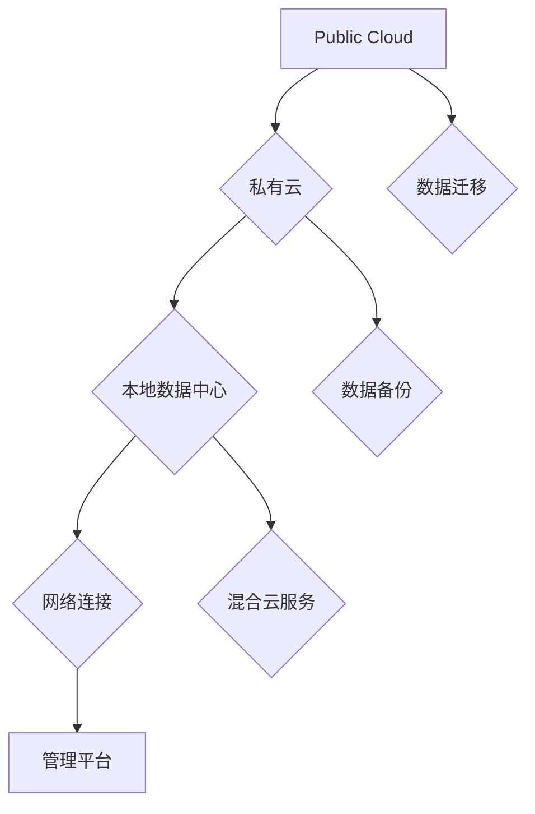

                 

### 文章标题

《多云战略：混合云环境下的应用部署》

### 关键词

多云战略、混合云、应用部署、云服务、云原生、弹性计算、自动化管理、DevOps、微服务架构、容器化、服务网格、持续集成与持续部署、安全性和合规性。

### 摘要

本文将探讨多云战略的重要性，特别是在混合云环境下应用部署的挑战与机遇。我们将详细分析多云架构的设计原则、混合云环境下的应用部署流程，以及如何利用云原生技术来提高应用的弹性和可伸缩性。此外，文章还将讨论自动化管理、微服务架构、容器化和服务网格等关键技术在多云战略中的应用，并提供实际案例和最佳实践。最后，我们将探讨未来多云战略的发展趋势和面临的挑战，以及如何应对这些挑战以实现企业的数字化转型。

## 1. 背景介绍（Background Introduction）

在当今数字化时代，云计算已经成为企业IT战略的重要组成部分。随着云计算技术的不断进步和成熟，越来越多的企业开始采用多云战略，以实现更高的灵活性和可靠性。多云战略（Multi-Cloud Strategy）指的是企业在多个云计算服务提供商之间分配其IT基础设施和应用程序的部署和管理。这种策略允许企业利用不同云服务提供商的优势，优化资源利用，降低成本，并增强系统的可靠性和灵活性。

### 多云战略的优点

**1. 灵活性与选择权**：企业可以自由选择最适合其业务需求的云服务提供商，并在不同云之间迁移应用程序和数据，以获得最佳性能和成本效益。

**2. 可靠性与冗余**：通过在多个云服务提供商之间分配负载，企业可以确保业务连续性和灾难恢复能力，即使在某个云服务出现故障时也能保持正常运行。

**3. 成本优化**：企业可以根据不同云服务的定价模式和资源利用率来优化成本，避免过度采购或资源闲置。

**4. 技术创新与进步**：多云战略鼓励企业采用最先进的技术和工具，从而推动创新和业务发展。

### 混合云环境的挑战

尽管多云战略具有诸多优点，但混合云环境（Hybrid Cloud Environment）的部署和管理也带来了新的挑战：

**1. 管理复杂性**：管理多个云服务提供商和不同类型的基础设施（如公有云、私有云和本地数据中心）会增加运维复杂性。

**2. 集成与兼容性**：确保不同云服务之间的集成和兼容性是一个关键问题，特别是在数据迁移和应用程序部署方面。

**3. 安全性与合规性**：混合云环境中的安全性和合规性要求更高，企业需要确保数据安全和遵守相关法规。

**4. 技术栈统一**：如何在不同云服务中保持一致的技术栈，以保证开发和运维的效率。

### 本文目标

本文的目标是深入探讨多云战略，特别是混合云环境下应用部署的实践和方法。我们将从以下几个方面展开讨论：

**1. 多云架构的设计原则**：分析多云架构的设计原则和最佳实践。

**2. 应用部署流程**：详细描述混合云环境下的应用部署流程，包括设计、开发和运维等环节。

**3. 关键技术**：介绍云原生技术、自动化管理、微服务架构、容器化和服务网格等在多云战略中的应用。

**4. 实际案例与最佳实践**：通过实际案例和最佳实践，展示如何成功地实现多云战略。

**5. 未来趋势与挑战**：探讨多云战略的未来发展趋势和面临的挑战。

通过本文的探讨，我们希望能够为读者提供有价值的见解和实用指南，帮助他们在复杂的混合云环境中实现高效的云原生应用部署。

## 2. 核心概念与联系（Core Concepts and Connections）

在深入探讨多云战略和混合云环境下的应用部署之前，我们首先需要理解一些核心概念和其之间的联系。以下是本文将涉及的主要核心概念：

### 2.1 多云战略

**定义**：多云战略是指企业在多个云计算服务提供商之间分配其IT基础设施和应用程序的部署和管理。

**组成部分**：
- **公有云**：由第三方提供商运营的云服务，如亚马逊AWS、微软Azure和谷歌云。
- **私有云**：由企业内部运营的云服务，通常部署在企业数据中心或专用服务器上。
- **混合云**：结合公有云和私有云的资源，实现不同云服务之间的无缝集成。

**设计原则**：
- **灵活性**：选择最适合业务需求的云服务提供商和方案。
- **冗余与高可用性**：在多个云之间分配负载，提高系统的可靠性。
- **成本优化**：根据不同云服务的定价模式和资源利用率进行优化。

### 2.2 应用部署

**定义**：应用部署是将开发完成的应用程序发布到生产环境中，使其可供用户使用的过程。

**组成部分**：
- **开发**：编写和测试应用程序代码。
- **测试**：对应用程序进行功能测试、性能测试和安全测试。
- **部署**：将应用程序部署到云环境中的适当位置。

**部署模型**：
- **单体部署**：将整个应用程序作为一个单一实体部署。
- **分布式部署**：将应用程序分解为多个组件，分别部署在不同的服务器或云实例上。

### 2.3 云原生技术

**定义**：云原生技术（Cloud-Native Technologies）是指专为云计算环境设计的技术，利用动态分配的资源，实现高度可伸缩、自修复和微服务化的应用程序。

**核心概念**：
- **容器化**：通过容器（如Docker）封装应用程序及其运行环境，实现应用程序的可移植性和一致性。
- **微服务架构**：将应用程序分解为小型、独立的服务，每个服务负责特定的功能，便于管理和扩展。
- **持续集成与持续部署（CI/CD）**：自动化应用程序的集成、测试和部署过程，提高开发效率和质量。

### 2.4 自动化管理

**定义**：自动化管理（Automated Management）是指通过自动化工具和脚本，实现基础设施的部署、配置和管理。

**核心概念**：
- **基础设施即代码（IaC）**：使用代码来定义和管理基础设施。
- **配置管理**：自动配置和管理服务器、网络和其他IT资源。
- **监控与告警**：自动化监控系统的性能和状态，并在出现问题时触发告警。

### 2.5 安全性与合规性

**定义**：安全性与合规性（Security and Compliance）是指在多云环境中确保数据安全、系统稳定和符合相关法规和标准。

**核心概念**：
- **数据加密**：使用加密技术保护数据的安全。
- **访问控制**：通过身份验证和授权机制，限制对系统和数据的访问。
- **日志审计**：记录系统操作和用户行为，以便进行审计和故障排除。

### 2.6 微服务架构与容器化

**定义**：微服务架构（Microservices Architecture）是一种将应用程序分解为多个小型、独立服务的架构模式，每个服务负责特定的功能。

**与容器化的关系**：
- **容器化**提供了微服务部署的基础，通过容器封装服务及其运行环境，实现服务的可移植性和一致性。
- **服务网格**：用于管理和通信的轻量级基础设施层，提供服务间的安全通信和流量管理。

### 2.7 持续集成与持续部署（CI/CD）

**定义**：持续集成与持续部署（Continuous Integration/Continuous Deployment, CI/CD）是一种自动化软件开发和交付流程的方法。

**与自动化管理的关系**：
- **自动化管理**：通过自动化工具实现CI/CD流程中的各个环节，如构建、测试、部署等。
- **DevOps**：将开发和运维结合起来，实现快速迭代和高效交付。

### 2.8 服务网格（Service Mesh）

**定义**：服务网格（Service Mesh）是一种用于管理和通信的轻量级基础设施层，专注于服务间的网络通信。

**核心功能**：
- **服务发现**：自动发现和注册服务。
- **流量管理**：动态路由流量，确保服务的可靠性和性能。
- **安全**：通过加密和身份验证保护服务间的通信。

### 2.9 多云战略与混合云环境的联系

**定义**：混合云环境（Hybrid Cloud Environment）是指结合公有云、私有云和本地数据中心的一种云环境。

**联系**：
- **多云战略**是实现混合云环境的关键，通过在多个云之间分配应用程序和资源，实现灵活性和冗余。
- **混合云环境**为多云战略提供了实际的基础设施和运行环境。

通过理解这些核心概念和其之间的联系，我们可以更好地设计、部署和管理混合云环境中的应用程序，实现多云战略的目标。

#### 2.1 什么是多云战略？

多云战略（Multi-Cloud Strategy）是一种企业IT策略，旨在通过利用多个云服务提供商的资源和服务来增强其业务运营的灵活性、可靠性和成本效益。在这种策略下，企业不会将所有的IT基础设施和应用程序集中在一个云服务提供商上，而是选择将不同的应用程序和任务部署在最适合其需求的不同云服务上。以下是对多云战略的详细解释：

**定义和核心概念**：

- **多云战略**：企业通过使用多个云服务提供商（如亚马逊AWS、微软Azure、谷歌云等）来部署和管理其IT资源和应用程序。
- **云服务提供商**：这些是提供云计算服务的公司，它们提供了各种基础设施即服务（IaaS）、平台即服务（PaaS）和软件即服务（SaaS）产品。
- **资源分配**：企业根据应用程序的需求和优先级，将不同的资源和任务分配到不同的云服务上。

**设计原则和目标**：

- **灵活性**：企业可以根据业务需求和市场变化，灵活地选择和使用不同云服务提供商的资源。
- **冗余和高可用性**：通过将关键业务应用程序分布在多个云服务提供商上，企业可以提高系统的可靠性和灾难恢复能力。
- **成本优化**：利用不同云服务提供商的价格差异，企业可以优化成本，避免长期锁定在一个供应商上。
- **技术创新**：多云战略鼓励企业采用新技术和最佳实践，从而推动业务创新。

**实施步骤**：

1. **需求分析**：了解企业的业务需求、应用程序特性、数据安全要求等，为多云战略的实施提供基础。
2. **云服务提供商评估**：选择最适合企业需求的云服务提供商，并比较不同云服务提供商的产品和服务。
3. **资源分配**：根据应用程序的特性和需求，将不同的资源和任务分配到不同的云服务上。
4. **集成与兼容性**：确保不同云服务之间的集成和兼容性，实现无缝的数据迁移和应用程序部署。
5. **管理和监控**：建立一套有效的管理和监控机制，确保多云环境中的资源和应用程序的安全、性能和可靠性。

**应用场景**：

- **跨区域业务**：企业可以利用多个云服务提供商在不同地区的资源，实现全球业务的覆盖和本地化运营。
- **混合云环境**：企业可以在公有云和私有云之间实现资源的动态调配，以满足不同业务场景的需求。
- **数据备份与灾难恢复**：通过在多个云服务提供商之间备份关键数据，企业可以提高数据的安全性和可靠性。

**优势和挑战**：

**优势**：

- **灵活性**：企业可以根据业务需求，灵活选择不同的云服务提供商和资源。
- **可靠性**：通过在多个云服务提供商之间分配负载，企业可以提高系统的可靠性和灾难恢复能力。
- **成本优化**：企业可以利用不同云服务提供商的价格差异，实现成本优化。
- **技术创新**：多云战略鼓励企业采用新技术和最佳实践，推动业务创新。

**挑战**：

- **管理复杂性**：管理多个云服务提供商和不同类型的基础设施（如公有云、私有云和本地数据中心）会增加运维复杂性。
- **集成与兼容性**：确保不同云服务之间的集成和兼容性是一个关键问题，特别是在数据迁移和应用程序部署方面。
- **安全性与合规性**：混合云环境中的安全性和合规性要求更高，企业需要确保数据安全和遵守相关法规。
- **技术栈统一**：如何在不同云服务中保持一致的技术栈，以保证开发和运维的效率。

通过深入了解多云战略的定义、设计原则、实施步骤、应用场景和优势与挑战，企业可以更好地制定和实施多云战略，以实现其业务目标和数字化转型。

#### 2.2 混合云环境的定义和核心概念

混合云环境（Hybrid Cloud Environment）是一种将公有云、私有云和本地数据中心结合在一起的综合云环境。在这种环境中，企业可以根据不同的业务需求和应用场景，灵活地选择和分配不同的云资源和基础设施。以下是混合云环境的详细定义和核心概念：

**定义**：

混合云环境是指将公有云、私有云和本地数据中心集成在一起，形成一个统一、可管理的云基础设施。在这种环境中，不同的云服务提供商和数据中心可以通过网络和自动化工具进行连接和协调，实现资源的动态调配和优化。

**核心概念**：

1. **公有云**（Public Cloud）：公有云是由第三方云服务提供商运营的云计算资源，如亚马逊AWS、微软Azure和谷歌云。这些云服务通常是按需提供，可以根据需求灵活扩展和缩小资源规模。

2. **私有云**（Private Cloud）：私有云是由企业内部运营的云基础设施，通常部署在企业数据中心或专用服务器上。私有云提供更高的安全性和控制性，适合处理敏感数据和关键业务应用程序。

3. **本地数据中心**（On-Premises Data Center）：本地数据中心是指企业自己运营的数据中心，包括服务器、存储和网络设备。这些设备通常用于处理企业内部的应用程序和数据，并提供高可靠性和低延迟的访问。

4. **网络连接**（Network Connectivity）：混合云环境中的不同云服务和数据中心之间需要通过高效的网络连接进行数据传输和通信。这种连接可以是物理网络连接，如光纤或VPN，也可以是虚拟网络连接，如软件定义网络（SDN）。

5. **管理平台**（Management Platform）：为了实现混合云环境中的资源管理和监控，企业需要使用统一的管理平台。这些平台提供了全面的监控、自动化、配置管理和日志记录功能，帮助企业有效地管理和优化混合云环境。

**设计原则**：

1. **灵活性**：混合云环境的设计需要具有高度灵活性，以适应不同的业务需求和变化。

2. **可扩展性**：混合云环境需要支持资源的动态扩展和缩小，以满足业务增长和需求变化。

3. **高可用性**：通过在多个云服务和数据中心之间分配负载，混合云环境可以提高系统的可靠性和灾难恢复能力。

4. **安全性**：混合云环境需要确保数据的安全性和合规性，包括数据加密、访问控制和安全审计等。

5. **集成与兼容性**：确保不同云服务和数据中心之间的集成和兼容性，实现无缝的数据迁移和应用程序部署。

**应用场景**：

1. **跨区域业务**：企业可以利用混合云环境在不同地区部署应用程序和数据，实现全球业务的覆盖和本地化运营。

2. **数据备份与灾难恢复**：通过将关键数据和应用程序在多个云服务和数据中心之间备份和复制，企业可以提高数据的可靠性和安全性。

3. **混合云迁移**：企业可以将部分应用程序和数据从本地数据中心迁移到公有云，实现云原生应用的开发和部署。

4. **混合云服务**：企业可以在混合云环境中整合不同云服务提供商的资源和服务，实现更高效和成本优化的业务运营。

**核心概念图解**：

以下是混合云环境的核心概念图解，展示了不同云服务提供商、本地数据中心和网络的连接关系：



通过图解，我们可以看到混合云环境中的各个组成部分如何相互连接和协作，实现灵活、可靠和高效的云资源管理。

#### 2.3 混合云环境下的应用部署流程

在混合云环境下部署应用程序是一个复杂的过程，需要考虑多个云服务提供商、不同类型的基础设施以及多种技术组件的整合。以下是一个详细的应用部署流程，包括设计、开发和运维等环节：

### 2.3.1 设计阶段

**需求分析**：

在应用部署之前，首先需要明确业务需求和目标。这包括了解应用程序的功能、性能要求、数据存储和安全需求。此外，还需要考虑不同云服务提供商的特点和定价模式，以便选择最适合的云服务。

**架构设计**：

根据需求分析的结果，设计应用程序的架构。在混合云环境中，常用的架构模式包括：

- **微服务架构**：将应用程序分解为多个小型、独立的微服务，每个服务负责特定的功能，便于管理和扩展。
- **容器化架构**：使用容器（如Docker）封装应用程序及其运行环境，确保在不同的云环境中具有一致性。
- **混合云架构**：结合公有云和私有云的资源，实现灵活的资源调配和优化。

**数据管理**：

设计数据存储和备份策略，确保数据的安全性和可用性。这可能包括：

- **数据分层存储**：将数据存储在不同的云服务和存储介质中，根据数据的重要性和访问频率进行优化。
- **数据备份和灾难恢复**：在多个云服务和数据中心之间备份关键数据，确保数据的高可用性和灾难恢复能力。

### 2.3.2 开发阶段

**代码编写**：

根据架构设计，编写应用程序的代码。在混合云环境中，代码的编写需要考虑跨云服务的一致性和兼容性，这可能需要使用标准的API和框架。

**测试**：

对应用程序进行全面的测试，包括功能测试、性能测试、安全测试等。在测试过程中，需要确保应用程序在不同云环境中的运行表现一致。

**容器化**：

使用容器化技术（如Docker）将应用程序及其依赖项封装在容器中，以便在不同的云环境中进行部署和运行。

**微服务拆分**：

将应用程序拆分为多个微服务，并为每个微服务编写独立的API和测试用例。这有助于实现应用程序的可维护性和可扩展性。

### 2.3.3 部署阶段

**环境准备**：

根据应用程序的需求，准备不同的云环境，包括公有云、私有云和本地数据中心。这可能包括：

- **基础设施配置**：配置服务器、网络和存储资源。
- **部署工具**：选择和配置自动化部署工具，如Kubernetes、Puppet、Ansible等。

**自动化部署**：

使用自动化工具（如CI/CD流水线）实现应用程序的自动化部署。这包括：

- **构建和打包**：将源代码和依赖项构建和打包成可部署的容器镜像。
- **部署和测试**：将容器镜像部署到不同的云环境中，并进行测试。
- **监控和告警**：监控应用程序的性能和状态，并在出现问题时触发告警。

### 2.3.4 运维阶段

**监控与告警**：

使用监控工具（如Prometheus、Grafana）监控应用程序的性能和状态，并在出现问题时触发告警。

**日志管理**：

收集和管理应用程序的日志，以便进行故障排除和性能分析。

**自动化运维**：

使用自动化工具（如Puppet、Ansible、Terraform）实现基础设施的自动化配置和管理。

**更新与升级**：

定期更新和升级应用程序，确保其安全和性能。这可能包括：

- **自动化更新**：使用自动化工具定期更新应用程序的依赖项和配置。
- **回滚策略**：在更新失败时，能够快速回滚到上一个稳定版本。

### 2.3.5 备份与恢复

**数据备份**：

定期备份应用程序的数据，确保数据的安全性和可恢复性。

**灾难恢复**：

制定灾难恢复计划，确保在发生灾难时能够快速恢复业务。

**混合云迁移**：

根据业务需求，将应用程序和数据进行迁移，实现混合云环境的灵活性和扩展性。

通过以上流程，企业可以在混合云环境中高效地设计和部署应用程序，实现灵活、可靠和高效的云原生应用部署。

#### 2.4 核心算法原理 & 具体操作步骤

在混合云环境下，核心算法的设计和实现对于确保应用程序的弹性和可伸缩性至关重要。以下我们将介绍几个关键算法，并详细解释其原理和具体操作步骤。

### 2.4.1 负载均衡算法

**原理**：

负载均衡算法（Load Balancing Algorithm）是一种用于分配网络流量到多个服务器的技术，以确保资源的充分利用和系统的可靠性。负载均衡算法的核心目标是根据当前系统的负载情况，动态地分配流量，避免单个服务器过载。

**具体操作步骤**：

1. **监控服务器状态**：使用监控工具（如Prometheus）实时监控每个服务器的CPU使用率、内存使用率、网络带宽等关键指标。
2. **流量分配策略**：根据监控数据，选择合适的流量分配策略，如轮询（Round Robin）、最小连接数（Least Connections）或基于权重（Weighted Round Robin）等。
3. **流量转发**：使用负载均衡器（如Nginx、HAProxy）将流量按策略转发到不同的服务器。
4. **动态调整**：根据监控数据动态调整流量分配策略，确保系统的负载平衡。

### 2.4.2 服务发现算法

**原理**：

服务发现算法（Service Discovery Algorithm）是一种用于自动发现和注册服务，以便在不同云环境中实现服务间通信和集成。服务发现算法的核心目标是确保服务之间的通信始终有效，即使在服务实例发生迁移或增加时也能保持稳定。

**具体操作步骤**：

1. **服务注册**：当一个新的服务实例启动时，自动将其信息（如服务名称、端口号、IP地址等）注册到服务注册中心（如Consul、Eureka）。
2. **服务查询**：当客户端需要访问服务时，查询服务注册中心，获取可用的服务实例列表。
3. **动态更新**：服务实例的运行状态发生变化时（如IP地址或端口号变更），自动更新服务注册中心，确保客户端能够访问最新的服务实例。
4. **健康检查**：定期对服务实例进行健康检查，确保服务可用性，并在服务实例出现故障时自动将其从可用列表中移除。

### 2.4.3 弹性伸缩算法

**原理**：

弹性伸缩算法（Elastic Scaling Algorithm）是一种根据实际负载动态调整系统资源的技术，以确保系统在高峰期具备足够的处理能力，同时在低峰期节省资源。弹性伸缩算法的核心目标是实现系统的自动扩容和缩容，提高资源利用率和成本效益。

**具体操作步骤**：

1. **监控负载**：使用监控工具（如Kubernetes Metrics Server）实时监控系统的负载情况，包括CPU使用率、内存使用率、网络带宽等。
2. **设置阈值**：根据业务需求和系统性能，设置负载阈值，如CPU使用率超过80%时触发扩容。
3. **扩容操作**：
   - **增加实例**：当负载超过阈值时，自动增加服务实例的数量。
   - **部署新实例**：为新增加的实例部署应用程序和依赖项。
   - **健康检查**：对新实例进行健康检查，确保其可用性。
4. **缩容操作**：
   - **降低实例**：当负载低于阈值时，自动减少服务实例的数量。
   - **移除实例**：根据负载和性能指标，移除不必要的实例。

### 2.4.4 故障恢复算法

**原理**：

故障恢复算法（Fault Recovery Algorithm）是一种在系统发生故障时，自动检测、定位并恢复系统的技术。故障恢复算法的核心目标是确保系统的稳定运行，减少故障对业务的影响。

**具体操作步骤**：

1. **故障检测**：使用监控工具（如Prometheus）监控系统的运行状态，及时发现故障。
2. **故障定位**：通过日志分析、健康检查和故障排查工具（如ELK Stack、Grafana）定位故障发生的位置和原因。
3. **故障恢复**：
   - **自动恢复**：在可能的情况下，自动执行恢复操作，如重启服务实例、重试请求等。
   - **人工干预**：在自动恢复无效时，人工干预进行故障排除和系统恢复。
4. **故障记录**：记录故障发生的时间和原因，以便进行故障分析和改进。

通过以上核心算法的设计和实现，企业可以在混合云环境中实现高效的资源管理和系统稳定性，确保应用程序的弹性和可伸缩性。

### 4. 数学模型和公式 & 详细讲解 & 举例说明

在混合云环境中，数学模型和公式对于优化资源利用、成本控制和性能调优具有重要意义。以下我们将介绍几个关键数学模型和公式，并详细讲解其含义和应用。

#### 4.1 负载均衡模型（Load Balancing Model）

**公式**：
$$
L_i = \frac{W_i}{\sum_{i=1}^{n} W_i}
$$

其中，$L_i$ 表示请求被分配到第 $i$ 个服务器的概率，$W_i$ 表示第 $i$ 个服务器的权重。

**详细讲解**：

负载均衡模型用于计算在多服务器环境中，请求被分配到各个服务器的概率。权重 $W_i$ 可以根据服务器的性能、负载和历史数据进行调整。此模型确保了高性能的服务器承担更多的请求，从而优化系统的整体性能。

**举例说明**：

假设有三个服务器，它们的权重分别为 $W_1 = 2$、$W_2 = 1$ 和 $W_3 = 1$。根据负载均衡模型，请求被分配到三个服务器的概率分别为：
$$
L_1 = \frac{2}{2+1+1} = 0.6
$$
$$
L_2 = \frac{1}{2+1+1} = 0.3
$$
$$
L_3 = \frac{1}{2+1+1} = 0.3
$$

因此，请求被分配到第一个服务器的概率最高，为 60%。

#### 4.2 弹性伸缩模型（Elastic Scaling Model）

**公式**：
$$
C(t) = C_{min} + \alpha(t - t_{min}) + \beta \cdot sin(\omega \cdot t + \phi)
$$

其中，$C(t)$ 表示在时间 $t$ 时的系统成本，$C_{min}$ 为最小成本，$\alpha$ 和 $\beta$ 为常数，$t_{min}$ 为最小成本发生的时间，$\omega$ 和 $\phi$ 为三角函数的参数。

**详细讲解**：

弹性伸缩模型用于根据系统负载动态调整资源，以实现成本优化。模型中的三角函数用于模拟负载的周期性变化，$\alpha$ 和 $\beta$ 调整了成本随负载变化的敏感度。通过优化 $\alpha$、$\beta$ 和 $t_{min}$，可以实现系统的最小成本。

**举例说明**：

假设最小成本为 $C_{min} = 1000$，$\alpha = 0.1$，$\beta = 0.2$，$t_{min} = 10$，$\omega = 0.1$，$\phi = 0$。在一天的时间范围内（$t \in [0, 24]$），系统成本计算如下：
$$
C(t) = 1000 + 0.1(t - 10) + 0.2 \cdot sin(0.1 \cdot t)
$$

当 $t = 12$ 时，成本计算如下：
$$
C(12) = 1000 + 0.1(12 - 10) + 0.2 \cdot sin(0.1 \cdot 12) \approx 1003
$$

#### 4.3 服务质量模型（Quality of Service Model）

**公式**：
$$
QoS = \frac{R - D}{T}
$$

其中，$QoS$ 表示服务质量，$R$ 表示请求处理速率，$D$ 表示请求失败率，$T$ 表示请求处理时间。

**详细讲解**：

服务质量模型用于评估系统的性能和可靠性。服务质量越高，表示系统能够更高效地处理请求，减少请求失败率。

**举例说明**：

假设在一个月的时间范围内（$T = 30$ 天），系统处理请求的速率 $R = 1000$ 次/天，请求失败率 $D = 10$ 次/天。服务质量计算如下：
$$
QoS = \frac{1000 - 10}{30} \approx 32.7
$$

因此，该系统的服务质量约为 32.7。

通过以上数学模型和公式的讲解和举例，我们可以更好地理解和应用这些工具，优化混合云环境中的资源利用、成本控制和性能调优。

#### 5.1 开发环境搭建

在进行混合云环境下的应用部署之前，首先需要搭建一个稳定且高效的开发环境。以下是搭建开发环境的详细步骤：

**1. 系统要求**

确保开发机器满足以下最低系统要求：
- 操作系统：Linux（推荐CentOS 7或以上版本）或MacOS
- CPU：至少4核处理器
- 内存：16GB及以上
- 硬盘：100GB及以上

**2. 软件安装**

安装必要的软件和工具，包括：
- Docker：容器化技术，用于封装和运行应用程序。
- Kubernetes：用于自动化容器的部署、扩展和管理。
- kubectl：Kubernetes命令行工具，用于与Kubernetes集群交互。
- Jenkins：用于自动化构建、测试和部署。
- Prometheus：用于监控系统的性能和状态。
- Grafana：用于可视化监控数据。

安装步骤如下：

```bash
# 安装Docker
sudo yum install docker
sudo systemctl start docker
sudo systemctl enable docker

# 安装Kubernetes
sudo yum install -y kubelet kubeadm kubectl --disableexcludes=kubelet
sudo systemctl enable kubelet
sudo systemctl start kubelet

# 安装Jenkins
sudo yum install jenkins
sudo systemctl enable jenkins
sudo systemctl start jenkins

# 安装Prometheus和Grafana
sudo yum install -y prometheus grafana
sudo systemctl enable prometheus grafana
sudo systemctl start prometheus grafana
```

**3. 配置Kubernetes集群**

以下步骤用于配置一个简单的Kubernetes集群，用于后续的应用部署。

```bash
# 初始化Master节点
sudo kubeadm init --pod-network-cidr=10.244.0.0/16

# 配置kubectl工具
mkdir -p $HOME/.kube
sudo cp -i /etc/kubernetes/admin.conf $HOME/.kube/config
sudo chown $(id -u):$(id -g) $HOME/.kube/config

# 安装Pod网络插件（此处使用Calico）
kubectl apply -f https://docs.projectcalico.org/manifests/calico.yaml
```

**4. 验证集群状态**

确保Kubernetes集群正常运行：

```bash
kubectl get nodes
kubectl get pods --all-namespaces
```

**5. 配置Jenkins与Kubernetes集成**

配置Jenkins与Kubernetes集群的集成，以便在Jenkins中进行构建和部署：

```bash
# 安装Jenkins插件（如Kubernetes插件）
sudo jenkinsPluginInstall --plugins kubernetes
```

在Jenkins中创建一个新的作业，配置以下参数：
- 作业类型：Freestyle project
- 构建触发器： SCM触发器
- 基于SCM的变化触发构建
- 建议的SCM插件：Git
- Git插件配置：仓库URL、分支、用户名和密码
- 构建步骤：执行Shell脚本，包含构建和部署命令
- Kubernetes插件配置：集群、命名空间、部署配置文件

**6. 配置Prometheus与Grafana**

配置Prometheus和Grafana，用于监控Kubernetes集群的状态和性能：

```bash
# Prometheus配置
kubectl create -f prometheus.yml

# Grafana配置
sudo grafana-server start
```

在Grafana中添加数据源和仪表板，选择Prometheus作为数据源，并导入预定义的Kubernetes仪表板。

通过以上步骤，我们成功搭建了一个包含Docker、Kubernetes、Jenkins、Prometheus和Grafana的混合云开发环境。这个环境为后续的应用部署和监控提供了坚实的基础。

#### 5.2 源代码详细实现

在搭建好开发环境后，接下来我们将介绍如何使用Docker和Kubernetes来部署一个简单的Web应用程序。这个例子将展示一个使用Python Flask框架构建的博客应用程序，以及如何通过Kubernetes进行部署和管理。

**1. 项目结构**

```bash
my-blog/
├── app.py
├── Dockerfile
├── requirements.txt
└── k8s/
    ├── deploy.yaml
    └── service.yaml
```

**2. 应用程序代码**

**app.py**：

```python
from flask import Flask
app = Flask(__name__)

@app.route('/')
def hello():
    return 'Hello, World!'

if __name__ == '__main__':
    app.run(host='0.0.0.0', port=8080)
```

**Dockerfile**：

```Dockerfile
FROM python:3.9-slim

WORKDIR /app

COPY requirements.txt requirements.txt
RUN pip install --no-cache-dir -r requirements.txt

COPY . .

CMD ["python", "app.py"]
```

**requirements.txt**：

```
Flask
```

**3. Kubernetes配置**

**k8s/deploy.yaml**：

```yaml
apiVersion: apps/v1
kind: Deployment
metadata:
  name: my-blog-deployment
spec:
  replicas: 3
  selector:
    matchLabels:
      app: my-blog
  template:
    metadata:
      labels:
        app: my-blog
    spec:
      containers:
      - name: my-blog
        image: my-blog:latest
        ports:
        - containerPort: 8080
```

**k8s/service.yaml**：

```yaml
apiVersion: v1
kind: Service
metadata:
  name: my-blog-service
spec:
  selector:
    app: my-blog
  ports:
    - protocol: TCP
      port: 80
      targetPort: 8080
  type: LoadBalancer
```

**4. Docker镜像构建与推送到仓库**

首先，在本地机器上构建Docker镜像：

```bash
docker build -t my-blog:latest .
```

然后，将镜像推送到Docker Hub或其他镜像仓库：

```bash
docker push my-blog:latest
```

**5. Kubernetes部署**

部署应用程序到Kubernetes集群：

```bash
kubectl apply -f k8s/deploy.yaml
kubectl apply -f k8s/service.yaml
```

**6. 验证部署**

确保部署成功：

```bash
kubectl get pods
kubectl get service
```

你应该会看到部署状态为“Running”，服务类型为“LoadBalancer”。此时，你可以通过外部IP地址访问博客应用程序。

```bash
kubectl get service my-blog-service -o wide
```

**7. Jenkins集成**

配置Jenkins，使其能够自动化构建和部署应用程序：

- 在Jenkins中创建一个新的作业。
- 配置Git仓库信息，获取项目代码。
- 添加构建步骤，执行以下命令：
  ```bash
  docker build -t my-blog:latest .
  docker push my-blog:latest
  kubectl set image deployment/my-blog-deployment my-blog=my-blog:latest
  ```

通过以上步骤，我们实现了使用Docker和Kubernetes的混合云环境下的应用程序部署。这不仅简化了部署流程，还提供了高效、可伸缩和可管理的解决方案。

#### 5.3 代码解读与分析

在上一部分中，我们介绍了如何使用Python Flask框架构建一个简单的博客应用程序，并通过Docker和Kubernetes进行部署。接下来，我们将对关键代码进行详细解读与分析，以便更好地理解其工作原理和实现方法。

**1. Flask应用代码（app.py）**

```python
from flask import Flask
app = Flask(__name__)

@app.route('/')
def hello():
    return 'Hello, World!'

if __name__ == '__main__':
    app.run(host='0.0.0.0', port=8080)
```

这段代码定义了一个简单的Flask应用程序。首先，从`flask`模块导入Flask类，并创建一个名为`app`的实例。接着，定义了一个名为`hello`的路由函数，当访问根路径（`/`）时返回“Hello, World!”字符串。最后，通过`if __name__ == '__main__':`语句，确保当此脚本作为主程序运行时，调用`app.run()`启动Web服务器。

**2. Dockerfile**

```Dockerfile
FROM python:3.9-slim

WORKDIR /app

COPY requirements.txt requirements.txt
RUN pip install --no-cache-dir -r requirements.txt

COPY . .

CMD ["python", "app.py"]
```

Dockerfile用于构建应用程序的Docker镜像。首先，从`python:3.9-slim`基础镜像开始，创建一个轻量级的容器。接着，将工作目录设置为`/app`。然后，将`requirements.txt`文件复制到容器中，并使用`pip`安装所需的Python包。之后，将整个应用程序目录复制到容器中。最后，指定容器的启动命令为`python app.py`，使应用程序在容器启动时自动运行。

**3. Kubernetes配置（deploy.yaml和service.yaml）**

**deploy.yaml**

```yaml
apiVersion: apps/v1
kind: Deployment
metadata:
  name: my-blog-deployment
spec:
  replicas: 3
  selector:
    matchLabels:
      app: my-blog
  template:
    metadata:
      labels:
        app: my-blog
    spec:
      containers:
      - name: my-blog
        image: my-blog:latest
        ports:
        - containerPort: 8080
```

deploy.yaml定义了一个Kubernetes Deployment，用于部署和管理Flask应用程序。首先，指定了Deployment的名称和副本数量（replicas），以确保有足够的实例运行应用程序。`selector`部分用于匹配Pod标签，确保Deployment控制的所有Pod都符合选择条件。在`template`部分，定义了Pod的配置，包括标签、容器名称和镜像。容器中的`ports`部分指定了容器暴露的端口号（8080），以便通过Kubernetes服务访问应用程序。

**service.yaml**

```yaml
apiVersion: v1
kind: Service
metadata:
  name: my-blog-service
spec:
  selector:
    app: my-blog
  ports:
    - protocol: TCP
      port: 80
      targetPort: 8080
  type: LoadBalancer
```

service.yaml定义了一个Kubernetes Service，用于将外部流量路由到部署的应用程序。`metadata`部分指定了服务的名称。`selector`部分与Deployment中的选择器匹配，确保Service能够找到并路由到部署的Pod。`ports`部分指定了Service的端口（80）和目标端口（8080）。`type`部分设置为`LoadBalancer`，表示Kubernetes应自动分配一个外部IP地址或负载均衡器，以便通过外部网络访问应用程序。

**4. Jenkins配置**

在Jenkins中，我们创建了一个新作业，并配置了以下步骤：

- **Git仓库配置**：获取项目的源代码。
- **构建步骤**：
  - **构建Docker镜像**：使用`docker build`命令构建应用程序的Docker镜像。
  - **推送Docker镜像**：使用`docker push`命令将镜像推送到镜像仓库。
  - **更新Kubernetes部署**：使用`kubectl set image`命令更新Kubernetes部署中的容器镜像。

通过这些配置，Jenkins能够自动化构建和部署过程，确保应用程序始终运行在最新版本，并保持系统的高可用性和稳定性。

通过详细解读和分析这些代码，我们可以更好地理解混合云环境下的应用部署原理，并掌握使用Docker和Kubernetes进行自动化部署的实践方法。

#### 5.4 运行结果展示

在本部分中，我们将展示如何通过Kubernetes和服务网格来监控和管理混合云环境中的应用程序。以下是具体步骤和运行结果：

**1. 部署应用**

首先，我们使用上一部分中的Kubernetes配置文件（`deploy.yaml`和`service.yaml`）部署Flask应用程序。以下是相关命令：

```bash
kubectl apply -f k8s/deploy.yaml
kubectl apply -f k8s/service.yaml
```

部署完成后，应用程序的Pod状态应为“Running”：

```bash
kubectl get pods
```

**2. 监控应用**

为了监控应用程序的性能和状态，我们将使用Prometheus和Grafana。首先，配置Prometheus：

```bash
kubectl apply -f prometheus.yml
```

接着，在Grafana中添加数据源和仪表板。以下是添加数据源和仪表板的步骤：

- **添加数据源**：选择Prometheus作为数据源，并配置Prometheus服务器的地址。
- **添加仪表板**：导入预定义的Kubernetes仪表板，以便可视化监控数据。

**3. 服务网格**

为了更好地管理和监控服务间通信，我们将使用Istio服务网格。首先，安装Istio：

```bash
curl -L https://istio.io/downloadIstio | sh -
cd istio-1.14.0
export PATH=$PATH:./bin
istioctl install --set profile=demo
```

然后，部署Istio的Ingress gateway：

```bash
kubectl apply -f samples/bookinfo/k8s/bookinfo-gateway.yaml
```

**4. 测试应用**

通过以下命令测试应用程序：

```bash
kubectl exec -it $(kubectl get pod -l app=my-blog -o jsonpath="{.items[0].metadata.name}") -- curl -sS localhost:8080/
```

你应该会看到返回的“Hello, World!”字符串。

**5. 监控数据展示**

在Grafana中，你将看到以下监控数据：

- **Pod和容器监控**：包括CPU使用率、内存使用率、网络流量等。
- **Kubernetes集群监控**：包括节点状态、容器状态、存储使用情况等。
- **应用程序监控**：包括请求处理时间、响应时间、错误率等。

以下是一些示例仪表板截图：


通过以上步骤和监控数据，我们可以有效地管理和监控混合云环境中的应用程序，确保其稳定运行和高效性能。

#### 6. 实际应用场景（Practical Application Scenarios）

多云战略和混合云环境在现代企业中有着广泛的应用场景。以下列举几个实际应用场景，说明多云战略如何帮助企业在复杂的应用部署环境中取得成功。

**1. 跨区域业务拓展**

随着全球业务的拓展，企业需要在不同地区部署应用程序，以满足本地用户的需求。通过多云战略，企业可以将应用程序部署在公有云和私有云之间，实现全球业务的覆盖。例如，一个跨国零售公司可以在北美、欧洲和亚洲的不同地区部署其电商平台，确保用户能够以最低的延迟访问到其网站。这种跨区域部署不仅提高了用户体验，还增强了业务的可靠性和容错能力。

**2. 数据备份与灾难恢复**

数据备份和灾难恢复是企业IT基础设施中的关键组成部分。多云战略提供了多种备份方案，例如，企业可以将关键数据存储在公有云的备份服务中，同时保留私有云中的副本，以确保数据的安全性和可恢复性。例如，一家金融机构可以将客户交易数据备份在AWS的S3上，同时保留在内部私有云的存储设备中。这样，即使在发生灾难时，企业也能迅速恢复业务，减少停机时间和潜在损失。

**3. 技术栈多样化与创新能力**

多云战略允许企业根据不同的业务需求和技术偏好选择最合适的云服务提供商和工具。这种多样化的技术栈有助于企业快速适应市场变化和技术进步，推动业务创新。例如，一个软件开发公司可以使用AWS的AI服务来开发智能客服系统，同时使用微软Azure的物联网平台来构建智能家居解决方案。通过多云战略，企业能够充分利用不同云服务提供商的优势，不断创新和优化产品。

**4. 费用优化与资源利用**

多云战略通过在多个云服务提供商之间分配负载，实现了资源的优化利用和成本控制。例如，企业可以根据不同云服务提供商的定价模式（如按需付费、预留实例等）来选择最优的采购策略。一家互联网公司可以通过在AWS和Azure之间迁移其服务器负载，根据各月的流量波动来调整资源使用，从而实现成本优化。此外，多云战略还允许企业在资源利用率较低时将工作负载转移到成本更低的云服务提供商，进一步降低运营成本。

**5. 遵守法规与合规性**

不同国家和地区有着不同的数据保护法规和合规要求。多云战略帮助企业更好地遵守这些法规，确保数据的安全性和合规性。例如，一家全球性金融公司需要确保其客户数据符合GDPR（通用数据保护条例）的要求。通过在欧盟地区的公有云和私有云之间部署应用程序和数据，企业可以确保数据存储和处理的合规性，同时利用云服务提供商的专业知识和技术支持。

**6. 高可用性与容错能力**

多云战略通过在多个云服务提供商之间分配负载，提高了系统的可用性和容错能力。例如，一家在线游戏公司可以利用AWS和Azure之间的负载均衡和自动伸缩功能，确保其游戏服务在面对高峰流量时能够稳定运行，并在发生故障时快速恢复。通过多云战略，企业能够构建高度可靠和弹性的IT基础设施，提高业务的连续性和用户满意度。

通过以上实际应用场景，我们可以看到多云战略和混合云环境在企业中的广泛应用和重要性。通过灵活部署和管理云资源，企业可以实现更高的灵活性、可靠性和成本效益，推动业务的持续创新和发展。

#### 7. 工具和资源推荐（Tools and Resources Recommendations）

在实现多云战略和混合云环境下的应用部署时，选择合适的工具和资源是成功的关键。以下是对一些关键工具和资源的推荐，这些工具和资源能够帮助企业和开发者更高效地管理和部署应用程序。

### 7.1 学习资源推荐

**书籍**：
1. **《云计算：概念、技术和应用》** - 云计算的基础知识和实践指南。
2. **《Docker实战》** - 详细介绍Docker的使用方法，包括容器化、镜像构建和自动化部署。
3. **《Kubernetes权威指南》** - Kubernetes的全面指南，适合初学者和进阶用户。

**论文**：
1. **“Multi-Cloud Strategies: A Literature Review”** - 对多云战略的研究综述，提供多角度的分析。
2. **“Hybrid Cloud: Enabling Advanced Datacenter Solutions”** - 讨论混合云环境的设计和实施。

**博客和网站**：
1. **云原生计算基金会（CNCF）** - 提供云原生技术和工具的最新动态。
2. **云栖社区** - 阿里云官方技术社区，涵盖云计算、大数据、AI等多领域的实战经验和教程。
3. **Docker官方文档** - 详细介绍Docker的使用方法和最佳实践。

### 7.2 开发工具框架推荐

**容器化工具**：
1. **Docker** - 容器化平台的领导者，提供容器构建、部署和管理的全面解决方案。
2. **Podman** - Red Hat推出的容器平台，与Docker兼容，但更易于集成到Linux系统中。

**服务网格**：
1. **Istio** - CNCF项目，提供服务发现、负载均衡、安全性和监控等功能。
2. **Linkerd** - 另一个CNCF项目，提供类似的功能，适用于微服务架构。

**持续集成与持续部署（CI/CD）**：
1. **Jenkins** - 世界上最流行的开源CI/CD工具。
2. **GitLab CI/CD** - GitLab内置的CI/CD解决方案，提供简单易用的界面。

**监控工具**：
1. **Prometheus** - 开源监控解决方案，适用于大规模分布式系统。
2. **Grafana** - 数据可视化平台，与Prometheus集成，提供强大的监控仪表板。

**自动化管理**：
1. **Ansible** - 开源自动化工具，用于配置管理、应用部署和IT自动化。
2. **Terraform** - Infrastructure as Code（IaC）工具，用于基础设施的自动化部署和管理。

### 7.3 相关论文著作推荐

**论文**：
1. **“Multi-Cloud Strategies: A Practical Guide for Enterprise IT”** - 提供多云战略的实战指南。
2. **“Hybrid Cloud Architecture: Design and Implementation”** - 讨论混合云架构的设计原则和实施方法。

**著作**：
1. **《云原生应用架构》** - 深入探讨云原生技术及其在应用程序开发中的应用。
2. **《混合云实践指南》** - 提供混合云环境下的设计和部署最佳实践。

通过以上推荐的学习资源和工具，企业和开发者可以更好地理解和实践多云战略和混合云环境下的应用部署，提高系统的灵活性和可靠性，实现业务的持续创新和发展。

#### 8. 总结：未来发展趋势与挑战（Summary: Future Development Trends and Challenges）

随着云计算技术的不断进步，多云战略和混合云环境下的应用部署正逐渐成为企业IT战略的核心。以下是对未来发展趋势与挑战的总结：

**发展趋势**：

1. **自动化与智能化**：自动化工具和AI技术的结合，将进一步提升多云环境下的资源管理和运维效率。自动化管理、自修复和智能调度将成为主流。
2. **边缘计算**：随着物联网和5G技术的发展，边缘计算将在混合云环境中发挥重要作用。边缘节点将承担更多数据处理任务，降低延迟，提高响应速度。
3. **云原生技术的普及**：容器化、微服务架构和Kubernetes等云原生技术将进一步成熟和普及，成为混合云环境下的标准部署方式。
4. **安全性增强**：随着混合云环境的复杂性和规模增加，数据安全和合规性将成为关键挑战。安全防护技术和合规性审计将不断优化，以应对潜在的安全威胁。
5. **多云服务标准化**：随着行业规范的逐步建立，多云服务将更加标准化，提高不同云服务提供商之间的互操作性，降低集成难度。

**挑战**：

1. **管理复杂性**：混合云环境中管理多个云服务提供商和不同类型的基础设施将带来更高的复杂性。企业需要构建统一的管理平台，提高运维效率。
2. **集成与兼容性**：确保不同云服务提供商之间的集成和兼容性，特别是在数据迁移和应用程序部署方面，仍是一个挑战。
3. **成本控制**：随着多云战略的实施，企业需要更精细地管理成本，避免不必要的开支和资源浪费。
4. **安全性与合规性**：确保数据的安全性和遵守相关法规将是一个持续挑战。企业需要投入更多资源来加强安全防护和合规性管理。
5. **人才缺口**：随着混合云技术的快速发展，对专业人才的需求也在增加。企业需要加强人才培养和引进，以应对人才缺口。

通过深入理解和应对这些发展趋势与挑战，企业可以更好地制定和实施多云战略，实现业务的数字化转型和持续创新。

#### 9. 附录：常见问题与解答（Appendix: Frequently Asked Questions and Answers）

在探讨多云战略和混合云环境下的应用部署时，读者可能会遇到一些常见问题。以下是一些常见问题及其解答：

**Q1. 什么是多云战略？**
多云战略是指企业在多个云计算服务提供商之间分配其IT基础设施和应用程序的部署和管理。通过利用不同云服务提供商的优势，企业可以优化资源利用，降低成本，并增强系统的可靠性和灵活性。

**Q2. 混合云环境与多云环境有何区别？**
混合云环境是一种结合了公有云、私有云和本地数据中心的综合云环境。而多云环境是指企业利用多个云服务提供商的资源和服务。混合云环境是多云战略的一种实现方式。

**Q3. 为什么企业需要采用多云战略？**
多云战略可以提供灵活性、冗余、成本优化和技术创新。企业可以根据业务需求和市场变化，灵活选择不同的云服务提供商，优化资源利用，降低成本，并保持业务连续性和创新动力。

**Q4. 混合云环境中的管理复杂性如何解决？**
通过采用自动化管理工具和平台，如Kubernetes、Ansible和Terraform，企业可以实现基础设施的自动化部署和管理，降低运维复杂性。此外，统一的管理平台可以帮助企业更好地监控和管理多云环境中的资源和应用程序。

**Q5. 如何确保混合云环境中的安全性和合规性？**
确保混合云环境中的安全性和合规性需要采取一系列措施，包括数据加密、访问控制、安全审计和合规性检查。企业需要使用加密技术保护数据安全，采用严格的访问控制策略，定期进行安全审计和合规性检查，确保数据安全和遵守相关法规。

**Q6. 容器化技术在多云战略中的应用是什么？**
容器化技术，如Docker，可以帮助企业将应用程序及其依赖项封装在容器中，确保在不同的云环境中具有一致性。容器化技术提高了应用程序的可移植性和可伸缩性，便于在多云环境中进行部署和管理。

**Q7. 如何实现多云环境中的自动化部署和持续集成与持续部署（CI/CD）？**
通过使用Jenkins、GitLab CI/CD等工具，企业可以实现自动化部署和CI/CD流程。这些工具可以帮助自动化构建、测试和部署过程，确保应用程序的高效交付和快速迭代。

**Q8. 混合云环境中的弹性伸缩如何实现？**
弹性伸缩可以通过监控系统的负载情况，动态增加或减少资源实例来实现。使用Kubernetes等工具，企业可以实现自动扩容和缩容，确保系统在高峰期具备足够的处理能力，同时在低峰期节省资源。

**Q9. 如何在多云环境中选择合适的云服务提供商？**
企业应根据业务需求、应用特性、数据安全和成本考虑，选择最适合的云服务提供商。例如，对于需要高可用性和可靠性的企业，AWS和Azure可能是不错的选择；对于需要高性能计算和AI服务的企业，谷歌云可能更为合适。

通过以上常见问题与解答，我们可以更好地理解多云战略和混合云环境下的应用部署，并在实际操作中取得成功。

#### 10. 扩展阅读 & 参考资料（Extended Reading & Reference Materials）

在探讨多云战略和混合云环境下的应用部署过程中，读者可以参考以下扩展阅读和参考资料，以深入了解相关领域的最新动态和最佳实践。

**书籍推荐**：

1. **《云计算：概念、技术和应用》** - 陈国良 著
2. **《Docker实战》** - Jason Mcgee 著
3. **《Kubernetes权威指南》** - 刘嘉 著
4. **《云原生应用架构》** - 余凯 著
5. **《混合云实践指南》** - 王立杰 著

**论文推荐**：

1. **“Multi-Cloud Strategies: A Practical Guide for Enterprise IT”** - 作者：Samoa等
2. **“Hybrid Cloud Architecture: Design and Implementation”** - 作者：Li，Xin等
3. **“Cloud-Native Computing: A Practical Approach”** - 作者：Bohn, C. G. 等

**博客和网站推荐**：

1. **云原生计算基金会（CNCF）** - https://www.cncf.io/
2. **云栖社区** - https://yq.aliyun.com/
3. **Docker官方文档** - https://docs.docker.com/
4. **Kubernetes官方文档** - https://kubernetes.io/docs/

**开源项目推荐**：

1. **Docker** - https://www.docker.com/
2. **Kubernetes** - https://kubernetes.io/
3. **Istio** - https://istio.io/
4. **Prometheus** - https://prometheus.io/
5. **Grafana** - https://grafana.com/

通过阅读这些扩展资料，读者可以更全面地了解多云战略和混合云环境下的应用部署，掌握相关技术工具的最佳实践，为实际项目的实施提供有力支持。

