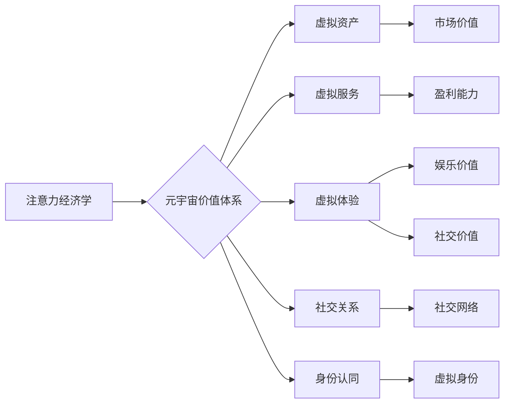

                 

## 注意力经济学研究:元宇宙中的价值评估体系

> 关键词：元宇宙、注意力经济学、价值评估、算法、数学模型、应用场景

## 1. 背景介绍

元宇宙概念的兴起，标志着人类进入一个全新的数字世界。在这个虚拟世界中，人们可以沉浸式地体验、互动和创造，其发展潜力巨大。然而，元宇宙的繁荣也面临着诸多挑战，其中之一便是如何有效地评估和分配价值。

传统经济学中的价值评估体系主要基于现实世界中的物质资源和市场机制。但在元宇宙中，价值的构成更加复杂，它不仅包含虚拟物品、服务和体验，还涉及用户注意力、社交关系、身份认同等虚拟资源。因此，我们需要建立一套全新的价值评估体系，以适应元宇宙的独特特性。

注意力经济学作为一种新兴的经济学分支，关注的是人类注意力作为一种稀缺资源的分配和交易。它认为，在信息爆炸的时代，注意力是比金钱更宝贵的资源。元宇宙作为高度沉浸式的虚拟环境，对用户注意力的需求更加强烈。因此，注意力经济学为元宇宙价值评估提供了重要的理论基础和实践借鉴。

## 2. 核心概念与联系

### 2.1 注意力经济学

注意力经济学认为，注意力是有限的，并且在信息爆炸的时代变得越来越稀缺。人们需要花费时间和精力来选择和过滤信息，从而集中注意力在对自己有价值的内容上。

注意力经济学强调以下几个核心概念：

* **注意力稀缺性:** 人类的注意力是有限的，无法同时处理大量信息。
* **注意力价值:** 注意力是稀缺资源，因此具有价值。
* **注意力分配:** 人们会根据自身需求和兴趣来分配注意力。
* **注意力交易:**  人们可以通过各种方式获取和交换注意力，例如广告、内容付费、社交互动等。

### 2.2 元宇宙价值体系

元宇宙价值体系是指在元宇宙中，用户价值的产生、分配和体现的机制。它涵盖了虚拟物品、服务、体验、社交关系、身份认同等多个方面。

元宇宙价值体系的核心要素包括：

* **虚拟资产:** 包括虚拟物品、数字货币、土地等。
* **虚拟服务:** 包括游戏、社交、教育、娱乐等。
* **虚拟体验:** 包括沉浸式游戏、虚拟旅行、虚拟社交等。
* **社交关系:** 用户在元宇宙中的社交网络和关系。
* **身份认同:** 用户在元宇宙中的虚拟身份和角色。

### 2.3 注意力与元宇宙价值的联系

注意力是元宇宙价值体系的重要驱动力。用户注意力决定了虚拟资产、服务和体验的价值。

* **虚拟资产:** 用户对虚拟资产的关注度决定了其市场价值。
* **虚拟服务:** 用户对虚拟服务的参与度决定了其盈利能力。
* **虚拟体验:** 用户对虚拟体验的沉浸度决定了其娱乐价值和社交价值。

**核心概念原理与架构的 Mermaid 流程图**



## 3. 核心算法原理 & 具体操作步骤

### 3.1 算法原理概述

注意力经济学研究中，常用的算法主要用于分析用户注意力行为，预测用户注意力分配模式，以及评估注意力价值。这些算法通常基于机器学习和深度学习技术，可以从海量用户数据中提取特征，建立注意力模型。

常见的注意力算法包括：

* **Transformer模型:** Transformer模型是一种基于注意力机制的深度学习模型，能够有效地捕捉文本序列中的长距离依赖关系，广泛应用于自然语言处理任务，例如文本分类、机器翻译等。
* **Recurrent Neural Networks (RNNs):** RNNs是一种能够处理序列数据的深度学习模型，其内部循环结构能够捕捉时间序列中的依赖关系，常用于预测用户行为，例如点击率、停留时间等。
* **Graph Neural Networks (GNNs):** GNNs是一种能够处理图结构数据的深度学习模型，能够学习用户之间的关系和社交网络结构，常用于分析用户行为和推荐系统。

### 3.2 算法步骤详解

以Transformer模型为例，其注意力机制的具体操作步骤如下：

1. **输入嵌入:** 将输入文本序列转换为向量表示。
2. **查询、键、值矩阵:** 将输入向量分别转换为查询矩阵(Q)、键矩阵(K)和值矩阵(V)。
3. **注意力计算:** 计算每个查询向量与所有键向量的相似度，得到注意力权重。
4. **加权求和:** 根据注意力权重对值矩阵进行加权求和，得到输出向量。

### 3.3 算法优缺点

**Transformer模型的优点:**

* 能够有效地捕捉长距离依赖关系。
* 并行计算能力强，训练速度快。
* 在自然语言处理任务中取得了优异的性能。

**Transformer模型的缺点:**

* 参数量大，计算资源需求高。
* 对训练数据要求高，需要大量高质量的数据进行训练。

### 3.4 算法应用领域

注意力算法广泛应用于以下领域:

* **用户行为预测:** 预测用户点击、停留、购买等行为。
* **内容推荐:** 推荐用户感兴趣的内容。
* **广告投放:** 优化广告投放策略，提高广告效果。
* **搜索引擎:** 提高搜索结果的准确性和相关性。
* **虚拟现实和增强现实:** 增强用户体验，提供更沉浸式的互动。

## 4. 数学模型和公式 & 详细讲解 & 举例说明

### 4.1 数学模型构建

注意力机制的核心是计算每个查询向量与所有键向量的相似度，并根据相似度分配注意力权重。常用的相似度计算方法是点积运算。

假设输入序列长度为n，每个词向量维度为d。查询矩阵Q、键矩阵K和值矩阵V分别为n x d的矩阵。

**注意力权重计算公式:**

$$
\text{Attention}(Q, K, V) = \text{softmax}\left(\frac{Q K^T}{\sqrt{d}}\right) V
$$

其中:

* $QK^T$ 表示查询矩阵与键矩阵的转置矩阵的点积。
* $\sqrt{d}$ 是一个缩放因子，用于防止梯度爆炸。
* $\text{softmax}$ 函数将点积结果转换为概率分布，每个元素代表了查询向量对相应键向量的注意力权重。

### 4.2 公式推导过程

注意力权重计算公式的推导过程如下:

1. 计算查询向量与所有键向量的点积，得到一个n x n的矩阵。
2. 对点积矩阵进行归一化，使用softmax函数将每个元素转换为概率分布。
3. 将概率分布与值矩阵相乘，得到输出向量。

### 4.3 案例分析与讲解

假设我们有一个句子“我爱学习编程”，我们想要计算每个词对句子的整体注意力的贡献。

我们可以将句子中的每个词向量作为查询向量，将所有词向量作为键向量和值向量。然后，使用注意力权重计算公式计算每个词对句子的注意力权重。

例如，"学习"这个词的注意力权重可能比较高，因为它与句子的主题相关。而“我”这个词的注意力权重可能比较低，因为它只是一个主语。

## 5. 项目实践：代码实例和详细解释说明

### 5.1 开发环境搭建

为了实现注意力经济学模型，我们需要搭建一个开发环境。常用的开发环境包括：

* **Python:** Python是一种流行的编程语言，拥有丰富的机器学习和深度学习库，例如TensorFlow、PyTorch等。
* **Jupyter Notebook:** Jupyter Notebook是一种交互式编程环境，方便进行代码编写、调试和可视化。
* **GPU:** GPU(图形处理单元)能够加速深度学习模型的训练，因此建议使用GPU进行开发。

### 5.2 源代码详细实现

以下是一个使用TensorFlow实现Transformer模型的简单代码示例：

```python
import tensorflow as tf

# 定义Transformer模型
class Transformer(tf.keras.Model):
    def __init__(self, vocab_size, embedding_dim, num_heads, num_layers):
        super(Transformer, self).__init__()
        self.embedding = tf.keras.layers.Embedding(vocab_size, embedding_dim)
        self.transformer_layers = tf.keras.layers.StackedRNNCells([tf.keras.layers.Attention(num_heads) for _ in range(num_layers)])

    def call(self, inputs):
        embedded = self.embedding(inputs)
        output = self.transformer_layers(embedded)
        return output

# 实例化模型
model = Transformer(vocab_size=10000, embedding_dim=128, num_heads=8, num_layers=6)

# 训练模型
model.compile(optimizer='adam', loss='mse')
model.fit(x_train, y_train, epochs=10)
```

### 5.3 代码解读与分析

* **Embedding层:** 将输入词转换为词向量表示。
* **Transformer层:** 使用多头注意力机制和多层感知机构建Transformer模型。
* **StackedRNNCells:** 将多个Transformer层堆叠在一起，形成多层Transformer模型。
* **训练模型:** 使用Adam优化器和均方误差损失函数训练模型。

### 5.4 运行结果展示

训练完成后，我们可以使用模型预测用户注意力分配模式，并评估模型的性能。

## 6. 实际应用场景

### 6.1 元宇宙游戏

在元宇宙游戏中，注意力算法可以用于：

* **个性化游戏体验:** 根据玩家的注意力行为，推荐个性化的游戏内容和任务。
* **虚拟物品交易:** 预测玩家对虚拟物品的注意力和价值，优化虚拟物品的交易机制。
* **游戏广告投放:** 根据玩家的注意力行为，精准投放游戏广告，提高广告效果。

### 6.2 元宇宙社交平台

在元宇宙社交平台，注意力算法可以用于：

* **内容推荐:** 根据用户的注意力行为，推荐感兴趣的内容和用户。
* **社交关系分析:** 分析用户之间的注意力互动，构建更精准的社交关系图谱。
* **虚拟身份构建:** 根据用户的注意力行为，帮助用户构建更个性化的虚拟身份。

### 6.3 元宇宙教育平台

在元宇宙教育平台，注意力算法可以用于：

* **个性化学习路径:** 根据学生的注意力行为，定制个性化的学习路径和内容。
* **互动式教学:** 利用注意力机制，提高学生的学习兴趣和参与度。
* **知识评估:** 通过分析学生的注意力行为，评估学生的学习效果和理解程度。

### 6.4 未来应用展望

随着元宇宙的发展，注意力经济学将发挥越来越重要的作用。未来，注意力算法将应用于更多元宇宙场景，例如元宇宙医疗、元宇宙金融、元宇宙艺术等。

## 7. 工具和资源推荐

### 7.1 学习资源推荐

* **书籍:**
    * 《深度学习》
    * 《注意力机制》
    * 《元宇宙》
* **在线课程:**
    * Coursera: 深度学习
    * edX: 自然语言处理
    * Udacity: 元宇宙开发

### 7.2 开发工具推荐

* **TensorFlow:** 深度学习框架
* **PyTorch:** 深度学习框架
* **Jupyter Notebook:** 交互式编程环境
* **Hugging Face:** 预训练模型库

### 7.3 相关论文推荐

* **Attention Is All You Need:** https://arxiv.org/abs/1706.03762
* **BERT: Pre-training of Deep Bidirectional Transformers for Language Understanding:** https://arxiv.org/abs/1810.04805
* **The Metaverse: A New Paradigm for Human Interaction:** https://arxiv.org/abs/2112.09828

## 8. 总结：未来发展趋势与挑战

### 8.1 研究成果总结

注意力经济学研究为元宇宙价值评估提供了新的理论和方法。注意力算法能够有效地分析用户注意力行为，预测用户注意力分配模式，并评估注意力价值。

### 8.2 未来发展趋势

未来，注意力经济学研究将朝着以下方向发展:

* **更精准的注意力预测:** 开发更精准的注意力预测模型，能够更准确地预测用户的注意力行为。
* **更细粒度的注意力分析:** 分析更细粒度的注意力行为，例如用户的眼动轨迹、鼠标移动轨迹等。
* **注意力价值的量化评估:** 开发更科学的注意力价值评估方法，能够更客观地衡量注意力价值。

### 8.3 面临的挑战

注意力经济学研究也面临着一些挑战:

* **数据隐私:** 用户注意力数据具有高度隐私性，如何保护用户数据隐私是一个重要的挑战。
* **算法公平性:** 注意力算法可能存在偏见，导致不公平的结果，需要研究如何保证算法的公平性。
* **伦理问题:** 注意力经济学的发展可能带来一些伦理问题，例如注意力操控、注意力剥夺等，需要进行深入的伦理探讨。

### 8.4 研究展望

尽管面临着挑战，但注意力经济学研究的前景依然光明。随着技术的进步和社会的发展，注意力经济学将发挥越来越重要的作用，为元宇宙的健康发展提供重要的理论和实践支持。

## 9. 附录：常见问题与解答

### 9.1 如何衡量注意力价值？

注意力价值的衡量是一个复杂的问题，目前还没有一个统一的标准。一些常用的方法包括:

* **用户停留时间:** 用户对某个内容停留的时间越长，其注意力价值越高。
* **用户点击率:** 用户对某个内容点击的次数越多，其注意力价值越高。
* **用户参与度:** 用户对某个内容的互动程度越高，其注意力价值越高。

### 9.2 注意力算法可能会带来哪些伦理问题？

注意力算法可能会带来一些伦理问题，例如:

* **注意力操控:** 利用注意力算法操纵用户的注意力，使其关注特定的内容或行为。
* **注意力剥夺:** 过度依赖注意力算法，导致用户无法集中注意力，影响学习和工作效率。
* **数据隐私:** 用户注意力数据具有高度隐私性，需要保护用户的隐私权。

### 9.3 如何解决注意力算法带来的伦理问题？

解决注意力算法带来的伦理问题需要多方面的努力，例如:

* **制定相关法律法规:** 规范注意力算法的应用，防止其被滥用。
* **加强算法透明度:** 使注意力算法更加透明，让用户了解算法是如何运作的。
* **提高用户意识:** 提高用户的注意力意识，帮助用户更好地控制自己的注意力。

作者：禅与计算机程序设计艺术 / Zen and the Art of Computer Programming


<end_of_turn>

