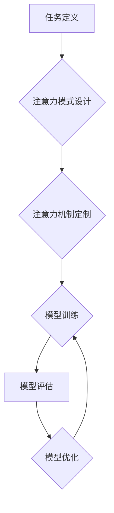

                 

## 注意力编程工作坊：AI定制的认知模式设计

> 关键词：注意力机制、认知模式、AI编程、深度学习、神经网络、可解释性、定制化

## 1. 背景介绍

在人工智能领域，深度学习模型取得了令人瞩目的成就，在图像识别、自然语言处理等领域展现出强大的能力。然而，这些模型的“黑箱”性质使得其决策过程难以理解，这限制了我们对模型的信任和应用范围。

注意力机制作为深度学习的重要组成部分，为解决这一问题提供了新的思路。它赋予模型选择性关注的能力，类似于人类在阅读或理解信息时会集中注意力于关键部分。通过学习哪些信息更重要，注意力机制可以提高模型的准确性、效率和可解释性。

然而，现有的注意力机制大多是预设的，缺乏灵活性。我们希望能够设计一种“注意力编程”框架，允许开发者根据具体任务定制注意力机制，构建更符合人类认知模式的AI模型。

## 2. 核心概念与联系

### 2.1 认知模式

认知模式是指人类在理解和处理信息时所遵循的模式，包括感知、记忆、推理和决策等过程。这些模式是基于经验和知识积累形成的，具有高度的灵活性和适应性。

### 2.2 注意力机制

注意力机制是一种模仿人类注意力机制的算法，它允许模型在处理信息时选择性地关注某些部分，而忽略其他部分。

### 2.3 注意力编程

注意力编程是指利用注意力机制构建AI模型，并允许开发者根据具体任务定制注意力机制，使其更符合人类认知模式。

**注意力编程工作流程:**



## 3. 核心算法原理 & 具体操作步骤

### 3.1 算法原理概述

注意力机制的核心思想是学习一个权重向量，用于对输入序列中的每个元素进行加权，从而突出重要信息。

### 3.2 算法步骤详解

1. **输入序列编码:** 将输入序列转换为向量表示，每个向量代表序列中的一个元素。
2. **注意力权重计算:** 使用一个注意力函数计算每个元素的注意力权重，权重值反映了元素的重要性。
3. **加权求和:** 将每个元素的向量与其注意力权重相乘，然后对所有元素的加权向量进行求和，得到最终的输出向量。

### 3.3 算法优缺点

**优点:**

* 提高模型的准确性：通过关注重要信息，注意力机制可以提高模型的预测精度。
* 提升模型的效率：注意力机制可以减少模型的计算量，提高训练速度。
* 增强模型的可解释性：注意力权重可以反映模型关注哪些信息，提高模型的透明度。

**缺点:**

* 计算复杂度较高：注意力机制的计算量较大，尤其是在处理长序列数据时。
* 训练难度较大：注意力机制的参数需要通过训练来学习，训练过程可能比较复杂。

### 3.4 算法应用领域

注意力机制在许多领域都有广泛的应用，例如：

* **自然语言处理:** 机器翻译、文本摘要、问答系统等。
* **计算机视觉:** 图像识别、目标检测、图像 Captioning 等。
* **语音识别:** 语音转文本、语音合成等。

## 4. 数学模型和公式 & 详细讲解 & 举例说明

### 4.1 数学模型构建

注意力机制的数学模型可以概括为以下公式：

$$
\text{Attention}(Q, K, V) = \text{softmax}\left(\frac{Q K^T}{\sqrt{d_k}}\right) V
$$

其中：

* $Q$：查询向量，表示需要关注的信息。
* $K$：键向量，表示所有输入元素的表示。
* $V$：值向量，表示每个输入元素的具体信息。
* $d_k$：键向量的维度。
* $\text{softmax}$：softmax函数，用于将注意力权重归一化。

### 4.2 公式推导过程

注意力机制的公式推导过程可以分为以下几个步骤：

1. 计算查询向量 $Q$ 和键向量 $K$ 的点积，得到一个得分矩阵。
2. 对得分矩阵进行归一化，得到注意力权重矩阵。
3. 将注意力权重矩阵与值向量 $V$ 进行加权求和，得到最终的输出向量。

### 4.3 案例分析与讲解

假设我们有一个句子 "The cat sat on the mat"，我们需要使用注意力机制来理解这句话的含义。

1. 将句子中的每个单词转换为向量表示，得到 $V$。
2. 将查询向量 $Q$ 设置为 "sat"，表示我们想要关注 "sat" 这个单词的信息。
3. 计算 $Q$ 和 $K$ 的点积，得到一个得分矩阵，得分矩阵中的每个元素表示 "sat" 和每个单词之间的相关性。
4. 对得分矩阵进行归一化，得到注意力权重矩阵，权重矩阵中的每个元素表示 "sat" 对每个单词的关注程度。
5. 将注意力权重矩阵与 $V$ 进行加权求和，得到最终的输出向量，该向量包含了 "sat" 所关注的信息。

## 5. 项目实践：代码实例和详细解释说明

### 5.1 开发环境搭建

* Python 3.7+
* TensorFlow 2.0+
* PyTorch 1.0+

### 5.2 源代码详细实现

```python
import tensorflow as tf

# 定义注意力机制
def attention_mechanism(query, keys, values, mask=None):
    # 计算查询向量和键向量的点积
    scores = tf.matmul(query, keys, transpose_b=True)
    # 对得分进行归一化
    attention_weights = tf.nn.softmax(scores, axis=-1)
    # 将注意力权重与值向量进行加权求和
    context_vector = tf.matmul(attention_weights, values)
    return context_vector

# 定义一个简单的文本分类模型
class TextClassifier(tf.keras.Model):
    def __init__(self, vocab_size, embedding_dim, hidden_dim):
        super(TextClassifier, self).__init__()
        self.embedding = tf.keras.layers.Embedding(vocab_size, embedding_dim)
        self.lstm = tf.keras.layers.LSTM(hidden_dim)
        self.attention = attention_mechanism
        self.dense = tf.keras.layers.Dense(1, activation='sigmoid')

    def call(self, inputs):
        # 将输入序列嵌入到词向量空间
        embedded = self.embedding(inputs)
        # 使用LSTM编码输入序列
        encoded = self.lstm(embedded)
        # 使用注意力机制计算上下文向量
        context_vector = self.attention(encoded, encoded, encoded)
        # 将上下文向量输入到全连接层
        output = self.dense(context_vector)
        return output

# 实例化模型
model = TextClassifier(vocab_size=10000, embedding_dim=128, hidden_dim=64)

# 训练模型
# ...

```

### 5.3 代码解读与分析

* 代码中定义了一个 `attention_mechanism` 函数，实现了注意力机制的核心逻辑。
* `TextClassifier` 类定义了一个简单的文本分类模型，其中包含了嵌入层、LSTM层、注意力机制和全连接层。
* 模型的训练过程需要根据具体的数据集和任务进行调整。

### 5.4 运行结果展示

* 模型的运行结果可以根据具体的任务和数据集进行评估，例如准确率、召回率、F1-score等。

## 6. 实际应用场景

### 6.1 机器翻译

注意力机制可以帮助机器翻译模型更好地理解句子结构和语义，从而提高翻译质量。

### 6.2 文本摘要

注意力机制可以帮助文本摘要模型识别重要信息，并生成更准确、更简洁的摘要。

### 6.3 问答系统

注意力机制可以帮助问答系统更好地理解问题和上下文，从而提供更准确的答案。

### 6.4 未来应用展望

注意力机制在人工智能领域具有广泛的应用前景，未来可能在更多领域发挥重要作用，例如：

* **医疗诊断:** 帮助医生分析病历和影像数据，提高诊断准确率。
* **金融风险评估:** 帮助金融机构识别潜在的风险，降低损失。
* **个性化推荐:** 帮助电商平台根据用户的兴趣和偏好提供个性化的商品推荐。

## 7. 工具和资源推荐

### 7.1 学习资源推荐

* **书籍:**
    * "深度学习" by Ian Goodfellow, Yoshua Bengio, and Aaron Courville
    * "Attention Is All You Need" by Vaswani et al.
* **在线课程:**
    * Coursera: Deep Learning Specialization
    * Udacity: Deep Learning Nanodegree

### 7.2 开发工具推荐

* **TensorFlow:** https://www.tensorflow.org/
* **PyTorch:** https://pytorch.org/

### 7.3 相关论文推荐

* "Attention Is All You Need"
* "BERT: Pre-training of Deep Bidirectional Transformers for Language Understanding"
* "Transformer-XL: Attentive Language Models Beyond a Fixed-Length Context"

## 8. 总结：未来发展趋势与挑战

### 8.1 研究成果总结

注意力机制在人工智能领域取得了显著的进展，为模型的准确性、效率和可解释性带来了提升。

### 8.2 未来发展趋势

* **更有效的注意力机制:** 研究更有效的注意力机制，例如自注意力机制、多头注意力机制等。
* **可解释性增强:** 研究更可解释的注意力机制，以便更好地理解模型的决策过程。
* **跨模态注意力:** 研究跨模态注意力机制，例如将文本和图像信息融合在一起。

### 8.3 面临的挑战

* **计算复杂度:** 现有的注意力机制计算复杂度较高，难以处理长序列数据。
* **训练难度:** 注意力机制的参数需要通过训练来学习，训练过程可能比较复杂。
* **可解释性:** 尽管注意力机制提高了模型的可解释性，但仍然存在一些挑战，例如解释注意力权重的含义。

### 8.4 研究展望

未来，注意力机制的研究将继续深入，并应用于更多领域，为人工智能的发展做出更大的贡献。

## 9. 附录：常见问题与解答

* **Q: 注意力机制与RNN有什么区别？**

* **A:** RNN可以处理序列数据，但其难以捕捉长距离依赖关系。注意力机制可以解决这个问题，因为它可以学习关注序列中重要信息。

* **Q: 注意力机制的计算复杂度如何？**

* **A:** 注意力机制的计算复杂度较高，尤其是在处理长序列数据时。

* **Q: 如何解释注意力权重？**

* **A:** 注意力权重反映了模型对每个输入元素的关注程度。权重值越高，表示模型对该元素的关注程度越强。


作者：禅与计算机程序设计艺术 / Zen and the Art of Computer Programming 
<end_of_turn>

