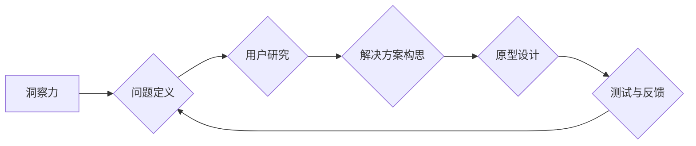

                 

## 洞察力与设计思维：以人为本的问题解决方法

> 关键词：洞察力、设计思维、用户体验、问题解决、人工智能、软件架构、创新

## 1. 背景介绍

在当今科技飞速发展的时代，人工智能、大数据、云计算等技术日新月异，为我们带来了前所未有的机遇和挑战。然而，技术的进步并非意味着问题的自动解决。 

面对日益复杂的技术难题，单纯依靠技术手段往往难以找到最佳解决方案。我们需要一种更全面的、更以人为本的思维方式来解决问题，这种思维方式就是“洞察力与设计思维”。

设计思维是一种以用户为中心的创新方法论，它强调通过观察、理解、实验和迭代的方式，不断优化产品和服务，以满足用户真实需求。而洞察力则是设计思维的基础，它指通过深入理解用户、市场和技术趋势，发现隐藏在表面现象背后的本质问题，并从中获得启发和灵感。

将洞察力和设计思维相结合，可以帮助我们更有效地解决技术难题，创造出真正有价值的产品和服务。

## 2. 核心概念与联系

### 2.1 洞察力

洞察力是指通过观察、分析和思考，发现隐藏在表面现象背后的本质规律和趋势的能力。它需要我们跳出固有的思维模式，以更开放、更批判的眼光看待问题，并从中挖掘出潜在的价值和机会。

### 2.2 设计思维

设计思维是一种迭代式的解决问题的方法，它强调通过用户研究、原型设计、测试和反馈，不断优化解决方案的过程。它包含以下五个关键阶段：

* **理解 (Empathize):** 深入了解用户需求、痛点和行为模式。
* **定义 (Define):** 明确问题，并将其转化为可解决的目标。
* **构思 (Ideate):** 产生多种解决方案，鼓励创意和创新。
* **原型 (Prototype):** 将解决方案转化为可测试的原型，以便进行快速验证。
* **测试 (Test):** 收集用户反馈，并根据反馈进行迭代优化。

### 2.3 洞察力与设计思维的联系

洞察力和设计思维是相互促进、相互依赖的。洞察力为设计思维提供方向和灵感，而设计思维则帮助我们将洞察转化为实际的解决方案。

**Mermaid 流程图**



## 3. 核心算法原理 & 具体操作步骤

### 3.1 算法原理概述

在洞察力与设计思维的框架下，我们可以运用多种算法和技术手段来辅助问题解决。例如，用户行为分析算法可以帮助我们理解用户的行为模式，从而发现潜在的需求和痛点；机器学习算法可以帮助我们从海量数据中挖掘出隐藏的规律和趋势，为设计决策提供数据支持。

### 3.2 算法步骤详解

以用户行为分析算法为例，其具体操作步骤如下：

1. **数据收集:** 收集用户在使用产品或服务时的行为数据，例如点击记录、浏览历史、购买记录等。
2. **数据预处理:** 对收集到的数据进行清洗、转换和格式化，以便于后续分析。
3. **特征提取:** 从用户行为数据中提取有价值的特征，例如用户访问频率、停留时间、页面跳转路径等。
4. **模型训练:** 利用机器学习算法对提取的特征进行训练，建立用户行为预测模型。
5. **模型评估:** 对训练好的模型进行评估，验证其预测准确率和泛化能力。
6. **结果分析:** 分析模型预测结果，发现用户行为模式和潜在需求。

### 3.3 算法优缺点

**优点:**

* 可以帮助我们更深入地了解用户行为，发现隐藏的需求和痛点。
* 可以为产品设计和优化提供数据支持，提高产品用户体验。

**缺点:**

* 需要收集和处理大量用户数据，存在隐私安全问题。
* 模型训练需要专业知识和技术支持，成本较高。

### 3.4 算法应用领域

用户行为分析算法广泛应用于以下领域：

* **电商:** 分析用户购买行为，推荐个性化商品。
* **社交媒体:** 分析用户互动行为，优化内容推荐算法。
* **金融:** 分析用户交易行为，识别欺诈行为。
* **教育:** 分析用户学习行为，个性化学习路径。

## 4. 数学模型和公式 & 详细讲解 & 举例说明

### 4.1 数学模型构建

在洞察力与设计思维的框架下，我们可以利用数学模型来量化和分析问题，并为解决方案提供更清晰的指导。例如，我们可以构建用户满意度模型，将用户反馈数据转化为可量化的指标，以便于评估产品或服务的质量。

### 4.2 公式推导过程

假设用户满意度模型采用以下公式：

$$
满意度 = \alpha \times 功能满意度 + \beta \times 使用体验满意度 + \gamma \times 价格满意度
$$

其中：

* 满意度：用户对产品或服务的整体满意度。
* 功能满意度：用户对产品或服务的功能满足程度。
* 使用体验满意度：用户对产品或服务的易用性和流畅程度。
* 价格满意度：用户对产品或服务的性价比。
* $\alpha$, $\beta$, $\gamma$：三个权重系数，分别代表功能满意度、使用体验满意度和价格满意度的相对重要性。

### 4.3 案例分析与讲解

假设我们对一款软件产品进行用户满意度调查，收集到以下数据：

* 功能满意度：平均评分为 4.5 分。
* 使用体验满意度：平均评分为 4.0 分。
* 价格满意度：平均评分为 3.5 分。

如果我们设定 $\alpha = 0.4$, $\beta = 0.3$, $\gamma = 0.3$，则可以计算出该软件产品的整体满意度：

$$
满意度 = 0.4 \times 4.5 + 0.3 \times 4.0 + 0.3 \times 3.5 = 1.8 + 1.2 + 1.05 = 4.05
$$

该结果表明，该软件产品的整体满意度较高，但仍有改进空间。

## 5. 项目实践：代码实例和详细解释说明

### 5.1 开发环境搭建

为了演示洞察力与设计思维在实际项目中的应用，我们可以选择一个简单的项目，例如设计一个用户反馈收集系统。

开发环境搭建包括以下步骤：

1. 选择编程语言和框架：例如，可以使用 Python 和 Flask 框架。
2. 安装必要的软件包：例如，需要安装 Flask、SQLAlchemy 等软件包。
3. 设置数据库：例如，可以使用 MySQL 或 PostgreSQL 数据库。

### 5.2 源代码详细实现

以下是一个简单的用户反馈收集系统代码示例：

```python
from flask import Flask, render_template, request

app = Flask(__name__)

@app.route('/', methods=['GET', 'POST'])
def index():
    if request.method == 'POST':
        feedback = request.form['feedback']
        # 将反馈数据存储到数据库中
        # ...
        return '感谢您的反馈！'
    else:
        return render_template('index.html')

if __name__ == '__main__':
    app.run(debug=True)
```

### 5.3 代码解读与分析

* `Flask` 是一个轻量级的 Python Web 框架，用于构建 Web 应用。
* `render_template` 函数用于渲染 HTML 模板。
* `request` 对象用于获取用户提交的数据。
* `if request.method == 'POST'` 判断用户是否提交了表单数据。
* `feedback = request.form['feedback']` 获取用户提交的反馈内容。
* `# 将反馈数据存储到数据库中` 是代码中需要补充的部分，用于将用户反馈数据持久化存储。

### 5.4 运行结果展示

运行上述代码后，可以访问 http://127.0.0.1:5000/，看到一个简单的用户反馈表单。用户可以输入反馈内容并提交，反馈数据将被存储到数据库中。

## 6. 实际应用场景

### 6.1 产品设计

洞察力与设计思维可以帮助产品经理和设计师更深入地了解用户需求，并设计出更符合用户期望的产品。例如，通过用户调研和数据分析，可以发现用户对某个功能的需求，并将其融入到产品设计中。

### 6.2 软件开发

在软件开发过程中，洞察力与设计思维可以帮助开发人员更好地理解用户需求，并设计出更易用、更可靠的软件。例如，可以通过用户测试和反馈，发现软件中的bug和 usability issue，并进行及时修复和改进。

### 6.3 业务创新

洞察力与设计思维可以帮助企业发现新的市场机会，并开发出具有竞争力的产品和服务。例如，通过分析市场趋势和用户需求，可以发现新的业务模式和盈利点。

### 6.4 未来应用展望

随着人工智能、大数据等技术的不断发展，洞察力与设计思维将发挥越来越重要的作用。未来，我们可以期待看到更多基于洞察力和设计思维的创新应用，例如：

* **个性化推荐:** 基于用户行为和偏好，提供更精准的个性化推荐。
* **智能客服:** 利用自然语言处理技术，提供更智能、更人性化的客服服务。
* **自动化的产品设计:** 利用人工智能算法，自动生成符合用户需求的产品设计方案。

## 7. 工具和资源推荐

### 7.1 学习资源推荐

* **书籍:**
    * 《洞察力：如何发现隐藏的真相》
    * 《设计思维：解决问题、激发创新》
    * 《Lean Startup》
* **在线课程:**
    * Coursera: Design Thinking Specialization
    * edX: Design Thinking for Innovation
    * Udemy: The Complete Design Thinking Course

### 7.2 开发工具推荐

* **用户行为分析工具:**
    * Google Analytics
    * Mixpanel
    * Amplitude
* **原型设计工具:**
    * Figma
    * Sketch
    * Adobe XD
* **协作工具:**
    * Slack
    * Trello
    * Jira

### 7.3 相关论文推荐

* **Design Thinking: A Practical Guide for Educators**
* **The Power of Design Thinking: How to Solve Problems and Innovate**
* **User-Centered Design: A Practical Guide**

## 8. 总结：未来发展趋势与挑战

### 8.1 研究成果总结

洞察力与设计思维已经成为解决复杂问题、推动创新发展的重要方法论。它强调以人为本，通过深入理解用户需求和市场趋势，不断优化解决方案，创造出真正有价值的产品和服务。

### 8.2 未来发展趋势

未来，洞察力与设计思维将与人工智能、大数据等技术深度融合，形成更强大的创新引擎。例如，我们可以期待看到更多基于人工智能的洞察分析工具，帮助我们更深入地理解用户行为和市场趋势；我们可以期待看到更多基于设计思维的自动化产品设计系统，帮助我们更快、更有效地开发出符合用户需求的产品。

### 8.3 面临的挑战

尽管洞察力与设计思维具有巨大的潜力，但它也面临着一些挑战：

* **数据隐私问题:** 在收集和分析用户数据时，需要充分考虑数据隐私和安全问题。
* **算法偏见问题:** 人工智能算法可能会存在偏见，导致洞察结果不准确。
* **跨学科合作问题:** 洞察力与设计思维需要跨学科合作，需要不同领域的专家共同参与。

### 8.4 研究展望

未来，我们需要继续深入研究洞察力与设计思维的理论和实践，并探索其在不同领域的应用。我们需要开发更安全、更可靠的人工智能算法，并建立更完善的数据隐私保护机制。我们需要加强跨学科合作，促进洞察力与设计思维的融合发展。


## 9. 附录：常见问题与解答

### 9.1 如何进行用户洞察？

用户洞察可以通过多种方式进行，例如：

* **用户访谈:** 与用户进行一对一访谈，了解他们的需求、痛点和使用习惯。
* **用户调查:** 设计问卷调查，收集用户的大量反馈数据。
* **用户观察:** 观察用户使用产品或服务的场景，了解他们的行为模式。
* **数据分析:** 分析用户行为数据，发现隐藏的规律和趋势。

### 9.2 如何将洞察转化为解决方案？

将洞察转化为解决方案需要遵循设计思维的五个阶段：

* **理解:** 深入理解用户需求、痛点和行为模式。
* **定义:** 明确问题，并将其转化为可解决的目标。
* **构思:** 产生多种解决方案，鼓励创意和创新。
* **原型:** 将解决方案转化为可测试的原型，以便进行快速验证。
* **测试:** 收集用户反馈，并根据反馈进行迭代优化。

### 9.3 如何评估洞察力的有效性？

洞察力的有效性可以通过以下方式评估：

* **用户反馈:** 收集用户对解决方案的反馈，了解其是否满足用户需求。
* **业务指标:** 跟踪解决方案对业务指标的影响，例如用户增长、用户留存、转化率等。
* **市场反馈:** 观察解决方案在市场上的表现，了解其竞争力。


作者：禅与计算机程序设计艺术 / Zen and the Art of Computer Programming 
<end_of_turn>

