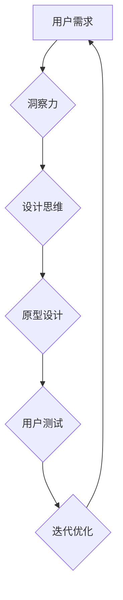

                 

## 洞察力与设计思维：用户体验的核心

> 关键词：用户体验，洞察力，设计思维，用户研究，原型设计，迭代优化，A/B测试，数据分析

### 1. 背景介绍

在当今数字化时代，用户体验 (UX) 已成为企业竞争力的关键因素。用户界面简洁易用、功能强大、交互流畅，能够显著提升用户满意度、忠诚度和转化率。然而，仅仅依靠技术手段无法打造出卓越的用户体验。真正优秀的用户体验设计需要深入理解用户的需求、行为和心理，并以洞察力为驱动，运用设计思维方法进行迭代优化。

### 2. 核心概念与联系

**2.1 用户体验 (UX)**

用户体验是指用户与产品或服务交互时所感受到的整体感受，包括情感、认知、生理等方面的体验。良好的用户体验可以带来以下好处：

* **提升用户满意度和忠诚度:**  用户更容易接受和使用易于理解和使用的产品。
* **提高转化率和收入:**  良好的用户体验可以引导用户完成目标操作，从而提高转化率和收入。
* **增强品牌形象:**  优质的用户体验可以提升品牌形象，建立用户信任。

**2.2 洞察力**

洞察力是指对用户需求、行为和心理的深刻理解，并从中发现隐藏的模式和趋势。洞察力是用户体验设计的基石，它帮助设计师了解用户的真实需求，并设计出真正切合实际的产品。

**2.3 设计思维**

设计思维是一种以用户为中心的方法论，它强调通过迭代和实验的方式，不断优化产品和服务，以满足用户的需求。设计思维的核心步骤包括：

* **理解:** 深入了解用户需求、行为和环境。
* **点子:** 提出各种解决方案，不拘泥于现有思维模式。
* **原型:**  构建低保真原型，快速验证想法。
* **测试:**  与用户进行测试，收集反馈并进行迭代优化。

**2.4 流程图**

### 3. 核心算法原理 & 具体操作步骤

**3.1 算法原理概述**

用户体验设计中，并没有一个特定的算法，而是需要结合多种方法和工具，通过数据分析、用户研究、原型设计等步骤，不断迭代优化产品。

**3.2 算法步骤详解**

1. **用户研究:** 通过访谈、问卷调查、用户行为分析等方式，深入了解用户的需求、行为和痛点。
2. **洞察力挖掘:** 分析用户研究数据，发现隐藏的模式和趋势，形成对用户需求的深刻理解。
3. **信息架构设计:**  根据用户需求和洞察力，构建产品的信息架构，确定用户导航路径和内容组织方式。
4. **界面设计:**  根据信息架构和用户体验原则，设计简洁易用的界面，确保用户能够轻松找到所需信息并完成操作。
5. **交互设计:**  设计用户与产品交互的流程和方式，确保交互流畅自然，符合用户习惯。
6. **原型设计:**  构建低保真和高保真原型，用于测试和验证设计方案。
7. **用户测试:**  邀请用户进行原型测试，收集反馈并进行迭代优化。
8. **开发和发布:**  根据测试结果，进行产品开发和发布，并持续进行数据分析和用户反馈收集，不断优化产品体验。

**3.3 算法优缺点**

* **优点:** 以用户为中心，注重用户体验，能够设计出更符合用户需求的产品。
* **缺点:** 需要投入大量时间和资源进行用户研究和迭代优化，需要设计师具备良好的洞察力和沟通能力。

**3.4 算法应用领域**

用户体验设计方法广泛应用于各个领域，包括：

* **移动应用开发:**  设计简洁易用的移动应用界面和交互体验。
* **网站设计:**  提升网站用户体验，提高转化率和用户粘性。
* **产品设计:**  设计符合用户需求和使用场景的产品。
* **服务设计:**  优化服务流程，提升用户满意度。

### 4. 数学模型和公式 & 详细讲解 & 举例说明

在用户体验设计中，数学模型和公式可以用于量化用户体验指标，例如：

* **用户满意度 (USAT):**  $$USAT = \frac{\sum_{i=1}^{n} (S_i - \overline{S})}{n}$$

其中，$S_i$ 表示第 $i$ 个用户的满意度评分，$\overline{S}$ 表示平均满意度评分，$n$ 表示用户总数。

* **任务完成时间 (TCT):**  $$TCT = \frac{\sum_{i=1}^{n} t_i}{n}$$

其中，$t_i$ 表示第 $i$ 个用户完成特定任务所需的时间，$n$ 表示用户总数。

* **错误率 (ER):**  $$ER = \frac{\sum_{i=1}^{n} e_i}{n}$$

其中，$e_i$ 表示第 $i$ 个用户在完成特定任务过程中犯下的错误数量，$n$ 表示用户总数。

**4.1 数学模型构建**

用户体验指标的数学模型构建需要根据具体的设计目标和需求进行定制。例如，如果目标是提升用户满意度，则可以构建基于用户评分的模型；如果目标是优化任务完成效率，则可以构建基于任务完成时间的模型。

**4.2 公式推导过程**

数学模型的公式推导过程通常基于统计学原理和用户行为分析数据。例如，用户满意度模型的推导过程可以参考用户满意度调查问卷的设计和分析方法。

**4.3 案例分析与讲解**

假设我们设计了一个电商网站，目标是提升用户购买商品的转化率。我们可以使用以下数学模型和公式进行分析：

* **转化率 (CR):**  $$CR = \frac{购买数量}{访问数量}$$

通过分析用户访问网站、浏览商品、加入购物车和最终购买的流程，我们可以识别出影响转化率的因素，例如：商品页面设计、购物车流程、支付方式等。

### 5. 项目实践：代码实例和详细解释说明

**5.1 开发环境搭建**

用户体验设计项目通常需要使用以下开发工具：

* **原型设计工具:**  Figma、Sketch、Adobe XD等
* **用户研究工具:**  UserTesting、Hotjar、Google Analytics等
* **代码编辑器:**  VS Code、Sublime Text等

**5.2 源代码详细实现**

用户体验设计项目通常不涉及到复杂的代码实现，而是更侧重于用户界面设计、交互设计和用户研究。

**5.3 代码解读与分析**

用户体验设计项目中的代码主要用于实现原型设计和用户测试。例如，可以使用 JavaScript 和 HTML 构建交互式原型，并使用 A/B 测试工具进行用户测试。

**5.4 运行结果展示**

用户体验设计项目的结果通常以用户反馈、数据分析和原型测试报告的形式呈现。

### 6. 实际应用场景

**6.1 移动应用设计**

用户体验设计在移动应用开发中至关重要，因为它直接影响着用户的使用体验和粘性。例如，一个电商应用需要设计简洁易用的商品列表页面、流畅的购物车流程和安全的支付方式，才能提升用户的购买体验。

**6.2 网站设计**

用户体验设计可以帮助网站提升用户满意度、转化率和用户粘性。例如，一个新闻网站需要设计清晰的导航结构、易于阅读的新闻内容和便捷的分享功能，才能吸引用户并提高用户停留时间。

**6.3 产品设计**

用户体验设计可以帮助产品设计师设计出更符合用户需求和使用场景的产品。例如，一个智能家居设备需要设计直观的控制界面、易于理解的指示信息和便捷的连接方式，才能满足用户的日常使用需求。

**6.4 未来应用展望**

随着人工智能、虚拟现实和增强现实技术的不断发展，用户体验设计将迎来新的机遇和挑战。例如，人工智能可以帮助设计师自动生成用户界面原型，虚拟现实和增强现实可以创造出更加沉浸式的用户体验。

### 7. 工具和资源推荐

**7.1 学习资源推荐**

* **书籍:**  《Don't Make Me Think》 by Steve Krug, 《The Design of Everyday Things》 by Don Norman
* **在线课程:**  Coursera、Udemy、Udacity等平台提供丰富的用户体验设计课程。
* **网站:**  UX Collective、UX Planet、Smashing Magazine等网站提供最新的用户体验设计资讯和案例分享。

**7.2 开发工具推荐**

* **原型设计工具:**  Figma、Sketch、Adobe XD
* **用户研究工具:**  UserTesting、Hotjar、Google Analytics
* **代码编辑器:**  VS Code、Sublime Text

**7.3 相关论文推荐**

* **Nielsen Norman Group:**  https://www.nngroup.com/
* **ACM SIGCHI:**  https://chi.acm.org/

### 8. 总结：未来发展趋势与挑战

**8.1 研究成果总结**

用户体验设计已经成为一个成熟的学科，并取得了显著的成果。例如，用户界面设计规范、用户研究方法和原型设计工具等都得到了广泛应用。

**8.2 未来发展趋势**

未来用户体验设计将更加注重个性化、智能化和沉浸式体验。例如，人工智能可以帮助设计师根据用户的行为和偏好，个性化定制用户界面和交互体验。虚拟现实和增强现实可以创造出更加沉浸式的用户体验，例如，用户可以身临其境地体验产品的功能和使用场景。

**8.3 面临的挑战**

用户体验设计也面临着一些挑战，例如：

* **跨文化设计:**  如何设计出符合不同文化背景的用户体验？
* **数据隐私保护:**  如何收集和使用用户数据，同时保护用户的隐私？
* **技术发展速度:**  如何跟上技术的快速发展，不断更新用户体验设计方法和工具？

**8.4 研究展望**

未来用户体验设计的研究方向包括：

* **人工智能驱动的用户体验设计:**  利用人工智能技术，实现个性化、智能化和自适应的用户体验。
* **虚拟现实和增强现实的用户体验设计:**  探索虚拟现实和增强现实技术在用户体验设计中的应用，创造出更加沉浸式的体验。
* **跨文化用户体验设计:**  研究不同文化背景的用户行为和偏好，设计出更加包容和友好的用户体验。

### 9. 附录：常见问题与解答

**9.1 如何进行用户研究？**

用户研究可以采用多种方法，例如：

* **访谈:**  与用户进行一对一或小组访谈，了解他们的需求、行为和痛点。
* **问卷调查:**  设计问卷调查，收集用户的大量数据，并进行统计分析。
* **用户行为分析:**  使用工具分析用户在网站或应用中的行为，例如点击路径、停留时间等。

**9.2 如何进行原型设计？**

原型设计可以采用多种工具，例如：

* **Figma:**  一款在线原型设计工具，支持协作设计和实时预览。
* **Sketch:**  一款专业的Mac平台原型设计工具，拥有丰富的插件和扩展功能。
* **Adobe XD:**  一款由Adobe公司开发的原型设计工具，支持跨平台设计和交互动画。

**9.3 如何进行用户测试？**

用户测试可以采用多种方法，例如：

* **A/B测试:**  将不同的设计方案展示给用户，并比较其转化率和用户满意度。
* **用户访谈:**  邀请用户使用原型进行测试，并进行访谈，收集他们的反馈和建议。
* **眼动追踪:**  使用眼动追踪设备，记录用户在界面上的视线轨迹，了解他们的视觉焦点和注意力分布。

作者：禅与计算机程序设计艺术 / Zen and the Art of Computer Programming 
<end_of_turn>

