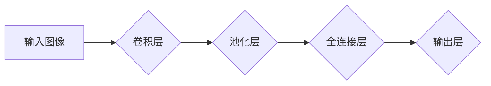

                 

## 深度学习在商品图像识别中的应用

> 关键词：深度学习、商品图像识别、卷积神经网络、迁移学习、物体检测、图像分类、推荐系统

## 1. 背景介绍

随着电子商务的蓬勃发展，商品图像识别技术已成为零售行业不可或缺的一部分。传统的商品识别方法，例如基于规则的匹配或人工标注，效率低下且难以应对商品的多样性和复杂性。深度学习的出现为商品图像识别带来了革命性的变革，其强大的特征提取能力和自学习特性使其能够准确识别和分类各种商品。

商品图像识别技术在零售领域有着广泛的应用场景，例如：

* **商品搜索和推荐:** 通过识别商品图像，用户可以更方便地搜索和找到所需商品，同时，系统可以根据用户的浏览和购买历史，推荐与用户兴趣相符的商品。
* **库存管理:** 自动识别商品图像可以帮助企业更准确地管理库存，避免缺货或积压。
* **价格监测:** 通过识别商品图像，系统可以自动监测商品价格的变化，帮助企业制定更有效的定价策略。
* **反假冒:** 利用深度学习识别商品的真伪，有效打击假冒伪劣商品。

## 2. 核心概念与联系

商品图像识别主要依赖于深度学习中的卷积神经网络（CNN）。CNN 是一种专门用于处理图像数据的网络结构，其核心在于利用卷积层和池化层提取图像特征。

**流程图:**



**核心概念:**

* **卷积层:** 利用卷积核对图像进行卷积运算，提取图像局部特征。
* **池化层:** 对卷积层的输出进行降维处理，减少计算量并提高网络鲁棒性。
* **全连接层:** 将池化层的输出连接起来，进行分类或回归任务。
* **输出层:** 根据任务类型输出最终结果，例如商品类别或商品价格。

## 3. 核心算法原理 & 具体操作步骤

### 3.1  算法原理概述

深度学习的商品图像识别算法基于 CNN 的原理，通过多层卷积和池化操作，逐层提取图像特征，最终实现商品的识别和分类。

**具体步骤:**

1. **数据预处理:** 对输入图像进行尺寸调整、归一化等预处理操作，以提高模型的训练效率和识别精度。
2. **特征提取:** 利用 CNN 的卷积层和池化层提取图像特征，将图像转换为抽象的特征向量。
3. **分类或回归:** 将提取的特征向量输入全连接层，进行分类或回归任务。
4. **模型训练:** 利用训练数据训练模型，调整网络参数，使模型能够准确识别商品。
5. **模型评估:** 利用测试数据评估模型的识别精度，并根据评估结果进行模型调优。

### 3.2  算法步骤详解

1. **数据预处理:**

* **尺寸调整:** 将所有图像调整为统一的大小，以满足模型的输入要求。
* **归一化:** 将图像像素值归一化到 [0, 1] 范围内，提高模型的训练稳定性。
* **数据增强:** 通过旋转、翻转、裁剪等操作对图像进行增强，增加训练数据的多样性，提高模型的泛化能力。

2. **特征提取:**

* **卷积层:** 利用多个卷积核对图像进行卷积运算，提取图像局部特征。每个卷积核对应不同的特征，例如边缘、纹理等。
* **池化层:** 对卷积层的输出进行降维处理，减少计算量并提高网络鲁棒性。常用的池化方法包括最大池化和平均池化。

3. **分类或回归:**

* **全连接层:** 将池化层的输出连接起来，进行分类或回归任务。全连接层可以学习更复杂的特征关系。
* **输出层:** 根据任务类型输出最终结果。

    * **分类任务:** 输出层使用 softmax 函数将特征向量映射到多个类别概率，选择概率最高的类别作为预测结果。
    * **回归任务:** 输出层直接输出商品价格等连续值。

4. **模型训练:**

* **损失函数:** 用于衡量模型预测结果与真实结果之间的差距。常用的损失函数包括交叉熵损失和均方误差损失。
* **优化算法:** 用于更新模型参数，使损失函数最小化。常用的优化算法包括梯度下降法和 Adam 算法。

5. **模型评估:**

* **准确率:** 预测正确的商品数量占总商品数量的比例。
* **召回率:** 预测正确的商品数量占真实商品数量的比例。
* **F1-score:** 准确率和召回率的 harmonic mean。

### 3.3  算法优缺点

**优点:**

* **高识别精度:** 深度学习算法能够学习到复杂的图像特征，实现高准确率的商品识别。
* **自学习能力:** 深度学习模型能够通过训练数据自动学习特征，无需人工设计特征。
* **鲁棒性:** 深度学习模型对图像噪声和变化有一定的鲁棒性。

**缺点:**

* **训练数据需求量大:** 深度学习模型需要大量的训练数据才能达到较高的识别精度。
* **计算资源消耗大:** 训练深度学习模型需要大量的计算资源，例如 GPU。
* **可解释性差:** 深度学习模型的决策过程较为复杂，难以解释模型的识别结果。

### 3.4  算法应用领域

深度学习在商品图像识别领域有着广泛的应用，例如：

* **电商平台:** 商品搜索、推荐、库存管理、反假冒等。
* **零售店:** 商品识别、价格监测、库存管理等。
* **物流行业:** 商品识别、包裹分类、运输管理等。
* **医疗行业:** 药品识别、病历分析等。

## 4. 数学模型和公式 & 详细讲解 & 举例说明

### 4.1  数学模型构建

深度学习模型的数学模型主要基于神经网络的结构和激活函数。

**神经网络结构:**

神经网络由多个层组成，每层包含多个神经元。每个神经元接收来自上一层的输入信号，并通过权重进行加权求和，然后应用激活函数进行非线性变换，输出到下一层。

**激活函数:**

激活函数用于引入非线性，使神经网络能够学习复杂的特征关系。常用的激活函数包括 sigmoid 函数、ReLU 函数和 tanh 函数。

### 4.2  公式推导过程

**损失函数:**

交叉熵损失函数用于衡量分类任务的模型预测结果与真实结果之间的差距。

$$
L = -\sum_{i=1}^{N} y_i \log(\hat{y}_i)
$$

其中：

* $L$ 为损失函数值
* $N$ 为样本数量
* $y_i$ 为真实标签
* $\hat{y}_i$ 为模型预测的概率

**梯度下降法:**

梯度下降法是一种常用的优化算法，用于更新模型参数，使损失函数最小化。

$$
\theta = \theta - \alpha \nabla L(\theta)
$$

其中：

* $\theta$ 为模型参数
* $\alpha$ 为学习率
* $\nabla L(\theta)$ 为损失函数对参数 $\theta$ 的梯度

### 4.3  案例分析与讲解

**举例说明:**

假设我们训练一个商品图像识别模型，用于识别服装类别。模型输入一张服装图像，经过卷积层和池化层提取特征，最终输出服装类别的概率分布。

如果模型预测结果为：

* T恤: 0.8
* 裤子: 0.1
* 裙子: 0.1

则模型认为该图像最可能是 T 恤。

## 5. 项目实践：代码实例和详细解释说明

### 5.1  开发环境搭建

* **操作系统:** Ubuntu 18.04
* **深度学习框架:** TensorFlow 2.0
* **编程语言:** Python 3.7
* **硬件:** NVIDIA GeForce GTX 1080Ti GPU

### 5.2  源代码详细实现

```python
import tensorflow as tf

# 定义模型结构
model = tf.keras.models.Sequential([
    tf.keras.layers.Conv2D(32, (3, 3), activation='relu', input_shape=(224, 224, 3)),
    tf.keras.layers.MaxPooling2D((2, 2)),
    tf.keras.layers.Conv2D(64, (3, 3), activation='relu'),
    tf.keras.layers.MaxPooling2D((2, 2)),
    tf.keras.layers.Flatten(),
    tf.keras.layers.Dense(10, activation='softmax')
])

# 编译模型
model.compile(optimizer='adam',
              loss='sparse_categorical_crossentropy',
              metrics=['accuracy'])

# 训练模型
model.fit(x_train, y_train, epochs=10)

# 评估模型
loss, accuracy = model.evaluate(x_test, y_test)
print('Loss:', loss)
print('Accuracy:', accuracy)
```

### 5.3  代码解读与分析

* **模型结构:** 代码定义了一个简单的 CNN 模型，包含两个卷积层、两个池化层、一个全连接层和一个输出层。
* **激活函数:** 模型使用 ReLU 函数作为激活函数，可以提高模型的训练效率。
* **损失函数:** 模型使用 sparse_categorical_crossentropy 作为损失函数，用于分类任务。
* **优化算法:** 模型使用 Adam 算法作为优化算法，可以快速收敛到局部最优解。
* **训练和评估:** 代码使用训练数据训练模型，并使用测试数据评估模型的性能。

### 5.4  运行结果展示

训练完成后，模型的损失值和准确率会输出到控制台。

## 6. 实际应用场景

### 6.1  电商平台

* **商品搜索:** 用户可以通过上传商品图像进行搜索，快速找到所需商品。
* **商品推荐:** 系统可以根据用户的浏览和购买历史，识别用户的兴趣偏好，推荐与用户兴趣相符的商品。
* **库存管理:** 自动识别商品图像可以帮助企业更准确地管理库存，避免缺货或积压。
* **反假冒:** 利用深度学习识别商品的真伪，有效打击假冒伪劣商品。

### 6.2  零售店

* **商品识别:** 顾客可以通过手机摄像头扫描商品条码或图像，获取商品信息。
* **价格监测:** 系统可以自动监测商品价格的变化，帮助企业制定更有效的定价策略。
* **库存管理:** 自动识别商品图像可以帮助企业更准确地管理库存，提高库存周转率。

### 6.3  物流行业

* **商品识别:** 系统可以识别包裹中的商品类型，提高包裹分类效率。
* **运输管理:** 通过识别商品图像，系统可以跟踪商品的运输过程，提高物流效率。

### 6.4  未来应用展望

随着深度学习技术的不断发展，商品图像识别技术将有更广泛的应用场景，例如：

* **个性化推荐:** 根据用户的画像和商品图像特征，提供更个性化的商品推荐。
* **虚拟试衣间:** 利用深度学习技术，实现虚拟试衣间功能，帮助用户在线试穿衣服。
* **智能零售:** 建立智能零售系统，实现无人商店、智能导购等功能。

## 7. 工具和资源推荐

### 7.1  学习资源推荐

* **书籍:**
    * 深度学习
    * 深度学习实战
* **在线课程:**
    * Coursera: 深度学习
    * Udacity: 深度学习工程师
* **博客:**
    * TensorFlow 官方博客
    * PyTorch 官方博客

### 7.2  开发工具推荐

* **深度学习框架:** TensorFlow, PyTorch
* **图像处理库:** OpenCV, Pillow
* **数据可视化工具:** Matplotlib, Seaborn

### 7.3  相关论文推荐

* **AlexNet: ImageNet Classification with Deep Convolutional Neural Networks**
* **VGGNet: Very Deep Convolutional Networks for Large-Scale Image Recognition**
* **ResNet: Deep Residual Learning for Image Recognition**

## 8. 总结：未来发展趋势与挑战

### 8.1  研究成果总结

深度学习在商品图像识别领域取得了显著的成果，能够实现高准确率的商品识别和分类。

### 8.2  未来发展趋势

* **模型更深更复杂:** 研究更深更复杂的 CNN 模型，提高识别精度和泛化能力。
* **迁移学习:** 利用预训练模型进行迁移学习，减少训练数据需求。
* **多模态融合:** 将图像识别与其他模态数据（例如文本、音频）融合，提高识别准确率和理解能力。
* **实时识别:** 研究实时商品图像识别技术，应用于智能零售、无人商店等场景。

### 8.3  面临的挑战

* **数据标注成本高:** 深度学习模型需要大量的标注数据，数据标注成本较高。
* **模型解释性差:** 深度学习模型的决策过程较为复杂，难以解释模型的识别结果。
* **模型部署成本高:** 部署深度学习模型需要强大的计算资源，成本较高。

### 8.4  研究展望

未来，商品图像识别技术将继续发展，应用场景将更加广泛，对零售行业、物流行业、医疗行业等领域产生深远影响。


## 9. 附录：常见问题与解答

**1. 如何选择合适的深度学习框架？**

 TensorFlow 和 PyTorch 是目前最流行的深度学习框架， TensorFlow 更注重生产环境部署，PyTorch 更注重学术研究和快速原型开发。

**2. 如何解决数据标注成本高的问题？**

 可以利用数据增强技术，通过对现有数据进行变换，生成更多训练数据。还可以利用自动标注工具，减少人工标注成本。

**3. 如何提高模型的识别精度？**

 可以尝试使用更深更复杂的 CNN 模型，增加训练数据量，调优模型参数，以及使用迁移学习技术。


作者：禅与计算机程序设计艺术 / Zen and the Art of Computer Programming<end_of_turn>

