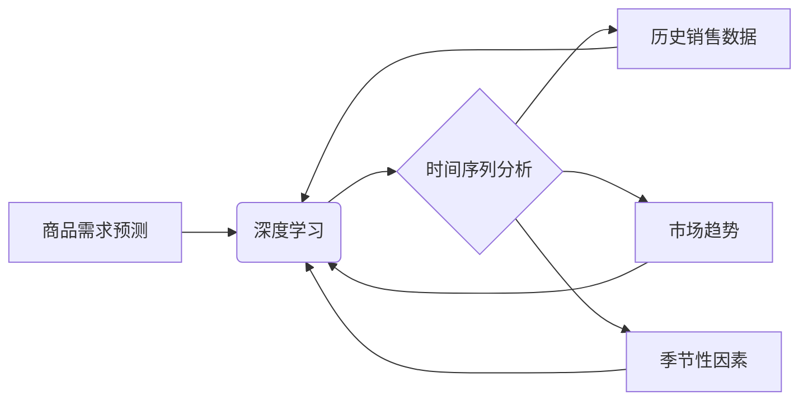

                 

## 深度学习在商品需求预测中的应用

> 关键词：深度学习、商品需求预测、时间序列分析、卷积神经网络、循环神经网络、长短期记忆网络、注意力机制

## 1. 背景介绍

在当今数据爆炸的时代，商品需求预测已成为企业运营和决策的关键环节。准确预测商品需求能够帮助企业优化库存管理、制定合理的生产计划、制定有效的营销策略，从而提高利润率和市场竞争力。传统的商品需求预测方法主要依赖于统计模型和专家经验，但这些方法往往难以捕捉到复杂的时间序列特征和潜在的非线性关系。

深度学习作为一种强大的机器学习技术，凭借其强大的特征提取能力和非线性建模能力，在商品需求预测领域展现出巨大的潜力。深度学习模型能够从海量历史数据中自动学习到商品需求的复杂模式，并对未来需求进行更精准的预测。

## 2. 核心概念与联系

### 2.1 商品需求预测

商品需求预测是指根据历史销售数据、市场趋势、季节性因素等信息，预测未来一段时间内特定商品的销售量。

### 2.2 深度学习

深度学习是一种基于人工神经网络的机器学习方法，它利用多层神经网络结构来学习数据中的复杂特征。深度学习模型能够自动从数据中提取特征，无需人工特征工程，从而提高预测精度。

### 2.3 时间序列分析

时间序列分析是研究随时间推移而变化的数据的统计方法。商品需求数据通常呈现时间序列特征，因此时间序列分析方法在商品需求预测中发挥着重要作用。

**核心概念与联系流程图**



## 3. 核心算法原理 & 具体操作步骤

### 3.1 算法原理概述

深度学习在商品需求预测中常用的算法包括卷积神经网络（CNN）、循环神经网络（RNN）和长短期记忆网络（LSTM）。

* **卷积神经网络（CNN）**：CNN擅长提取图像和文本中的特征，也可以应用于时间序列数据。CNN通过卷积核对时间序列数据进行卷积操作，提取不同时间尺度的特征，并通过池化层降低数据维度。

* **循环神经网络（RNN）**：RNN能够处理具有时间依赖性的数据，其内部结构包含循环单元，能够记忆之前的信息，从而更好地捕捉时间序列中的长期依赖关系。

* **长短期记忆网络（LSTM）**：LSTM是一种改进的RNN，它通过引入门控机制，能够更好地解决梯度消失问题，从而更有效地学习长期依赖关系。

### 3.2 算法步骤详解

**使用CNN进行商品需求预测的步骤：**

1. **数据预处理**: 将历史销售数据进行清洗、标准化和转换，使其适合CNN模型的输入。
2. **特征提取**: 使用CNN模型提取时间序列数据的特征，包括不同时间尺度的特征。
3. **分类或回归**: 根据预测目标，使用分类器或回归器对提取的特征进行预测。

**使用RNN或LSTM进行商品需求预测的步骤：**

1. **数据预处理**: 将历史销售数据进行清洗、标准化和转换，使其适合RNN或LSTM模型的输入。
2. **序列编码**: 将时间序列数据编码为RNN或LSTM模型可以理解的格式。
3. **特征学习**: 使用RNN或LSTM模型学习时间序列数据的特征，包括长期依赖关系。
4. **预测**: 根据学习到的特征，对未来需求进行预测。

### 3.3 算法优缺点

| 算法 | 优点 | 缺点 |
|---|---|---|
| CNN | 提取特征能力强，能够捕捉不同时间尺度的特征 | 难以处理长序列数据，对数据长度敏感 |
| RNN | 能够处理时间依赖性数据，捕捉长期依赖关系 | 容易出现梯度消失问题 |
| LSTM | 能够更好地解决梯度消失问题，更有效地学习长期依赖关系 | 计算复杂度高，训练时间长 |

### 3.4 算法应用领域

深度学习在商品需求预测领域有着广泛的应用，例如：

* **电子商务**: 预测商品销量，优化库存管理，推荐商品。
* **零售**: 预测商品需求，制定采购计划，优化商品布局。
* **制造业**: 预测生产需求，优化生产计划，降低库存成本。
* **能源**: 预测能源需求，优化能源分配，提高能源效率。

## 4. 数学模型和公式 & 详细讲解 & 举例说明

### 4.1 数学模型构建

深度学习模型的数学模型通常基于神经网络的结构和激活函数。

**神经网络结构**:

神经网络由多个层组成，每层包含多个神经元。每个神经元接收来自上一层的输入信号，并通过权重进行加权求和，然后通过激活函数进行非线性变换，输出到下一层。

**激活函数**:

激活函数是神经网络中引入非线性性的关键部分。常用的激活函数包括 sigmoid 函数、ReLU 函数、tanh 函数等。

**损失函数**:

损失函数用于衡量模型预测结果与真实值的差距。常用的损失函数包括均方误差（MSE）、交叉熵损失（Cross-Entropy Loss）等。

**优化算法**:

优化算法用于更新模型参数，使损失函数最小化。常用的优化算法包括梯度下降（Gradient Descent）、Adam 算法、RMSprop 算法等。

### 4.2 公式推导过程

**均方误差 (MSE)**

$$MSE = \frac{1}{n} \sum_{i=1}^{n} (y_i - \hat{y}_i)^2$$

其中：

* $y_i$ 是真实值
* $\hat{y}_i$ 是预测值
* $n$ 是样本数量

**梯度下降 (GD)**

$$\theta = \theta - \alpha \nabla J(\theta)$$

其中：

* $\theta$ 是模型参数
* $\alpha$ 是学习率
* $\nabla J(\theta)$ 是损失函数的梯度

### 4.3 案例分析与讲解

假设我们想要预测某商品未来一周的销量。我们可以使用历史销售数据训练一个深度学习模型，例如 LSTM 网络。

训练过程中，我们将历史销售数据作为输入，并使用 MSE 作为损失函数。通过梯度下降算法，模型会不断更新参数，使预测结果与真实值之间的差距最小化。

训练完成后，我们可以使用模型对未来一周的销量进行预测。

## 5. 项目实践：代码实例和详细解释说明

### 5.1 开发环境搭建

* Python 3.6+
* TensorFlow 或 PyTorch
* NumPy
* Pandas

### 5.2 源代码详细实现

```python
import tensorflow as tf
from tensorflow.keras.models import Sequential
from tensorflow.keras.layers import LSTM, Dense

# 数据预处理
# ...

# 模型构建
model = Sequential()
model.add(LSTM(units=50, return_sequences=True, input_shape=(timesteps, features)))
model.add(LSTM(units=50))
model.add(Dense(units=1))

# 模型编译
model.compile(loss='mean_squared_error', optimizer='adam')

# 模型训练
model.fit(X_train, y_train, epochs=100, batch_size=32)

# 模型评估
# ...

# 模型预测
predictions = model.predict(X_test)
```

### 5.3 代码解读与分析

* **数据预处理**: 将历史销售数据进行清洗、标准化和转换，使其适合模型的输入。
* **模型构建**: 使用 TensorFlow 或 PyTorch 库构建 LSTM 网络模型。
* **模型编译**: 使用 MSE 作为损失函数，Adam 算法作为优化器，编译模型。
* **模型训练**: 使用训练数据训练模型，并设置训练轮数和批处理大小。
* **模型评估**: 使用测试数据评估模型的性能，例如计算均方误差。
* **模型预测**: 使用训练好的模型对未来需求进行预测。

### 5.4 运行结果展示

运行结果展示包括模型的训练曲线、评估指标和预测结果的可视化展示。

## 6. 实际应用场景

### 6.1 电子商务平台

* **商品推荐**: 根据用户的历史购买记录和浏览行为，预测用户对特定商品的需求，并推荐相关商品。
* **库存管理**: 预测商品的未来销量，优化库存水平，避免缺货或积压。
* **促销活动**: 预测促销活动的效果，制定合理的促销策略。

### 6.2 零售商

* **商品采购**: 预测商品的需求量，制定合理的采购计划，降低采购成本。
* **商品布局**: 根据商品的需求预测，优化商品的陈列位置，提高销售额。
* **库存优化**: 预测商品的滞销风险，及时调整库存策略，降低库存成本。

### 6.3 制造业

* **生产计划**: 预测产品的需求量，制定合理的生产计划，提高生产效率。
* **原材料采购**: 预测原材料的需求量，优化原材料采购计划，降低采购成本。
* **库存管理**: 预测产品的滞销风险，及时调整库存策略，降低库存成本。

### 6.4 未来应用展望

随着深度学习技术的不断发展，商品需求预测的精度和应用范围将会进一步提升。未来，深度学习在商品需求预测领域可能会有以下应用：

* **个性化需求预测**: 基于用户的个人特征和行为数据，进行个性化的需求预测。
* **多因素融合预测**: 将多种数据源，例如天气、节日、新闻等，融合到模型中，提高预测精度。
* **实时需求预测**: 利用实时数据流，进行实时需求预测，支持更灵活的决策。

## 7. 工具和资源推荐

### 7.1 学习资源推荐

* **书籍**:
    * Deep Learning by Ian Goodfellow, Yoshua Bengio, and Aaron Courville
    * Hands-On Machine Learning with Scikit-Learn, Keras & TensorFlow by Aurélien Géron
* **在线课程**:
    * Deep Learning Specialization by Andrew Ng (Coursera)
    * Fast.ai Deep Learning Course
* **博客和网站**:
    * Towards Data Science
    * Machine Learning Mastery

### 7.2 开发工具推荐

* **TensorFlow**: 开源深度学习框架，支持多种硬件平台。
* **PyTorch**: 开源深度学习框架，以其灵活性和易用性而闻名。
* **Keras**: 高级深度学习API，可以运行在 TensorFlow、Theano 或 CNTK 后端。

### 7.3 相关论文推荐

* **Sequence to Sequence Learning with Neural Networks** by Sutskever et al. (2014)
* **Recurrent Neural Networks for Sequence Learning** by Hochreiter and Schmidhuber (1997)
* **Long Short-Term Memory** by Hochreiter and Schmidhuber (1997)

## 8. 总结：未来发展趋势与挑战

### 8.1 研究成果总结

深度学习在商品需求预测领域取得了显著的成果，能够有效提高预测精度，并为企业提供更精准的决策支持。

### 8.2 未来发展趋势

* **模型复杂度提升**: 研究更复杂的深度学习模型，例如 Transformer 网络，以更好地捕捉时间序列数据的复杂特征。
* **数据融合**: 将多种数据源融合到模型中，例如天气、节日、新闻等，提高预测精度。
* **个性化需求预测**: 基于用户的个人特征和行为数据，进行个性化的需求预测。
* **实时需求预测**: 利用实时数据流，进行实时需求预测，支持更灵活的决策。

### 8.3 面临的挑战

* **数据质量**: 深度学习模型对数据质量要求较高，需要高质量、丰富的数据进行训练。
* **模型 interpretability**: 深度学习模型的内部机制较为复杂，难以解释模型的预测结果，这可能会影响模型的信任度。
* **计算资源**: 训练大型深度学习模型需要大量的计算资源，这可能会成为一些企业的技术瓶颈。

### 8.4 研究展望

未来，深度学习在商品需求预测领域仍有很大的发展空间。研究者将继续探索更有效的模型架构、更丰富的特征融合方法和更强大的计算资源，以推动商品需求预测技术的进步。

## 9. 附录：常见问题与解答

**Q1: 深度学习模型的训练需要多长时间？**

A1: 深度学习模型的训练时间取决于模型的复杂度、数据量和硬件资源等因素。一般来说，训练时间可能从几分钟到几天不等。

**Q2: 如何评估深度学习模型的性能？**

A2: 常用的评估指标包括均方误差 (MSE)、平均绝对误差 (MAE) 和 R-squared 等。

**Q3: 如何处理缺失数据？**

A3: 可以使用多种方法处理缺失数据，例如平均值填充、线性插值或使用机器学习算法进行预测。

**Q4: 如何选择合适的深度学习模型？**

A4: 选择合适的深度学习模型需要根据具体任务和数据特点进行选择。例如，对于时间序列数据，RNN 或 LSTM 网络通常是一个不错的选择。


作者：禅与计算机程序设计艺术 / Zen and the Art of Computer Programming 
<end_of_turn>

