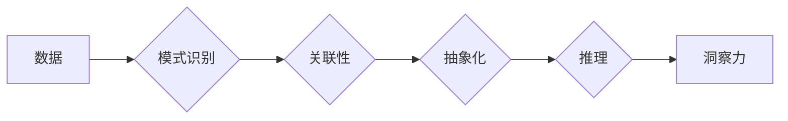

                 

## 理解洞察力：大脑的神奇能力

> 关键词：洞察力、人工智能、神经网络、深度学习、认知科学、机器学习、模式识别

## 1. 背景介绍

洞察力，这是一种令人惊叹的能力，让我们能够从纷繁复杂的现象中识别出隐藏的模式，并从中得出深刻的见解。它赋予我们理解世界、解决问题和做出明智决策的能力。然而，洞察力的本质是什么？它是如何运作的？人类大脑是如何实现这种神奇能力的？

近年来，人工智能（AI）领域取得了令人瞩目的进展，特别是深度学习技术的突破，使得机器能够模拟人类大脑的部分功能，例如图像识别、自然语言处理和决策分析。然而，在洞察力方面，机器仍然远远落后于人类。

理解洞察力的本质，对于推动人工智能发展至关重要。它将帮助我们设计出更智能、更具洞察力的 AI 系统，能够更好地理解和应对复杂世界中的挑战。

## 2. 核心概念与联系

洞察力本质上是一种从数据中发现隐藏的模式和关系的能力。它涉及到以下几个核心概念：

* **模式识别:** 这是洞察力的基础，大脑能够识别数据中的重复性和规律性，并将其归类和关联。
* **关联性:** 洞察力需要将看似无关的信息联系起来，发现它们之间的潜在关系。
* **抽象化:** 能够将具体的事物概括为更抽象的概念，从而发现更深层次的规律。
* **推理:** 基于已知的模式和关系，推断出新的结论和见解。

**核心概念与联系流程图:**



## 3. 核心算法原理 & 具体操作步骤

### 3.1  算法原理概述

目前，还没有一种算法能够完全模拟人类的洞察力。然而，一些机器学习算法，例如深度学习，已经取得了一些进展。深度学习算法通过多层神经网络来学习数据中的复杂模式。

### 3.2  算法步骤详解

1. **数据收集和预处理:** 收集大量相关数据，并进行清洗、转换和特征提取。
2. **网络结构设计:** 设计多层神经网络结构，包括输入层、隐藏层和输出层。
3. **参数初始化:** 为神经网络中的每个参数赋予初始值。
4. **训练过程:** 使用训练数据训练神经网络，通过反向传播算法调整网络参数，使网络能够准确地识别数据中的模式。
5. **模型评估:** 使用测试数据评估模型的性能，并进行调优。
6. **洞察力发现:** 将训练好的模型应用于新的数据，并通过分析模型的输出结果，发现隐藏的模式和关系。

### 3.3  算法优缺点

**优点:**

* 能够学习复杂的数据模式。
* 自动特征提取，无需人工特征工程。
* 性能不断提升，取得了令人瞩目的成果。

**缺点:**

* 需要大量的数据进行训练。
* 训练过程耗时和计算资源消耗大。
* 模型解释性较差，难以理解模型的决策过程。

### 3.4  算法应用领域

* **图像识别:** 识别物体、场景和人脸。
* **自然语言处理:** 理解和生成文本，例如机器翻译、文本摘要和情感分析。
* **医疗诊断:** 辅助医生诊断疾病，例如癌症检测和疾病预测。
* **金融分析:** 识别欺诈行为、预测市场趋势和评估风险。

## 4. 数学模型和公式 & 详细讲解 & 举例说明

### 4.1  数学模型构建

深度学习算法的核心是神经网络，它由多个神经元组成，这些神经元相互连接，并通过权重来传递信息。

**神经网络模型:**

$$
y = f(W_1x_1 + W_2x_2 + ... + W_nx_n + b)
$$

其中：

* $y$ 是输出值
* $x_1, x_2, ..., x_n$ 是输入值
* $W_1, W_2, ..., W_n$ 是权重
* $b$ 是偏置
* $f$ 是激活函数

### 4.2  公式推导过程

神经网络的训练过程是通过优化权重来最小化预测误差。常用的优化算法是梯度下降算法。

**梯度下降算法:**

$$
W_{new} = W_{old} - \alpha \frac{\partial Loss}{\partial W}
$$

其中：

* $W_{new}$ 是更新后的权重
* $W_{old}$ 是旧的权重
* $\alpha$ 是学习率
* $\frac{\partial Loss}{\partial W}$ 是损失函数对权重的梯度

### 4.3  案例分析与讲解

例如，在图像识别任务中，我们可以使用卷积神经网络（CNN）来提取图像特征。CNN 的结构包含多个卷积层、池化层和全连接层。

卷积层使用卷积核来提取图像的局部特征，池化层对特征图进行降维，全连接层将提取的特征进行分类。

通过训练 CNN 模型，它能够学习到图像中各种物体和场景的特征，并能够准确地识别它们。

## 5. 项目实践：代码实例和详细解释说明

### 5.1  开发环境搭建

* Python 3.x
* TensorFlow 或 PyTorch 深度学习框架
* Jupyter Notebook 或 VS Code 代码编辑器

### 5.2  源代码详细实现

```python
# 使用 TensorFlow 构建一个简单的 CNN 模型

import tensorflow as tf

# 定义模型结构
model = tf.keras.models.Sequential([
    tf.keras.layers.Conv2D(32, (3, 3), activation='relu', input_shape=(28, 28, 1)),
    tf.keras.layers.MaxPooling2D((2, 2)),
    tf.keras.layers.Conv2D(64, (3, 3), activation='relu'),
    tf.keras.layers.MaxPooling2D((2, 2)),
    tf.keras.layers.Flatten(),
    tf.keras.layers.Dense(10, activation='softmax')
])

# 编译模型
model.compile(optimizer='adam',
              loss='sparse_categorical_crossentropy',
              metrics=['accuracy'])

# 训练模型
model.fit(x_train, y_train, epochs=5)

# 评估模型
loss, accuracy = model.evaluate(x_test, y_test)
print('Test Loss:', loss)
print('Test Accuracy:', accuracy)
```

### 5.3  代码解读与分析

* **模型结构:** 该代码定义了一个简单的 CNN 模型，包含两个卷积层、两个池化层和一个全连接层。
* **激活函数:** 使用 ReLU 激活函数，可以提高模型的表达能力。
* **损失函数:** 使用 sparse_categorical_crossentropy 损失函数，适合多分类问题。
* **优化器:** 使用 Adam 优化器，可以快速收敛。
* **训练过程:** 使用训练数据训练模型，并设置训练轮数（epochs）。
* **评估过程:** 使用测试数据评估模型的性能，并打印测试损失和准确率。

### 5.4  运行结果展示

训练完成后，可以将模型应用于新的数据，并预测其类别。

## 6. 实际应用场景

* **医疗诊断:** 使用深度学习算法分析医学图像，辅助医生诊断疾病。
* **金融风险评估:** 分析金融数据，识别欺诈行为和预测市场风险。
* **个性化推荐:** 分析用户行为数据，推荐个性化的商品和服务。
* **智能客服:** 使用自然语言处理技术，开发智能客服系统，自动回复用户问题。

### 6.4  未来应用展望

随着人工智能技术的不断发展，洞察力将应用于更广泛的领域，例如：

* **科学发现:** 帮助科学家发现新的物理规律和化学物质。
* **艺术创作:** 创作出具有洞察力的艺术作品。
* **社会治理:** 帮助政府制定更有效的政策。

## 7. 工具和资源推荐

### 7.1  学习资源推荐

* **书籍:**
    * 《深度学习》
    * 《人工智能：一种现代方法》
* **在线课程:**
    * Coursera 深度学习课程
    * Udacity 机器学习工程师课程

### 7.2  开发工具推荐

* **TensorFlow:** 开源深度学习框架
* **PyTorch:** 开源深度学习框架
* **Jupyter Notebook:** 用于代码编写和可视化分析的工具

### 7.3  相关论文推荐

* **《ImageNet Classification with Deep Convolutional Neural Networks》**
* **《Attention Is All You Need》**

## 8. 总结：未来发展趋势与挑战

### 8.1  研究成果总结

近年来，深度学习算法取得了令人瞩目的进展，在图像识别、自然语言处理等领域取得了突破性成果。

### 8.2  未来发展趋势

* **更强大的模型:** 研究更深、更复杂的网络结构，提高模型的表达能力和泛化能力。
* **更有效的训练方法:** 研究更有效的训练算法，降低训练成本和时间。
* **模型解释性:** 研究更可解释的模型，帮助人们理解模型的决策过程。
* **跨模态学习:** 研究能够处理多种数据类型的模型，例如图像、文本和音频。

### 8.3  面临的挑战

* **数据获取和标注:** 深度学习算法需要大量的数据进行训练，获取和标注高质量数据仍然是一个挑战。
* **计算资源:** 训练大型深度学习模型需要大量的计算资源，这对于个人开发者和小型公司来说是一个负担。
* **模型安全性:** 深度学习模型容易受到攻击，需要研究更安全的模型架构和训练方法。

### 8.4  研究展望

未来，人工智能研究将继续朝着更智能、更安全、更可解释的方向发展。洞察力将成为人工智能的核心能力之一，它将帮助我们更好地理解世界，解决更复杂的问题，创造更美好的未来。

## 9. 附录：常见问题与解答

**Q1: 深度学习算法能够完全模拟人类的洞察力吗？**

A1: 目前还没有一种算法能够完全模拟人类的洞察力。人类的洞察力涉及到复杂的认知能力，例如推理、抽象化和创造力，这些能力目前还没有被完全理解和模拟。

**Q2: 如何评估深度学习模型的洞察力？**

A2: 评估深度学习模型的洞察力是一个复杂的问题，目前还没有一个统一的标准。可以从以下几个方面进行评估：

* **模型的准确率:** 模型能够准确地识别数据中的模式和关系。
* **模型的泛化能力:** 模型能够应用于新的数据，并做出准确的预测。
* **模型的解释性:** 人类能够理解模型的决策过程。

**Q3: 深度学习算法的应用领域有哪些？**

A3: 深度学习算法的应用领域非常广泛，例如：

* **图像识别:** 识别物体、场景和人脸。
* **自然语言处理:** 理解和生成文本，例如机器翻译、文本摘要和情感分析。
* **医疗诊断:** 辅助医生诊断疾病，例如癌症检测和疾病预测。
* **金融分析:** 识别欺诈行为、预测市场趋势和评估风险。


作者：禅与计算机程序设计艺术 / Zen and the Art of Computer Programming 
<end_of_turn>

