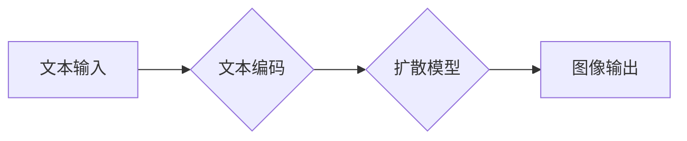

                 

## 生成图像加速:LLM图像生成速度提升

> 关键词：LLM, 图像生成, 加速, 效率, 模型优化, 硬件加速, 算法改进

## 1. 背景介绍

近年来，基于大型语言模型（LLM）的文本到图像生成技术取得了令人瞩目的进展。模型如 DALL-E 2、Stable Diffusion 和 Midjourney 能够根据自然语言描述生成逼真的、富有创意的图像，这为艺术创作、设计、教育和娱乐等领域带来了革命性的变革。然而，这些模型通常需要大量的计算资源和时间来生成图像，这限制了其在实际应用中的推广。

图像生成速度的提升对于广泛应用LLM至关重要。 

* **用户体验:** 较长的生成时间会影响用户体验，降低使用效率。
* **实时应用:**  许多应用场景，例如实时图像编辑、游戏开发和增强现实，需要快速响应，而现有的LLM图像生成速度难以满足。
* **成本效益:**  高昂的计算成本限制了LLM图像生成技术的普及。

因此，加速LLM图像生成速度成为一个重要的研究方向。

## 2. 核心概念与联系

LLM图像生成通常基于以下核心概念：

* **文本编码:** 将自然语言描述转换为模型可理解的向量表示。
* **图像解码:** 将编码后的文本信息解码为图像像素。
* **扩散模型:** 一种强大的生成模型，通过逐步添加噪声到图像中，然后学习逆转这个过程来生成图像。

这些概念相互关联，共同构成了LLM图像生成系统的框架。

**Mermaid 流程图:**



## 3. 核心算法原理 & 具体操作步骤

### 3.1  算法原理概述

LLM图像生成算法的核心是扩散模型。扩散模型的工作原理是：

1. **前向过程:** 将一个干净的图像逐步添加噪声，直到变成纯噪声。
2. **反向过程:** 学习逆转这个过程，从纯噪声中逐渐去除噪声，最终生成一个新的图像。

训练扩散模型时，会使用大量的图像数据，学习噪声添加和去除的规律。

### 3.2  算法步骤详解

1. **数据预处理:** 将图像数据预处理，例如调整大小、归一化等。
2. **前向扩散:** 对图像数据进行多次随机噪声添加，直到变成纯噪声。
3. **反向扩散:** 学习从纯噪声中逐渐去除噪声，生成图像的过程。
4. **文本引导:** 将文本编码信息融入反向扩散过程中，引导模型生成符合文本描述的图像。
5. **图像生成:** 通过反向扩散过程，最终生成符合文本描述的图像。

### 3.3  算法优缺点

**优点:**

* **生成高质量图像:** 扩散模型能够生成逼真、高质量的图像。
* **灵活多样:** 可以根据不同的文本描述生成不同的图像。
* **可解释性强:** 扩散模型的训练过程相对透明，更容易理解。

**缺点:**

* **训练成本高:** 训练扩散模型需要大量的计算资源和时间。
* **生成速度慢:** 即使训练完成后，生成图像的速度仍然相对较慢。

### 3.4  算法应用领域

* **图像生成:** 根据文本描述生成图像，例如艺术创作、概念设计、产品原型设计。
* **图像编辑:** 对图像进行编辑和修改，例如添加物体、修改背景、修复图像缺陷。
* **图像增强:** 提升图像质量，例如提高分辨率、减少噪声、增强色彩。
* **视频生成:** 根据文本描述生成视频，例如动画制作、视频剪辑。

## 4. 数学模型和公式 & 详细讲解 & 举例说明

### 4.1  数学模型构建

扩散模型的核心是马尔可夫链，它描述了图像数据在添加噪声和去除噪声过程中的状态转移。

假设图像数据为 $x_t$，其中 $t$ 表示时间步长。扩散模型的马尔可夫链可以表示为：

$$
x_{t+1} = \sqrt{1-\beta_t}x_t + \sqrt{\beta_t}\epsilon_t
$$

其中：

* $\beta_t$ 是时间步长 $t$ 的噪声强度参数。
* $\epsilon_t$ 是服从标准正态分布的噪声项。

### 4.2  公式推导过程

训练扩散模型的目标是学习逆向扩散过程，即从纯噪声 $x_T$ 逐渐去除噪声，生成干净的图像 $x_0$。

为了实现这一点，模型学习一个映射函数 $f_\theta(x_t, t)$，该函数可以将当前状态 $x_t$ 和时间步长 $t$ 作为输入，输出下一个状态 $x_{t-1}$。

$$
x_{t-1} = f_\theta(x_t, t)
$$

### 4.3  案例分析与讲解

假设我们想要生成一张猫的图像。

1. 首先，将文本描述 "一只可爱的猫" 编码为向量表示。
2. 然后，将纯噪声输入到扩散模型中，并根据文本编码信息引导模型生成图像。
3. 模型通过反向扩散过程，逐步去除噪声，最终生成一张符合文本描述的猫的图像。

## 5. 项目实践：代码实例和详细解释说明

### 5.1  开发环境搭建

* Python 3.7+
* PyTorch 1.7+
* CUDA 11.0+

### 5.2  源代码详细实现

```python
import torch
import torch.nn as nn

class DiffusionModel(nn.Module):
    def __init__(self):
        super(DiffusionModel, self).__init__()
        # 定义模型结构，例如 U-Net
        # ...

    def forward(self, x, t):
        # 前向扩散过程
        # ...
        # 反向扩散过程
        # ...
        return x

# 实例化模型
model = DiffusionModel()

# 加载预训练模型权重
model.load_state_dict(torch.load('model_weights.pth'))

# 设置设备
device = torch.device("cuda" if torch.cuda.is_available() else "cpu")
model.to(device)

# 输入文本编码信息
text_embedding = torch.randn(1, 512).to(device)

# 生成图像
generated_image = model(text_embedding, t)

# 保存生成的图像
torch.save(generated_image, 'generated_image.png')
```

### 5.3  代码解读与分析

* `DiffusionModel` 类定义了扩散模型的结构和前向/反向扩散过程。
* `forward()` 方法接收图像数据 $x$ 和时间步长 $t$ 作为输入，并返回下一个状态 $x_{t-1}$。
* `load_state_dict()` 方法加载预训练模型的权重。
* `to(device)` 方法将模型移动到指定的设备上，例如 GPU。
* `torch.randn()` 方法生成随机噪声向量。
* `torch.save()` 方法保存生成的图像。

### 5.4  运行结果展示

运行代码后，将生成一张符合文本描述的猫的图像。

## 6. 实际应用场景

LLM图像生成技术在多个领域具有广泛的应用场景：

* **艺术创作:** 艺术家可以使用LLM生成图像，探索新的创意和风格。
* **设计领域:** 设计师可以使用LLM快速生成产品原型、UI界面设计等。
* **教育领域:** 教师可以使用LLM生成教学素材，帮助学生更好地理解概念。
* **娱乐领域:** 游戏开发人员可以使用LLM生成游戏场景、角色等。

## 6.4  未来应用展望

随着LLM图像生成技术的不断发展，未来将有更多新的应用场景出现，例如：

* **个性化内容生成:** 根据用户的喜好生成个性化的图像内容。
* **虚拟现实和增强现实:** 在虚拟现实和增强现实场景中生成逼真的图像内容。
* **医学图像分析:** 使用LLM生成医学图像，辅助医生诊断和治疗。

## 7. 工具和资源推荐

### 7.1  学习资源推荐

* **论文:**

    * Denoising Diffusion Probabilistic Models (DDPM)
    * Imagen: Text-to-Image Diffusion Models

* **博客:**

    * OpenAI Blog
    * Stability AI Blog

### 7.2  开发工具推荐

* **PyTorch:** 深度学习框架
* **Hugging Face Transformers:** 预训练模型库
* **Diffusers:** 扩散模型库

### 7.3  相关论文推荐

* **Denoising Diffusion Probabilistic Models**
* **Imagen: Text-to-Image Diffusion Models**
* **High-Resolution Image Synthesis with Latent Diffusion Models**

## 8. 总结：未来发展趋势与挑战

### 8.1  研究成果总结

LLM图像生成技术取得了显著的进展，能够生成高质量、逼真的图像。

### 8.2  未来发展趋势

* **更高效的算法:** 研究更快的图像生成算法，降低计算成本和生成时间。
* **更强大的模型:** 开发更强大的LLM模型，能够生成更复杂、更具细节的图像。
* **更丰富的应用场景:** 将LLM图像生成技术应用到更多领域，例如医学、教育、娱乐等。

### 8.3  面临的挑战

* **数据获取和标注:** 训练高质量的LLM模型需要大量的图像数据和文本标注，这仍然是一个挑战。
* **模型可解释性:** 现有的LLM模型难以解释其生成图像的过程，这限制了其在一些应用场景中的使用。
* **伦理问题:** LLM图像生成技术可能被用于生成虚假信息或进行恶意攻击，需要关注其伦理问题。

### 8.4  研究展望

未来，LLM图像生成技术将继续发展，并带来更多创新和应用。

## 9. 附录：常见问题与解答

* **Q: 如何加速LLM图像生成速度?**

    A: 可以通过以下方法加速LLM图像生成速度:

    * 使用更快的硬件，例如 GPU。
    * 使用更有效的算法，例如量化、剪枝、知识蒸馏等。
    * 优化模型架构，例如使用更小的模型或更少的层数。

* **Q: LLM图像生成技术有哪些伦理问题?**

    A: LLM图像生成技术可能被用于生成虚假信息、进行恶意攻击、侵犯隐私等。因此，需要关注其伦理问题，并制定相应的规范和政策。

* **Q: 如何学习LLM图像生成技术?**

    A: 可以通过学习相关论文、博客文章、在线课程等方式学习LLM图像生成技术。

作者：禅与计算机程序设计艺术 / Zen and the Art of Computer Programming 


<end_of_turn>

