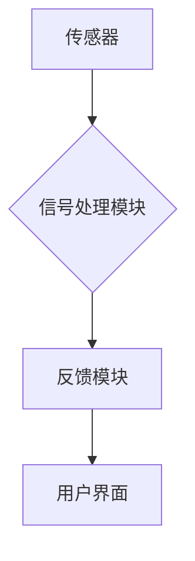

                 

## 生物反馈创业：身心健康的科技解决方案

> 关键词：生物反馈、神经反馈、心率变异、脑电波、情绪调节、健康科技、创业机会、人工智能

## 1. 背景介绍

随着科技的飞速发展，人们对身心健康的关注度越来越高。传统医疗模式逐渐难以满足人们对个性化、精准、便捷医疗的需求。而生物反馈技术作为一种新型的健康科技，正逐渐被人们所认识和接受。

生物反馈技术是指通过监测人体生理信号，如心率、血压、脑电波、肌电图等，并将这些信号反馈给用户，帮助用户了解自身生理状态，并通过训练和调节来改善身心健康。

近年来，生物反馈技术在医疗、教育、体育等领域取得了显著的成果，并逐渐应用于日常生活。例如，用于治疗焦虑、抑郁、失眠等心理疾病；帮助运动员提高运动表现；改善学习效率等。

## 2. 核心概念与联系

### 2.1 生物反馈原理

生物反馈的核心原理是利用反馈机制来调节人体生理功能。通过监测人体生理信号，将这些信号转化为可视化或听觉化的形式反馈给用户，用户可以直观地了解自身生理状态，并根据反馈信息进行调整，从而达到改善身心健康的目的。

### 2.2 生物反馈技术架构

生物反馈技术架构通常包括以下几个部分：

* **传感器:** 用于采集人体生理信号，例如心率传感器、血压传感器、脑电波传感器等。
* **信号处理模块:** 对采集到的生理信号进行预处理、滤波、分析等操作，提取有用的信息。
* **反馈模块:** 将处理后的生理信号转化为可视化或听觉化的形式，反馈给用户。
* **用户界面:** 提供用户操作界面，用户可以通过界面设置参数、查看反馈信息、进行训练等操作。



### 2.3 生物反馈与人工智能

人工智能技术在生物反馈领域有着广泛的应用前景。例如，人工智能算法可以用于分析和解读人体生理信号，识别潜在的健康问题；可以根据用户的生理状态和训练目标，定制个性化的训练方案；可以实时监测用户的训练效果，并提供相应的建议。

## 3. 核心算法原理 & 具体操作步骤

### 3.1 算法原理概述

生物反馈技术的核心算法主要包括信号采集、信号处理、信号反馈和训练算法等。

* **信号采集:** 利用传感器采集人体生理信号，例如心率、血压、脑电波等。
* **信号处理:** 对采集到的生理信号进行预处理、滤波、分析等操作，提取有用的信息。
* **信号反馈:** 将处理后的生理信号转化为可视化或听觉化的形式，反馈给用户。
* **训练算法:** 根据用户的反馈信息，调整训练参数，优化训练效果。

### 3.2 算法步骤详解

1. **传感器连接:** 将传感器连接到生物反馈设备上，并确保传感器与人体接触良好。
2. **信号采集:** 启动设备，开始采集人体生理信号。
3. **信号预处理:** 对采集到的生理信号进行滤波、去噪等预处理，去除干扰信号。
4. **信号分析:** 利用算法对预处理后的生理信号进行分析，提取有用的信息，例如心率变化、脑电波频率等。
5. **信号反馈:** 将分析结果转化为可视化或听觉化的形式，反馈给用户。
6. **用户训练:** 用户根据反馈信息，调整自己的生理状态，例如放松肌肉、控制呼吸等。
7. **训练结果评估:** 根据用户的训练效果，调整训练参数，优化训练方案。

### 3.3 算法优缺点

**优点:**

* **非侵入性:** 生物反馈技术是一种非侵入性的健康监测和治疗方法，不会对人体造成伤害。
* **个性化:** 生物反馈技术可以根据用户的生理状态和训练目标，定制个性化的训练方案。
* **可重复性:** 用户可以随时随地进行生物反馈训练，并根据训练效果进行调整。

**缺点:**

* **技术复杂性:** 生物反馈技术的开发和应用需要一定的技术水平。
* **数据分析难度:** 生物反馈信号的分析和解读需要复杂的算法和模型。
* **用户接受度:** 一些用户可能对生物反馈技术感到陌生或不信任。

### 3.4 算法应用领域

生物反馈技术在医疗、教育、体育、企业等多个领域都有广泛的应用前景。

* **医疗:** 用于治疗焦虑、抑郁、失眠、疼痛等心理疾病和身体疾病。
* **教育:** 帮助学生提高注意力、记忆力和学习效率。
* **体育:** 帮助运动员提高运动表现、预防运动损伤。
* **企业:** 帮助员工缓解压力、提高工作效率、促进团队合作。

## 4. 数学模型和公式 & 详细讲解 & 举例说明

### 4.1 数学模型构建

生物反馈技术的数学模型主要用于描述人体生理信号的动态变化规律，以及用户训练过程中的反馈机制。

例如，心率变异 (HRV) 可以用以下公式来描述:

$$HRV = \frac{1}{N} \sum_{i=1}^{N} (RR_i - \bar{RR})^2$$

其中:

* $HRV$ 表示心率变异
* $N$ 表示心率间隔的个数
* $RR_i$ 表示第 $i$ 个心率间隔
* $\bar{RR}$ 表示所有心率间隔的平均值

### 4.2 公式推导过程

该公式的推导过程基于统计学原理，通过计算心率间隔的标准差来衡量心率变异的大小。

### 4.3 案例分析与讲解

例如，如果一个人的心率变异较大，则说明其心血管系统比较灵活，能够更好地适应环境变化。反之，如果一个人的心率变异较小，则说明其心血管系统比较僵化，容易受到压力和外界刺激的影响。

## 5. 项目实践：代码实例和详细解释说明

### 5.1 开发环境搭建

* **操作系统:** Windows/macOS/Linux
* **编程语言:** Python
* **库:** NumPy, SciPy, Matplotlib, Biofeedback

### 5.2 源代码详细实现

```python
import numpy as np
from biofeedback import Biofeedback

# 初始化生物反馈设备
biofeedback = Biofeedback()

# 开始采集心率数据
heart_rate_data = biofeedback.get_heart_rate()

# 计算心率变异
hrv = np.std(heart_rate_data)

# 将心率变异值反馈给用户
print(f"您的心率变异值为: {hrv}")
```

### 5.3 代码解读与分析

* `import numpy as np`：导入NumPy库，用于数值计算。
* `from biofeedback import Biofeedback`：导入Biofeedback类，用于控制生物反馈设备。
* `biofeedback = Biofeedback()`：实例化Biofeedback类，创建生物反馈设备对象。
* `heart_rate_data = biofeedback.get_heart_rate()`：使用设备对象获取心率数据。
* `hrv = np.std(heart_rate_data)`：计算心率变异值。
* `print(f"您的心率变异值为: {hrv}")`：将心率变异值反馈给用户。

### 5.4 运行结果展示

运行代码后，将显示用户的实时心率变异值。

## 6. 实际应用场景

### 6.1 心理健康管理

生物反馈技术可以帮助用户了解自己的情绪状态，并通过训练来调节情绪，缓解焦虑、抑郁等心理问题。例如，可以使用脑电波反馈来训练用户放松大脑，降低焦虑水平。

### 6.2 运动表现提升

生物反馈技术可以帮助运动员提高运动表现，例如通过心率变异反馈来训练心肺功能，提高耐力。

### 6.3 学习效率提升

生物反馈技术可以帮助学生提高注意力、记忆力和学习效率，例如通过脑电波反馈来训练学生的集中力。

### 6.4 未来应用展望

生物反馈技术的应用前景广阔，未来可能在以下领域得到更广泛的应用:

* **远程医疗:** 利用生物反馈技术进行远程医疗诊断和治疗。
* **个性化健康管理:** 根据用户的生理数据，提供个性化的健康建议和干预方案。
* **智能家居:** 将生物反馈技术集成到智能家居系统中，实现对用户的健康状态的实时监测和管理。

## 7. 工具和资源推荐

### 7.1 学习资源推荐

* **书籍:**

    * 《生物反馈：原理与应用》
    * 《神经反馈：原理与实践》

* **在线课程:**

    * Coursera: 生物反馈与神经反馈
    * Udemy: 生物反馈技术入门

### 7.2 开发工具推荐

* **Biofeedback:** Python库，用于控制生物反馈设备。
* **OpenBCI:** 开源脑机接口平台，提供硬件和软件开发工具。
* **Muse:** 头戴式脑电波传感器，支持蓝牙连接和数据传输。

### 7.3 相关论文推荐

* **The Effects of Biofeedback on Anxiety:** A Meta-Analysis
* **Neurofeedback for the Treatment of ADHD:** A Systematic Review
* **Biofeedback and Heart Rate Variability: A Review of the Literature**

## 8. 总结：未来发展趋势与挑战

### 8.1 研究成果总结

生物反馈技术在身心健康领域取得了显著的成果，为人们提供了新的健康管理和治疗方案。

### 8.2 未来发展趋势

未来，生物反馈技术将朝着以下方向发展:

* **更精准的生理信号监测:** 利用人工智能技术，提高生物反馈设备的精度和可靠性。
* **更个性化的训练方案:** 根据用户的生理数据和训练目标，定制个性化的训练方案。
* **更便捷的应用场景:** 将生物反馈技术集成到智能手机、智能手表等便携设备中，实现随时随地的健康管理。

### 8.3 面临的挑战

生物反馈技术的发展也面临着一些挑战:

* **技术复杂性:** 生物反馈技术的开发和应用需要一定的技术水平。
* **数据安全:** 生物反馈数据涉及用户的隐私信息，需要采取有效的安全措施。
* **用户接受度:** 一些用户可能对生物反馈技术感到陌生或不信任。

### 8.4 研究展望

未来，需要进一步加强对生物反馈技术的研发和应用，探索其在更多领域的新应用场景，并解决技术和伦理方面的挑战，为人类身心健康做出更大的贡献。

## 9. 附录：常见问题与解答

* **Q: 生物反馈技术安全吗?**

A: 生物反馈技术是一种非侵入性的健康监测和治疗方法，不会对人体造成伤害。

* **Q: 生物反馈技术真的有效吗?**

A: 生物反馈技术在医疗、教育、体育等领域取得了显著的成果，被广泛认可其有效性。

* **Q: 如何选择合适的生物反馈设备?**

A: 选择生物反馈设备时，需要考虑设备的功能、精度、价格等因素。建议咨询专业人士，选择适合自己的设备。


作者：禅与计算机程序设计艺术 / Zen and the Art of Computer Programming 
<end_of_turn>

