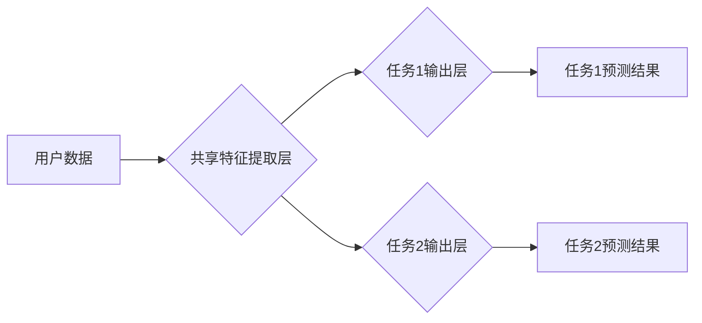

                 

## 电商平台中的多任务学习：大模型解决方案

> 关键词：电商平台、多任务学习、大模型、推荐系统、个性化服务、自然语言处理、计算机视觉

## 1. 背景介绍

随着电商平台的蓬勃发展，用户需求日益多样化，平台需要提供更加个性化、精准的服务来提升用户体验和商业价值。传统的单任务学习模型难以满足这些需求，因为它们往往专注于单个任务，缺乏对用户行为和偏好的全局理解。多任务学习 (Multi-Task Learning, MTL) 作为一种机器学习范式，通过联合训练多个相关任务的模型，能够更好地学习用户特征和模式，从而提升各任务的性能。

近年来，大模型 (Large Language Model, LLM) 的快速发展为电商平台的多任务学习带来了新的机遇。大模型拥有海量参数和强大的泛化能力，能够学习更复杂的知识和关系，并应用于多个不同的任务。本文将深入探讨电商平台中多任务学习的应用，重点介绍大模型在该领域的优势和挑战。

## 2. 核心概念与联系

### 2.1 多任务学习

多任务学习 (MTL) 是一种机器学习范式，旨在通过联合训练多个相关任务的模型来提升模型的整体性能。

**核心思想：**

MTL 假设多个任务之间存在着共享的底层知识和特征。通过联合训练，模型可以学习到这些共享的知识，从而提升各个任务的性能。

**优势：**

* **提升泛化能力：** MTL 可以利用多个任务的数据来训练模型，从而提升模型的泛化能力。
* **减少训练数据需求：** MTL 可以通过共享知识来减少每个任务所需的训练数据量。
* **提升模型鲁棒性：** MTL 可以使模型对噪声和异常数据更加鲁棒。

**架构：**

MTL 的架构通常包括一个共享的特征提取层和多个任务特定的输出层。共享的特征提取层负责学习用户特征和模式，而每个任务特定的输出层负责预测该任务的结果。

**Mermaid 流程图：**



### 2.2 大模型

大模型 (LLM) 是近年来人工智能领域取得突破性进展的重要成果。它们拥有海量参数和强大的学习能力，能够处理复杂的任务，并生成高质量的输出。

**特点：**

* **参数规模庞大：** 大模型通常拥有数十亿甚至数千亿个参数。
* **学习能力强：** 大模型能够学习复杂的知识和关系，并应用于多个不同的任务。
* **泛化能力强：** 大模型能够在未见过的数据上表现出良好的性能。

**应用场景：**

大模型在自然语言处理、计算机视觉、语音识别等多个领域都有广泛的应用。

## 3. 核心算法原理 & 具体操作步骤

### 3.1 算法原理概述

多任务学习的核心算法原理是通过共享特征提取层来学习多个任务之间的相关性。共享特征提取层可以学习到用户特征和模式，而每个任务特定的输出层可以根据这些特征进行预测。

**主要算法：**

* **Hard Parameter Sharing:** 所有任务共享相同的参数。
* **Soft Parameter Sharing:** 每个任务拥有自己的参数，但参数之间存在一定的权重共享。
* **Auxiliary Tasks:** 添加一些辅助任务来帮助模型学习共享知识。

### 3.2 算法步骤详解

1. **数据预处理:** 将多个任务的数据进行预处理，例如文本清洗、图像裁剪等。
2. **模型构建:** 建立一个多任务学习模型，包括共享特征提取层和多个任务特定的输出层。
3. **参数初始化:** 对模型参数进行初始化。
4. **联合训练:** 使用所有任务的数据联合训练模型，并使用交叉熵损失函数进行优化。
5. **模型评估:** 使用测试数据评估模型的性能，并根据需要调整模型参数和训练策略。

### 3.3 算法优缺点

**优点：**

* 提升泛化能力
* 减少训练数据需求
* 提升模型鲁棒性

**缺点：**

* 训练时间较长
* 需要设计合理的任务关系
* 过度拟合的风险

### 3.4 算法应用领域

多任务学习在多个领域都有广泛的应用，例如：

* **电商推荐:** 联合训练商品推荐、用户画像、广告投放等任务。
* **自然语言处理:** 联合训练文本分类、情感分析、机器翻译等任务。
* **计算机视觉:** 联合训练图像识别、目标检测、图像分割等任务。

## 4. 数学模型和公式 & 详细讲解 & 举例说明

### 4.1 数学模型构建

多任务学习的数学模型可以表示为：

$$
\mathbf{y} = f(\mathbf{x}; \mathbf{W})
$$

其中：

* $\mathbf{y}$ 是多个任务的预测结果。
* $\mathbf{x}$ 是输入数据。
* $f(\mathbf{x}; \mathbf{W})$ 是模型函数，其中 $\mathbf{W}$ 是模型参数。

### 4.2 公式推导过程

多任务学习的目标是最小化所有任务的损失函数的加权平均值：

$$
L(\mathbf{W}) = \sum_{i=1}^{N} \lambda_i L_i(\mathbf{W})
$$

其中：

* $L(\mathbf{W})$ 是总损失函数。
* $N$ 是任务的数量。
* $\lambda_i$ 是第 $i$ 个任务的权重。
* $L_i(\mathbf{W})$ 是第 $i$ 个任务的损失函数。

### 4.3 案例分析与讲解

**举例：**

假设我们有一个电商平台，需要同时进行商品推荐和用户画像两个任务。

* **任务1：商品推荐**

损失函数：交叉熵损失函数

* **任务2：用户画像**

损失函数：均方误差损失函数

我们可以使用多任务学习模型联合训练这两个任务，并根据任务的重要性调整权重 $\lambda_1$ 和 $\lambda_2$。

## 5. 项目实践：代码实例和详细解释说明

### 5.1 开发环境搭建

* Python 3.7+
* TensorFlow 2.0+
* PyTorch 1.0+
* CUDA 10.0+ (可选)

### 5.2 源代码详细实现

```python
import tensorflow as tf

# 定义模型
class MultiTaskModel(tf.keras.Model):
    def __init__(self, num_tasks):
        super(MultiTaskModel, self).__init__()
        self.shared_layer = tf.keras.layers.Dense(128, activation='relu')
        self.task_layers = [tf.keras.layers.Dense(1) for _ in range(num_tasks)]

    def call(self, inputs):
        x = self.shared_layer(inputs)
        outputs = [task_layer(x) for task_layer in self.task_layers]
        return outputs

# 实例化模型
model = MultiTaskModel(num_tasks=2)

# 定义损失函数和优化器
loss_fn = tf.keras.losses.CategoricalCrossentropy()
optimizer = tf.keras.optimizers.Adam(learning_rate=0.001)

# 训练模型
for epoch in range(10):
    # 训练数据
    train_data = ...
    # 验证数据
    val_data = ...
    # 训练过程
    with tf.GradientTape() as tape:
        outputs = model(train_data)
        loss = loss_fn(train_data, outputs)
    gradients = tape.gradient(loss, model.trainable_variables)
    optimizer.apply_gradients(zip(gradients, model.trainable_variables))

    # 验证模型
    val_outputs = model(val_data)
    val_loss = loss_fn(val_data, val_outputs)
    print(f'Epoch {epoch+1}, Train Loss: {loss.numpy()}, Val Loss: {val_loss.numpy()}')

```

### 5.3 代码解读与分析

* **模型定义:** 使用 TensorFlow 的 `keras.Model` 类定义多任务学习模型。
* **共享层:** 使用 `Dense` 层作为共享特征提取层。
* **任务层:** 使用 `Dense` 层作为每个任务特定的输出层。
* **损失函数:** 使用交叉熵损失函数和均方误差损失函数分别对两个任务进行优化。
* **优化器:** 使用 Adam 优化器进行模型训练。
* **训练过程:** 使用 TensorFlow 的 `GradientTape` 进行自动求导，并使用优化器更新模型参数。

### 5.4 运行结果展示

训练完成后，可以将模型应用于实际场景，例如商品推荐和用户画像。

## 6. 实际应用场景

### 6.1 商品推荐

多任务学习可以用于提升电商平台的商品推荐效果。例如，可以联合训练商品推荐、用户画像、广告投放等任务，从而更好地理解用户的需求和偏好。

### 6.2 用户画像

多任务学习可以用于构建更精准的用户画像。例如，可以联合训练用户行为分析、文本分析、图像分析等任务，从而更全面地了解用户的兴趣、需求和行为模式。

### 6.3 个性化服务

多任务学习可以用于提供更个性化的服务。例如，可以联合训练商品推荐、内容推荐、客服机器人等任务，从而为每个用户提供定制化的服务体验。

### 6.4 未来应用展望

随着大模型的发展，多任务学习在电商平台的应用场景将更加广泛。例如，可以利用大模型学习更复杂的知识和关系，从而提升推荐系统的精准度和个性化程度。

## 7. 工具和资源推荐

### 7.1 学习资源推荐

* **书籍:**
    * Deep Learning by Ian Goodfellow, Yoshua Bengio, and Aaron Courville
    * Hands-On Machine Learning with Scikit-Learn, Keras & TensorFlow by Aurélien Géron
* **在线课程:**
    * Stanford CS231n: Convolutional Neural Networks for Visual Recognition
    * Deep Learning Specialization by Andrew Ng

### 7.2 开发工具推荐

* **TensorFlow:** https://www.tensorflow.org/
* **PyTorch:** https://pytorch.org/
* **Keras:** https://keras.io/

### 7.3 相关论文推荐

* **Multi-Task Learning** by Richard S. Sutton and Andrew G. Barto
* **Learning Transferable Features with Multi-Task Learning** by Ross Girshick et al.
* **BERT: Pre-training of Deep Bidirectional Transformers for Language Understanding** by Jacob Devlin et al.

## 8. 总结：未来发展趋势与挑战

### 8.1 研究成果总结

多任务学习在电商平台的应用取得了显著的成果，例如提升了商品推荐的精准度和用户画像的准确性。大模型的快速发展为多任务学习带来了新的机遇，使得模型能够学习更复杂的知识和关系，并应用于更多不同的任务。

### 8.2 未来发展趋势

* **更复杂的模型架构:** 研究更复杂的模型架构，例如 Transformer 和 Graph Neural Networks，以更好地学习用户特征和模式。
* **更有效的训练策略:** 研究更有效的训练策略，例如知识蒸馏和联邦学习，以提升模型的训练效率和泛化能力。
* **跨模态多任务学习:** 研究跨模态多任务学习，例如结合文本、图像、视频等多种数据类型，以构建更全面的用户画像和提供更个性化的服务。

### 8.3 面临的挑战

* **数据稀缺性:** 某些任务的数据可能比较稀缺，这会影响模型的训练效果。
* **任务相关性:** 需要合理设计任务之间的相关性，以确保模型能够有效地学习共享知识。
* **模型解释性:** 大模型的复杂性使得模型的解释性比较差，这可能会影响模型的应用和信任度。

### 8.4 研究展望

未来，多任务学习将在电商平台的应用场景中发挥越来越重要的作用。随着大模型和深度学习技术的不断发展，多任务学习的模型架构、训练策略和应用场景将会不断丰富，为用户提供更加智能化、个性化的服务体验。

## 9. 附录：常见问题与解答

**Q1: 多任务学习和单任务学习相比有什么优势？**

**A1:** 多任务学习可以利用多个任务的数据来训练模型，从而提升模型的泛化能力和鲁棒性。此外，多任务学习还可以减少每个任务所需的训练数据量。

**Q2: 如何设计合理的任务关系？**

**A2:** 任务关系的设计需要根据实际应用场景进行，需要考虑任务之间的相关性、数据共享程度等因素。

**Q3: 如何解决数据稀缺性问题？**

**A3:** 可以使用数据增强、迁移学习等技术来解决数据稀缺性问题。

**Q4: 如何提高模型的解释性？**

**A4:** 可以使用可解释机器学习 (XAI) 技术来提高模型的解释性，例如 LIME 和 SHAP。


作者：禅与计算机程序设计艺术 / Zen and the Art of Computer Programming<end_of_turn>

