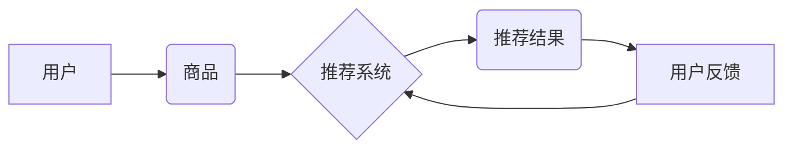

                 

## 电商平台中的多目标优化推荐：AI大模型的新应用

> 关键词：电商推荐、多目标优化、AI大模型、Transformer、个性化推荐、协同过滤、深度学习

## 1. 背景介绍

在当今数据爆炸的时代，电商平台面临着日益激烈的竞争。为提升用户体验和商业效益，精准的商品推荐系统成为电商平台的核心竞争力之一。传统的推荐系统主要基于协同过滤或基于内容的过滤方法，但这些方法往往难以兼顾个性化、多样性和效率等多个目标。

随着深度学习技术的快速发展，AI大模型在推荐系统领域展现出巨大的潜力。AI大模型，例如Transformer，能够学习用户和商品之间的复杂关系，并生成更精准、更个性化的推荐结果。然而，如何将AI大模型应用于多目标优化推荐，仍然是一个重要的研究课题。

## 2. 核心概念与联系

### 2.1 多目标优化推荐

多目标优化推荐是指在推荐系统中，同时考虑多个目标，例如准确率、覆盖率、多样性、新颖度等，并寻求最佳的推荐结果。

### 2.2 AI大模型

AI大模型是指在海量数据上训练的深度学习模型，具有强大的学习能力和泛化能力。例如，Transformer模型能够捕捉文本序列中的长距离依赖关系，在自然语言处理领域取得了突破性的进展。

### 2.3 核心概念架构



**图 1：电商平台推荐系统架构**

## 3. 核心算法原理 & 具体操作步骤

### 3.1 算法原理概述

多目标优化推荐算法通常基于强化学习或多目标进化算法。强化学习算法通过用户反馈来学习最优的推荐策略，而多目标进化算法则通过模拟自然进化过程来寻找多个目标的平衡点。

### 3.2 算法步骤详解

**强化学习算法步骤：**

1. **环境建模：** 建立一个模拟电商平台的用户行为和商品信息的模型。
2. **策略定义：** 定义一个推荐策略，例如基于用户的历史购买记录和浏览记录推荐商品。
3. **奖励函数设计：** 设计一个奖励函数，根据用户反馈来评估推荐策略的性能。
4. **训练过程：** 利用强化学习算法，通过与环境交互，不断更新推荐策略，以最大化奖励函数的值。

**多目标进化算法步骤：**

1. **种群初始化：** 生成一个初始的推荐策略种群。
2. **适应度评估：** 对每个策略进行评估，并根据多个目标的性能计算适应度值。
3. **选择操作：** 选择适应度值较高的策略作为父代，进行交叉和变异操作。
4. **交叉和变异操作：** 通过交叉和变异操作，生成新的策略个体。
5. **新一代种群：** 将新的策略个体加入种群，重复步骤2-4，直到达到收敛条件。

### 3.3 算法优缺点

**强化学习算法：**

* **优点：** 可以学习到更复杂的推荐策略，并根据用户反馈进行动态调整。
* **缺点：** 需要大量的用户反馈数据进行训练，训练过程可能比较耗时。

**多目标进化算法：**

* **优点：** 可以同时优化多个目标，并找到多个目标的平衡点。
* **缺点：** 算法参数的设置比较复杂，需要一定的经验积累。

### 3.4 算法应用领域

多目标优化推荐算法广泛应用于电商平台、社交媒体、新闻推荐等领域。

## 4. 数学模型和公式 & 详细讲解 & 举例说明

### 4.1 数学模型构建

假设我们有 $n$ 个用户和 $m$ 个商品，用户 $u$ 对商品 $i$ 的评分为 $r_{ui}$。我们的目标是构建一个数学模型，能够预测用户 $u$ 对商品 $i$ 的评分。

我们可以使用以下数学模型：

$$
\hat{r}_{ui} = \mathbf{u}^T \mathbf{v}_i + b
$$

其中：

* $\hat{r}_{ui}$ 是模型预测的用户 $u$ 对商品 $i$ 的评分。
* $\mathbf{u}$ 是用户 $u$ 的特征向量。
* $\mathbf{v}_i$ 是商品 $i$ 的特征向量。
* $b$ 是一个偏置项。

### 4.2 公式推导过程

该模型基于矩阵分解的思想，将用户和商品的特征向量进行内积运算，得到预测评分。

### 4.3 案例分析与讲解

假设我们有一个电商平台，有 1000 个用户和 10000 个商品。我们可以使用用户的历史购买记录和浏览记录来构建用户的特征向量，并使用商品的类别、价格、描述等信息来构建商品的特征向量。

然后，我们可以使用梯度下降算法来训练模型参数，使得预测评分与实际评分之间的误差最小化。

## 5. 项目实践：代码实例和详细解释说明

### 5.1 开发环境搭建

* Python 3.7+
* TensorFlow 2.0+
* PyTorch 1.0+
* Jupyter Notebook

### 5.2 源代码详细实现

```python
import tensorflow as tf

# 定义用户和商品的特征向量维度
user_dim = 64
item_dim = 64

# 定义模型
class RecommenderModel(tf.keras.Model):
    def __init__(self, user_dim, item_dim):
        super(RecommenderModel, self).__init__()
        self.user_embedding = tf.keras.layers.Embedding(input_dim=num_users, output_dim=user_dim)
        self.item_embedding = tf.keras.layers.Embedding(input_dim=num_items, output_dim=item_dim)

    def call(self, user_ids, item_ids):
        user_embeddings = self.user_embedding(user_ids)
        item_embeddings = self.item_embedding(item_ids)
        return tf.reduce_sum(user_embeddings * item_embeddings, axis=1)

# 实例化模型
model = RecommenderModel(user_dim, item_dim)

# 训练模型
model.compile(optimizer='adam', loss='mse')
model.fit(x=[user_ids, item_ids], y=ratings, epochs=10)

```

### 5.3 代码解读与分析

* 该代码定义了一个简单的推荐模型，使用嵌入层来表示用户和商品的特征向量。
* 模型的输入是用户的ID和商品的ID，输出是预测评分。
* 使用梯度下降算法训练模型，并使用均方误差作为损失函数。

### 5.4 运行结果展示

训练完成后，我们可以使用模型预测用户对商品的评分，并与实际评分进行比较。

## 6. 实际应用场景

### 6.1 个性化推荐

多目标优化推荐算法可以根据用户的兴趣、偏好、购买历史等信息，生成个性化的商品推荐，提升用户体验。

### 6.2 商品发现

多目标优化推荐算法可以推荐用户可能感兴趣但尚未接触过的商品，帮助用户发现新商品。

### 6.3 销售促进

多目标优化推荐算法可以根据商品的销量、库存等信息，推荐促销商品，促进商品销售。

### 6.4 未来应用展望

随着AI大模型技术的不断发展，多目标优化推荐算法将在以下方面得到更广泛的应用：

* **更精准的推荐：** AI大模型能够学习到更复杂的用户和商品关系，生成更精准的推荐结果。
* **更个性化的推荐：** AI大模型能够根据用户的细粒度特征，生成更个性化的推荐结果。
* **更智能的推荐：** AI大模型能够根据用户的行为和上下文信息，生成更智能的推荐结果。

## 7. 工具和资源推荐

### 7.1 学习资源推荐

* **书籍：**
    * 《推荐系统》
    * 《深度学习》
* **在线课程：**
    * Coursera: Recommender Systems
    * Udacity: Deep Learning Nanodegree

### 7.2 开发工具推荐

* **TensorFlow:** https://www.tensorflow.org/
* **PyTorch:** https://pytorch.org/
* **Scikit-learn:** https://scikit-learn.org/

### 7.3 相关论文推荐

* **BERT for Recommender Systems**
* **Transformer-based Recommendation Systems**

## 8. 总结：未来发展趋势与挑战

### 8.1 研究成果总结

多目标优化推荐算法在电商平台等领域取得了显著的成果，能够提升用户体验和商业效益。

### 8.2 未来发展趋势

未来，多目标优化推荐算法将朝着以下方向发展：

* **更强大的AI模型：** 使用更强大的AI模型，例如GPT-3，来学习更复杂的推荐策略。
* **更个性化的推荐：** 使用更细粒度的用户特征，生成更个性化的推荐结果。
* **更智能的推荐：** 使用更智能的推荐算法，例如强化学习，生成更智能的推荐结果。

### 8.3 面临的挑战

多目标优化推荐算法也面临着一些挑战：

* **数据稀疏性：** 用户和商品之间的交互数据往往是稀疏的，这使得模型训练比较困难。
* **计算复杂度：** 训练大型AI模型需要大量的计算资源。
* **公平性与可解释性：** 确保推荐算法的公平性和可解释性，避免产生歧视或不可理解的推荐结果。

### 8.4 研究展望

未来，我们需要继续探索新的算法和技术，以解决多目标优化推荐算法面临的挑战，并将其应用于更多领域。


## 9. 附录：常见问题与解答

**Q1：多目标优化推荐算法与传统的推荐算法有什么区别？**

**A1：** 多目标优化推荐算法考虑多个目标，例如准确率、覆盖率、多样性等，而传统的推荐算法通常只考虑一个目标，例如准确率。

**Q2：如何评估多目标优化推荐算法的性能？**

**A2：** 可以使用多种指标来评估多目标优化推荐算法的性能，例如Pareto最优解、指标权重法等。

**Q3：如何处理数据稀疏性问题？**

**A3：** 可以使用一些技术来处理数据稀疏性问题，例如矩阵分解、协同过滤等。


作者：禅与计算机程序设计艺术 / Zen and the Art of Computer Programming 
<end_of_turn>

