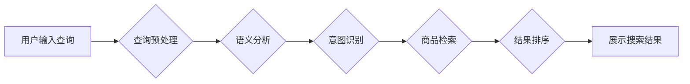

                 

## 电商搜索中的查询理解与商品映射技术

> 关键词：电商搜索、查询理解、商品映射、自然语言处理、信息检索、推荐系统、机器学习

## 1. 背景介绍

电商平台作为现代商业的重要组成部分，其搜索功能直接影响着用户体验和商业转化率。与传统搜索引擎不同，电商搜索需要更深入地理解用户意图，并准确地将查询映射到相关的商品。 

随着电商平台的规模不断扩大，用户搜索行为也变得更加复杂多样。用户不再仅仅依赖简单的关键词搜索，而是倾向于使用更自然、更具语义的查询，例如长尾关键词、短语查询、甚至是图像或语音查询。这些复杂查询的出现，对传统的基于关键词匹配的搜索算法提出了新的挑战。

为了提升电商搜索的精准度和用户体验，查询理解与商品映射技术应运而生。该技术旨在通过自然语言处理 (NLP) 和机器学习 (ML) 等方法，深入理解用户查询的语义，并将其映射到最相关的商品。

## 2. 核心概念与联系

**2.1 查询理解**

查询理解是指对用户输入的查询进行分析，识别其潜在的意图和需求。 

**2.2 商品映射**

商品映射是指将理解后的查询意图与电商平台中的商品进行匹配，找到最相关的商品结果。

**2.3 架构图**



## 3. 核心算法原理 & 具体操作步骤

**3.1 算法原理概述**

电商搜索中的查询理解与商品映射技术通常基于以下核心算法：

* **词嵌入:** 将单词或短语映射到低维向量空间，捕捉单词之间的语义关系。
* **语义分析:** 利用词嵌入和语法规则，分析查询的结构和语义。
* **意图识别:** 根据语义分析结果，识别用户查询的潜在意图，例如搜索商品、比较价格、查看评价等。
* **商品检索:** 根据用户意图，从电商平台的商品数据库中检索相关的商品。
* **结果排序:** 利用机器学习算法，对检索到的商品进行排序，将最相关的商品展示在用户面前。

**3.2 算法步骤详解**

1. **查询预处理:** 对用户输入的查询进行预处理，例如去除停用词、规范化词形、转换大小写等。
2. **词嵌入:** 将预处理后的查询词语映射到词嵌入空间，例如使用Word2Vec或GloVe等模型。
3. **语义分析:** 利用词嵌入和语法规则，分析查询的结构和语义，例如识别关键词、短语、关系等。
4. **意图识别:** 根据语义分析结果，使用机器学习模型识别用户查询的意图，例如使用支持向量机 (SVM) 或深度神经网络 (DNN) 等。
5. **商品检索:** 根据用户意图，从电商平台的商品数据库中检索相关的商品，例如使用基于关键词匹配、TF-IDF 或 BM25 等算法。
6. **结果排序:** 利用机器学习算法，对检索到的商品进行排序，例如使用基于排名模型的排序算法，例如LambdaMART 或 RankNet 等。

**3.3 算法优缺点**

* **优点:** 能够更好地理解用户查询的语义，提高搜索结果的精准度和用户体验。
* **缺点:** 需要大量的训练数据和计算资源，算法模型的训练和部署成本较高。

**3.4 算法应用领域**

* 电商搜索
* 问答系统
* 个性化推荐
* 语音识别
* 机器翻译

## 4. 数学模型和公式 & 详细讲解 & 举例说明

**4.1 数学模型构建**

假设我们有一个电商平台，包含N个商品和M个用户查询。我们可以用以下数学模型来表示商品和查询之间的关系：

* **商品向量:**  每个商品可以用一个向量来表示，该向量包含商品的特征信息，例如商品名称、描述、类别、价格等。
* **查询向量:**  每个用户查询也可以用一个向量来表示，该向量包含查询的关键词和语义信息。
* **相似度度量:**  我们可以使用余弦相似度等度量来计算商品向量和查询向量的相似度。

**4.2 公式推导过程**

余弦相似度公式如下：

$$
\text{相似度} = \frac{\mathbf{商品向量} \cdot \mathbf{查询向量}}{\|\mathbf{商品向量}\| \|\mathbf{查询向量}\|}
$$

其中：

* $\mathbf{商品向量}$ 和 $\mathbf{查询向量}$ 分别表示商品和查询的向量表示。
* $\cdot$ 表示向量点积。
* $\|\mathbf{商品向量}\|$ 和 $\|\mathbf{查询向量}\|$ 分别表示商品向量和查询向量的模长。

**4.3 案例分析与讲解**

假设我们有一个商品向量为 $\mathbf{商品向量} = [0.2, 0.5, 0.3, 0.8]$，查询向量为 $\mathbf{查询向量} = [0.1, 0.4, 0.2, 0.7]$。

则它们的余弦相似度为：

$$
\text{相似度} = \frac{[0.2, 0.5, 0.3, 0.8] \cdot [0.1, 0.4, 0.2, 0.7]}{\sqrt{0.2^2 + 0.5^2 + 0.3^2 + 0.8^2} \sqrt{0.1^2 + 0.4^2 + 0.2^2 + 0.7^2}}
$$

通过计算，我们可以得到商品向量和查询向量的相似度。

## 5. 项目实践：代码实例和详细解释说明

**5.1 开发环境搭建**

* Python 3.x
* TensorFlow 或 PyTorch 等深度学习框架
* NLTK 或 spaCy 等自然语言处理库
* Elasticsearch 或 Solr 等搜索引擎

**5.2 源代码详细实现**

```python
# 使用 Word2Vec 模型进行词嵌入
from gensim.models import Word2Vec

# 加载训练数据
sentences = [["电商", "平台", "搜索"], ["用户", "查询", "商品"], ["商品", "推荐", "系统"]]

# 训练 Word2Vec 模型
model = Word2Vec(sentences, min_count=1)

# 获取词向量
word_vector = model.wv["电商"]

# 使用 TF-IDF 算法进行商品检索
from sklearn.feature_extraction.text import TfidfVectorizer

# 加载商品描述数据
product_descriptions = ["这是一个电商平台的商品描述", "这是一个用户查询的商品描述"]

# 使用 TF-IDF 构建商品特征向量
vectorizer = TfidfVectorizer()
product_vectors = vectorizer.fit_transform(product_descriptions)

# 计算商品向量和查询向量的相似度
similarity_scores = product_vectors.dot(word_vector)

# 根据相似度排序商品
sorted_products = sorted(range(len(product_descriptions)), key=lambda k: similarity_scores[k], reverse=True)

# 展示排序后的商品
print(sorted_products)
```

**5.3 代码解读与分析**

* 该代码示例展示了如何使用 Word2Vec 模型进行词嵌入，以及如何使用 TF-IDF 算法进行商品检索。
* 首先，我们使用 Word2Vec 模型训练了一个词嵌入模型，并将 "电商" 这个词的向量表示存储在 `word_vector` 变量中。
* 然后，我们使用 TF-IDF 算法构建了商品描述的特征向量，并计算了商品向量和查询向量的相似度。
* 最后，我们根据相似度排序了商品，并展示了排序后的商品列表。

**5.4 运行结果展示**

运行该代码后，会输出一个包含商品索引的列表，表示排序后的商品列表。

## 6. 实际应用场景

**6.1 电商搜索引擎**

电商平台的搜索引擎是查询理解与商品映射技术的典型应用场景。通过理解用户查询的语义，电商平台可以提供更精准的商品搜索结果，提升用户体验。

**6.2 个性化推荐系统**

查询理解与商品映射技术也可以应用于个性化推荐系统。通过分析用户的查询历史和行为数据，系统可以理解用户的兴趣偏好，并推荐相关的商品。

**6.3 智能客服系统**

智能客服系统可以利用查询理解技术，理解用户的咨询需求，并提供相应的帮助。

**6.4 未来应用展望**

随着人工智能技术的不断发展，查询理解与商品映射技术将有更广泛的应用场景，例如：

* 语音搜索
* 图像搜索
* 视频搜索
* 物联网搜索

## 7. 工具和资源推荐

**7.1 学习资源推荐**

* **书籍:**
    * 《自然语言处理》 by Jurafsky & Martin
    * 《深度学习》 by Goodfellow, Bengio & Courville
* **在线课程:**
    * Coursera: Natural Language Processing Specialization
    * edX: Deep Learning

**7.2 开发工具推荐**

* **Python:**
    * TensorFlow
    * PyTorch
    * NLTK
    * spaCy
* **搜索引擎:**
    * Elasticsearch
    * Solr

**7.3 相关论文推荐**

* **BERT: Pre-training of Deep Bidirectional Transformers for Language Understanding**
* **Attention Is All You Need**
* **Recurrent Neural Network for Sequence Classification**

## 8. 总结：未来发展趋势与挑战

**8.1 研究成果总结**

近年来，查询理解与商品映射技术取得了显著进展，例如：

* 词嵌入技术的不断发展，使得模型能够更好地捕捉单词之间的语义关系。
* 深度学习技术的应用，使得模型能够处理更复杂的查询和商品数据。
* 跨模态搜索技术的兴起，使得模型能够理解图像、语音等多模态数据。

**8.2 未来发展趋势**

* **更精准的查询理解:** 利用更先进的自然语言处理技术，例如 Transformer 模型，进一步提升查询理解的精准度。
* **更个性化的商品推荐:** 利用用户行为数据和偏好信息，提供更个性化的商品推荐。
* **跨模态搜索:** 将图像、语音等多模态数据与文本数据融合，实现更全面的查询理解和商品映射。

**8.3 面临的挑战**

* **数据稀缺性:** 许多电商平台的数据是私有的，难以公开共享，这限制了模型的训练和测试。
* **语义理解的复杂性:** 自然语言的语义理解非常复杂，模型仍然难以完全理解用户的意图。
* **模型的可解释性:** 深度学习模型的决策过程往往难以解释，这使得模型的应用受到限制。

**8.4 研究展望**

未来，查询理解与商品映射技术将继续朝着更精准、更个性化、更智能的方向发展。


## 9. 附录：常见问题与解答

**9.1 如何提高查询理解的精准度？**

* 使用更先进的自然语言处理技术，例如 Transformer 模型。
* 结合用户行为数据和偏好信息，进行更精准的语义分析。
* 使用多模态数据，例如图像和语音，辅助查询理解。

**9.2 如何实现更个性化的商品推荐？**

* 利用用户历史购买记录、浏览记录和评价数据，构建用户画像。
* 使用协同过滤、内容过滤等推荐算法，推荐个性化的商品。
* 利用深度学习技术，学习用户隐性的偏好，进行更精准的推荐。

**9.3 如何解决数据稀缺性的问题？**

* 利用迁移学习技术，将预训练模型应用于电商领域。
* 与其他电商平台合作，共享数据资源。
* 使用合成数据技术，生成模拟电商数据的训练集。


作者：禅与计算机程序设计艺术 / Zen and the Art of Computer Programming 
<end_of_turn>

