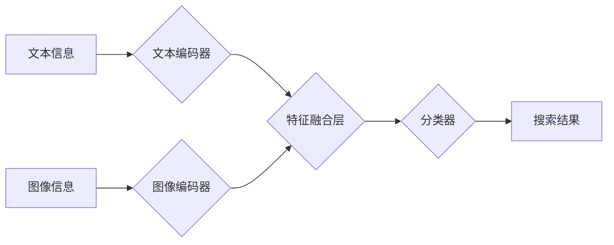

                 

## 电商搜索的多模态融合：AI大模型的新突破

> 关键词：电商搜索、多模态融合、AI大模型、自然语言处理、计算机视觉、推荐系统、用户体验

## 1. 背景介绍

电商搜索作为电商平台的核心功能之一，直接影响着用户购物体验和平台商业成功。传统的电商搜索主要依赖文本关键词匹配，难以满足用户日益复杂的搜索需求。随着人工智能技术的快速发展，特别是深度学习和自然语言处理（NLP）技术的突破，多模态融合技术逐渐成为电商搜索领域的新热点。

多模态融合是指将不同模态的信息（如文本、图像、音频、视频等）融合在一起，以获得更全面、更准确、更丰富的理解和表示。在电商搜索领域，多模态融合可以有效解决以下问题：

* **提升搜索结果的准确性:**  通过结合文本和图像等多模态信息，可以更准确地理解用户搜索意图，提高搜索结果的匹配度。
* **丰富搜索结果的表达方式:**  除了文本描述，还可以通过图像、视频等多模态信息展示商品，更直观地展现商品信息，提升用户体验。
* **降低用户搜索门槛:**  用户可以通过多种方式进行搜索，例如语音搜索、图像搜索等，降低搜索门槛，提高用户搜索效率。

## 2. 核心概念与联系

### 2.1 多模态融合的原理

多模态融合的核心是将不同模态的信息有效地结合起来，形成一个统一的表示，以便于后续的理解和应用。常见的融合方法包括：

* **特征级融合:** 将不同模态的信息分别提取特征，然后将特征进行拼接、加权求和等操作，形成一个综合特征向量。
* **决策级融合:** 将不同模态的信息分别进行独立的处理，得到各自的预测结果，然后将结果进行投票、加权平均等操作，最终得到最终的预测结果。
* **嵌入级融合:** 将不同模态的信息映射到同一个低维空间，形成统一的语义表示，然后进行后续的处理。

### 2.2 多模态融合架构



**图 1：多模态融合架构**

* 文本信息和图像信息分别经过文本编码器和图像编码器进行处理，提取特征。
* 特征融合层将文本特征和图像特征进行融合，形成综合特征。
* 分类器根据融合后的特征进行分类，输出搜索结果。

## 3. 核心算法原理 & 具体操作步骤

### 3.1 算法原理概述

本文将介绍一种基于 Transformer 的多模态融合算法，该算法能够有效地融合文本和图像信息，提高电商搜索的准确性和效率。

Transformer 是一种基于注意力机制的深度学习模型，能够有效地捕捉序列数据中的长距离依赖关系。在多模态融合领域，Transformer 可以将文本和图像信息映射到同一个低维空间，形成统一的语义表示。

### 3.2 算法步骤详解

1. **文本编码:** 将用户输入的文本信息进行分词、词嵌入等预处理，然后使用 Transformer 模型进行编码，得到文本的语义表示。
2. **图像编码:** 将商品图像进行预处理，例如裁剪、缩放等，然后使用预训练的图像编码器（例如 ResNet、VGG 等）进行编码，得到图像的特征表示。
3. **特征融合:** 将文本的语义表示和图像的特征表示进行拼接，形成一个综合特征向量。
4. **分类:** 使用分类器（例如线性分类器、支持向量机等）对融合后的特征向量进行分类，得到最终的搜索结果。

### 3.3 算法优缺点

**优点:**

* 能够有效地融合文本和图像信息，提高搜索结果的准确性和丰富度。
* 基于 Transformer 的模型能够捕捉序列数据中的长距离依赖关系，提升语义理解能力。
* 能够处理多种类型的模态信息，例如文本、图像、音频等。

**缺点:**

* 训练成本较高，需要大量的训练数据和计算资源。
* 模型复杂度较高，部署和推理效率相对较低。

### 3.4 算法应用领域

* **电商搜索:** 提升商品搜索的准确性和效率，提供更个性化的搜索结果。
* **图像识别:** 将图像信息与文本信息结合，提高图像识别的准确性和理解能力。
* **问答系统:** 将文本和图像信息结合，构建更智能的问答系统。
* **内容推荐:** 根据用户的文本和图像偏好，推荐更相关的商品或内容。

## 4. 数学模型和公式 & 详细讲解 & 举例说明

### 4.1 数学模型构建

假设我们有文本序列 $T = \{t_1, t_2, ..., t_n\}$ 和图像特征 $V = \{v_1, v_2, ..., v_m\}$，我们需要构建一个多模态融合模型，将文本和图像信息融合在一起，得到一个综合表示 $H = \{h_1, h_2, ..., h_k\}$。

### 4.2 公式推导过程

我们可以使用 Transformer 模型来构建多模态融合模型。Transformer 模型的核心是注意力机制，它能够捕捉序列数据中的长距离依赖关系。

**注意力机制公式:**

$$
Attention(Q, K, V) = softmax(\frac{QK^T}{\sqrt{d_k}})V
$$

其中，$Q$、$K$ 和 $V$ 分别是查询矩阵、键矩阵和值矩阵，$d_k$ 是键向量的维度。

**Transformer 模型的编码器:**

Transformer 模型的编码器由多个编码层组成，每个编码层包含多头注意力机制和前馈神经网络。

**多头注意力机制:**

$$
MultiHead(Q, K, V) = Concat(head_1, head_2, ..., head_h)W^O
$$

其中，$head_i$ 是第 $i$ 个注意力头的输出，$h$ 是注意力头的数量，$W^O$ 是一个线性变换矩阵。

**前馈神经网络:**

$$
FFN(x) = \max(0, xW_1 + b_1)W_2 + b_2
$$

其中，$W_1$、$b_1$、$W_2$ 和 $b_2$ 是神经网络的参数。

### 4.3 案例分析与讲解

假设我们有一个电商平台，用户搜索“红色长款外套”。我们可以使用多模态融合模型来处理用户的搜索请求。

1. **文本编码:** 将“红色长款外套”进行分词和词嵌入，得到文本的语义表示。
2. **图像编码:** 从数据库中检索出与“红色长款外套”相关的商品图像，并使用预训练的图像编码器进行编码，得到图像的特征表示。
3. **特征融合:** 将文本的语义表示和图像的特征表示进行拼接，形成一个综合特征向量。
4. **分类:** 使用分类器对融合后的特征向量进行分类，得到最终的搜索结果。

## 5. 项目实践：代码实例和详细解释说明

### 5.1 开发环境搭建

* Python 3.7+
* PyTorch 1.7+
* CUDA 10.2+
* 其他依赖库：transformers, torchvision, numpy, pandas等

### 5.2 源代码详细实现

```python
import torch
from transformers import BertTokenizer, BertModel

# 加载预训练的文本编码器
tokenizer = BertTokenizer.from_pretrained('bert-base-uncased')
model = BertModel.from_pretrained('bert-base-uncased')

# 定义图像编码器
class ImageEncoder(torch.nn.Module):
    def __init__(self):
        super(ImageEncoder, self).__init__()
        # 使用预训练的图像编码器，例如 ResNet
        self.resnet = torchvision.models.resnet18(pretrained=True)
        # 移除分类层
        self.resnet = torch.nn.Sequential(*list(self.resnet.children())[:-1])

    def forward(self, x):
        # 将图像输入到 ResNet 中进行编码
        x = self.resnet(x)
        # 返回图像的特征表示
        return x

# 定义多模态融合模型
class MultiModalFusionModel(torch.nn.Module):
    def __init__(self):
        super(MultiModalFusionModel, self).__init__()
        # 定义文本编码器
        self.text_encoder = BertModel.from_pretrained('bert-base-uncased')
        # 定义图像编码器
        self.image_encoder = ImageEncoder()
        # 定义融合层
        self.fusion_layer = torch.nn.Linear(768 + 512, 1024)
        # 定义分类层
        self.classifier = torch.nn.Linear(1024, num_classes)

    def forward(self, text, image):
        # 文本编码
        text_output = self.text_encoder(tokenizer(text, padding=True, truncation=True).input_ids)
        # 图像编码
        image_output = self.image_encoder(image)
        # 特征融合
        fused_features = torch.cat((text_output.last_hidden_state[:, 0, :], image_output.mean(dim=2)), dim=1)
        fused_features = self.fusion_layer(fused_features)
        # 分类
        output = self.classifier(fused_features)
        return output

# 实例化模型
model = MultiModalFusionModel()

# 训练模型
# ...

# 推理模型
# ...
```

### 5.3 代码解读与分析

* 代码首先加载预训练的文本编码器和图像编码器。
* 定义了多模态融合模型，包含文本编码器、图像编码器、融合层和分类层。
* 文本编码器使用预训练的 BERT 模型，图像编码器使用预训练的 ResNet 模型。
* 融合层将文本和图像的特征进行拼接，然后使用线性变换进行融合。
* 分类层根据融合后的特征进行分类，输出最终的搜索结果。

### 5.4 运行结果展示

* 训练完成后，可以使用测试集评估模型的性能，例如准确率、召回率等。
* 可以将模型部署到电商平台，用于处理用户的搜索请求。

## 6. 实际应用场景

### 6.1 电商搜索场景

* **商品搜索:** 用户输入商品名称、属性等关键词，系统根据文本和图像信息进行多模态融合，返回更精准的商品搜索结果。
* **视觉搜索:** 用户上传商品图片，系统识别图片中的商品信息，并返回相关商品搜索结果。
* **个性化推荐:** 根据用户的浏览历史、购买记录等信息，系统构建用户的多模态特征，并推荐更符合用户偏好的商品。

### 6.2 其他应用场景

* **内容推荐:** 根据用户的阅读习惯、观看记录等信息，推荐更相关的文章、视频等内容。
* **问答系统:** 将文本和图像信息结合，构建更智能的问答系统，能够理解用户的复杂问题，并给出更准确的答案。
* **医疗诊断:** 将患者的病历、影像资料等信息进行多模态融合，辅助医生进行诊断。

### 6.4 未来应用展望

随着人工智能技术的不断发展，多模态融合技术将在更多领域得到应用，例如：

* **虚拟现实 (VR) 和增强现实 (AR):** 将文本、图像、音频等信息融合在一起，构建更沉浸式的虚拟现实和增强现实体验。
* **自动驾驶:** 将车辆传感器获取的图像、激光雷达数据等信息进行多模态融合，提高自动驾驶系统的感知能力和决策能力。
* **机器人:** 将文本、图像、语音等信息融合在一起，使机器人能够更好地理解人类指令，并进行更复杂的交互。

## 7. 工具和资源推荐

### 7.1 学习资源推荐

* **书籍:**
    * Deep Learning with Python by Francois Chollet
    * Natural Language Processing with Python by Steven Bird, Ewan Klein, and Edward Loper
* **在线课程:**
    * Stanford CS224N: Natural Language Processing with Deep Learning
    * Deep Learning Specialization by Andrew Ng
* **博客和网站:**
    * Towards Data Science
    * Machine Learning Mastery

### 7.2 开发工具推荐

* **深度学习框架:** PyTorch, TensorFlow
* **自然语言处理库:** NLTK, spaCy, Hugging Face Transformers
* **图像处理库:** OpenCV, Pillow

### 7.3 相关论文推荐

* **Attention Is All You Need** (Vaswani et al., 2017)
* **BERT: Pre-training of Deep Bidirectional Transformers for Language Understanding** (Devlin et al., 2018)
* **Multimodal Fusion for Visual Question Answering** (Anderson et al., 2018)

## 8. 总结：未来发展趋势与挑战

### 8.1 研究成果总结

多模态融合技术在电商搜索领域取得了显著的成果，能够有效提升搜索结果的准确性和丰富度，提升用户体验。

### 8.2 未来发展趋势

* **模型复杂度提升:** 未来将会有更复杂的模型架构，例如 Transformer-XL、GPT-3 等，能够更好地捕捉多模态信息的复杂关系。
* **跨模态知识表示:** 将不同模态的信息进行跨模态知识表示，例如将文本信息映射到图像空间，能够提升模型的理解能力。
* **个性化多模态融合:** 根据用户的个性化偏好，进行个性化的多模态融合，提供更精准的搜索结果和推荐。

### 8.3 面临的挑战

* **数据获取和标注:** 多模态融合模型需要大量的多模态数据进行训练，数据获取和标注成本较高。
* **模型训练效率:** 多模态融合模型训练复杂度高，训练时间长，需要更高效的训练算法和硬件资源。
* **模型解释性:** 多模态融合模型的决策过程较为复杂，难以解释模型的决策结果，需要进一步研究模型的解释性。

### 8.4 研究展望

未来，多模态融合技术将继续发展，在电商搜索、内容推荐、问答系统等领域发挥更大的作用。


## 9. 附录：常见问题与解答

**Q1: 多模态融合模型的训练数据如何获取？**

**A1:** 多模态融合模型的训练数据可以从公开数据集、电商平台内部数据等渠道获取。例如，可以从 ImageNet、COCO 等公开图像数据集获取图像数据，从电商平台的商品信息、用户搜索记录等数据获取文本数据。

**Q2: 多模态融合模型的训练成本如何降低？**

**A2:** 可以采用以下方法降低多模态融合模型的训练成本：

* 使用预训练模型进行微调，减少训练数据和训练时间。
* 使用分布式训练技术，将模型训练任务分发到多个机器上进行并行训练。
* 使用模型压缩技术，减少模型参数量，降低模型训练和推理成本。

**Q3: 多模态融合模型的解释性如何提升？**

**A3:** 可以采用以下方法提升多模态融合模型的解释性：

* 使用可解释机器学习方法，例如 LIME、SHAP 等，解释模型的决策过程。
* 使用注意力机制的可视化技术，展示模型对不同模态信息的关注程度。
* 使用人类专家进行模型评估和解释，结合专家知识进行模型解释。


作者：禅与计算机程序设计艺术 / Zen and the Art of Computer Programming<end_of_turn>

