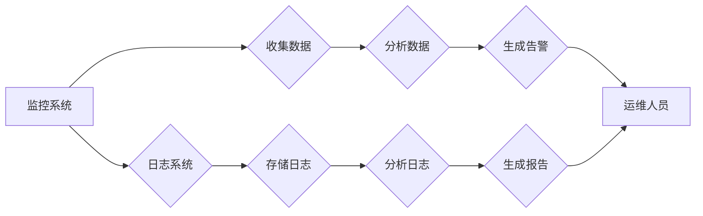

                 

## 监控和日志管理：保持系统运行畅通

> 关键词：监控、日志管理、系统健康、异常检测、性能优化、数据分析、自动化运维、告警机制、日志分析工具

### 1. 背景介绍

在当今数字化时代，系统规模不断扩大，应用场景日益复杂，对系统稳定性和可靠性的要求也越来越高。监控和日志管理作为现代IT基础设施的重要组成部分，扮演着至关重要的角色。它们不仅能帮助我们实时了解系统运行状态，还能为故障诊断、性能优化和安全保障提供关键数据。

传统的监控和日志管理方式往往依赖于人工干预，效率低下，难以应对大规模系统的挑战。随着云计算、容器化和微服务架构的兴起，系统更加分散和动态，对监控和日志管理提出了更高的要求。

### 2. 核心概念与联系

#### 2.1 监控

监控是指对系统运行状态进行实时收集、分析和展示的过程。其目标是及时发现潜在问题，确保系统稳定运行。监控数据通常包括：

* **性能指标：** CPU使用率、内存使用率、磁盘IO、网络流量等。
* **系统状态：** 服务是否运行、进程状态、错误日志等。
* **用户行为：** 登录次数、访问频率、操作记录等。

#### 2.2 日志管理

日志管理是指收集、存储、分析和管理系统产生的日志数据的过程。日志数据记录了系统发生的各种事件，包括正常操作、错误信息、安全事件等。日志管理可以帮助我们：

* **故障诊断：** 通过分析日志数据，定位故障原因，缩短故障解决时间。
* **性能优化：** 识别性能瓶颈，优化系统配置和代码。
* **安全保障：** 检测恶意攻击、审计用户行为，保障系统安全。

#### 2.3 监控与日志管理的联系

监控和日志管理是相互补充、协同工作的两个重要环节。监控系统收集实时数据，而日志系统记录历史事件。两者共同作用，可以形成全面的系统观测体系，帮助我们更好地理解和管理系统。

**Mermaid 流程图**



### 3. 核心算法原理 & 具体操作步骤

#### 3.1 算法原理概述

监控和日志管理系统通常采用多种算法来实现其功能，例如：

* **聚合算法：** 将大量数据进行汇总，例如计算平均值、最大值、最小值等。
* **异常检测算法：** 通过分析数据分布，识别异常值，例如使用统计方法或机器学习算法。
* **关联规则挖掘算法：** 从日志数据中发现事件之间的关联关系，例如使用Apriori算法或FP-Growth算法。

#### 3.2 算法步骤详解

以异常检测算法为例，其步骤如下：

1. **数据预处理：** 清洗数据，去除噪声和异常值，并将数据转换为适合算法处理的格式。
2. **特征提取：** 从原始数据中提取关键特征，例如CPU使用率、内存使用率、网络流量等。
3. **模型训练：** 使用训练数据训练异常检测模型，例如使用统计方法建立阈值模型，或使用机器学习算法训练分类模型。
4. **模型评估：** 使用测试数据评估模型性能，例如计算准确率、召回率、F1-score等指标。
5. **异常检测：** 将实时数据输入模型，预测数据是否属于异常值。
6. **告警触发：** 当模型检测到异常值时，触发告警机制，通知运维人员。

#### 3.3 算法优缺点

**优点：**

* 可以自动识别系统异常，提高故障响应速度。
* 可以帮助发现性能瓶颈，优化系统配置。
* 可以提供系统运行状态的实时监控，帮助运维人员更好地管理系统。

**缺点：**

* 需要大量的训练数据，才能训练出准确的模型。
* 算法本身存在一定的误差，可能会产生误报或漏报。
* 需要专业的技术人员进行模型设计、训练和维护。

#### 3.4 算法应用领域

异常检测算法广泛应用于：

* **网络安全：** 检测网络攻击、入侵行为。
* **系统监控：** 监控服务器、数据库、应用等系统运行状态。
* **数据分析：** 识别数据异常，进行数据清洗和异常值处理。
* **金融交易：** 检测欺诈交易、异常交易行为。

### 4. 数学模型和公式 & 详细讲解 & 举例说明

#### 4.1 数学模型构建

异常检测算法通常基于统计模型或机器学习模型。

**统计模型：**

* **Z-score：** 用于衡量数据点与均值的距离，计算公式如下：

$$Z = \frac{x - \mu}{\sigma}$$

其中：

* $x$ 是数据点
* $\mu$ 是数据均值
* $\sigma$ 是数据标准差

* **IQR：** 用于衡量数据分布的范围，计算公式如下：

$$IQR = Q3 - Q1$$

其中：

* $Q3$ 是数据第三分位数
* $Q1$ 是数据第一分位数

**机器学习模型：**

* **K-Means聚类：** 将数据点划分为K个簇，异常点通常位于远离其他簇的数据点。
* **Isolation Forest：** 通过隔离异常点，识别异常数据点。

#### 4.2 公式推导过程

Z-score公式的推导过程如下：

1. 假设数据服从正态分布。
2. 正态分布的均值为$\mu$，标准差为$\sigma$。
3. 任何数据点$x$与均值$\mu$的距离，除以标准差$\sigma$后，服从标准正态分布。
4. 因此，Z-score可以用来衡量数据点与均值的距离，其值越大，数据点越远离均值，越可能是异常值。

#### 4.3 案例分析与讲解

假设我们监控一个服务器的CPU使用率，其历史数据服从正态分布，均值为80%，标准差为10%。如果我们检测到一个CPU使用率为100%的数据点，则其Z-score为：

$$Z = \frac{100 - 80}{10} = 2$$

Z-score为2，表明该数据点与均值相差两倍标准差，很可能是异常值。

### 5. 项目实践：代码实例和详细解释说明

#### 5.1 开发环境搭建

* 操作系统：Linux
* 编程语言：Python
* 工具：

    * **Prometheus：** 用于收集监控数据
    * **Grafana：** 用于可视化监控数据
    * **Elasticsearch：** 用于存储和分析日志数据
    * **Kibana：** 用于可视化日志数据

#### 5.2 源代码详细实现

以下是一个使用Python和Prometheus收集CPU使用率监控数据的简单示例：

```python
import requests

# Prometheus API endpoint
url = 'http://localhost:9090/api/v1/query'

# Query for CPU usage
query = 'avg(node_cpu_seconds_total{mode="idle"})'

# Send query to Prometheus
response = requests.get(url, params={'query': query})

# Parse response
data = response.json()

# Extract CPU usage
cpu_usage = 100 - float(data['data']['result'][0]['value'][1])

# Print CPU usage
print(f'CPU Usage: {cpu_usage}%')
```

#### 5.3 代码解读与分析

* 该代码使用Python的`requests`库发送HTTP请求到Prometheus API，查询CPU使用率数据。
* Prometheus API返回JSON格式的数据，包含查询结果和元数据。
* 代码解析JSON数据，提取CPU使用率值，并将其打印到控制台。

#### 5.4 运行结果展示

运行该代码后，将输出当前服务器的CPU使用率。

### 6. 实际应用场景

#### 6.1 系统监控

监控系统运行状态，例如CPU使用率、内存使用率、磁盘IO、网络流量等，及时发现潜在问题，确保系统稳定运行。

#### 6.2 性能优化

分析系统性能指标，识别性能瓶颈，优化系统配置和代码，提高系统性能。

#### 6.3 安全保障

监控系统安全事件，例如用户登录失败、恶意攻击、数据泄露等，及时采取措施保障系统安全。

#### 6.4 未来应用展望

随着人工智能、机器学习等技术的不断发展，监控和日志管理系统将更加智能化、自动化，能够更有效地识别异常、预测故障、优化性能，为企业提供更全面的IT运维支持。

### 7. 工具和资源推荐

#### 7.1 学习资源推荐

* **Prometheus官方文档：** https://prometheus.io/docs/
* **Grafana官方文档：** https://grafana.com/docs/
* **Elasticsearch官方文档：** https://www.elastic.co/guide/en/elasticsearch/reference/current/index.html
* **Kibana官方文档：** https://www.elastic.co/guide/en/kibana/current/index.html

#### 7.2 开发工具推荐

* **Prometheus：** 开源监控和告警系统
* **Grafana：** 开源数据可视化平台
* **Elasticsearch：** 开源搜索和分析引擎
* **Kibana：** 开源数据可视化和分析工具

#### 7.3 相关论文推荐

* **Prometheus: A Production-Ready Monitoring System:** https://prometheus.io/docs/prometheus/latest/introduction/
* **Grafana: The Open Source Analytics and Monitoring Platform:** https://grafana.com/docs/
* **Elasticsearch: A Distributed, RESTful Search and Analytics Engine:** https://www.elastic.co/guide/en/elasticsearch/reference/current/index.html

### 8. 总结：未来发展趋势与挑战

#### 8.1 研究成果总结

监控和日志管理技术近年来取得了显著进展，从传统的基于规则的监控向基于机器学习的智能监控迈进。

#### 8.2 未来发展趋势

* **人工智能驱动的监控：** 利用机器学习算法，实现更智能的异常检测、故障预测和性能优化。
* **微服务监控：** 针对微服务架构，提供更细粒度的监控和日志管理。
* **云原生监控：** 与云平台深度集成，提供更灵活、可扩展的监控和日志管理解决方案。

#### 8.3 面临的挑战

* **数据量爆炸：** 系统产生的数据量不断增长，对存储、分析和处理能力提出了更高的要求。
* **复杂性增加：** 系统架构越来越复杂，监控和日志管理需要更加智能化和自动化。
* **安全风险：** 监控和日志数据包含敏感信息，需要加强安全防护。

#### 8.4 研究展望

未来，监控和日志管理技术将继续朝着智能化、自动化、云原生方向发展，为企业提供更全面的IT运维支持。


### 9. 附录：常见问题与解答

#### 9.1 什么是监控？

监控是指对系统运行状态进行实时收集、分析和展示的过程。其目标是及时发现潜在问题，确保系统稳定运行。

#### 9.2 什么是日志管理？

日志管理是指收集、存储、分析和管理系统产生的日志数据的过程。日志数据记录了系统发生的各种事件，包括正常操作、错误信息、安全事件等。

#### 9.3 监控和日志管理有什么区别？

监控和日志管理是相互补充、协同工作的两个重要环节。监控系统收集实时数据，而日志系统记录历史事件。两者共同作用，可以形成全面的系统观测体系。

#### 9.4 如何选择合适的监控和日志管理工具？

选择合适的监控和日志管理工具需要根据企业的具体需求和环境进行评估。需要考虑以下因素：

* 系统规模和复杂度
* 监控和日志数据量
* 监控和日志分析需求
* 预算和技术能力


作者：禅与计算机程序设计艺术 / Zen and the Art of Computer Programming 
<end_of_turn>

