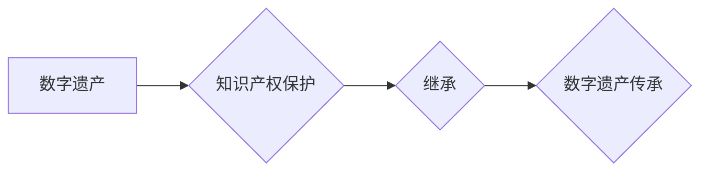

                 

## 知识产权与数字遗产的继承

> 关键词：知识产权、数字遗产、继承、区块链、智能合约、数据隐私、版权保护、元宇宙

## 1. 背景介绍

随着数字技术的飞速发展，人类创造的知识和文化遗产越来越多的以数字化形式存在。从文学作品、音乐、艺术品到软件代码、设计图纸、个人日记，数以百万计的数字资产正在不断涌现。这些数字资产构成了我们个人和社会的重要财富，也成为未来发展的重要资源。然而，随着数字遗产的不断积累，如何有效地保护其知识产权，并确保其能够顺利地传承下去，成为了一个亟待解决的难题。

传统知识产权保护机制主要针对物理世界中的实体资产，例如书籍、绘画、雕塑等。这些机制难以有效地应对数字资产的独特特性，例如易于复制、传播和修改。此外，随着数字技术的不断发展，新的数字资产类型不断涌现，传统的知识产权保护机制也面临着挑战。

数字遗产的继承问题更是复杂。传统的继承方式主要针对物质财产，而数字遗产的性质更加复杂，涉及到数据、代码、虚拟资产等多种形式。如何将这些数字资产合法、有效地继承给下一代，成为了一个新的挑战。

## 2. 核心概念与联系

### 2.1 知识产权

知识产权是指个人或组织对知识、创造和发明享有的专有权利。它包括以下几种类型：

* **版权:** 对文学、艺术、音乐等作品的创作权。
* **专利:** 对发明或技术方案的独占权。
* **商标:** 对商品或服务的标志的独占权。
* **商业秘密:** 对商业上的机密信息享有的保护权。

### 2.2 数字遗产

数字遗产是指在数字形式存在的个人或组织的知识、文化、创意和财产。它包括以下几种类型：

* **个人数据:** 个人信息、通讯记录、照片、视频等。
* **数字作品:** 文学作品、音乐、艺术作品、软件代码等。
* **虚拟资产:** 游戏道具、虚拟货币、NFT等。
* **在线账户:** 社交媒体账号、电子邮件账户、云存储账户等。

### 2.3 继承

继承是指在个人或组织死亡后，其财产和权利按照法律规定由继承人继承。

### 2.4 核心概念联系

数字遗产的知识产权保护和继承问题是相互关联的。

* **知识产权保护:** 确保数字遗产的知识产权得到有效保护，可以防止未经授权的复制、传播和修改，维护数字遗产的价值和完整性。
* **继承:** 确保数字遗产能够顺利地继承给下一代，可以保证数字遗产的传承和价值的延续。

**Mermaid 流程图**



## 3. 核心算法原理 & 具体操作步骤

### 3.1 算法原理概述

为了解决数字遗产的知识产权保护和继承问题，需要开发相应的算法和技术。这些算法可以帮助我们：

* **识别和分类数字遗产:** 识别不同类型的数字遗产，例如文本、图像、音频、视频等，并对其进行分类。
* **追踪和记录数字遗产的版权信息:** 记录数字遗产的版权信息，例如作者、创作日期、版权期限等。
* **验证数字遗产的真实性和完整性:** 使用加密技术和区块链技术验证数字遗产的真实性和完整性，防止篡改和伪造。
* **实现数字遗产的继承和分配:** 使用智能合约技术实现数字遗产的继承和分配，确保数字遗产能够按照遗嘱或法律规定分配给继承人。

### 3.2 算法步骤详解

**1. 数字遗产识别和分类:**

* 使用自然语言处理（NLP）技术分析数字遗产的内容，识别其类型和主题。
* 使用计算机视觉技术分析数字遗产的图像和视频内容，识别其内容和特征。
* 使用音频处理技术分析数字遗产的音频内容，识别其内容和特征。

**2. 数字遗产版权信息追踪和记录:**

* 使用区块链技术记录数字遗产的版权信息，例如作者、创作日期、版权期限等。
* 使用数字签名技术验证数字遗产的版权信息，防止篡改。

**3. 数字遗产真实性和完整性验证:**

* 使用加密技术对数字遗产进行加密，防止未经授权的访问和修改。
* 使用区块链技术记录数字遗产的完整性信息，防止篡改和伪造。

**4. 数字遗产继承和分配:**

* 使用智能合约技术定义数字遗产的继承规则，例如谁是继承人、如何分配遗产等。
* 使用区块链技术执行智能合约，确保数字遗产按照预设规则分配给继承人。

### 3.3 算法优缺点

**优点:**

* **提高数字遗产的安全性:** 使用加密技术和区块链技术可以有效地保护数字遗产的安全性和完整性。
* **确保数字遗产的合法性:** 使用智能合约技术可以确保数字遗产的合法继承和分配。
* **方便数字遗产的管理和传承:** 使用区块链技术可以方便地管理和追踪数字遗产的信息。

**缺点:**

* **技术复杂性:** 开发和实施这些算法需要一定的技术难度。
* **法律法规不完善:** 目前相关的法律法规对数字遗产的知识产权保护和继承问题还存在一些空白。
* **公众认知度不足:** 公众对数字遗产的知识产权保护和继承问题还存在一定的认知障碍。

### 3.4 算法应用领域

* **数字艺术品:** 保护数字艺术品的版权和确保其传承。
* **软件代码:** 保护软件代码的知识产权和确保其合法使用。
* **个人数据:** 保护个人数据的隐私和确保其合法使用。
* **虚拟资产:** 保护虚拟资产的知识产权和确保其合法交易。

## 4. 数学模型和公式 & 详细讲解 & 举例说明

### 4.1 数学模型构建

为了量化数字遗产的价值，可以构建一个数学模型，将数字遗产的各种属性转化为数值，例如：

* **版权价值:** $V_c = f(A, T, L)$，其中 $A$ 是作品的艺术价值，$T$ 是作品的时效性，$L$ 是作品的寿命。
* **数据价值:** $V_d = f(S, R, U)$，其中 $S$ 是数据的规模，$R$ 是数据的可靠性，$U$ 是数据的实用性。
* **虚拟资产价值:** $V_v = f(N, D, P)$，其中 $N$ 是虚拟资产的数量，$D$ 是虚拟资产的稀缺性，$P$ 是虚拟资产的市场价格。

### 4.2 公式推导过程

这些公式的推导过程需要根据具体的应用场景和数据进行调整。例如，对于数字艺术品，可以根据作品的拍卖价格、评论数量、收藏人数等因素来计算其艺术价值。对于个人数据，可以根据数据的敏感程度、数据量、数据更新频率等因素来计算其价值。

### 4.3 案例分析与讲解

假设有一位艺术家创作了一幅数字艺术品，并将其上传到一个区块链平台。

* **版权价值:** 我们可以根据艺术品的创作时间、艺术家的知名度、作品的评论数量等因素来计算其版权价值。
* **数据价值:** 艺术品的元数据，例如创作日期、艺术家信息、作品描述等，也具有数据价值。
* **虚拟资产价值:** 如果艺术品被铸造成NFT，那么它就具有虚拟资产价值，其价值取决于NFT的稀缺性、市场需求等因素。

## 5. 项目实践：代码实例和详细解释说明

### 5.1 开发环境搭建

* **操作系统:** Ubuntu 20.04 LTS
* **编程语言:** Python 3.8
* **开发工具:** VS Code
* **区块链平台:** Ethereum

### 5.2 源代码详细实现

```python
# 导入必要的库
from web3 import Web3

# 连接到以太坊网络
w3 = Web3(Web3.HTTPProvider("https://mainnet.infura.io/v3/YOUR_INFURA_PROJECT_ID"))

# 定义智能合约的ABI
abi = [
    {
        "constant": True,
        "inputs": [],
        "name": "getArtworkOwner",
        "outputs": [{"name": "", "type": "address"}],
        "payable": False,
        "stateMutability": "view",
        "type": "function"
    },
    # ... 其他智能合约函数
]

# 部署智能合约的地址
contract_address = "0xYOUR_CONTRACT_ADDRESS"

# 创建智能合约实例
contract = w3.eth.contract(address=contract_address, abi=abi)

# 获取艺术品的拥有者地址
owner_address = contract.functions.getArtworkOwner().call()

# 打印艺术品的拥有者地址
print(f"艺术品的拥有者地址: {owner_address}")
```

### 5.3 代码解读与分析

* 代码首先导入必要的库，并连接到以太坊网络。
* 然后定义智能合约的ABI，并根据合约地址创建智能合约实例。
* 最后调用智能合约的`getArtworkOwner()`函数获取艺术品的拥有者地址，并将其打印出来。

### 5.4 运行结果展示

运行代码后，将输出艺术品的拥有者地址。

## 6. 实际应用场景

### 6.1 数字艺术品

数字艺术品可以被铸造成NFT，并存储在区块链上。使用智能合约可以实现数字艺术品的版权保护和交易。

### 6.2 软件代码

软件代码可以被存储在区块链上，并使用智能合约来管理其版权和许可。

### 6.3 个人数据

个人数据可以被加密存储在区块链上，并使用智能合约来控制其访问和使用权限。

### 6.4 未来应用展望

随着区块链技术的不断发展，数字遗产的知识产权保护和继承将会有更加广泛的应用场景。例如：

* **数字身份:** 使用区块链技术构建数字身份，可以确保个人身份的唯一性和不可篡改性。
* **数字遗产管理平台:** 开发专门的数字遗产管理平台，可以帮助用户管理和传承其数字遗产。
* **数字遗产税务:** 建立数字遗产税务制度，可以确保数字遗产的合理分配和税收收入。

## 7. 工具和资源推荐

### 7.1 学习资源推荐

* **区块链技术入门书籍:** 《区块链：从原理到实践》
* **智能合约开发教程:** Solidity 官方文档
* **数字遗产相关研究论文:** arXiv

### 7.2 开发工具推荐

* **以太坊开发工具:** Truffle Suite, Remix IDE
* **区块链浏览器:** Etherscan, Blockchair
* **代码编辑器:** VS Code, Atom

### 7.3 相关论文推荐

* **数字遗产的知识产权保护:** "Intellectual Property Rights in Digital Heritage"
* **数字遗产的继承问题:** "Digital Inheritance: Legal and Ethical Challenges"
* **区块链技术在数字遗产管理中的应用:** "Blockchain Technology for Digital Heritage Management"

## 8. 总结：未来发展趋势与挑战

### 8.1 研究成果总结

数字遗产的知识产权保护和继承问题是一个复杂的挑战，需要多学科的合作和研究。目前，区块链技术和智能合约技术为解决这些问题提供了新的思路和方法。

### 8.2 未来发展趋势

* **技术创新:** 随着区块链技术的不断发展，将会有更加安全、高效、便捷的数字遗产管理解决方案出现。
* **法律法规完善:** 相关法律法规将逐步完善，为数字遗产的知识产权保护和继承提供更加明确的规范。
* **社会认知提升:** 公众对数字遗产的认知度将不断提升，人们将更加重视数字遗产的保护和传承。

### 8.3 面临的挑战

* **技术复杂性:** 区块链技术和智能合约技术仍然存在一定的复杂性，需要不断进行优化和改进。
* **法律法规不完善:** 目前相关的法律法规对数字遗产的知识产权保护和继承问题还存在一些空白，需要进一步完善。
* **公众认知度不足:** 公众对数字遗产的知识产权保护和继承问题还存在一定的认知障碍，需要进行宣传和教育。

### 8.4 研究展望

未来，我们将继续关注数字遗产的知识产权保护和继承问题，并致力于开发更加安全、高效、便捷的解决方案。


## 9. 附录：常见问题与解答

### 9.1 如何保护数字艺术品的版权？

可以使用区块链技术将数字艺术品铸造成NFT，并存储其版权信息在区块链上。

### 9.2 如何继承数字遗产？

可以使用智能合约来定义数字遗产的继承规则，并将其存储在区块链上。

### 9.3 数字遗产的价值如何评估？

可以根据数字遗产的类型和属性构建数学模型，并使用相关数据进行评估。

### 9.4 区块链技术如何应用于数字遗产管理？

区块链技术可以用于存储数字遗产的信息，确保其安全性和完整性，并实现数字遗产的合法继承和分配。


作者：禅与计算机程序设计艺术 / Zen and the Art of Computer Programming 
<end_of_turn>

