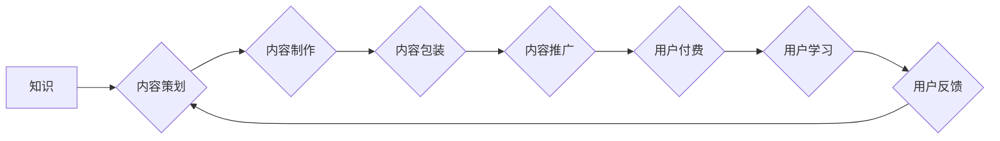

                 

# 知识付费创业中的内容产品化策略

> 关键词：知识付费、内容产品化、内容运营、用户体验、商业模式

## 1. 背景介绍

知识付费作为一种新型的商业模式，近年来在互联网领域蓬勃发展。随着人们对知识的需求不断增长，以及互联网技术的发展，知识付费平台和内容创作者的数量也在迅速增加。然而，知识付费市场竞争激烈，如何打造优质的内容产品，并将其转化为商业价值，成为众多创作者和平台面临的挑战。

知识付费创业的核心在于将知识转化为有价值的产品，并通过有效的运营策略，将产品推向目标用户。内容产品化是实现这一目标的关键环节，它涉及到内容的策划、制作、包装、推广等多个方面。

## 2. 核心概念与联系

**2.1 内容产品化**

内容产品化是指将知识、技能、经验等内容，通过一定的加工和包装，转化为具有市场价值的产品，并通过线上线下渠道进行销售和推广。

**2.2 知识付费**

知识付费是指用户通过付费的方式获取知识、技能、经验等内容。

**2.3 用户体验**

用户体验是指用户在使用产品或服务过程中所感受到的整体感受。良好的用户体验是知识付费产品成功的关键因素之一。

**2.4 内容运营**

内容运营是指围绕内容产品，进行策划、制作、推广、维护等一系列活动，以提升内容的价值和影响力。

**2.5 商业模式**

商业模式是指企业为创造、传递和获取价值而采取的策略和方法。

**2.6 Mermaid 流程图**



## 3. 核心算法原理 & 具体操作步骤

**3.1 算法原理概述**

内容产品化是一个复杂的系统工程，涉及到多个环节和技术，没有一个单一的算法可以完美解决所有问题。然而，我们可以通过一些算法和模型，来辅助内容产品化过程，例如：

* **推荐算法**: 根据用户的兴趣和行为，推荐相关的知识付费产品。
* **内容分发算法**: 根据内容的质量和用户需求，优化内容的展示和分发。
* **用户画像算法**: 分析用户的特征和行为，构建用户画像，以便更好地进行内容定制和营销。

**3.2 算法步骤详解**

以下是一个简单的推荐算法步骤示例：

1. **数据收集**: 收集用户的行为数据，例如浏览记录、购买记录、评论记录等。
2. **特征提取**: 从用户行为数据中提取特征，例如用户喜欢的主题、学习习惯、消费水平等。
3. **模型训练**: 使用机器学习算法，训练一个推荐模型，例如协同过滤算法、内容基准算法等。
4. **推荐结果**: 根据用户的特征和模型的预测结果，推荐相关的知识付费产品。

**3.3 算法优缺点**

推荐算法的优缺点：

* **优点**: 可以根据用户的个性化需求，推荐更精准的内容，提高用户体验和转化率。
* **缺点**: 需要大量的用户数据进行训练，算法的准确性依赖于数据质量，存在推荐偏差和信息茧房等问题。

**3.4 算法应用领域**

推荐算法广泛应用于各个领域，例如：

* **电商**: 推荐商品
* **视频平台**: 推荐视频
* **音乐平台**: 推荐歌曲
* **社交媒体**: 推荐好友和内容

## 4. 数学模型和公式 & 详细讲解 & 举例说明

**4.1 数学模型构建**

推荐算法通常使用矩阵分解模型，例如协同过滤算法。协同过滤算法的核心思想是：

* **用户-物品交互矩阵**: 将用户和物品之间的交互关系表示为一个矩阵，例如用户对物品的评分、购买记录等。
* **矩阵分解**: 将用户-物品交互矩阵分解成两个低维矩阵，分别代表用户的特征和物品的特征。
* **预测评分**: 根据用户的特征和物品的特征，预测用户对物品的评分。

**4.2 公式推导过程**

假设用户-物品交互矩阵为R，用户特征矩阵为U，物品特征矩阵为V，则有：

$$R \approx U V^T$$

其中，$U$ 是一个m×k的矩阵，m是用户数量，k是特征维度；$V$ 是一个n×k的矩阵，n是物品数量。

**4.3 案例分析与讲解**

例如，假设有一个用户-物品交互矩阵，其中用户对物品的评分表示为1-5星。我们可以使用协同过滤算法，将这个矩阵分解成用户特征矩阵和物品特征矩阵。

然后，我们可以根据用户的特征和物品的特征，预测用户对某个物品的评分。例如，如果用户A对电影A评分为4星，电影B评分为3星，而用户B对电影A评分为5星，电影C评分为2星，那么我们可以预测用户A对电影C的评分。

## 5. 项目实践：代码实例和详细解释说明

**5.1 开发环境搭建**

* Python 3.x
* TensorFlow 或 PyTorch
* Jupyter Notebook

**5.2 源代码详细实现**

```python
import tensorflow as tf

# 定义用户-物品交互矩阵
R = tf.constant([[5, 4, 3],
                 [4, 5, 2],
                 [3, 2, 5]])

# 定义特征维度
k = 2

# 定义用户特征矩阵和物品特征矩阵
U = tf.Variable(tf.random.normal([3, k]))
V = tf.Variable(tf.random.normal([3, k]))

# 计算预测评分
predictions = tf.matmul(U, V, transpose_b=True)

# 定义损失函数
loss = tf.reduce_mean(tf.square(predictions - R))

# 定义优化器
optimizer = tf.keras.optimizers.Adam()

# 训练模型
for epoch in range(100):
    with tf.GradientTape() as tape:
        loss_value = loss
    gradients = tape.gradient(loss_value, [U, V])
    optimizer.apply_gradients(zip(gradients, [U, V]))

# 打印预测评分
print(predictions)
```

**5.3 代码解读与分析**

* 代码首先定义了用户-物品交互矩阵R。
* 然后定义了特征维度k。
* 使用tf.Variable创建用户特征矩阵U和物品特征矩阵V，并随机初始化。
* 计算预测评分，并定义损失函数和优化器。
* 使用梯度下降算法训练模型，并打印预测评分。

**5.4 运行结果展示**

运行代码后，会输出预测评分矩阵，该矩阵包含了模型预测的用户对物品的评分。

## 6. 实际应用场景

**6.1 在线教育平台**

知识付费平台可以利用内容产品化策略，将课程、讲座、培训等内容，转化为付费产品，并通过推荐算法，将合适的课程推荐给目标用户。

**6.2 技能分享平台**

技能分享平台可以将用户的技能和经验，转化为付费教程、指导服务等产品，并通过内容运营和社区建设，提升产品的价值和影响力。

**6.3 咨询服务平台**

咨询服务平台可以将专家的知识和经验，转化为付费咨询服务，并通过用户画像和推荐算法，将合适的专家推荐给用户。

**6.4 未来应用展望**

随着人工智能技术的不断发展，内容产品化策略将更加智能化和个性化。例如：

* **个性化内容推荐**: 根据用户的兴趣、学习习惯、消费水平等特征，推荐更精准的内容。
* **智能内容创作**: 利用人工智能技术，自动生成高质量的内容，例如文章、视频、音频等。
* **虚拟现实/增强现实体验**: 利用VR/AR技术，打造沉浸式的学习体验。

## 7. 工具和资源推荐

**7.1 学习资源推荐**

* **书籍**: 《深度学习》、《机器学习实战》
* **在线课程**: Coursera、edX、Udacity
* **博客**: Towards Data Science、Machine Learning Mastery

**7.2 开发工具推荐**

* **Python**: TensorFlow、PyTorch、Scikit-learn
* **云平台**: AWS、Azure、GCP

**7.3 相关论文推荐**

* **协同过滤**: "Collaborative Filtering: A User-Based Approach"
* **推荐系统**: "Recommender Systems: A Survey"

## 8. 总结：未来发展趋势与挑战

**8.1 研究成果总结**

内容产品化策略已经取得了一定的成果，例如：

* **知识付费市场规模不断扩大**: 越来越多的用户愿意为知识付费。
* **内容质量不断提升**: 创作者和平台都在努力提升内容的质量和价值。
* **用户体验不断优化**: 平台和工具都在不断改进用户体验。

**8.2 未来发展趋势**

* **更智能化的内容推荐**: 利用人工智能技术，实现更精准、更个性化的内容推荐。
* **更丰富的学习体验**: 利用VR/AR技术，打造更沉浸式的学习体验。
* **更完善的知识体系**: 建立更完善的知识体系，满足用户多样化的学习需求。

**8.3 面临的挑战**

* **内容质量控制**: 如何保证内容的质量和真实性。
* **用户隐私保护**: 如何保护用户的隐私信息。
* **商业模式创新**: 如何找到更可持续的商业模式。

**8.4 研究展望**

未来，内容产品化策略将继续发展，并与人工智能、VR/AR等新技术融合，为用户提供更优质、更便捷的知识获取体验。


## 9. 附录：常见问题与解答

**9.1 如何提高内容的质量？**

* 坚持原创，避免抄袭和伪原创。
* 关注用户需求，创作有价值、有实用性的内容。
* 采用多种形式，例如文字、图片、视频、音频等，丰富内容形式。
* 邀请专家学者参与创作，提升内容的权威性和专业性。

**9.2 如何保护用户的隐私信息？**

* 明确收集和使用用户数据的目的和范围。
* 获得用户的明确同意，才能收集和使用他们的个人信息。
* 加强数据安全防护，防止数据泄露。
* 遵守相关法律法规，保护用户的隐私权。


作者：禅与计算机程序设计艺术 / Zen and the Art of Computer Programming 
<end_of_turn>

