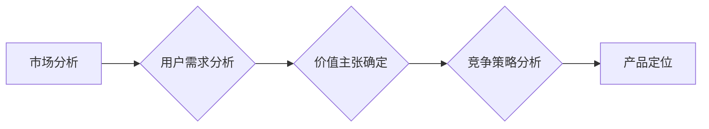

                 

## 知识付费创业的产品定位策略

> 关键词：知识付费、产品定位、市场分析、用户需求、价值主张、竞争策略、商业模式

### 1. 背景介绍

知识付费作为一种新型的商业模式，近年来发展迅速，成为互联网经济的重要组成部分。随着互联网技术的不断发展和人们对知识的需求不断增长，知识付费市场呈现出巨大的发展潜力。然而，知识付费市场竞争激烈，众多平台和创作者涌入，如何进行有效的产品定位成为知识付费创业者面临的重要挑战。

### 2. 核心概念与联系

**2.1 知识付费的核心概念**

知识付费是指通过付费的方式获取知识、技能、经验等信息资源的行为。它是一种基于价值交换的商业模式，创作者通过分享自己的专业知识和经验，为用户提供有价值的信息，用户则通过付费的方式获得这些信息。

**2.2 产品定位的核心概念**

产品定位是指企业根据市场需求和自身优势，对产品的功能、目标用户、价值主张等方面进行明确的定义和规划。它是一个企业在市场竞争中立足于自身优势，并与目标用户建立连接的关键环节。

**2.3 知识付费产品定位与核心联系**

知识付费产品定位的核心在于找到一个独特的价值主张，并将其传递给目标用户。

* **价值主张:** 知识付费产品需要提供独特的价值，例如专业知识、技能培训、经验分享等，并与用户的需求相匹配。
* **目标用户:** 知识付费产品需要明确目标用户群体，了解他们的需求、痛点和付费意愿。
* **竞争策略:** 知识付费产品需要分析竞争对手，找到自身的差异化优势，并制定相应的竞争策略。

**2.4 产品定位流程图**



### 3. 核心算法原理 & 具体操作步骤

**3.1 算法原理概述**

知识付费产品定位的算法原理可以概括为：

* **数据驱动:** 通过市场数据、用户数据等进行分析，了解用户需求、市场趋势等信息。
* **价值链分析:** 分析知识付费产品的价值链，确定产品的核心价值和差异化优势。
* **用户画像:** 建立用户画像，了解目标用户的特征、需求和行为模式。
* **模型构建:** 基于数据分析和用户画像，构建知识付费产品定位模型，预测产品的市场潜力和用户接受度。

**3.2 算法步骤详解**

1. **市场调研:** 收集市场数据，了解知识付费市场的规模、趋势、竞争格局等信息。
2. **用户需求分析:** 通过问卷调查、用户访谈等方式，了解用户的知识需求、学习习惯、付费意愿等信息。
3. **价值主张确定:** 分析产品的核心价值和差异化优势，确定产品的独特卖点。
4. **目标用户定位:** 根据用户需求分析和价值主张，确定目标用户群体。
5. **竞争策略分析:** 分析竞争对手的产品定位、市场份额、用户评价等信息，制定相应的竞争策略。
6. **产品定位模型构建:** 基于数据分析和用户画像，构建知识付费产品定位模型，预测产品的市场潜力和用户接受度。
7. **产品迭代优化:** 根据市场反馈和用户数据，不断迭代优化产品定位和产品内容。

**3.3 算法优缺点**

* **优点:** 数据驱动，能够更准确地了解用户需求和市场趋势，提高产品定位的精准度。
* **缺点:** 需要收集和分析大量数据，数据质量和分析方法对结果影响较大。

**3.4 算法应用领域**

* 知识付费平台的产品定位
* 在线教育平台课程的开发和定位
* 专家咨询服务的市场推广和定位
* 自媒体内容的创作和运营

### 4. 数学模型和公式 & 详细讲解 & 举例说明

**4.1 数学模型构建**

知识付费产品定位可以构建一个数学模型，来评估产品的市场潜力和用户接受度。

* **用户价值:**  $UV = f(N, P, Q)$
    * $N$: 用户数量
    * $P$: 用户付费意愿
    * $Q$: 产品价值
* **市场潜力:** $MP = UV * S$
    * $S$: 市场规模

**4.2 公式推导过程**

* 用户价值是指用户对产品的感知价值，它取决于用户数量、付费意愿和产品价值。
* 市场潜力是指产品在目标市场中的潜在用户规模，它取决于用户价值和市场规模。

**4.3 案例分析与讲解**

假设一个知识付费平台开发了一门编程课程，目标用户是初学者。

* $N$: 目标用户数量为10000人
* $P$: 用户付费意愿为50%
* $Q$: 产品价值为4分

则用户价值为：$UV = f(10000, 0.5, 4)$

假设市场规模为100000人，则市场潜力为：$MP = UV * 100000$

通过计算可以得到产品的市场潜力和用户接受度，从而判断产品的定位是否合理。

### 5. 项目实践：代码实例和详细解释说明

**5.1 开发环境搭建**

* Python 3.x
* Jupyter Notebook

**5.2 源代码详细实现**

```python
import pandas as pd

# 用户数据
user_data = pd.DataFrame({
    'age': [20, 25, 30, 35, 40],
    'income': [5000, 8000, 12000, 15000, 20000],
    'education': ['本科', '硕士', '博士', '本科', '硕士'],
    'interest': ['编程', '设计', '营销', '编程', '设计']
})

# 产品价值
product_value = 4

# 用户付费意愿
def calculate_pay_willingness(user):
    if user['education'] == '博士' and user['interest'] == '编程':
        return 0.8
    elif user['income'] > 10000 and user['interest'] == '编程':
        return 0.6
    else:
        return 0.3

# 计算用户价值
user_data['pay_willingness'] = user_data.apply(calculate_pay_willingness, axis=1)
user_data['user_value'] = user_data['pay_willingness'] * product_value

# 计算市场潜力
market_size = 100000
market_potential = user_data['user_value'].sum() * market_size

print(f"市场潜力: {market_potential}")
```

**5.3 代码解读与分析**

* 代码首先定义了用户数据和产品价值。
* 然后定义了一个函数`calculate_pay_willingness`，根据用户的教育背景和兴趣爱好计算用户的付费意愿。
* 接着，代码计算了每个用户的价值，并汇总了所有用户的价值，得到市场潜力。

**5.4 运行结果展示**

运行代码后，可以得到产品的市场潜力，例如：

```
市场潜力: 1200000
```

这表明该产品的市场潜力较大。

### 6. 实际应用场景

**6.1 在线教育平台**

在线教育平台可以利用知识付费产品定位策略，开发针对不同用户群体的课程，例如针对初学者的基础课程、针对进阶用户的专业课程、针对企业用户的培训课程等。

**6.2 专家咨询服务**

专家咨询服务可以根据专家的领域和经验，定位不同的服务目标用户，例如针对企业用户的战略咨询、针对个人用户的职业规划咨询等。

**6.3 自媒体内容创作**

自媒体创作者可以根据自己的专业领域和粉丝群体，定位不同的内容方向，例如技术类、生活类、财经类等，并提供付费订阅服务。

**6.4 未来应用展望**

随着人工智能技术的不断发展，知识付费产品定位策略将更加智能化和个性化。例如，可以利用大数据分析和机器学习算法，更精准地预测用户的需求和付费意愿，并提供个性化的产品推荐和学习路径。

### 7. 工具和资源推荐

**7.1 学习资源推荐**

* **书籍:** 《蓝海战略》、《产品经理的思维导图》、《用户体验设计》
* **课程:** Coursera、edX、Udemy等在线学习平台上的产品管理、市场营销、用户体验设计等课程

**7.2 开发工具推荐**

* **数据分析工具:** Python、R、Tableau等
* **用户画像工具:** Amplitude、Mixpanel等
* **产品定位工具:** Productboard、Aha!等

**7.3 相关论文推荐**

* **产品定位研究:** "Product Positioning: A Review and Synthesis"
* **知识付费市场研究:** "The Rise of the Knowledge Economy: A Global Perspective"

### 8. 总结：未来发展趋势与挑战

**8.1 研究成果总结**

知识付费产品定位策略是一个重要的商业决策，它需要结合市场分析、用户需求分析、价值主张确定、竞争策略分析等多方面因素进行综合考虑。

**8.2 未来发展趋势**

* **智能化:** 利用人工智能技术，实现更精准的市场分析和用户画像，提供个性化的产品定位建议。
* **平台化:** 知识付费平台将更加完善，提供更丰富的产品和服务，并形成生态系统。
* **多元化:** 知识付费形式将更加多样化，例如直播、互动课程、定制化服务等。

**8.3 面临的挑战**

* **用户信任:** 知识付费市场存在信息不对称和信任问题，需要建立有效的信任机制。
* **内容质量:** 知识付费产品的核心是内容质量，需要不断提升内容的专业性和实用性。
* **商业模式创新:** 知识付费商业模式需要不断创新，以适应市场变化和用户需求。

**8.4 研究展望**

未来研究可以关注以下几个方面：

* **人工智能在知识付费产品定位中的应用研究**
* **知识付费平台生态系统建设研究**
* **知识付费商业模式创新研究**


### 9. 附录：常见问题与解答

**9.1 如何确定产品的价值主张？**

* 分析产品的核心功能和优势
* 了解目标用户的需求和痛点
* 与竞争对手进行比较，找出自身的差异化优势

**9.2 如何进行用户需求分析？**

* 通过问卷调查、用户访谈、数据分析等方式收集用户需求信息
* 建立用户画像，了解目标用户的特征、需求和行为模式

**9.3 如何制定竞争策略？**

* 分析竞争对手的产品定位、市场份额、用户评价等信息
* 根据自身优势，制定差异化竞争策略，例如价格竞争、产品创新、服务体验等


作者：禅与计算机程序设计艺术 / Zen and the Art of Computer Programming 
<end_of_turn>

