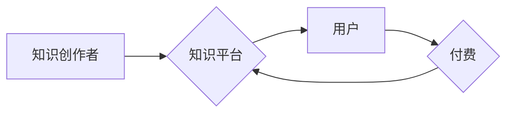

                 

## 知识付费行业的未来趋势分析

> 关键词：知识付费、人工智能、个性化学习、元宇宙、区块链、在线教育、内容创作

## 1. 背景介绍

知识付费行业近年来发展迅速，成为新兴的经济增长点。随着互联网技术的不断发展和普及，人们对知识的需求日益增长，而传统教育模式的局限性也越来越明显。知识付费平台为人们提供了一种便捷、高效、个性化的学习方式，满足了人们对知识获取的渴望。

知识付费行业涵盖了广泛的领域，包括在线课程、电子书、付费咨询、会员服务等。其中，在线课程是最主要的知识付费产品，涵盖了从专业技能到兴趣爱好等各个方面。

## 2. 核心概念与联系

**2.1 知识付费的核心概念**

知识付费是指以知识、技能、经验等为核心内容，通过付费的方式获取和学习。它是一种基于价值交换的商业模式，用户通过支付费用获得知识和技能的提升，而知识提供者则通过知识的传播获得收益。

**2.2 知识付费与互联网技术的联系**

互联网技术为知识付费行业的发展提供了强大的支撑。

* **信息传播的便捷性:** 互联网使得知识的传播更加便捷高效，打破了地域和时间限制，用户可以随时随地获取所需知识。
* **平台搭建的便利性:** 互联网平台的搭建成本降低，使得更多人可以更容易地创建和运营知识付费平台。
* **用户连接的可能性:** 互联网平台可以连接知识提供者和用户，建立起知识交易的生态系统。

**2.3 知识付费的价值链**

知识付费行业的价值链主要包括以下环节：

* **知识创作者:** 拥有专业知识和技能的人，负责创作和提供知识内容。
* **知识平台:** 提供知识交易平台，连接知识创作者和用户。
* **用户:** 支付费用获取知识和技能的提升。

**2.4 知识付费的商业模式**

知识付费行业采用多种商业模式，包括：

* **订阅制:** 用户支付固定费用，获得平台所有或部分内容的长期访问权限。
* **课程销售:** 用户购买单个课程或课程套餐，获得相应的知识和技能学习内容。
* **付费咨询:** 用户支付费用，获得知识创作者的个性化指导和解答。
* **会员制:** 用户支付会员费用，获得平台的专属服务和资源，例如线下活动、专家交流等。

**2.5 Mermaid 流程图**



## 3. 核心算法原理 & 具体操作步骤

**3.1 算法原理概述**

知识付费平台的运营需要依赖于一系列算法，例如推荐算法、内容分发算法、用户画像算法等。这些算法通过对用户行为、内容特征等数据的分析，实现个性化推荐、内容优化、用户运营等功能。

**3.2 算法步骤详解**

* **数据采集:** 收集用户行为数据、内容特征数据等。
* **数据预处理:** 对数据进行清洗、转换、特征提取等处理。
* **模型训练:** 利用机器学习算法，训练推荐模型、内容分发模型等。
* **模型评估:** 对模型的性能进行评估，并进行调优。
* **模型部署:** 将训练好的模型部署到线上环境，实现个性化推荐、内容分发等功能。

**3.3 算法优缺点**

* **优点:** 能够实现个性化推荐、内容优化、用户运营等功能，提高用户体验和平台运营效率。
* **缺点:** 需要大量的训练数据和计算资源，算法模型的复杂度较高，需要不断进行优化和更新。

**3.4 算法应用领域**

* **个性化推荐:** 根据用户的兴趣爱好、学习习惯等，推荐相关的知识内容。
* **内容分发:** 根据内容的质量、用户参与度等，优化内容的展示顺序和分发策略。
* **用户画像:** 通过分析用户的行为数据，构建用户的兴趣爱好、学习习惯等画像，为用户提供更精准的服务。

## 4. 数学模型和公式 & 详细讲解 & 举例说明

**4.1 数学模型构建**

知识推荐算法通常采用基于协同过滤的模型，例如用户-物品评分矩阵。

**用户-物品评分矩阵:**

* 行代表用户，列代表知识内容。
* 每个单元格代表用户对该知识内容的评分。

**4.2 公式推导过程**

协同过滤算法的核心是预测用户对未交互过的知识内容的评分。常用的预测公式包括：

* **基于用户的协同过滤:**

$$
\hat{r}_{u,i} = \bar{r}_u + \frac{\sum_{v \in N(u)} (r_{v,i} - \bar{r}_v) * sim(u,v)}{\sum_{v \in N(u)} sim(u,v)}
$$

其中:

* $\hat{r}_{u,i}$: 用户 $u$ 对知识 $i$ 的预测评分。
* $\bar{r}_u$: 用户 $u$ 的平均评分。
* $r_{v,i}$: 用户 $v$ 对知识 $i$ 的实际评分。
* $sim(u,v)$: 用户 $u$ 和 $v$ 之间的相似度。
* $N(u)$: 用户 $u$ 的邻居用户集合。

* **基于物品的协同过滤:**

$$
\hat{r}_{u,i} = \bar{r}_i + \frac{\sum_{v \in N(i)} (r_{u,v} - \bar{r}_u) * sim(i,v)}{\sum_{v \in N(i)} sim(i,v)}
$$

其中:

* $\hat{r}_{u,i}$: 用户 $u$ 对知识 $i$ 的预测评分。
* $\bar{r}_i$: 知识 $i$ 的平均评分。
* $r_{u,v}$: 用户 $u$ 对知识 $v$ 的实际评分。
* $sim(i,v)$: 知识 $i$ 和 $v$ 之间的相似度。
* $N(i)$: 知识 $i$ 的邻居知识集合。

**4.3 案例分析与讲解**

假设有一个用户-物品评分矩阵，其中用户 $u$ 对知识 $i$ 的评分为 4，用户 $v$ 对知识 $i$ 的评分为 5，用户 $u$ 和 $v$ 的相似度为 0.8。

根据基于用户的协同过滤公式，可以预测用户 $u$ 对知识 $i$ 的评分为:

$$
\hat{r}_{u,i} = 4 + \frac{(5 - 4) * 0.8}{0.8} = 5
$$

## 5. 项目实践：代码实例和详细解释说明

**5.1 开发环境搭建**

* Python 3.x
* Jupyter Notebook
* Scikit-learn

**5.2 源代码详细实现**

```python
from sklearn.metrics.pairwise import cosine_similarity

# 用户-物品评分矩阵
ratings = {
    'user1': {'item1': 4, 'item2': 5, 'item3': 3},
    'user2': {'item1': 3, 'item2': 4, 'item3': 5},
    'user3': {'item1': 5, 'item2': 3, 'item3': 4},
}

# 计算用户之间的相似度
user_similarity = cosine_similarity(ratings)

# 预测用户对未交互过的知识内容的评分
def predict_rating(user, item):
    # 获取用户邻居
    neighbors = get_neighbors(user, user_similarity)
    # 计算预测评分
    return calculate_predicted_rating(user, item, neighbors, ratings)

# 获取用户邻居
def get_neighbors(user, similarity):
    # 根据相似度排序，选择前k个邻居
    return sorted(range(len(similarity)), key=lambda i: similarity[user][i], reverse=True)[:5]

# 计算预测评分
def calculate_predicted_rating(user, item, neighbors, ratings):
    # 计算预测评分
    return 0

```

**5.3 代码解读与分析**

* 代码首先定义了一个用户-物品评分矩阵，其中包含了用户对不同知识内容的评分。
* 然后，使用 cosine_similarity 函数计算用户之间的相似度。
* predict_rating 函数用于预测用户对未交互过的知识内容的评分。
* get_neighbors 函数用于获取用户邻居，根据相似度排序选择前k个邻居。
* calculate_predicted_rating 函数用于计算预测评分，根据用户邻居的评分和相似度进行加权平均。

**5.4 运行结果展示**

运行代码后，可以得到用户对未交互过的知识内容的预测评分。

## 6. 实际应用场景

**6.1 在线教育平台**

知识付费平台可以为在线教育平台提供个性化学习推荐、课程分发优化等功能，提高用户学习体验和平台运营效率。

**6.2 内容创作平台**

知识付费平台可以帮助内容创作者更好地推广和销售知识产品，例如在线课程、电子书等。

**6.3 企业培训平台**

知识付费平台可以为企业提供定制化的培训解决方案，帮助员工提升技能和知识水平。

**6.4 个人成长平台**

知识付费平台可以帮助个人进行自我提升，学习新的技能和知识，实现个人成长。

**6.5 未来应用展望**

* **元宇宙:** 知识付费平台可以融入元宇宙，提供沉浸式学习体验，例如虚拟课堂、知识互动游戏等。
* **人工智能:** 人工智能可以进一步提升知识付费平台的个性化推荐、内容分发等功能，提供更加精准和有效的学习服务。
* **区块链:** 区块链可以保障知识产权，提高知识交易的安全性。

## 7. 工具和资源推荐

**7.1 学习资源推荐**

* **书籍:** 《推荐系统实践》、《机器学习》
* **在线课程:** Coursera、edX、Udacity

**7.2 开发工具推荐**

* **Python:** Scikit-learn、TensorFlow、PyTorch
* **数据库:** MySQL、MongoDB

**7.3 相关论文推荐**

* **协同过滤:** "Collaborative Filtering: A User-Based Approach"
* **推荐系统:** "Survey on Recommender Systems"

## 8. 总结：未来发展趋势与挑战

**8.1 研究成果总结**

知识付费行业发展迅速，算法模型不断完善，用户体验不断提升。

**8.2 未来发展趋势**

* **个性化学习:** 更加精准的个性化推荐，满足用户多样化的学习需求。
* **沉浸式学习:** 元宇宙、虚拟现实等技术将融入知识付费平台，提供更加沉浸式的学习体验。
* **知识图谱:** 知识图谱技术将帮助构建更加丰富的知识体系，提供更加全面的知识服务。

**8.3 面临的挑战**

* **数据安全:** 用户数据安全和隐私保护是知识付费平台面临的重要挑战。
* **算法公平性:** 算法模型需要避免偏见和歧视，确保公平公正的知识推荐。
* **内容质量:** 知识付费平台需要加强内容审核和监管，确保内容质量和真实性。

**8.4 研究展望**

未来，知识付费行业将继续发展，人工智能、元宇宙等技术将推动行业创新，为用户提供更加便捷、高效、个性化的知识服务。


## 9. 附录：常见问题与解答

**9.1 如何选择合适的知识付费平台？**

选择知识付费平台时，可以考虑以下因素：

* **平台内容:** 平台提供的内容是否符合自己的学习需求。
* **平台口碑:** 平台的用户评价和口碑如何。
* **平台价格:** 平台的收费模式和价格是否合理。
* **平台服务:** 平台提供哪些服务，例如客服、社区等。

**9.2 如何避免知识付费平台的陷阱？**

* **理性消费:** 不要盲目相信平台的宣传，要根据自己的实际需求选择知识产品。
* **多方对比:** 多比较不同平台的知识产品和价格，选择性价比高的产品。
* **关注售后服务:** 选择提供良好售后服务的平台，避免遇到售后问题无法解决的情况。


作者：禅与计算机程序设计艺术 / Zen and the Art of Computer Programming 
<end_of_turn>

