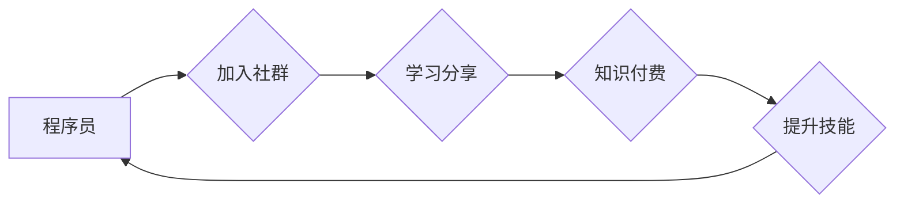

                 

## 知识付费：程序员的社群运营策略

> 关键词：知识付费、程序员、社群运营、内容创作、社区建设、技术分享、在线教育、商业模式

### 1. 背景介绍

在当今数字化时代，技术人才需求日益增长，程序员作为科技发展的重要力量，其技能和知识价值日益凸显。与此同时，互联网技术的发展为知识付费提供了广阔的平台和机遇。程序员可以通过构建自己的社群，分享技术经验、提供学习资源和辅导服务，实现知识付费的商业模式。

传统教育模式的局限性，例如成本高昂、时间限制等，使得程序员寻求更灵活、高效的学习方式。知识付费模式则能够满足这一需求，为程序员提供个性化、定制化的学习体验。

### 2. 核心概念与联系

**2.1 知识付费**

知识付费是指通过互联网平台，将知识、技能、经验等转化为有价值的商品或服务，并向付费用户提供。

**2.2 社群运营**

社群运营是指围绕特定主题或目标，建立和管理一个线上或线下的互动社区，通过内容创作、活动策划、用户互动等方式，提升社区活跃度和用户粘性。

**2.3 程序员社群**

程序员社群是指由程序员组成，围绕技术交流、学习分享、项目合作等主题的线上或线下社区。

**2.4 核心概念联系**

知识付费与社群运营相结合，可以形成一个良性循环：

* 社群运营吸引程序员加入，建立活跃的学习氛围。
* 知识付费提供优质的学习资源和服务，满足程序员的需求。
* 程序员的学习成果和经验分享，丰富社群内容，吸引更多用户加入。

**Mermaid 流程图**



### 3. 核心算法原理 & 具体操作步骤

**3.1 算法原理概述**

知识付费的成功关键在于精准定位目标用户，提供有价值的内容和服务，并建立良好的用户关系。

**3.2 算法步骤详解**

1. **用户调研:** 了解目标用户的技术水平、学习需求、付费意愿等。
2. **内容规划:** 根据用户调研结果，制定内容策略，选择热门技术、实战案例、学习技巧等为主题。
3. **内容创作:** 制作高质量的视频课程、文章、文档、代码示例等学习资源。
4. **社群建设:** 建立线上或线下社群，提供交流平台、互动活动、答疑服务等。
5. **推广营销:** 利用社交媒体、搜索引擎优化、广告投放等方式，推广社群和知识付费产品。
6. **用户运营:** 关注用户反馈，及时更新内容，提供个性化服务，提升用户粘性。

**3.3 算法优缺点**

* **优点:** 
    * 灵活便捷，用户可按需付费学习。
    * 内容丰富多样，满足不同用户需求。
    * 社群互动，促进学习交流。
* **缺点:** 
    * 内容质量参差不齐，需谨慎选择。
    * 用户付费意愿受影响，需不断提升价值。
    * 社群运营成本较高，需投入人力和时间。

**3.4 算法应用领域**

* 程序员技能提升
* 技术趋势学习
* 项目实战经验分享
* 职业发展指导

### 4. 数学模型和公式 & 详细讲解 & 举例说明

**4.1 数学模型构建**

知识付费的商业模式可以抽象为一个供需模型，其中：

* **供给方:** 知识创作者，提供知识和服务。
* **需求方:** 程序员用户，购买知识和服务。
* **价格:** 知识付费产品的价格。
* **需求量:** 用户对知识付费产品的购买意愿。

**4.2 公式推导过程**

假设知识付费产品的价格为 $p$, 用户对该产品的需求量为 $q$, 则可以建立以下需求函数：

$$q = f(p)$$

其中，$f(p)$ 是需求函数，描述了价格与需求量的关系。

**4.3 案例分析与讲解**

例如，假设程序员对学习 Python 的需求量与价格呈反比关系，则需求函数可以表示为：

$$q = 100 - 2p$$

当价格为 $20$ 时，需求量为 $60$；当价格为 $40$ 时，需求量为 $20$。

**4.4 举例说明**

通过分析需求函数，知识创作者可以确定最佳的定价策略，平衡利润和用户需求。

### 5. 项目实践：代码实例和详细解释说明

**5.1 开发环境搭建**

* 操作系统: Windows/macOS/Linux
* 编程语言: Python
* 开发工具: VS Code/Sublime Text
* 数据库: MySQL/PostgreSQL

**5.2 源代码详细实现**

```python
# 用户模型
class User:
    def __init__(self, username, password):
        self.username = username
        self.password = password

# 课程模型
class Course:
    def __init__(self, title, description, price):
        self.title = title
        self.description = description
        self.price = price

# 知识付费平台
class KnowledgePlatform:
    def __init__(self):
        self.users = []
        self.courses = []

    def register_user(self, username, password):
        user = User(username, password)
        self.users.append(user)
        return user

    def add_course(self, title, description, price):
        course = Course(title, description, price)
        self.courses.append(course)
        return course

    def purchase_course(self, user, course):
        # 处理支付逻辑
        user.purchased_courses.append(course)
        return True

# 实例化平台
platform = KnowledgePlatform()

# 注册用户
user1 = platform.register_user("john", "password123")

# 添加课程
course1 = platform.add_course("Python基础", "学习Python编程基础知识", 99)

# 用户购买课程
platform.purchase_course(user1, course1)
```

**5.3 代码解读与分析**

* 代码定义了用户、课程和知识付费平台的模型。
* 用户可以注册并购买课程。
* 平台管理用户和课程信息。
* 代码示例仅展示了基本功能，实际项目需要考虑支付接口、用户权限管理、数据存储等复杂逻辑。

**5.4 运行结果展示**

运行代码后，可以创建用户、添加课程、模拟用户购买课程等操作。

### 6. 实际应用场景

**6.1 在线课程平台**

程序员可以通过构建在线课程平台，分享自己的技术经验和学习资源，向付费用户提供编程课程、项目实战指导等服务。

**6.2 技术博客和社区**

程序员可以利用技术博客和社区平台，发布技术文章、代码示例、学习笔记等内容，并通过会员制度、付费咨询等方式实现知识付费。

**6.3 知识库和工具包**

程序员可以开发技术知识库和工具包，提供代码模板、API文档、调试工具等资源，并通过订阅服务、授权许可等方式进行知识付费。

**6.4 职业发展咨询**

程序员可以提供职业发展咨询服务，帮助其他程序员提升技能、寻找工作机会、规划职业发展路径，并通过付费咨询、一对一指导等方式实现知识付费。

**6.5 未来应用展望**

随着人工智能、大数据等技术的不断发展，知识付费模式将更加多元化、个性化。程序员可以利用这些技术，开发更智能、更精准的知识付费产品和服务，满足用户日益增长的学习需求。

### 7. 工具和资源推荐

**7.1 学习资源推荐**

* **在线学习平台:** Udemy, Coursera, edX
* **技术博客:** Medium, Dev.to, Hacker News
* **开源社区:** GitHub, Stack Overflow

**7.2 开发工具推荐**

* **内容创作工具:** Notion, Obsidian, Typora
* **社群管理工具:** Discord, Slack, WeChat
* **支付平台:** Stripe, PayPal, Alipay

**7.3 相关论文推荐**

* The Economics of Online Education
* The Impact of Social Media on Knowledge Sharing
* The Future of Work: How Technology is Transforming the Job Market

### 8. 总结：未来发展趋势与挑战

**8.1 研究成果总结**

知识付费模式为程序员提供了新的商业机会，也为用户提供了更灵活、高效的学习方式。

**8.2 未来发展趋势**

* **个性化定制:** 根据用户的学习需求和水平，提供个性化的学习方案和内容。
* **人工智能驱动:** 利用人工智能技术，自动生成学习内容、提供个性化推荐、评估学习效果。
* **沉浸式体验:** 通过虚拟现实、增强现实等技术，打造更沉浸式的学习体验。

**8.3 面临的挑战**

* **内容质量控制:** 确保知识付费产品的质量和价值，避免低质量内容泛滥。
* **用户信任建立:** 提升用户对知识付费平台和产品的信任，解决用户付费疑虑。
* **商业模式创新:** 探索新的商业模式，提高知识付费的盈利能力。

**8.4 研究展望**

未来研究可以关注以下方向：

* 如何利用人工智能技术，提高知识付费产品的个性化和智能化程度。
* 如何构建更完善的知识付费平台生态系统，促进知识共享和价值创造。
* 如何解决知识付费模式面临的挑战，推动其健康可持续发展。

### 9. 附录：常见问题与解答

**9.1 如何选择合适的知识付费产品？**

* 了解自己的学习需求和水平。
* 阅读产品介绍和用户评价。
* 尝试免费试听或体验课程。

**9.2 如何避免知识付费陷阱？**

* 谨慎选择平台和产品，避免购买虚假或低质量内容。
* 了解平台的退款政策和售后服务。
* 保护个人信息和支付安全。


作者：禅与计算机程序设计艺术 / Zen and the Art of Computer Programming 
<end_of_turn>

