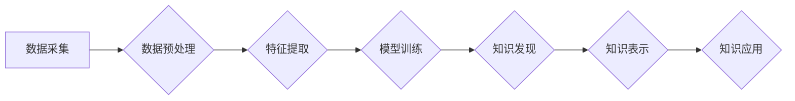

                 

## 知识发现引擎如何助力人类理解世界

> 关键词：知识发现引擎、数据挖掘、机器学习、人工智能、知识图谱、模式识别、人类认知

### 1. 背景介绍

人类文明的进步离不开对世界规律的探索和理解。从古至今，人类一直在通过观察、思考、记录和总结，不断积累和完善对世界的认知。随着信息时代的到来，人类所面临的信息量呈指数级增长，传统的认知方式已经难以跟上。如何高效地从海量数据中发现隐藏的知识，并将其转化为人类可理解的洞察，成为当今科技发展的重要课题。

知识发现引擎 (Knowledge Discovery Engine，KDE) 正是应运而生以解决这一问题的智能工具。它通过整合数据挖掘、机器学习、人工智能等技术，从海量数据中自动识别、提取和解释潜在的模式、趋势和关系，帮助人类更深入地理解世界。

### 2. 核心概念与联系

#### 2.1  数据挖掘

数据挖掘是KDE的核心技术之一，它旨在从大量数据中发现隐藏的模式、规律和知识。数据挖掘通常包括以下几个步骤：

1. 数据预处理：清洗、转换和格式化数据，使其适合挖掘。
2. 数据选择：根据挖掘目标选择合适的子集数据。
3. 数据转换：将数据转换为适合挖掘的格式，例如将文本数据转换为向量表示。
4. 模式发现：使用各种算法从数据中发现模式，例如关联规则、分类规则和聚类分析。
5. 模式评估：评估发现的模式的质量和意义。

#### 2.2  机器学习

机器学习是KDE的另一核心技术，它使系统能够从数据中学习，并根据学习到的知识进行预测或决策。机器学习算法可以分为监督学习、无监督学习和强化学习三大类。

* **监督学习:** 利用标记数据训练模型，例如分类和回归。
* **无监督学习:** 从未标记数据中发现模式，例如聚类和降维。
* **强化学习:** 通过试错学习，在环境中获得最大奖励。

#### 2.3  知识图谱

知识图谱是KDE的重要输出形式之一，它以图的形式表示知识，其中节点代表实体，边代表关系。知识图谱可以帮助人类更直观地理解知识之间的联系，并进行更深入的推理和分析。

**KDE 架构流程图**



### 3. 核心算法原理 & 具体操作步骤

#### 3.1  算法原理概述

KDE的核心算法原理基于数据挖掘和机器学习技术，主要包括以下几种：

* **关联规则挖掘:** 发现数据集中频繁出现的项集之间的关联关系。
* **分类算法:** 根据已标记数据训练模型，对新数据进行分类。
* **聚类算法:** 将数据按照相似性进行分组。
* **异常检测算法:** 识别数据集中与众不同的数据点。
* **文本挖掘算法:** 从文本数据中提取关键词、主题和情感等信息。

#### 3.2  算法步骤详解

以关联规则挖掘为例，其具体操作步骤如下：

1. **构建频繁项集:** 统计数据集中所有项的出现频率，并找出频繁出现的项集。
2. **计算支持度和置信度:** 计算每个频繁项集的支持度和置信度，支持度表示项集在整个数据集中的出现频率，置信度表示在给定一个项集的前提下，另一个项集出现的概率。
3. **筛选关联规则:** 根据预设的支持度和置信度阈值，筛选出满足条件的关联规则。

#### 3.3  算法优缺点

每个算法都有其自身的优缺点，需要根据具体应用场景选择合适的算法。

* **关联规则挖掘:** 优点是能够发现数据之间的隐性关联关系，缺点是容易产生冗余规则，并且对数据量要求较高。
* **分类算法:** 优点是能够对新数据进行准确分类，缺点是需要大量的标记数据进行训练。
* **聚类算法:** 优点是能够发现数据中的自然分组，缺点是难以解释聚类结果。
* **异常检测算法:** 优点是能够识别数据中的异常值，缺点是需要根据具体应用场景选择合适的算法。
* **文本挖掘算法:** 优点是能够从文本数据中提取有价值的信息，缺点是需要处理大量的文本数据，并且算法的复杂度较高。

#### 3.4  算法应用领域

KDE算法广泛应用于各个领域，例如：

* **商业领域:** 发现客户行为模式，进行精准营销和个性化推荐。
* **医疗领域:** 发现疾病的潜在风险因素，辅助医生进行诊断和治疗。
* **金融领域:** 识别欺诈交易，进行风险管理和投资决策。
* **科学研究领域:** 发现科学规律，加速科研进展。

### 4. 数学模型和公式 & 详细讲解 & 举例说明

#### 4.1  数学模型构建

KDE算法的数学模型通常基于概率论和统计学，例如：

* **贝叶斯网络:** 用于表示知识之间的概率关系。
* **隐马尔可夫模型:** 用于处理序列数据，例如文本和语音。
* **支持向量机:** 用于分类和回归问题。

#### 4.2  公式推导过程

以支持向量机为例，其目标是找到一个超平面，将数据点划分为不同的类别。

**支持向量机公式:**

$$
w^T x + b = 0
$$

其中：

* $w$ 是权重向量。
* $x$ 是数据点。
* $b$ 是偏置项。

#### 4.3  案例分析与讲解

假设我们有一个二分类问题，需要将数据点划分为正类和负类。我们可以使用支持向量机算法训练一个模型，并使用该模型对新数据进行分类。

**案例分析:**

* 数据集：包含100个数据点，其中50个正类，50个负类。
* 训练模型：使用支持向量机算法训练模型，并选择合适的核函数和参数。
* 分类结果：模型能够将新数据点准确地分类为正类或负类。

### 5. 项目实践：代码实例和详细解释说明

#### 5.1  开发环境搭建

KDE项目开发环境通常包括以下软件：

* **编程语言:** Python、R、Java等。
* **数据处理工具:** Pandas、NumPy、Scikit-learn等。
* **数据库:** MySQL、MongoDB等。
* **云计算平台:** AWS、Azure、GCP等。

#### 5.2  源代码详细实现

以下是一个使用Python和Scikit-learn库实现关联规则挖掘的代码示例：

```python
from mlxtend.frequent_patterns import apriori, association_rules

# 数据加载
transactions = [
    ['牛奶', '面包', '鸡蛋'],
    ['牛奶', '鸡蛋', '牛奶'],
    ['面包', '鸡蛋', '牛奶'],
    ['面包', '牛奶'],
    ['鸡蛋', '牛奶'],
]

# 关联规则挖掘
frequent_itemsets = apriori(transactions, min_support=0.5, use_colnames=True)
rules = association_rules(frequent_itemsets, metric="confidence", min_threshold=0.8)

# 打印关联规则
print(rules)
```

#### 5.3  代码解读与分析

* `apriori()` 函数用于挖掘频繁项集。
* `association_rules()` 函数用于生成关联规则。
* `min_support` 参数指定了频繁项集的支持度阈值。
* `min_threshold` 参数指定了关联规则置信度阈值。

#### 5.4  运行结果展示

运行上述代码后，会输出一系列关联规则，例如：

```
   antecedents  consequents  support  confidence  lift  leverage  conviction
0  (牛奶, 鸡蛋)     面包       0.600000     0.800000     1.333333     0.200000     1.800000
1  (牛奶)         (面包, 鸡蛋)   0.600000     0.800000     1.333333     0.200000     1.800000
```

### 6. 实际应用场景

#### 6.1  电商推荐系统

KDE可以用于分析用户购买历史和浏览记录，发现用户之间的相似性，并推荐个性化的商品。

#### 6.2  医疗诊断辅助系统

KDE可以用于分析患者的症状、病史和检查结果，发现潜在的疾病风险，并辅助医生进行诊断。

#### 6.3  金融风险管理

KDE可以用于分析交易数据，识别欺诈交易和异常行为，并帮助金融机构进行风险管理。

#### 6.4  未来应用展望

随着人工智能和数据挖掘技术的不断发展，KDE的应用场景将更加广泛，例如：

* **智能教育:** 根据学生的学习情况，提供个性化的学习建议和辅导。
* **智能交通:** 分析交通流量数据，优化交通信号灯控制和路线规划。
* **智能城市:** 分析城市数据，提高城市管理效率和居民生活质量。

### 7. 工具和资源推荐

#### 7.1  学习资源推荐

* **书籍:**
    * 《数据挖掘：概念与技术》
    * 《机器学习》
    * 《知识发现与数据挖掘》
* **在线课程:**
    * Coursera: 数据挖掘和机器学习课程
    * edX: 数据科学和分析课程
* **网站:**
    * KDnuggets: 数据挖掘和机器学习新闻和资源
    * Towards Data Science: 数据科学博客平台

#### 7.2  开发工具推荐

* **编程语言:** Python、R、Java
* **数据处理工具:** Pandas、NumPy、Scikit-learn
* **数据库:** MySQL、MongoDB
* **云计算平台:** AWS、Azure、GCP

#### 7.3  相关论文推荐

* **《A Survey of Knowledge Discovery and Data Mining》**
* **《Machine Learning: A Probabilistic Perspective》**
* **《Deep Learning》**

### 8. 总结：未来发展趋势与挑战

#### 8.1  研究成果总结

KDE技术在过去几十年取得了显著进展，已经成为数据分析和知识发现的重要工具。

#### 8.2  未来发展趋势

未来KDE技术的发展趋势包括：

* **更强大的算法:** 开发更精确、更高效的算法，能够从更复杂的数据中发现更深层的知识。
* **更智能的系统:** 开发能够自动学习和适应环境变化的智能KDE系统。
* **更广泛的应用:** 将KDE技术应用于更多领域，例如医疗、教育、金融等。

#### 8.3  面临的挑战

KDE技术也面临着一些挑战，例如：

* **数据质量问题:** 数据不完整、不准确、不一致等问题会影响KDE算法的性能。
* **算法解释性问题:** 一些KDE算法的决策过程难以解释，这会影响用户的信任度。
* **伦理问题:** KDE技术可能被用于侵犯隐私、进行歧视等不道德的行为。

#### 8.4  研究展望

未来KDE研究需要关注以下几个方面：

* **开发更鲁棒的算法:** 能够处理不完整、不准确、不一致的数据。
* **提高算法的解释性:** 使得KDE算法的决策过程更加透明可解释。
* **解决伦理问题:** 确保KDE技术被用于合法、合规、道德的方式。


### 9. 附录：常见问题与解答

#### 9.1  Q1: KDE和数据挖掘有什么区别？

**A1:** KDE是数据挖掘的一种应用，它更侧重于从数据中发现知识，并将其转化为人类可理解的洞察。数据挖掘是一个更广泛的概念，包括各种数据分析技术，例如数据清洗、数据预处理、数据分析等。

#### 9.2  Q2: KDE有哪些应用场景？

**A2:** KDE的应用场景非常广泛，例如电商推荐系统、医疗诊断辅助系统、金融风险管理等。

#### 9.3  Q3: 如何选择合适的KDE算法？

**A3:** 选择合适的KDE算法需要根据具体应用场景和数据特点进行选择。例如，如果需要发现用户之间的相似性，可以使用聚类算法；如果需要识别欺诈交易，可以使用异常检测算法。

#### 9.4  Q4: KDE技术有哪些挑战？

**A4:** KDE技术面临着数据质量问题、算法解释性问题和伦理问题等挑战。


作者：禅与计算机程序设计艺术 / Zen and the Art of Computer Programming 
<end_of_turn>

