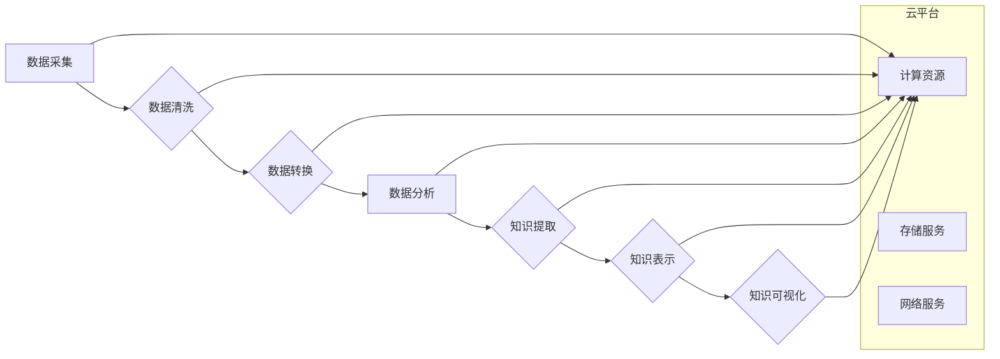

                 

## 知识发现引擎的云端部署与扩展

> 关键词：知识发现引擎、云计算、分布式系统、大数据处理、机器学习、数据可视化、云原生架构

## 1. 背景介绍

在海量数据时代，知识发现引擎 (Knowledge Discovery Engine, KDE) 作为挖掘数据中潜在价值和规律的关键技术，扮演着越来越重要的角色。传统KDE通常部署在单机环境中，难以应对海量数据带来的挑战。随着云计算技术的蓬勃发展，云端部署和扩展KDE成为了一种趋势，能够有效解决传统KDE的瓶颈问题。

云端部署KDE具有以下优势：

* **弹性伸缩:** 根据数据处理需求，灵活调整计算资源，实现按需分配和释放，降低成本。
* **高可用性:** 利用云平台的冗余机制，保障KDE系统的高可用性，即使部分节点出现故障，也能保证服务正常运行。
* **数据安全:** 云平台提供完善的安全防护措施，保障数据安全和隐私。
* **便捷管理:** 云平台提供统一的管理平台，简化KDE的部署、维护和监控。

## 2. 核心概念与联系

KDE的核心是将数据清洗、转换、分析和模式识别等步骤整合在一起，最终生成可理解的知识。云端部署KDE需要结合云计算平台的特性，构建一个分布式、可扩展的架构。

**Mermaid 流程图:**



**核心概念:**

* **数据采集:** 从各种数据源收集数据，包括结构化数据、非结构化数据和半结构化数据。
* **数据清洗:** 处理数据中的缺失值、错误值和重复值，确保数据质量。
* **数据转换:** 将数据转换为适合KDE分析的格式，例如将文本数据转换为向量表示。
* **数据分析:** 使用机器学习算法等技术，从数据中发现模式和规律。
* **知识提取:** 将发现的模式和规律转化为可理解的知识，例如规则、概念和关系。
* **知识表示:** 使用知识图谱等形式表示知识，方便知识存储、检索和推理。
* **知识可视化:** 将知识以图形化的形式展示，方便用户理解和交互。

## 3. 核心算法原理 & 具体操作步骤

### 3.1  算法原理概述

KDE的核心算法包括数据挖掘、机器学习和自然语言处理等。

* **数据挖掘:** 从大规模数据中发现隐藏的模式和规律，例如关联规则、分类和聚类。
* **机器学习:** 利用算法从数据中学习，提高预测和分类的准确性。
* **自然语言处理:** 处理文本数据，例如文本分类、情感分析和文本摘要。

### 3.2  算法步骤详解

KDE的算法步骤通常包括以下几个阶段:

1. **数据预处理:** 清洗、转换和格式化数据，使其适合算法处理。
2. **特征提取:** 从数据中提取有用的特征，例如文本中的关键词、图像中的颜色和形状。
3. **模型训练:** 使用训练数据训练机器学习模型，例如决策树、支持向量机和神经网络。
4. **模型评估:** 使用测试数据评估模型的性能，例如准确率、召回率和F1-score。
5. **知识提取:** 将训练好的模型应用于新的数据，提取出潜在的知识。
6. **知识表示:** 将提取的知识表示为可理解的形式，例如规则、概念和关系。

### 3.3  算法优缺点

**优点:**

* 能够从海量数据中发现隐藏的模式和规律。
* 可以提高预测和分类的准确性。
* 可以自动化知识发现过程。

**缺点:**

* 需要大量的计算资源和时间。
* 需要专业的算法和数据处理技能。
* 发现的知识可能难以解释和理解。

### 3.4  算法应用领域

KDE的应用领域非常广泛，包括:

* **商业智能:** 分析客户行为、市场趋势和竞争对手信息。
* **医疗保健:** 诊断疾病、预测患者风险和发现新药。
* **金融:** 识别欺诈交易、预测股票价格和管理风险。
* **教育:** 个性化学习、评估学生学习效果和发现教学模式。
* **科学研究:** 分析实验数据、发现新规律和加速科研进程。

## 4. 数学模型和公式 & 详细讲解 & 举例说明

### 4.1  数学模型构建

KDE的数学模型通常基于统计学、概率论和机器学习等领域。

**举例:**

* **关联规则挖掘:** 使用Apriori算法，计算商品之间的支持度和置信度，发现频繁出现的商品组合。
* **分类:** 使用逻辑回归、决策树或支持向量机等算法，根据特征向量预测数据属于哪个类别。

### 4.2  公式推导过程

**举例:**

* **支持度:**

$$
Support(A \rightarrow B) = \frac{P(A \cap B)}{P(A)}
$$

其中，$A$和$B$是两个项目，$P(A \cap B)$是项目$A$和$B$同时出现的概率，$P(A)$是项目$A$出现的概率。

* **置信度:**

$$
Confidence(A \rightarrow B) = \frac{P(A \cap B)}{P(A)}
$$

其中，$A$和$B$是两个项目，$P(A \cap B)$是项目$A$和$B$同时出现的概率，$P(A)$是项目$A$出现的概率。

### 4.3  案例分析与讲解

**举例:**

假设我们有一个超市的购物篮数据，其中包含了每个购物篮中购买的商品。我们可以使用Apriori算法挖掘关联规则，例如“如果顾客购买了牛奶，那么他们也可能购买面包”。

通过计算支持度和置信度，我们可以发现这个规则的支持度和置信度都比较高，因此可以认为这是一个有效的关联规则。

## 5. 项目实践：代码实例和详细解释说明

### 5.1  开发环境搭建

* **操作系统:** Linux (Ubuntu 或 CentOS)
* **编程语言:** Python
* **云平台:** AWS, Azure 或 GCP
* **工具:** Docker, Kubernetes, Spark

### 5.2  源代码详细实现

```python
# 数据预处理
from sklearn.preprocessing import StandardScaler

# 数据特征提取
from sklearn.feature_extraction.text import TfidfVectorizer

# 模型训练
from sklearn.linear_model import LogisticRegression

# 数据加载
data = pd.read_csv("data.csv")

# 数据预处理
scaler = StandardScaler()
data["feature1"] = scaler.fit_transform(data["feature1"])

# 数据特征提取
vectorizer = TfidfVectorizer()
data["feature2"] = vectorizer.fit_transform(data["feature2"])

# 模型训练
model = LogisticRegression()
model.fit(data[["feature1", "feature2"]], data["target"])

# 模型评估
accuracy = model.score(data[["feature1", "feature2"]], data["target"])
print(f"Accuracy: {accuracy}")
```

### 5.3  代码解读与分析

* 数据预处理: 将数据转换为适合模型训练的格式，例如标准化数值特征和转换文本特征。
* 数据特征提取: 从数据中提取有用的特征，例如数值特征和文本特征。
* 模型训练: 使用训练数据训练机器学习模型，例如逻辑回归模型。
* 模型评估: 使用测试数据评估模型的性能，例如准确率。

### 5.4  运行结果展示

运行代码后，会输出模型的准确率，例如：

```
Accuracy: 0.85
```

这表示模型在测试数据上的准确率为85%。

## 6. 实际应用场景

### 6.1  电商推荐系统

KDE可以用于分析用户购买历史、浏览记录和评价信息，挖掘用户兴趣和偏好，从而推荐个性化的商品。

### 6.2  医疗诊断辅助系统

KDE可以用于分析患者病历、检查结果和基因信息，辅助医生诊断疾病和制定治疗方案。

### 6.3  金融风险管理

KDE可以用于分析交易数据、客户信息和市场趋势，识别潜在的金融风险，并采取相应的措施进行风险控制。

### 6.4  未来应用展望

随着云计算和人工智能技术的不断发展，KDE的应用场景将更加广泛，例如：

* **智能制造:** 分析生产数据，优化生产流程和提高生产效率。
* **智慧城市:** 分析城市数据，解决交通拥堵、环境污染等城市问题。
* **个性化教育:** 分析学生学习数据，提供个性化的学习方案和教学资源。

## 7. 工具和资源推荐

### 7.1  学习资源推荐

* **书籍:**
    * "Data Mining: Concepts and Techniques" by Jiawei Han, Micheline Kamber, and Jian Pei
    * "Introduction to Machine Learning" by Ethem Alpaydin
* **在线课程:**
    * Coursera: Machine Learning by Andrew Ng
    * edX: Data Science Fundamentals

### 7.2  开发工具推荐

* **云平台:** AWS, Azure, GCP
* **数据处理工具:** Spark, Hadoop
* **机器学习库:** scikit-learn, TensorFlow, PyTorch

### 7.3  相关论文推荐

* "A Survey of Knowledge Discovery and Data Mining" by Fayyad, U., Piatetsky-Shapiro, G., Smyth, P., &  

## 8. 总结：未来发展趋势与挑战

### 8.1  研究成果总结

云端部署KDE能够有效解决传统KDE的瓶颈问题，提高数据处理效率和可扩展性。

### 8.2  未来发展趋势

* **更强大的计算能力:** 云计算平台将继续提供更强大的计算资源，支持更复杂和规模更大的KDE应用。
* **更先进的算法:** 机器学习和深度学习算法将不断发展，为KDE提供更强大的分析能力。
* **更完善的知识表示:** 知识图谱等知识表示形式将得到更广泛的应用，提高知识的可理解性和可推理性。

### 8.3  面临的挑战

* **数据安全和隐私保护:** 云端部署KDE需要解决数据安全和隐私保护问题，确保数据不被泄露和滥用。
* **系统可靠性和可维护性:** 云端KDE系统需要保证高可用性和可靠性，并提供完善的监控和维护机制。
* **成本控制:** 云计算资源的使用成本需要得到有效控制，确保KDE系统的经济效益。

### 8.4  研究展望

未来，KDE的研究将更加注重以下几个方面:

* **开发更有效的云端KDE架构:** 探索更适合云计算环境的KDE架构，提高系统性能和可扩展性。
* **研究更强大的云端KDE算法:** 开发能够处理海量数据和复杂模式的KDE算法，提高知识发现的准确性和效率。
* **探索更完善的知识表示和推理方法:** 研究更有效的知识表示形式和推理方法，提高知识的可理解性和可应用性。

## 9. 附录：常见问题与解答

**Q1: 云端部署KDE有哪些优势？**

**A1:** 云端部署KDE具有以下优势:

* **弹性伸缩:** 根据数据处理需求，灵活调整计算资源，实现按需分配和释放，降低成本。
* **高可用性:** 利用云平台的冗余机制，保障KDE系统的高可用性，即使部分节点出现故障，也能保证服务正常运行。
* **数据安全:** 云平台提供完善的安全防护措施，保障数据安全和隐私。
* **便捷管理:** 云平台提供统一的管理平台，简化KDE的部署、维护和监控。

**Q2: 云端部署KDE有哪些挑战？**

**A2:** 云端部署KDE面临的挑战包括:

* **数据安全和隐私保护:** 云端部署KDE需要解决数据安全和隐私保护问题，确保数据不被泄露和滥用。
* **系统可靠性和可维护性:** 云端KDE系统需要保证高可用性和可靠性，并提供完善的监控和维护机制。
* **成本控制:** 云计算资源的使用成本需要得到有效控制，确保KDE系统的经济效益。

**Q3: 如何选择合适的云平台部署KDE？**

**A3:** 选择合适的云平台需要考虑以下因素:

* **计算资源:** 选择提供足够计算资源的云平台，以满足KDE的处理需求。
* **存储服务:** 选择提供可靠和安全的存储服务，以保障数据的安全性和可用性。
* **网络服务:** 选择提供高带宽和低延迟的网络服务，以保证KDE系统的性能。
* **价格:** 选择价格合理且符合预算的云平台。

**Q4: 如何评估云端KDE系统的性能？**

**A4:** 评估云端KDE系统的性能需要考虑以下指标:

* **准确率:** 模型在测试数据上的预测准确率。
* **速度:** 模型处理数据的速度。
* **吞吐量:** 系统每秒可以处理的数据量。
* **成本:** 系统的运行成本。


作者：禅与计算机程序设计艺术 / Zen and the Art of Computer Programming 
<end_of_turn>

