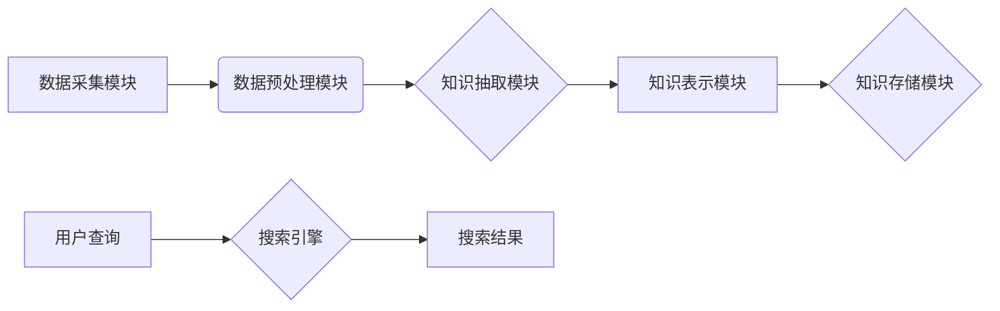

                 

## 知识发现引擎的实时搜索功能实现

> 关键词：知识发现引擎、实时搜索、全文检索、向量搜索、Elasticsearch、深度学习、自然语言处理

## 1. 背景介绍

随着海量数据的爆炸式增长，从海量数据中发现有价值的知识变得越来越重要。知识发现引擎 (Knowledge Discovery Engine, KDE) 正是专门用于从数据中挖掘知识的系统。传统的KDE通常依赖于预先定义的规则和模式，但随着数据的复杂性和多样性增加，这种方法越来越难以应对。实时搜索功能是KDE的重要组成部分，它能够帮助用户快速定位到与查询相关的知识。然而，实现实时搜索功能在海量数据场景下面临着巨大的挑战，包括数据存储、查询效率、结果准确性和用户体验等。

## 2. 核心概念与联系

### 2.1  知识发现引擎

知识发现引擎 (KDE) 是指能够从海量数据中自动发现、提取和表示有价值知识的系统。KDE通常包含以下几个核心模块：

* **数据采集模块:** 从各种数据源收集数据，包括结构化数据、半结构化数据和非结构化数据。
* **数据预处理模块:** 对收集到的数据进行清洗、转换和格式化，使其能够被后续模块处理。
* **知识抽取模块:** 利用自然语言处理 (NLP) 技术、机器学习 (ML) 技术等方法，从数据中抽取关键信息，如实体、关系、事件等。
* **知识表示模块:** 将抽取出的知识以结构化的形式表示，例如知识图谱、规则库等。
* **知识推理模块:** 利用逻辑推理、规则引擎等方法，从已有的知识中推导新的知识。
* **知识检索模块:** 提供用户查询和检索知识的功能，并根据用户的需求返回相关结果。

### 2.2  实时搜索

实时搜索是指在用户发出查询请求后，能够在极短的时间内返回结果的搜索技术。实时搜索的关键特点包括：

* **低延迟:** 查询响应时间极短，通常在几毫秒到几秒钟内。
* **高吞吐量:** 能够处理大量的查询请求，并保证每个请求都能得到快速响应。
* **高准确率:** 搜索结果与用户查询意图高度相关。

### 2.3  架构设计

为了实现知识发现引擎的实时搜索功能，需要结合多种技术，构建一个高效、灵活的架构。以下是一个可能的架构设计：



* **数据采集模块:** 从各种数据源收集数据。
* **数据预处理模块:** 对收集到的数据进行清洗、转换和格式化。
* **知识抽取模块:** 利用 NLP 技术、ML 技术等方法，从数据中抽取关键信息。
* **知识表示模块:** 将抽取出的知识以结构化的形式表示，例如知识图谱、规则库等。
* **知识存储模块:** 将知识表示存储在高效的数据库中，例如 Elasticsearch、Neo4j 等。
* **搜索引擎:** 提供用户查询和检索知识的功能，并根据用户的需求返回相关结果。
* **用户查询:** 用户通过搜索引擎输入查询词或短语。
* **搜索结果:** 搜索引擎根据查询词或短语，从知识存储模块中检索相关知识，并返回给用户。

## 3. 核心算法原理 & 具体操作步骤

### 3.1  算法原理概述

实时搜索算法的核心是快速定位到与用户查询相关的知识。常用的实时搜索算法包括：

* **全文检索:** 基于倒排索引技术，能够快速定位到包含特定关键词的文档。
* **向量搜索:** 将文本转换为向量，利用向量相似度计算找到与查询向量最相似的文档。
* **深度学习:** 利用深度神经网络，学习文本的语义表示，提高搜索结果的准确率。

### 3.2  算法步骤详解

**3.2.1 全文检索算法步骤:**

1. **数据预处理:** 对文本数据进行分词、去停用词、词干化等预处理操作。
2. **倒排索引构建:** 将每个词语作为索引，记录其在所有文档中出现的频率和位置信息。
3. **查询处理:** 将用户查询的关键词进行分词和预处理，构建查询索引。
4. **匹配查询:** 根据查询索引，从倒排索引中查找包含所有关键词的文档。
5. **排序结果:** 根据文档的关键词频率、位置信息等因素对匹配结果进行排序，返回用户。

**3.2.2 向量搜索算法步骤:**

1. **文本向量化:** 将文本数据转换为向量，可以使用 TF-IDF、Word2Vec、BERT 等方法。
2. **向量索引构建:** 将文本向量存储在高效的向量数据库中，例如 Faiss、Annoy 等。
3. **查询向量化:** 将用户查询的关键词进行向量化。
4. **相似度计算:** 利用余弦相似度、欧氏距离等方法计算查询向量与存储向量之间的相似度。
5. **排序结果:** 根据相似度排序，返回用户与查询最相关的文档。

### 3.3  算法优缺点

| 算法 | 优点 | 缺点 |
|---|---|---|
| 全文检索 | 查询速度快，易于实现 | 难以处理语义相似性，准确率有限 |
| 向量搜索 | 能够处理语义相似性，准确率高 | 向量化过程复杂，存储空间较大 |
| 深度学习 | 准确率高，能够学习复杂的语义关系 | 训练成本高，需要大量数据 |

### 3.4  算法应用领域

* **搜索引擎:** 用于快速定位到与用户查询相关的网页。
* **信息检索:** 用于从海量文档中检索相关信息。
* **推荐系统:** 用于根据用户的兴趣推荐相关商品或内容。
* **问答系统:** 用于回答用户的自然语言问题。

## 4. 数学模型和公式 & 详细讲解 & 举例说明

### 4.1  数学模型构建

**4.1.1 TF-IDF 模型:**

TF-IDF (Term Frequency-Inverse Document Frequency) 模型是一种常用的文本向量化方法。它将每个词语的权重计算为其在文档中的出现频率 (Term Frequency, TF) 与该词语在整个语料库中出现的频率 (Inverse Document Frequency, IDF) 的乘积。

* **TF:**  $TF(t,d) = \frac{f(t,d)}{ \sum_{t' \in d} f(t',d)}$

* **IDF:** $IDF(t) = log_e \frac{N}{df(t)}$

* **TF-IDF:** $TF-IDF(t,d) = TF(t,d) * IDF(t)$

其中：

* $t$ 表示词语
* $d$ 表示文档
* $f(t,d)$ 表示词语 $t$ 在文档 $d$ 中出现的频率
* $N$ 表示语料库中总的文档数
* $df(t)$ 表示词语 $t$ 在语料库中出现的文档数

**4.1.2 余弦相似度:**

余弦相似度是一种常用的向量相似度度量方法。它计算两个向量的夹角，夹角越小，相似度越高。

* **余弦相似度:** $sim(A,B) = \frac{A \cdot B}{||A|| ||B||}$

其中：

* $A$ 和 $B$ 表示两个向量
* $A \cdot B$ 表示两个向量的点积
* $||A||$ 和 $||B||$ 表示两个向量的模长

### 4.2  公式推导过程

**4.2.1 TF-IDF 模型推导:**

TF-IDF 模型的推导过程基于信息论的原理。

* **Term Frequency (TF):** 词语在文档中出现的频率越高，其重要性越高。
* **Inverse Document Frequency (IDF):** 词语在整个语料库中出现的频率越低，其重要性越高。

TF-IDF 模型将这两个因素结合起来，计算出每个词语在文档中的权重。

**4.2.2 余弦相似度推导:**

余弦相似度的推导过程基于向量几何的原理。

* **点积:** 向量点积可以表示两个向量之间的投影长度。
* **模长:** 向量的模长表示其长度。

余弦相似度通过计算两个向量的点积与两个向量的模长的乘积来衡量两个向量的夹角，从而衡量两个向量的相似度。

### 4.3  案例分析与讲解

**4.3.1 TF-IDF 模型案例:**

假设我们有一个语料库包含以下三个文档：

* 文档 1: "苹果是红色的水果"
* 文档 2: "香蕉是黄色的水果"
* 文档 3: "橘子是橙色的水果"

我们想要计算词语 "水果" 在每个文档中的 TF-IDF 值。

* **TF:**

    * 文档 1: TF("水果", 文档 1) = 1 / 4 = 0.25
    * 文档 2: TF("水果", 文档 2) = 1 / 3 = 0.33
    * 文档 3: TF("水果", 文档 3) = 1 / 3 = 0.33

* **IDF:**

    * IDF("水果") = log_e (3 / 3) = 0

* **TF-IDF:**

    * 文档 1: TF-IDF("水果", 文档 1) = 0.25 * 0 = 0
    * 文档 2: TF-IDF("水果", 文档 2) = 0.33 * 0 = 0
    * 文档 3: TF-IDF("水果", 文档 3) = 0.33 * 0 = 0

可以看到，由于 "水果" 在所有文档中都出现，因此其 IDF 值为 0，导致所有文档的 TF-IDF 值也为 0。

**4.3.2 余弦相似度案例:**

假设我们有两个向量：

* 向量 A: [1, 2, 3]
* 向量 B: [2, 4, 6]

我们可以计算这两个向量的余弦相似度：

* 点积: A ⋅ B = (1 * 2) + (2 * 4) + (3 * 6) = 2 + 8 + 18 = 28
* 模长: ||A|| = √(1² + 2² + 3²) = √14
* ||B|| = √(2² + 4² + 6²) = √56 = 2√14

* 余弦相似度: sim(A, B) = 28 / (√14 * 2√14) = 28 / 28 = 1

可以看到，两个向量的余弦相似度为 1，表示这两个向量完全相同。

## 5. 项目实践：代码实例和详细解释说明

### 5.1  开发环境搭建

* **操作系统:** Linux (Ubuntu 20.04)
* **编程语言:** Python 3.8
* **开发工具:** VS Code
* **库依赖:** Elasticsearch, scikit-learn, gensim

### 5.2  源代码详细实现

```python
# 安装依赖库
pip install elasticsearch scikit-learn gensim

# 连接 Elasticsearch
from elasticsearch import Elasticsearch
es = Elasticsearch([{'host': 'localhost', 'port': 9200}])

# 数据预处理
def preprocess_text(text):
    # 分词、去停用词、词干化等预处理操作
    # ...

# 文本向量化
def vectorize_text(text):
    # 使用 TF-IDF 或 Word2Vec 等方法进行向量化
    # ...

# 创建 Elasticsearch 索引
es.indices.create(index='knowledge_index',
                  body={
                      'mappings': {
                          'properties': {
                              'content': {
                                  'type': 'text'
                              }
                          }
                      }
                  })

# 将数据导入 Elasticsearch
for document in data:
    processed_text = preprocess_text(document['content'])
    vector = vectorize_text(processed_text)
    es.index(index='knowledge_index',
             body={'content': processed_text, 'vector': vector})

# 查询数据
query = {
    'query': {
        'match': {
            'content': '苹果'
        }
    }
}
results = es.search(index='knowledge_index', body=query)
print(results)
```

### 5.3  代码解读与分析

* **数据预处理:** 代码中定义了 `preprocess_text` 函数，用于对文本数据进行分词、去停用词、词干化等预处理操作。
* **文本向量化:** 代码中定义了 `vectorize_text` 函数，用于将文本数据转换为向量。可以使用 TF-IDF 或 Word2Vec 等方法进行向量化。
* **创建 Elasticsearch 索引:** 代码使用 `es.indices.create` 方法创建了一个名为 `knowledge_index` 的 Elasticsearch 索引。
* **导入数据:** 代码使用 `es.index` 方法将预处理后的文本数据和其向量表示导入 Elasticsearch 索引。
* **查询数据:** 代码使用 `es.search` 方法查询包含 "苹果" 的文档。

### 5.4  运行结果展示

运行代码后，将返回包含匹配结果的 JSON 数据。

## 6. 实际应用场景

### 6.1  知识库搜索

知识发现引擎可以构建一个知识库，并提供实时搜索功能，帮助用户快速定位到相关知识。例如，可以构建一个医学知识库，提供医生和患者查询疾病、药物等信息的平台。

### 6.2  智能问答系统

知识发现引擎可以结合自然语言处理技术，构建一个智能问答系统，能够理解用户的自然语言问题，并从知识库中找到答案。例如，可以构建一个客户服务机器人，能够回答用户的常见问题。

### 6.3  个性化推荐

知识发现引擎可以分析用户的行为数据，并根据用户的兴趣和偏好，提供个性化的推荐。例如，可以构建一个电商平台，推荐用户可能感兴趣的商品。

### 6.4  未来应用展望

随着人工智能技术的不断发展，知识发现引擎的实时搜索功能将有更广泛的应用场景，例如：

* **智能教育:** 提供个性化的学习内容推荐和智能答疑服务。
* **科学研究:** 帮助科学家快速发现和利用相关研究成果。
* **法律服务:** 提供法律法规查询和案例分析服务。

## 7. 工具和资源推荐

### 7.1  学习资源推荐

* **书籍:**
    * "Introduction to Information Retrieval" by Manning, Raghavan, and Schütze
    * "Speech and Language Processing" by Jurafsky and Martin
* **在线课程:**
    * Coursera: Natural Language Processing Specialization
    * edX: Artificial Intelligence
* **博客和网站:**
    * Towards Data Science
    * Analytics Vidhya

### 7.2  开发工具推荐

* **Elasticsearch:** 高性能的搜索和分析引擎
* **Faiss:** 高效的向量搜索库
* **Annoy:** 快速的近似最近邻搜索库
* **Gensim:** 用于主题建模和词向量训练的 Python 库
* **Scikit-learn:** 用于机器学习的 Python 库

### 7.3  相关论文推荐

* "BERT: Pre-training of Deep Bidirectional Transformers for Language Understanding"
* "Efficient Vector Search with Annoy"
* "Learning Word Vectors for Semantic Analysis"

## 8. 总结：未来发展趋势与挑战

### 8.1  研究成果总结

知识发现引擎的实时搜索功能已经取得了显著的进展，能够快速、准确地定位到与用户查询相关的知识。

### 8.2  未来发展趋势

* **更强大的深度学习模型:** 深度学习模型的不断发展将进一步提高知识发现引擎的搜索准确率和效率。
* **多模态搜索:** 将文本、图像、音频等多种数据类型融合在一起，实现更全面的知识搜索。
* **个性化搜索:** 基于用户的行为数据和偏好，提供个性化的搜索结果。

### 8.3  面临的挑战

* **海量数据处理:** 海量数据的存储、处理和分析仍然是一个挑战。
* **语义理解:** 理解用户的复杂语义需求仍然是一个难题。
* **数据隐私保护:** 如何保护用户数据隐私是一个重要的挑战。

### 8.4  研究展望

未来，知识发现引擎的实时搜索功能将朝着更智能、更个性化、更安全的方向发展，为用户提供更便捷、更精准的知识获取服务。

## 9. 附录：常见问题与解答

### 9.1  Q&A

* **Q:** 如何选择合适的文本向量化方法？
* **A:** 选择文本向量化方法需要根据具体应用场景和数据特点进行选择。TF-IDF 适用于文本分类、关键词提取等任务，Word2Vec 适用于语义相似度计算、文本聚类等任务。

* **Q:** 如何提高搜索结果的准确率？
* **A:** 可以通过数据预处理、选择合适的搜索算法、使用深度学习模型等方法提高搜索结果的准确率。

* **Q:** 如何保护用户数据隐私？
* **A:** 可以采用数据脱敏、加密、匿名化等技术保护用户数据隐私。


作者：禅与计算机程序设计艺术 / Zen and the Art of Computer Programming


<end_of_turn>


