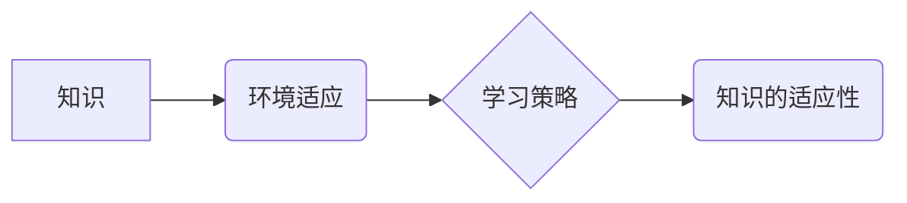

                 

## 知识的适应性：在变化环境中的学习策略

> 关键词：机器学习、深度学习、知识图谱、环境适应、学习策略、迁移学习、泛化能力

## 1. 背景介绍

在瞬息万变的科技时代，知识的价值正在以惊人的速度贬值。新技术层出不穷，旧知识迅速过时。面对这种快速变化的环境，如何让知识保持其有效性和适应性，成为一个至关重要的课题。

传统机器学习模型通常依赖于大量的标注数据进行训练，而这些数据往往是特定于某个特定环境的。当环境发生变化时，模型的性能会急剧下降，甚至失效。因此，如何让机器学习模型具备适应性，能够在变化的环境中持续学习和进化，成为人工智能领域亟待解决的关键问题。

## 2. 核心概念与联系

**2.1 知识的适应性**

知识的适应性是指知识在面对环境变化时，能够保持其有效性和适用性，并能够灵活地调整和更新以适应新环境的能力。

**2.2 环境适应**

环境适应是指系统能够识别和理解环境的变化，并根据这些变化调整其行为和策略，以保持其在环境中的稳定性和有效性。

**2.3 学习策略**

学习策略是指系统在学习过程中所采用的方法和规则，它决定了系统如何获取、处理和利用知识，以及如何适应环境变化。

**2.4 核心概念关系图**



## 3. 核心算法原理 & 具体操作步骤

**3.1 算法原理概述**

迁移学习是一种机器学习范式，它旨在利用已学习到的知识来解决新的、相关但不同的任务。迁移学习的核心思想是，在某些情况下，从一个任务（源任务）学习到的知识可以被转移到另一个任务（目标任务）中，从而提高目标任务的学习效率和性能。

**3.2 算法步骤详解**

1. **源任务训练:** 在源任务上训练一个机器学习模型，并获得一个预训练模型。
2. **特征提取:** 将预训练模型的特征提取层作为目标任务的特征提取器。
3. **目标任务微调:** 在目标任务上使用预训练模型的特征提取器，并对模型的分类器或回归器进行微调。

**3.3 算法优缺点**

**优点:**

* 能够利用已有知识，提高学习效率和性能。
* 在数据有限的情况下，可以有效地解决目标任务。

**缺点:**

* 需要找到与目标任务相关的源任务。
* 源任务和目标任务之间存在一定的差异，可能会导致知识迁移效果不佳。

**3.4 算法应用领域**

* 自然语言处理
*计算机视觉
*推荐系统
*医疗诊断

## 4. 数学模型和公式 & 详细讲解 & 举例说明

**4.1 数学模型构建**

假设源任务和目标任务分别为 $S$ 和 $T$，源任务的训练数据为 $D_S$，目标任务的训练数据为 $D_T$。

迁移学习的目标是利用 $D_S$ 上训练的模型 $f_S$ 来提高 $D_T$ 上的模型 $f_T$ 的性能。

**4.2 公式推导过程**

迁移学习的损失函数通常由源任务损失和目标任务损失两部分组成：

$$L = \lambda L_S + (1-\lambda) L_T$$

其中：

* $L_S$ 是源任务的损失函数。
* $L_T$ 是目标任务的损失函数。
* $\lambda$ 是权重参数，用于平衡源任务和目标任务的损失。

**4.3 案例分析与讲解**

例如，在图像分类任务中，我们可以使用 ImageNet 数据集训练一个预训练模型 $f_S$。然后，将 $f_S$ 的特征提取层作为目标任务的特征提取器，并在目标任务的训练数据上进行微调，从而提高目标任务的分类性能。

## 5. 项目实践：代码实例和详细解释说明

**5.1 开发环境搭建**

* Python 3.7+
* TensorFlow 2.0+
* PyTorch 1.0+

**5.2 源代码详细实现**

```python
# 使用 TensorFlow 实现迁移学习
import tensorflow as tf

# 加载预训练模型
base_model = tf.keras.applications.ResNet50(weights='imagenet', include_top=False)

# 冻结预训练模型的权重
base_model.trainable = False

# 添加新的分类层
inputs = tf.keras.Input(shape=(224, 224, 3))
x = base_model(inputs, training=False)
x = tf.keras.layers.GlobalAveragePooling2D()(x)
outputs = tf.keras.layers.Dense(10, activation='softmax')(x)

# 创建模型
model = tf.keras.Model(inputs=inputs, outputs=outputs)

# 编译模型
model.compile(optimizer='adam',
              loss='categorical_crossentropy',
              metrics=['accuracy'])

# 训练模型
model.fit(train_data, train_labels, epochs=10)
```

**5.3 代码解读与分析**

* 首先，我们加载一个预训练的 ResNet50 模型，并冻结其权重，防止其在微调过程中被更新。
* 然后，我们添加一个新的分类层，将预训练模型的特征映射到目标任务的类别数。
* 最后，我们编译和训练模型，使用目标任务的训练数据进行微调。

**5.4 运行结果展示**

在训练完成后，我们可以使用测试数据评估模型的性能，并观察其在目标任务上的准确率。

## 6. 实际应用场景

**6.1 自然语言处理**

* 使用预训练语言模型（如 BERT、GPT-3）来解决文本分类、情感分析、机器翻译等任务。

**6.2 计算机视觉**

* 使用预训练图像分类模型（如 ResNet、Inception）来解决目标检测、图像分割、图像识别等任务。

**6.3 推荐系统**

* 使用预训练用户行为模型来预测用户对商品的兴趣，并提供个性化的推荐。

**6.4 医疗诊断**

* 使用预训练医学图像模型来辅助医生诊断疾病，提高诊断准确率。

**6.5 未来应用展望**

随着迁移学习技术的不断发展，其应用场景将更加广泛，例如：

* 自动驾驶
* 人机交互
* 智慧城市

## 7. 工具和资源推荐

**7.1 学习资源推荐**

* **书籍:**

    * 《深度学习》 by Ian Goodfellow, Yoshua Bengio, and Aaron Courville
    * 《迁移学习》 by Sinno Jernite

* **在线课程:**

    * Coursera: Machine Learning by Andrew Ng
    * Udacity: Deep Learning Nanodegree

**7.2 开发工具推荐**

* TensorFlow
* PyTorch
* Keras

**7.3 相关论文推荐**

* "Transfer Learning" by Sinno Jernite
* "Domain Adaptation for Machine Learning" by Long et al.

## 8. 总结：未来发展趋势与挑战

**8.1 研究成果总结**

迁移学习在机器学习领域取得了显著的进展，能够有效地利用已有知识，提高学习效率和性能。

**8.2 未来发展趋势**

* **更有效的迁移学习算法:** 研究更有效的迁移学习算法，能够更好地解决源任务和目标任务之间的差异。
* **自动化迁移学习:** 研究自动化迁移学习方法，能够自动选择合适的源任务和迁移策略。
* **跨模态迁移学习:** 研究跨模态迁移学习方法，能够将不同模态的知识进行迁移。

**8.3 面临的挑战**

* **数据获取和标注:** 迁移学习需要大量的标注数据，获取和标注这些数据成本较高。
* **任务相关性:** 找到与目标任务相关的源任务是一个挑战。
* **模型解释性:** 迁移学习模型的解释性较差，难以理解模型的决策过程。

**8.4 研究展望**

未来，迁移学习将继续朝着更有效、更自动化、更跨模态的方向发展，并将应用于更多领域，推动人工智能技术的进步。

## 9. 附录：常见问题与解答

**9.1 如何选择合适的源任务？**

选择合适的源任务是迁移学习的关键。一般来说，源任务和目标任务应该具有以下相似性：

* 数据分布
* 任务类型
* 知识结构

**9.2 如何评估迁移学习的效果？**

迁移学习的效果可以通过目标任务的性能指标来评估，例如准确率、召回率、F1-score等。

**9.3 迁移学习的应用场景有哪些？**

迁移学习的应用场景非常广泛，包括自然语言处理、计算机视觉、推荐系统、医疗诊断等领域。


作者：禅与计算机程序设计艺术 / Zen and the Art of Computer Programming 
<end_of_turn>

