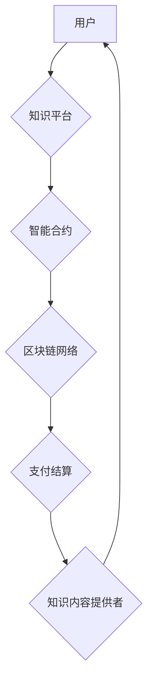

                 

## 知识经济下知识付费的区块链支付与结算方案

> 关键词：知识付费、区块链、支付结算、智能合约、去中心化、安全、透明

## 1. 背景介绍

知识经济时代，知识成为重要的生产要素，知识付费模式应运而生。知识付费是指以知识、技能、经验等为核心内容，通过付费的方式获取知识和服务。随着互联网的发展和移动互联网的普及，知识付费市场规模不断扩大，用户对知识获取方式和支付方式的需求也日益多样化。

传统知识付费模式存在一些问题，例如：

* **支付结算环节复杂:**  中间环节多，手续费高，支付效率低。
* **信息安全问题:**  用户支付信息容易泄露，存在安全风险。
* **平台垄断问题:**  平台掌握用户和内容创作者的双重资源，容易形成垄断。

区块链技术作为一种去中心化、安全、透明的分布式账本技术，为解决上述问题提供了新的解决方案。

## 2. 核心概念与联系

**2.1 核心概念**

* **知识付费:** 以知识、技能、经验等为核心内容，通过付费的方式获取知识和服务。
* **区块链:**  一种去中心化的、分布式、公开透明的账本技术，能够记录和验证交易信息。
* **智能合约:**  基于区块链技术的自动执行合约，能够自动执行预先定义的协议。

**2.2 架构流程图**



**2.3 联系分析**

区块链技术可以应用于知识付费的支付结算环节，实现以下功能：

* **去中心化支付:**  用户可以直接与知识内容提供者进行交易，无需通过第三方平台。
* **安全可靠:**  区块链技术的加密和分布式特性，能够保证交易安全可靠。
* **透明可溯:**  所有交易信息都记录在区块链上，可以公开透明地查看。
* **智能化结算:**  智能合约可以自动执行支付结算协议，提高效率。

## 3. 核心算法原理 & 具体操作步骤

**3.1 算法原理概述**

区块链支付结算方案的核心算法原理是基于智能合约的自动执行机制。

* **用户发起支付请求:**  用户通过知识平台发起支付请求，并指定支付金额和接收地址。
* **智能合约验证交易:**  智能合约会验证用户支付信息和知识内容提供者的身份信息，确保交易合法有效。
* **区块链网络确认交易:**  如果交易合法有效，智能合约会将交易信息广播到区块链网络，等待网络节点确认。
* **自动执行支付结算:**  一旦交易被区块链网络确认，智能合约会自动执行支付结算协议，将支付金额转账到知识内容提供者的账户。

**3.2 算法步骤详解**

1. **用户注册:** 用户在知识平台注册账号，并绑定自己的数字钱包地址。
2. **选择知识内容:** 用户选择自己想要购买的知识内容，并查看价格和支付方式。
3. **发起支付请求:** 用户点击支付按钮，输入支付金额和接收地址，并确认支付信息。
4. **智能合约验证:** 智能合约会根据预先设定的规则，验证用户支付信息和知识内容提供者的身份信息。
5. **区块链网络确认:**  如果验证通过，智能合约会将交易信息广播到区块链网络，等待网络节点确认。
6. **自动执行支付结算:**  一旦交易被区块链网络确认，智能合约会自动执行支付结算协议，将支付金额转账到知识内容提供者的账户。
7. **交易记录:**  所有交易信息都记录在区块链上，可以公开透明地查看。

**3.3 算法优缺点**

**优点:**

* **去中心化:**  无需第三方平台，用户和知识内容提供者直接交易。
* **安全可靠:**  区块链技术的加密和分布式特性，保证交易安全可靠。
* **透明可溯:**  所有交易信息都记录在区块链上，可以公开透明地查看。
* **智能化结算:**  智能合约自动执行支付结算协议，提高效率。

**缺点:**

* **技术复杂:**  区块链技术相对复杂，需要一定的技术门槛。
* **网络延迟:**  区块链网络的确认时间相对较长，可能会影响支付效率。
* **监管挑战:**  区块链技术的去中心化特性，也带来监管挑战。

**3.4 算法应用领域**

* **知识付费平台:**  实现知识付费的支付结算，提高效率和安全性。
* **在线教育:**  在线课程的购买和支付，保障知识产权。
* **数字内容交易:**  数字音乐、书籍、游戏等内容的交易，实现版权保护。
* **数据交易:**  数据交易的支付结算，保障数据安全和隐私。

## 4. 数学模型和公式 & 详细讲解 & 举例说明

**4.1 数学模型构建**

区块链支付结算方案可以抽象为一个状态机模型，其中每个状态代表一个交易阶段，状态之间的转换由交易规则和智能合约触发。

**状态:**

* **待支付:**  用户发起支付请求，等待智能合约验证。
* **验证中:**  智能合约正在验证用户支付信息和知识内容提供者的身份信息。
* **待确认:**  交易信息已广播到区块链网络，等待网络节点确认。
* **已确认:**  交易被区块链网络确认，支付结算完成。

**状态转换规则:**

* 待支付 -> 验证中:  用户发起支付请求，并满足智能合约的验证条件。
* 验证中 -> 待确认:  智能合约验证通过，交易信息广播到区块链网络。
* 待确认 -> 已确认:  交易被区块链网络确认。

**4.2 公式推导过程**

* **交易费用计算公式:**

$$
Fee = TransactionSize * FeeRate
$$

其中:

* **TransactionSize:**  交易信息的大小，以字节为单位。
* **FeeRate:**  区块链网络的交易费用率，以字节为单位的费用。

* **支付金额确认公式:**

$$
ConfirmedAmount = RequestedAmount - Fee
$$

其中:

* **RequestedAmount:**  用户请求支付的金额。
* **Fee:**  交易费用。

**4.3 案例分析与讲解**

假设用户A想要购买价值100美元的在线课程，区块链网络的交易费用率为0.01美元/字节，交易信息大小为1000字节。

* 交易费用:  Fee = 1000 * 0.01 = 10美元
* 确认支付金额:  ConfirmedAmount = 100 - 10 = 90美元

因此，用户A最终支付90美元，知识内容提供者收到90美元的支付金额。

## 5. 项目实践：代码实例和详细解释说明

**5.1 开发环境搭建**

* **区块链平台:**  选择一个支持智能合约的区块链平台，例如以太坊、EOS等。
* **开发工具:**  使用 Solidity 或其他支持区块链平台的编程语言进行开发。
* **IDE:**  使用 Remix、Truffle 等开发工具进行代码编写和调试。

**5.2 源代码详细实现**

```solidity
pragma solidity ^0.8.0;

contract KnowledgePayment {

    address public owner;

    constructor() {
        owner = msg.sender;
    }

    function payForKnowledge(address _to, uint256 _amount) public payable {
        require(msg.value == _amount, "Invalid payment amount");
        payable(_to).transfer(_amount);
    }
}
```

**5.3 代码解读与分析**

* **pragma solidity ^0.8.0;:**  指定合约使用的 Solidity 版本。
* **contract KnowledgePayment { ... }:**  定义一个名为 KnowledgePayment 的智能合约。
* **address public owner;:**  定义一个公开的变量，存储合约所有者的地址。
* **constructor() { ... }:**  合约构造函数，初始化合约所有者地址。
* **function payForKnowledge(address _to, uint256 _amount) public payable { ... }:**  定义一个名为 payForKnowledge 的公共函数，用于支付知识内容。
    * **address _to:**  接收支付金额的地址。
    * **uint256 _amount:**  支付金额。
    * **public payable:**  函数是公开的，并且可以接收以太坊支付。
* **require(msg.value == _amount, "Invalid payment amount");:**  验证用户支付的金额是否与请求的金额相等。
* **payable(_to).transfer(_amount);:**  将支付金额转账到接收地址。

**5.4 运行结果展示**

当用户调用 payForKnowledge 函数进行支付时，智能合约会自动执行支付结算协议，将支付金额转账到知识内容提供者的账户。

## 6. 实际应用场景

**6.1 在线教育平台**

* **课程购买:**  学生可以通过区块链支付平台购买在线课程，保障知识产权和支付安全。
* **证书颁发:**  在线教育平台可以利用区块链技术颁发数字证书，确保证书的真实性和不可篡改性。

**6.2 数字内容交易平台**

* **音乐、书籍、游戏等内容交易:**  用户可以通过区块链支付平台购买数字内容，保障版权和支付安全。
* **内容创作者收益分配:**  区块链技术可以帮助内容创作者更公平地获得收益，减少中间环节的抽成。

**6.3 数据交易平台**

* **数据交易支付:**  用户可以通过区块链支付平台购买数据，保障数据安全和隐私。
* **数据交易协议执行:**  智能合约可以自动执行数据交易协议，确保交易的公平性和透明性。

**6.4 未来应用展望**

区块链支付结算方案在知识经济下具有广阔的应用前景，未来可能应用于以下领域:

* **知识产权保护:**  利用区块链技术记录知识产权信息，防止知识盗窃和侵权。
* **知识共享平台:**  构建去中心化的知识共享平台，促进知识流通和传播。
* **个性化学习:**  利用区块链技术实现个性化学习，根据用户的学习需求提供定制化的知识内容。

## 7. 工具和资源推荐

**7.1 学习资源推荐**

* **区块链技术入门书籍:**  《区块链：从入门到实践》、《Mastering Bitcoin》
* **智能合约开发教程:**  Ethereum.org 智能合约开发教程、Truffle Suite 官方文档
* **区块链技术社区:**  Ethereum Stack Exchange、BitcoinTalk

**7.2 开发工具推荐**

* **Remix:**  在线 Solidity 开发环境
* **Truffle Suite:**  区块链开发工具套件
* **Ganache:**  本地区块链测试环境

**7.3 相关论文推荐**

* **Bitcoin: A Peer-to-Peer Electronic Cash System:**  Satoshi Nakamoto
* **Ethereum: A Secure Decentralised General-Purpose Platform:**  Gavin Wood

## 8. 总结：未来发展趋势与挑战

**8.1 研究成果总结**

区块链支付结算方案为知识付费提供了新的解决方案，具有去中心化、安全、透明等优势。

**8.2 未来发展趋势**

* **技术成熟度提升:**  区块链技术将不断成熟，支付结算效率和安全性将进一步提高。
* **应用场景拓展:**  区块链支付结算方案将应用于更多领域，例如知识产权保护、知识共享等。
* **监管政策完善:**  各国政府将逐步完善区块链技术的监管政策，促进其健康发展。

**8.3 面临的挑战**

* **技术复杂性:**  区块链技术相对复杂，需要一定的技术门槛。
* **网络延迟:**  区块链网络的确认时间相对较长，可能会影响支付效率。
* **监管挑战:**  区块链技术的去中心化特性，也带来监管挑战。

**8.4 研究展望**

未来研究方向包括:

* **提高支付结算效率:**  探索新的区块链技术和算法，提高支付结算效率。
* **降低技术门槛:**  开发更易于使用的区块链开发工具和平台，降低技术门槛。
* **完善监管机制:**  研究区块链技术的监管机制，促进其健康发展。

## 9. 附录：常见问题与解答

**9.1 如何选择合适的区块链平台?**

选择合适的区块链平台需要考虑以下因素:

* **交易费用:**  不同区块链平台的交易费用不同，需要选择费用较低的平台。
* **网络速度:**  不同区块链平台的网络速度不同，需要选择网络速度较快的平台。
* **智能合约功能:**  需要选择支持智能合约的平台。
* **社区支持:**  选择社区活跃、技术支持完善的平台。

**9.2 如何开发区块链支付结算方案?**

开发区块链支付结算方案需要以下步骤:

* **选择区块链平台:**  根据需求选择合适的区块链平台。
* **学习 Solidity 或其他支持区块链平台的编程语言:**  掌握智能合约开发知识。
* **设计智能合约:**  设计支付结算协议和智能合约代码。
* **部署智能合约:**  将智能合约部署到区块链网络。
* **开发前端界面:**  开发用户交互的支付界面。

**9.3 区块链支付结算方案的安全性和可靠性如何保证?**

区块链技术的加密和分布式特性，能够保证交易的安全性和可靠性。

* **加密:**  区块链网络使用加密算法保护交易信息，防止数据篡改。
* **分布式:**  交易信息存储在多个节点上，即使一个节点被攻击，也不会影响整个网络的正常运行。


作者：禅与计算机程序设计艺术 / Zen and the Art of Computer Programming 
<end_of_turn>

