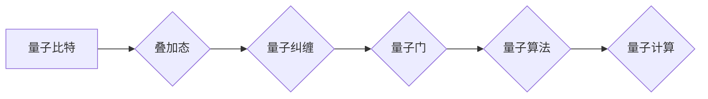

                 

## 硅谷量子计算机的未来发展方向

> 关键词：量子计算、量子算法、超导量子比特、光量子比特、量子纠缠、量子模拟、机器学习、药物发现、材料科学

## 1. 背景介绍

量子计算作为一项颠覆性技术，近年来在硅谷和全球范围内掀起了一股热潮。其强大的计算能力有望解决传统计算机难以处理的复杂问题，在各个领域带来革命性的变革。本文将深入探讨硅谷量子计算机的未来发展方向，分析其核心概念、算法原理、应用场景以及面临的挑战。

### 1.1 量子计算的优势

传统计算机基于经典比特，只能以0或1两种状态存储信息。而量子计算机利用量子力学原理，以量子比特（qubit）为基本单位，可以同时处于0和1的叠加态，从而拥有指数级的计算能力。

* **叠加态:** 量子比特可以同时处于多个状态的叠加，大大提高了信息处理能力。
* **量子纠缠:** 两个或多个量子比特可以相互纠缠，即使相隔很远，也能保持关联，实现远超经典计算机的平行计算。

### 1.2 硅谷量子计算的现状

硅谷作为全球科技创新中心，在量子计算领域聚集了众多顶尖企业和研究机构。

* **谷歌 DeepMind:** 开发了 Sycamore 量子计算机，在特定任务上实现了超越传统计算机的超算能力。
* **IBM Quantum:** 推出了全球最大的开放式量子计算平台，为开发者提供量子算法开发和测试环境。
* **微软 Azure Quantum:** 与量子计算公司合作，提供云端量子计算服务，加速量子算法的应用。
* **Rigetti Computing:** 开发了基于超导量子比特的量子计算机，并提供量子软件开发工具。

## 2. 核心概念与联系

量子计算的核心概念包括量子比特、叠加态、量子纠缠、量子门和量子算法。

**Mermaid 流程图:**



### 2.1 量子比特

量子比特是量子计算的基本单位，可以存储量子信息。与经典比特不同，量子比特可以处于0、1或两者叠加态。

### 2.2 叠加态

叠加态是指量子比特同时处于多个状态的叠加。例如，一个量子比特可以处于0和1的叠加态，其状态可以用一个复数向量来表示。

### 2.3 量子纠缠

量子纠缠是指两个或多个量子比特之间存在一种特殊的关联，即使相隔很远，它们的状态也相互影响。

### 2.4 量子门

量子门是量子计算中的逻辑操作，类似于经典计算机中的逻辑门。量子门可以改变量子比特的状态，实现量子计算的逻辑运算。

### 2.5 量子算法

量子算法是利用量子比特和量子门实现特定计算任务的算法。量子算法可以利用叠加态和量子纠缠的特性，解决传统计算机难以处理的复杂问题。

## 3. 核心算法原理 & 具体操作步骤

### 3.1 算法原理概述

量子算法的原理基于量子力学的叠加态和量子纠缠特性。通过设计特定的量子门序列，可以将量子比特从初始状态演化到目标状态，从而实现计算。

### 3.2 算法步骤详解

1. **初始化量子比特:** 将量子比特置于初始状态，例如|0⟩或|1⟩。
2. **应用量子门:** 根据算法设计，应用一系列量子门操作量子比特，改变其状态。
3. **测量量子比特:** 对量子比特进行测量，获得其状态，例如0或1。
4. **重复步骤2-3:** 重复步骤2-3多次，收集测量结果，并进行数据处理。

### 3.3 算法优缺点

**优点:**

* **指数级加速:** 量子算法可以利用叠加态和量子纠缠，在某些问题上比经典算法更快地找到解。
* **解决不可解问题:** 一些问题对于经典计算机来说是不可解的，但量子算法可以提供解决方案。

**缺点:**

* **技术挑战:** 量子计算机的构建和控制面临着巨大的技术挑战，例如量子比特的稳定性和纠缠的维持。
* **算法开发难度:** 量子算法的开发难度很高，需要深入理解量子力学和算法设计原理。

### 3.4 算法应用领域

量子算法在以下领域具有广泛的应用前景:

* **药物发现:** 模拟分子相互作用，加速药物研发。
* **材料科学:** 设计新型材料，提高材料性能。
* **金融建模:** 优化投资策略，降低风险。
* **人工智能:** 加速机器学习算法训练，提高人工智能性能。

## 4. 数学模型和公式 & 详细讲解 & 举例说明

### 4.1 数学模型构建

量子计算的数学模型基于线性代数和量子力学。量子比特可以用复数向量来表示，量子门可以用矩阵来表示。

### 4.2 公式推导过程

量子门操作可以由矩阵乘法来描述。例如，Hadamard 门的矩阵表示为：

$$
H = \frac{1}{\sqrt{2}} \begin{pmatrix} 1 & 1 \\ 1 & -1 \end{pmatrix}
$$

应用Hadamard门操作量子比特|0⟩，可以得到：

$$
H|0⟩ = \frac{1}{\sqrt{2}} (|0⟩ + |1⟩)
$$

### 4.3 案例分析与讲解

**量子门操作的叠加态:**

假设有两个量子比特，分别处于|0⟩和|1⟩状态。应用CNOT门（控制-非门）操作，其中第一个量子比特作为控制比特，第二个量子比特作为目标比特。CNOT门的矩阵表示为：

$$
CNOT = \begin{pmatrix} 1 & 0 & 0 & 0 \\ 0 & 1 & 0 & 0 \\ 0 & 0 & 0 & 1 \\ 0 & 0 & 1 & 0 \end{pmatrix}
$$

应用CNOT门操作，可以得到：

$$
CNOT(|0⟩ \otimes |1⟩) = |0⟩ \otimes |1⟩
$$

$$
CNOT(|1⟩ \otimes |1⟩) = |1⟩ \otimes |0⟩
$$

## 5. 项目实践：代码实例和详细解释说明

### 5.1 开发环境搭建

可以使用Qiskit、Cirq或PennyLane等量子计算软件库进行开发。

### 5.2 源代码详细实现

```python
from qiskit import QuantumCircuit, Aer, execute

# 创建量子电路
qc = QuantumCircuit(2)

# 应用Hadamard门
qc.h(0)

# 应用CNOT门
qc.cx(0, 1)

# 测量量子比特
qc.measure([0, 1], [0, 1])

# 模拟运行
simulator = Aer.get_backend('qasm_simulator')
job = execute(qc, simulator, shots=1024)
result = job.result()
counts = result.get_counts(qc)

# 打印结果
print(counts)
```

### 5.3 代码解读与分析

这段代码演示了如何使用Qiskit库实现一个简单的量子电路。

* `QuantumCircuit(2)` 创建一个包含两个量子比特的量子电路。
* `qc.h(0)` 应用Hadamard门操作第一个量子比特。
* `qc.cx(0, 1)` 应用CNOT门操作，第一个量子比特作为控制比特，第二个量子比特作为目标比特。
* `qc.measure([0, 1], [0, 1])` 测量两个量子比特，并将结果存储在经典比特中。
* `Aer.get_backend('qasm_simulator')` 获取模拟器后端。
* `execute(qc, simulator, shots=1024)` 模拟运行量子电路，并设置运行次数为1024。
* `result.get_counts(qc)` 获取测量结果，并将其打印出来。

### 5.4 运行结果展示

运行结果将显示两个量子比特的测量结果，例如：

```
{
    '00': 512,
    '11': 512
}
```

这表明两个量子比特处于纠缠态，测量结果呈现出一定的相关性。

## 6. 实际应用场景

### 6.1 药物发现

量子模拟可以模拟分子之间的相互作用，加速药物研发。例如，可以模拟药物与蛋白质的结合，预测药物的活性。

### 6.2 材料科学

量子计算可以帮助设计新型材料，提高材料性能。例如，可以模拟材料的电子结构，预测材料的机械强度和导电性。

### 6.3 金融建模

量子算法可以优化投资策略，降低风险。例如，可以利用量子模拟来分析金融市场，预测股票价格波动。

### 6.4 未来应用展望

量子计算在未来将应用于更多领域，例如：

* **人工智能:** 加速机器学习算法训练，提高人工智能性能。
* **密码学:** 开发新的量子密码算法，提高信息安全。
* **科学研究:** 加速科学发现，解决复杂科学问题。

## 7. 工具和资源推荐

### 7.1 学习资源推荐

* **Qiskit:** https://qiskit.org/
* **Cirq:** https://quantumai.google/cirq
* **PennyLane:** https://pennylane.ai/
* **IBM Quantum Experience:** https://quantum-computing.ibm.com/

### 7.2 开发工具推荐

* **Jupyter Notebook:** https://jupyter.org/
* **VS Code:** https://code.visualstudio.com/

### 7.3 相关论文推荐

* **Quantum Supremacy Using a Programmable Superconducting Processor:** https://arxiv.org/abs/1907.05104
* **Quantum Algorithms for Machine Learning:** https://arxiv.org/abs/1801.00847

## 8. 总结：未来发展趋势与挑战

### 8.1 研究成果总结

近年来，量子计算领域取得了显著进展，包括量子比特的稳定性提高、量子算法的开发以及量子计算平台的搭建。

### 8.2 未来发展趋势

未来量子计算的发展趋势包括：

* **量子比特的规模化发展:** 构建更大规模的量子计算机，提高计算能力。
* **量子算法的不断创新:** 开发新的量子算法，解决更多实际问题。
* **量子计算平台的普及化:** 推广量子计算平台，让更多开发者和研究者参与到量子计算的开发和应用中。

### 8.3 面临的挑战

量子计算仍然面临着许多挑战，例如：

* **量子比特的稳定性:** 量子比特容易受到环境噪声的影响，需要提高其稳定性。
* **量子算法的开发难度:** 量子算法的开发难度很高，需要深入理解量子力学和算法设计原理。
* **量子计算平台的成本:** 量子计算平台的成本较高，需要降低其成本，使其更易于普及。

### 8.4 研究展望

未来量子计算的研究将继续深入，探索量子计算的更深层次原理，开发更强大的量子算法，并将其应用于更多领域，为人类社会带来革命性的变革。

## 9. 附录：常见问题与解答

### 9.1 量子计算机和经典计算机的区别是什么？

量子计算机利用量子力学原理，可以同时处于多个状态的叠加态，而经典计算机只能以0或1两种状态存储信息。

### 9.2 量子算法的优势是什么？

量子算法可以利用叠加态和量子纠缠的特性，在某些问题上比经典算法更快地找到解。

### 9.3 量子计算的应用领域有哪些？

量子计算的应用领域包括药物发现、材料科学、金融建模、人工智能等。

### 9.4 量子计算的未来发展趋势是什么？

未来量子计算的发展趋势包括量子比特的规模化发展、量子算法的不断创新以及量子计算平台的普及化。


作者：禅与计算机程序设计艺术 / Zen and the Art of Computer Programming 
<end_of_turn>

