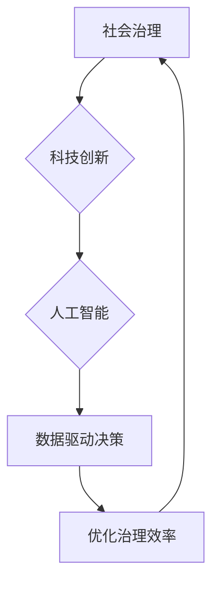

                 

## 科技创新：社会治理的新思路

> 关键词：人工智能、社会治理、科技创新、数据驱动、算法模型、可解释性、伦理规范、未来趋势

## 1. 背景介绍

社会治理，作为人类社会有序运行的基石，面临着日益严峻的挑战。传统的人工管理模式在面对复杂、多变的社会问题时显得力不从心。而科技创新，特别是人工智能（AI）技术的快速发展，为社会治理提供了全新的思路和工具。

近年来，AI技术在各个领域取得了突破性进展，例如图像识别、自然语言处理、预测分析等。这些技术能够帮助我们更高效地收集、分析和利用社会数据，从而更好地理解社会问题、预测未来趋势，并制定更精准、有效的治理方案。

## 2. 核心概念与联系

### 2.1  社会治理

社会治理是指社会成员共同参与，通过各种制度、规则和机制，协调和管理社会关系，维护社会秩序和公共利益的过程。它涵盖了政府、市场、社会组织等多方主体，涉及经济、政治、文化、环境等多个领域。

### 2.2  科技创新

科技创新是指利用科学技术知识，创造出新的产品、服务、工艺和模式，从而推动社会进步和经济发展。它包括基础研究、应用研究、技术开发和产业化等环节。

### 2.3  人工智能

人工智能是指模拟人类智能行为的计算机系统。它包括机器学习、深度学习、自然语言处理、计算机视觉等多个分支领域。

**核心概念联系：**



## 3. 核心算法原理 & 具体操作步骤

### 3.1  算法原理概述

在社会治理领域，人工智能算法可以帮助我们从海量数据中发现隐藏的模式和趋势，从而做出更明智的决策。常见的算法包括：

* **机器学习算法：**例如线性回归、逻辑回归、决策树、支持向量机等，用于预测和分类。
* **深度学习算法：**例如卷积神经网络、循环神经网络等，用于图像识别、自然语言处理等复杂任务。
* **强化学习算法：**例如Q学习、SARSA等，用于解决决策问题，例如自动驾驶、机器人控制等。

### 3.2  算法步骤详解

以机器学习算法为例，其基本步骤包括：

1. **数据收集和预处理：**收集相关社会数据，并进行清洗、转换、特征提取等预处理工作。
2. **模型选择：**根据具体问题选择合适的机器学习算法模型。
3. **模型训练：**利用训练数据训练模型参数，使模型能够学习数据中的规律。
4. **模型评估：**利用测试数据评估模型的性能，例如准确率、召回率、F1-score等。
5. **模型部署：**将训练好的模型部署到实际应用场景中，用于预测和决策。

### 3.3  算法优缺点

**优点：**

* **数据驱动：**基于数据分析，决策更加客观、科学。
* **效率提升：**自动化处理大量数据，提高决策效率。
* **精准化服务：**根据个体需求提供个性化服务。

**缺点：**

* **数据依赖：**算法性能依赖于数据质量和数量。
* **黑盒效应：**部分算法难以解释其决策过程，缺乏透明度。
* **伦理风险：**算法可能存在偏见和歧视，需要谨慎使用。

### 3.4  算法应用领域

* **公共安全：**犯罪预测、风险评估、视频监控等。
* **医疗保健：**疾病诊断、药物研发、个性化治疗等。
* **教育培训：**个性化学习、智能辅导、教学评估等。
* **社会服务：**精准扶贫、就业指导、公共资源分配等。

## 4. 数学模型和公式 & 详细讲解 & 举例说明

### 4.1  数学模型构建

在社会治理领域，我们可以利用数学模型来描述社会现象和关系，并进行预测和分析。例如，我们可以构建一个交通流量预测模型，利用历史交通数据和实时路况信息，预测未来交通流量。

### 4.2  公式推导过程

交通流量预测模型可以采用线性回归模型，其公式如下：

$$
y = \beta_0 + \beta_1x_1 + \beta_2x_2 + ... + \beta_nx_n + \epsilon
$$

其中：

* $y$：预测的交通流量
* $x_1, x_2, ..., x_n$：影响交通流量的因素，例如时间、日期、天气等
* $\beta_0, \beta_1, ..., \beta_n$：模型参数，需要通过训练数据进行估计
* $\epsilon$：随机误差项

### 4.3  案例分析与讲解

假设我们想要预测某条道路的交通流量，影响因素包括时间、日期、天气等。我们可以收集历史交通数据，并将其作为训练数据，利用线性回归模型训练出模型参数。然后，我们可以利用训练好的模型，预测未来某一时刻的交通流量。

## 5. 项目实践：代码实例和详细解释说明

### 5.1  开发环境搭建

* 操作系统：Windows/macOS/Linux
* Python版本：3.6+
* 必要的库：pandas、numpy、scikit-learn等

### 5.2  源代码详细实现

```python
import pandas as pd
from sklearn.linear_model import LinearRegression

# 数据加载
data = pd.read_csv('traffic_data.csv')

# 特征选择
features = ['hour', 'weekday', 'temperature']
target = 'traffic_volume'

# 数据分割
X = data[features]
y = data[target]

# 模型训练
model = LinearRegression()
model.fit(X, y)

# 模型预测
new_data = pd.DataFrame({'hour': [18], 'weekday': [5], 'temperature': [25]})
prediction = model.predict(new_data)

# 结果展示
print(f'预测的交通流量: {prediction[0]}')
```

### 5.3  代码解读与分析

* 代码首先加载交通数据，并选择影响交通流量的特征和目标变量。
* 然后，代码将数据分割为训练集和测试集，并使用线性回归模型训练模型。
* 最后，代码利用训练好的模型预测未来某一时刻的交通流量，并展示预测结果。

### 5.4  运行结果展示

运行代码后，会输出预测的交通流量值。

## 6. 实际应用场景

### 6.1  城市交通管理

利用AI算法分析交通数据，预测交通流量、拥堵情况，优化交通信号灯控制、道路规划等，提高城市交通效率。

### 6.2  公共安全保障

利用AI算法分析视频监控数据，识别犯罪嫌疑人、预警潜在安全风险，提高公共安全水平。

### 6.3  环境保护

利用AI算法分析环境数据，监测空气质量、水质污染等，制定环境保护政策，改善环境质量。

### 6.4  未来应用展望

随着AI技术的不断发展，其在社会治理领域的应用将更加广泛和深入。例如，我们可以利用AI技术实现智能执法、精准扶贫、个性化教育等。

## 7. 工具和资源推荐

### 7.1  学习资源推荐

* **在线课程：**Coursera、edX、Udacity等平台提供丰富的AI课程。
* **书籍：**《深度学习》、《机器学习实战》等经典书籍。
* **开源社区：**GitHub、Kaggle等平台提供丰富的AI开源项目和数据。

### 7.2  开发工具推荐

* **Python：**主流的AI开发语言。
* **TensorFlow：**开源深度学习框架。
* **PyTorch：**开源深度学习框架。

### 7.3  相关论文推荐

* **《Attention Is All You Need》:** 提出Transformer模型， revolutionized natural language processing.
* **《Deep Learning》:** 深度学习经典著作，介绍了深度学习的基本原理和应用。

## 8. 总结：未来发展趋势与挑战

### 8.1  研究成果总结

AI技术在社会治理领域取得了显著成果，例如提高了决策效率、精准化服务等。

### 8.2  未来发展趋势

* **更强大的算法模型：**例如生成式AI、联邦学习等。
* **更广泛的应用场景：**例如智能司法、智能医疗等。
* **更注重可解释性和伦理规范：**确保AI技术应用安全、公平、透明。

### 8.3  面临的挑战

* **数据质量和隐私问题：**AI算法依赖于高质量的数据，而数据隐私保护也是一个重要问题。
* **算法偏见和歧视：**AI算法可能存在偏见和歧视，需要进行充分的测试和评估。
* **技术伦理和社会影响：**AI技术的应用需要考虑其伦理和社会影响，制定相应的规范和政策。

### 8.4  研究展望

未来，我们需要继续加强AI技术在社会治理领域的应用研究，探索更有效的解决方案，并积极应对相关挑战，推动AI技术更好地服务于人类社会。

## 9. 附录：常见问题与解答

* **Q1：AI技术是否会取代人类工作？**

A1：AI技术可以自动化一些重复性工作，但不会完全取代人类工作。AI技术更像是人类的工具，可以帮助人类提高效率，解放人力，专注于更需要创造力和思考的工作。

* **Q2：如何确保AI技术的公平性和透明度？**

A2：

* **公平性：**需要在数据收集、算法设计和模型评估等环节，避免和减少算法偏见，确保AI技术公平地服务于所有群体。
* **透明度：**需要提高AI算法的可解释性，让公众能够理解AI技术的决策过程，并对其进行监督和评估。

* **Q3：AI技术有哪些伦理风险？**

A3：AI技术的应用可能带来一些伦理风险，例如：

* **隐私侵犯：**AI算法可能收集和利用个人数据，侵犯个人隐私。
* **算法歧视：**AI算法可能存在偏见和歧视，导致不公平的结果。
* **责任归属：**当AI系统做出错误决策时，责任归属问题难以界定。

需要制定相应的伦理规范和法律法规，规范AI技术的应用，避免其带来的负面影响。


作者：禅与计算机程序设计艺术 / Zen and the Art of Computer Programming 
<end_of_turn>

