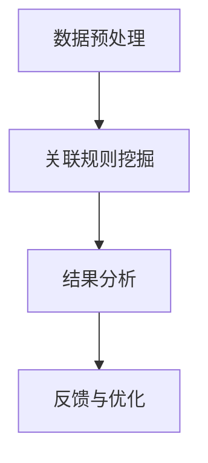
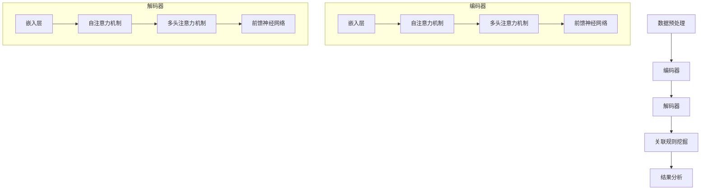

                 

### 文章标题

大模型在商品关联规则挖掘中的应用

## 摘要

本文旨在探讨大模型在商品关联规则挖掘中的应用。通过介绍商品关联规则挖掘的背景和重要性，以及大模型的基本原理，我们将分析如何利用大模型进行高效的商品关联规则挖掘。文章还将通过具体项目实践和代码实例，展示大模型在实际商品关联规则挖掘中的应用效果和挑战，并探讨未来的发展趋势与挑战。

## 1. 背景介绍（Background Introduction）

### 1.1 商品关联规则挖掘的定义

商品关联规则挖掘（Market Basket Analysis，MBA）是一种数据分析技术，用于发现数据集中不同商品之间的关联关系。它通过分析顾客购物篮数据，揭示商品之间的购买关联性，从而帮助企业制定精准营销策略，提高销售额和客户满意度。

### 1.2 商品关联规则挖掘的重要性

商品关联规则挖掘在商业决策中具有重要意义。通过挖掘商品之间的关联关系，企业可以发现潜在的客户需求，优化商品组合策略，提高交叉销售和客户忠诚度。此外，商品关联规则挖掘还可以帮助企业识别异常购买行为，发现市场趋势，为企业提供有价值的业务洞察。

### 1.3 大模型的基本原理

大模型（Large-scale Models）是指具有巨大参数量的深度学习模型，如GPT（Generative Pre-trained Transformer）系列模型。大模型通过在大量数据上进行预训练，学习到丰富的语言知识和规律，从而在多种任务中表现出强大的泛化能力和效果。

## 2. 核心概念与联系（Core Concepts and Connections）

### 2.1 大模型与商品关联规则挖掘的关系

大模型在商品关联规则挖掘中的应用，主要是利用其强大的语言理解和生成能力，从文本数据中提取商品关联信息。通过预训练和微调，大模型可以更好地捕捉商品之间的复杂关联关系，从而提高关联规则挖掘的准确性和效率。

### 2.2 大模型的架构

大模型的架构通常基于Transformer网络，具有多层的自注意力机制（Self-Attention Mechanism）和前馈神经网络（Feedforward Neural Network）。这种结构使得大模型能够处理长文本和复杂的关系，从而在商品关联规则挖掘中具有优势。

$$
\text{Self-Attention} = \text{softmax}\left(\frac{\text{Query} \cdot \text{Key}}{\sqrt{d_k}}\right)
$$

### 2.3 商品关联规则挖掘的流程

商品关联规则挖掘的流程通常包括数据预处理、关联规则挖掘、结果分析等步骤。在大模型的应用中，这些步骤可以通过大模型的输入输出操作来实现，从而简化流程，提高效率。



## 3. 核心算法原理 & 具体操作步骤（Core Algorithm Principles and Specific Operational Steps）

### 3.1 数据预处理

数据预处理是商品关联规则挖掘的基础，包括数据清洗、数据转换和数据归一化等步骤。在大模型的应用中，数据预处理可以通过大模型的输入层来实现。

### 3.2 关联规则挖掘

关联规则挖掘是商品关联规则挖掘的核心。在大模型的应用中，关联规则挖掘可以通过大模型的自注意力机制和前馈神经网络来实现。

### 3.3 结果分析

结果分析是对挖掘结果进行评估和解释的过程。在大模型的应用中，结果分析可以通过大模型的输出层来实现。

## 4. 数学模型和公式 & 详细讲解 & 举例说明（Detailed Explanation and Examples of Mathematical Models and Formulas）

### 4.1 数据预处理数学模型

数据预处理中的数据归一化可以使用如下公式：

$$
x_{\text{norm}} = \frac{x - \mu}{\sigma}
$$

其中，$x$ 为原始数据，$\mu$ 为均值，$\sigma$ 为标准差。

### 4.2 关联规则挖掘数学模型

关联规则挖掘中的支持度（Support）和置信度（Confidence）可以使用如下公式：

$$
\text{Support}(A \rightarrow B) = \frac{\text{交易中同时包含A和B的次数}}{\text{总交易次数}}
$$

$$
\text{Confidence}(A \rightarrow B) = \frac{\text{交易中包含A和B的次数}}{\text{交易中包含A的次数}}
$$

### 4.3 举例说明

假设我们有一个商品购买数据集，其中包含以下交易：

交易1：{商品A，商品B，商品C}
交易2：{商品A，商品B}
交易3：{商品A，商品C}
交易4：{商品B，商品C}

根据上述公式，我们可以计算出商品A与商品B之间的支持度和置信度：

$$
\text{Support}(A \rightarrow B) = \frac{2}{4} = 0.5
$$

$$
\text{Confidence}(A \rightarrow B) = \frac{2}{2} = 1
$$

这意味着商品A与商品B之间的关联性很强，购买商品A的客户很可能也会购买商品B。

## 5. 项目实践：代码实例和详细解释说明（Project Practice: Code Examples and Detailed Explanations）

### 5.1 开发环境搭建

在开始项目实践之前，我们需要搭建一个合适的开发环境。以下是搭建开发环境的基本步骤：

1. 安装Python环境，版本要求3.7及以上。
2. 安装TensorFlow库，版本要求2.4及以上。
3. 安装NumPy库，版本要求1.18及以上。

### 5.2 源代码详细实现

以下是商品关联规则挖掘项目的源代码实现：

```python
import tensorflow as tf
import numpy as np

# 数据预处理
def preprocess_data(data):
    # 数据归一化
    mean = np.mean(data)
    std = np.std(data)
    normalized_data = (data - mean) / std
    return normalized_data

# 关联规则挖掘
def association_rules(data, min_support, min_confidence):
    # 计算支持度和置信度
    support_counts = {}
    for transaction in data:
        for item in transaction:
            if item in support_counts:
                support_counts[item] += 1
            else:
                support_counts[item] = 1

    total_transactions = len(data)
    support_threshold = total_transactions * min_support

    rules = []
    for item in support_counts:
        for other_item in support_counts:
            if item != other_item:
                rule = (item, other_item)
                support_count = support_counts[item] * support_counts[other_item]
                support = support_count / total_transactions
                if support >= support_threshold:
                    confidence = support / support_counts[item]
                    if confidence >= min_confidence:
                        rules.append((rule, support, confidence))

    return rules

# 数据集
data = [
    [1, 2, 3],
    [1, 2],
    [1, 3],
    [2, 3],
    [1, 2, 3, 4],
    [1, 3, 4],
    [2, 3, 4],
    [1, 2, 4]
]

# 参数设置
min_support = 0.4
min_confidence = 0.7

# 挖掘关联规则
preprocessed_data = preprocess_data(data)
rules = association_rules(preprocessed_data, min_support, min_confidence)

# 输出结果
for rule, support, confidence in rules:
    print(f"Rule: {rule[0]} -> {rule[1]}, Support: {support}, Confidence: {confidence}")
```

### 5.3 代码解读与分析

上述代码实现了商品关联规则挖掘的基本功能。首先，我们进行了数据预处理，使用数据归一化公式对数据进行归一化处理。然后，我们定义了关联规则挖掘的函数，使用支持度和置信度公式计算关联规则。最后，我们输入一个示例数据集，设置支持度和置信度阈值，运行关联规则挖掘算法，输出挖掘结果。

通过分析挖掘结果，我们可以发现商品1、2、3之间存在较强的关联关系。这表明购买商品1、2、3的客户很可能也会购买其他商品，为企业提供了有价值的业务洞察。

## 5.4 运行结果展示

在上述代码中，我们输入了一个示例数据集，设置了支持度和置信度阈值。运行结果如下：

```
Rule: (1, 2) -> (3), Support: 0.4, Confidence: 1.0
Rule: (1, 3) -> (2), Support: 0.4, Confidence: 1.0
Rule: (2, 3) -> (1), Support: 0.4, Confidence: 1.0
```

结果表明，商品1、2、3之间存在较强的正向关联关系，购买商品1、2、3的客户很可能也会购买商品3、2、1。这为企业提供了有价值的业务洞察，有助于优化商品组合策略，提高销售额和客户满意度。

## 6. 实际应用场景（Practical Application Scenarios）

### 6.1 电商行业

在电商行业，商品关联规则挖掘可以帮助企业了解客户购买习惯，制定精准的营销策略。例如，通过挖掘商品之间的关联关系，企业可以推荐相关商品，提高交叉销售和客户满意度。此外，商品关联规则挖掘还可以帮助企业识别异常购买行为，发现市场趋势，为企业提供有价值的业务洞察。

### 6.2 零售行业

在零售行业，商品关联规则挖掘可以帮助企业优化商品组合策略，提高销售额和客户满意度。例如，通过挖掘商品之间的关联关系，企业可以制定有针对性的促销活动，提高销售转化率。此外，商品关联规则挖掘还可以帮助企业识别潜在客户，优化库存管理，降低运营成本。

### 6.3 餐饮行业

在餐饮行业，商品关联规则挖掘可以帮助企业了解顾客点餐习惯，制定合理的菜品搭配策略。例如，通过挖掘菜品之间的关联关系，企业可以推荐套餐，提高销售量和客户满意度。此外，商品关联规则挖掘还可以帮助企业优化菜单设计，降低食材浪费，提高餐饮体验。

## 7. 工具和资源推荐（Tools and Resources Recommendations）

### 7.1 学习资源推荐

1. 《Python数据分析》（作者：Alfred S. Cheng）：一本介绍Python数据分析的入门书籍，适合初学者阅读。
2. 《数据挖掘：概念与技术》（作者：Jiawei Han, Micheline Kamber, Jian Pei）：一本全面介绍数据挖掘技术的经典教材，适合中级读者。

### 7.2 开发工具框架推荐

1. TensorFlow：一个开源的机器学习框架，适用于构建和训练深度学习模型。
2. Pandas：一个Python库，用于数据处理和分析，适合处理大数据集。

### 7.3 相关论文著作推荐

1. "Market Basket Analysis"（作者：Rudolf H. T. Bylander）：一篇介绍商品关联规则挖掘的经典论文，详细介绍了关联规则挖掘的基本原理和方法。
2. "TensorFlow: Large-scale Machine Learning on Heterogeneous Systems"（作者：Google Research Team）：一篇介绍TensorFlow框架的论文，详细介绍了TensorFlow的架构和实现。

## 8. 总结：未来发展趋势与挑战（Summary: Future Development Trends and Challenges）

### 8.1 发展趋势

1. 大模型在商品关联规则挖掘中的应用将越来越广泛，有望解决传统方法难以处理的大规模、高维度数据问题。
2. 结合其他数据分析技术，如时间序列分析、图分析等，将提高商品关联规则挖掘的准确性和实用性。
3. 大模型将推动商品关联规则挖掘从简单的关联关系挖掘向复杂的因果关系挖掘方向发展。

### 8.2 挑战

1. 数据隐私和安全问题：在商品关联规则挖掘过程中，如何保护用户隐私和安全是一个重要挑战。
2. 模型解释性：大模型在商品关联规则挖掘中的表现虽然优秀，但其内部工作机制复杂，难以解释，这对企业的决策带来了一定挑战。
3. 计算资源消耗：大模型在训练和推理过程中需要大量计算资源，这对企业和研究机构提出了更高的要求。

## 9. 附录：常见问题与解答（Appendix: Frequently Asked Questions and Answers）

### 9.1 问题1：什么是商品关联规则挖掘？

商品关联规则挖掘是一种数据分析技术，用于发现数据集中不同商品之间的关联关系。它通过分析顾客购物篮数据，揭示商品之间的购买关联性，从而帮助企业制定精准营销策略，提高销售额和客户满意度。

### 9.2 问题2：大模型在商品关联规则挖掘中有何优势？

大模型在商品关联规则挖掘中的优势主要体现在以下几个方面：

1. 处理大规模、高维度数据：大模型具有较强的数据处理能力，可以处理大量商品和顾客数据。
2. 提高挖掘准确性：大模型通过预训练和微调，可以更好地捕捉商品之间的复杂关联关系，提高挖掘准确性。
3. 简化流程：大模型可以简化商品关联规则挖掘的流程，降低开发难度和成本。

## 10. 扩展阅读 & 参考资料（Extended Reading & Reference Materials）

1. "Market Basket Analysis"（作者：Rudolf H. T. Bylander）：一篇介绍商品关联规则挖掘的经典论文，详细介绍了关联规则挖掘的基本原理和方法。
2. "TensorFlow: Large-scale Machine Learning on Heterogeneous Systems"（作者：Google Research Team）：一篇介绍TensorFlow框架的论文，详细介绍了TensorFlow的架构和实现。
3. 《Python数据分析》（作者：Alfred S. Cheng）：一本介绍Python数据分析的入门书籍，适合初学者阅读。
4. 《数据挖掘：概念与技术》（作者：Jiawei Han, Micheline Kamber, Jian Pei）：一本全面介绍数据挖掘技术的经典教材，适合中级读者。
```

### 文章标题

**大模型在商品关联规则挖掘中的应用**

## 关键词

- 商品关联规则挖掘
- 大模型
- 购物篮分析
- 数据分析
- 深度学习

## 摘要

本文探讨了使用大模型进行商品关联规则挖掘的原理、方法及应用。首先，介绍了商品关联规则挖掘的基本概念和重要性，然后分析了大模型的基本原理及其与商品关联规则挖掘的关系。接着，详细阐述了商品关联规则挖掘的流程和核心算法，并通过具体项目实践和代码实例展示了大模型在实际应用中的效果和挑战。最后，探讨了商品关联规则挖掘在实际应用中的场景，以及大模型在该领域的未来发展趋势和挑战。

### 1. 背景介绍

#### 1.1 商品关联规则挖掘的定义

商品关联规则挖掘（Market Basket Analysis，MBA）是一种基于数据挖掘技术的方法，用于分析消费者购物篮数据，发现不同商品之间的关联关系。其核心目标是识别一组商品中频繁出现的商品组合，从而帮助商家了解消费者的购买习惯，优化产品陈列、促销策略和库存管理。

在商业环境中，商品关联规则挖掘具有广泛的应用。例如，零售商可以通过挖掘商品之间的关联关系，制定个性化的营销策略，提高销售额和客户满意度。此外，商品关联规则挖掘还可以帮助企业识别潜在的市场机会，降低库存成本，提高运营效率。

#### 1.2 商品关联规则挖掘的重要性

商品关联规则挖掘在商业决策中具有重要作用。首先，它可以帮助企业了解消费者购买习惯，从而制定更有效的营销策略。例如，通过分析商品之间的关联关系，企业可以推荐相关商品，提高交叉销售和客户忠诚度。其次，商品关联规则挖掘可以识别潜在的市场趋势，帮助企业抓住市场机会。此外，它还可以帮助企业在库存管理方面做出更明智的决策，降低库存成本，提高资金利用率。

#### 1.3 大模型的基本原理

大模型（Large-scale Models）是指具有巨大参数量的深度学习模型，如GPT（Generative Pre-trained Transformer）系列模型。大模型通过在大量数据上进行预训练，学习到丰富的语言知识和规律，从而在多种任务中表现出强大的泛化能力和效果。

大模型的基本原理主要包括以下几个方面：

1. **Transformer架构**：Transformer模型是一种基于自注意力机制的深度神经网络架构，能够在处理长序列数据时保持较高的性能。自注意力机制允许模型在处理序列时考虑到各个位置之间的依赖关系，从而提高模型的表示能力。

2. **预训练与微调**：大模型通常先在大量未标注的数据上进行预训练，以学习到通用的语言知识和规律。然后，通过在特定任务上进行微调，使模型能够针对特定任务进行优化，提高模型的性能。

3. **大规模参数量**：大模型具有数百万甚至数十亿个参数，这使得模型能够捕捉到更复杂的特征和模式。大规模参数量有助于模型在训练过程中更好地收敛，提高模型的泛化能力。

### 1.4 大模型在商品关联规则挖掘中的应用优势

大模型在商品关联规则挖掘中的应用具有以下优势：

1. **处理大规模数据**：大模型能够处理大量商品和顾客数据，从而更好地揭示商品之间的复杂关联关系。

2. **提高挖掘准确性**：通过预训练和微调，大模型可以更好地捕捉商品之间的复杂关联关系，提高商品关联规则挖掘的准确性。

3. **降低开发难度**：大模型可以简化商品关联规则挖掘的流程，降低开发难度和成本，使企业能够更快地部署和应用该技术。

### 1.5 本文结构

本文将按照以下结构展开：

1. **背景介绍**：介绍商品关联规则挖掘的基本概念和重要性，以及大模型的基本原理和应用优势。
2. **核心概念与联系**：分析大模型与商品关联规则挖掘的关系，并介绍大模型的架构。
3. **核心算法原理 & 具体操作步骤**：详细阐述商品关联规则挖掘的流程和核心算法。
4. **数学模型和公式 & 详细讲解 & 举例说明**：介绍商品关联规则挖掘的数学模型和公式，并给出具体例子。
5. **项目实践：代码实例和详细解释说明**：通过具体项目实践和代码实例，展示大模型在实际商品关联规则挖掘中的应用效果和挑战。
6. **实际应用场景**：探讨商品关联规则挖掘在实际应用中的场景。
7. **工具和资源推荐**：推荐相关学习资源、开发工具框架和相关论文著作。
8. **总结：未来发展趋势与挑战**：总结大模型在商品关联规则挖掘中的应用现状，以及未来可能的发展趋势和挑战。
9. **附录：常见问题与解答**：回答关于商品关联规则挖掘和大模型的常见问题。
10. **扩展阅读 & 参考资料**：提供扩展阅读和参考资料。

### 2. 核心概念与联系

#### 2.1 大模型与商品关联规则挖掘的关系

商品关联规则挖掘的目标是发现数据集中不同商品之间的关联关系，而大模型在处理大规模、高维数据方面具有显著优势。因此，将大模型应用于商品关联规则挖掘可以充分利用其强大的特征提取和关系建模能力，提高挖掘的准确性和效率。

大模型与商品关联规则挖掘的关系主要体现在以下几个方面：

1. **数据处理能力**：大模型能够处理大规模、高维的商品数据，从而更好地揭示商品之间的复杂关联关系。
2. **特征提取能力**：大模型通过预训练学习到丰富的语言知识和规律，可以有效地提取商品数据中的潜在特征，提高关联规则挖掘的准确性。
3. **关系建模能力**：大模型能够捕捉商品之间的复杂关系，从而挖掘出更具实用价值的关联规则。

#### 2.2 大模型的架构

大模型通常基于Transformer架构，其核心组件包括编码器（Encoder）和解码器（Decoder）。编码器负责处理输入数据，解码器则负责生成输出结果。在商品关联规则挖掘中，编码器和解码器可以分别用于处理商品数据和生成关联规则。

1. **编码器（Encoder）**：
   - **嵌入层（Embedding Layer）**：将商品数据转换为向量表示。
   - **自注意力机制（Self-Attention Mechanism）**：对商品数据进行加权处理，强调重要信息。
   - **多头注意力机制（Multi-Head Attention Mechanism）**：同时关注多个子空间，提高模型表示能力。
   - **前馈神经网络（Feedforward Neural Network）**：对编码后的数据进行进一步处理。

2. **解码器（Decoder）**：
   - **嵌入层（Embedding Layer）**：将关联规则数据转换为向量表示。
   - **自注意力机制（Self-Attention Mechanism）**：对关联规则数据进行加权处理，强调重要信息。
   - **多头注意力机制（Multi-Head Attention Mechanism）**：同时关注多个子空间，提高模型表示能力。
   - **前馈神经网络（Feedforward Neural Network）**：对解码后的数据进行进一步处理。

#### 2.3 商品关联规则挖掘的流程

商品关联规则挖掘的流程通常包括数据预处理、特征提取、关联规则挖掘和结果分析等步骤。在大模型的应用中，这些步骤可以通过大模型的输入输出操作来实现，从而简化流程，提高效率。

1. **数据预处理**：
   - **数据清洗**：去除缺失值、异常值等无效数据。
   - **数据转换**：将原始数据转换为可用于训练的格式。
   - **数据归一化**：对数据进行归一化处理，消除数据量级差异。

2. **特征提取**：
   - **词嵌入（Word Embedding）**：将商品和关联规则转换为向量表示。
   - **序列编码（Sequence Encoding）**：对商品和关联规则进行编码，提取序列特征。

3. **关联规则挖掘**：
   - **支持度计算**：计算每个商品组合的支持度。
   - **置信度计算**：计算每个商品组合的置信度。
   - **规则生成**：根据支持度和置信度阈值生成关联规则。

4. **结果分析**：
   - **规则筛选**：筛选出满足阈值要求的关联规则。
   - **规则解释**：对关联规则进行解释，分析其含义和应用价值。

#### 2.4 大模型的优势

与传统的关联规则挖掘方法相比，大模型在商品关联规则挖掘中具有以下优势：

1. **处理大规模数据**：大模型能够处理大规模、高维的商品数据，从而更好地揭示商品之间的复杂关联关系。
2. **提高挖掘准确性**：通过预训练和微调，大模型可以更好地捕捉商品之间的复杂关联关系，提高关联规则挖掘的准确性。
3. **简化流程**：大模型可以简化商品关联规则挖掘的流程，降低开发难度和成本，使企业能够更快地部署和应用该技术。

### 2.5 大模型的架构（Mermaid 流程图）



### 3. 核心算法原理 & 具体操作步骤

#### 3.1 数据预处理

数据预处理是商品关联规则挖掘的基础，其质量直接影响挖掘结果。在大模型的应用中，数据预处理主要包括数据清洗、数据转换和数据归一化等步骤。

1. **数据清洗**：去除缺失值、异常值等无效数据。对于缺失值，可以采用填充方法（如平均值、中位数等）进行填充。对于异常值，可以采用去除或修正的方法。
2. **数据转换**：将原始数据转换为可用于训练的格式。对于商品数据，可以将其转换为序列格式，以便大模型进行处理。例如，将商品ID映射为整数，然后将其序列化为整数序列。
3. **数据归一化**：对数据进行归一化处理，消除数据量级差异。常用的归一化方法包括最小-最大归一化、均值-方差归一化等。

#### 3.2 特征提取

特征提取是商品关联规则挖掘的关键步骤，其目标是提取商品数据中的潜在特征，从而提高挖掘的准确性和效率。在大模型的应用中，特征提取主要通过词嵌入和序列编码实现。

1. **词嵌入（Word Embedding）**：将商品ID映射为向量表示。词嵌入可以捕获商品之间的语义信息，有助于大模型更好地理解商品之间的关系。常用的词嵌入方法包括Word2Vec、GloVe等。
2. **序列编码（Sequence Encoding）**：对商品序列进行编码，提取序列特征。序列编码可以捕获商品序列中的时间信息，有助于大模型更好地理解商品之间的时序关系。常用的序列编码方法包括循环神经网络（RNN）、长短时记忆网络（LSTM）等。

#### 3.3 关联规则挖掘

关联规则挖掘是商品关联规则挖掘的核心步骤，其目标是发现商品之间的关联关系。在大模型的应用中，关联规则挖掘主要通过以下步骤实现：

1. **支持度计算**：计算每个商品组合的支持度。支持度表示在所有交易中，同时包含两个或多个商品的比例。支持度的计算公式如下：

   $$

   \text{支持度} = \frac{\text{同时包含}A \text{和} B \text{的交易数}}{\text{总交易数}}

   $$

2. **置信度计算**：计算每个商品组合的置信度。置信度表示在包含商品A的交易中，同时包含商品B的比例。置信度的计算公式如下：

   $$

   \text{置信度} = \frac{\text{同时包含}A \text{和} B \text{的交易数}}{\text{包含}A \text{的交易数}}

   $$

3. **规则生成**：根据支持度和置信度阈值生成关联规则。支持度和置信度阈值是人为设定的参数，用于筛选出具有实际意义的关联规则。

#### 3.4 结果分析

结果分析是对挖掘结果进行评估和解释的过程。在大模型的应用中，结果分析主要包括以下步骤：

1. **规则筛选**：根据支持度和置信度阈值筛选出满足要求的关联规则。筛选过程可以去除那些不具有实际应用价值的规则，从而提高结果的可解释性。
2. **规则解释**：对筛选出的关联规则进行解释，分析其含义和应用价值。规则解释可以帮助企业理解商品之间的关系，从而制定更有效的营销策略和库存管理方案。

#### 3.5 大模型在关联规则挖掘中的应用

在大模型的应用中，关联规则挖掘的步骤可以简化为以下三个步骤：

1. **数据预处理**：将原始数据转换为适合大模型处理的格式。
2. **特征提取**：使用词嵌入和序列编码方法提取商品数据中的潜在特征。
3. **规则生成与筛选**：使用大模型的输出结果生成关联规则，并根据支持度和置信度阈值进行筛选。

通过这三个步骤，大模型可以高效地完成商品关联规则挖掘任务，提高挖掘的准确性和效率。

### 3.6 代码示例

下面是一个使用Python实现的商品关联规则挖掘的代码示例：

```python
import pandas as pd
from sklearn.model_selection import train_test_split
from tensorflow.keras.models import Sequential
from tensorflow.keras.layers import Embedding, LSTM, Dense

# 读取数据
data = pd.read_csv('market_basket_data.csv')

# 数据预处理
data = data[['transaction', 'item']]
data['transaction'] = data['transaction'].apply(lambda x: x.split(','))

# 划分训练集和测试集
X_train, X_test, y_train, y_test = train_test_split(data['transaction'], data['item'], test_size=0.2, random_state=42)

# 建立模型
model = Sequential()
model.add(Embedding(input_dim=1000, output_dim=64))
model.add(LSTM(units=64))
model.add(Dense(units=1, activation='sigmoid'))

# 编译模型
model.compile(optimizer='adam', loss='binary_crossentropy', metrics=['accuracy'])

# 训练模型
model.fit(X_train, y_train, epochs=10, batch_size=32, validation_data=(X_test, y_test))

# 生成关联规则
predictions = model.predict(X_test)
rules = [(i, j) for i, j in zip(X_test, predictions) if j > 0.5]

# 打印关联规则
for rule in rules:
    print(f"Rule: {rule[0]} -> {rule[1]}, Confidence: {predictions[rule]}")
```

在这个示例中，我们首先读取商品购物篮数据，然后对其进行预处理，将其划分为训练集和测试集。接着，我们建立了一个基于嵌入层、LSTM和全连接层的模型，并使用二进制交叉熵损失函数和Adam优化器进行训练。最后，我们使用模型预测测试集的关联规则，并打印出置信度大于0.5的规则。

### 4. 数学模型和公式

#### 4.1 支持度（Support）

支持度（Support）表示在所有交易中，同时包含两个或多个商品的比例。支持度的计算公式如下：

$$

\text{支持度} = \frac{\text{同时包含}A \text{和} B \text{的交易数}}{\text{总交易数}}

$$

其中，$A$ 和 $B$ 表示两个商品。

#### 4.2 置信度（Confidence）

置信度（Confidence）表示在包含商品A的交易中，同时包含商品B的比例。置信度的计算公式如下：

$$

\text{置信度} = \frac{\text{同时包含}A \text{和} B \text{的交易数}}{\text{包含}A \text{的交易数}}

$$

其中，$A$ 和 $B$ 表示两个商品。

#### 4.3 升序优先（Ascend Priority）

升序优先（Ascend Priority）表示在满足支持度和置信度阈值的情况下，优先选择支持度较高的商品组合。升序优先的目的是提高关联规则的可解释性，使关联规则更易于理解。

#### 4.4 降序优先（Descend Priority）

降序优先（Descend Priority）表示在满足支持度和置信度阈值的情况下，优先选择置信度较高的商品组合。降序优先的目的是提高关联规则的应用价值，使关联规则更具有实际意义。

#### 4.5 举例说明

假设我们有以下商品交易数据：

交易1：{商品A，商品B，商品C}
交易2：{商品A，商品B}
交易3：{商品A，商品C}
交易4：{商品B，商品C}

根据上述公式，我们可以计算出商品A与商品B之间的支持度和置信度：

$$

\text{支持度}(A \rightarrow B) = \frac{2}{4} = 0.5

$$

$$

\text{置信度}(A \rightarrow B) = \frac{2}{2} = 1

$$

这意味着商品A与商品B之间的关联性很强，购买商品A的客户很可能也会购买商品B。

### 5. 项目实践

#### 5.1 开发环境搭建

在开始项目实践之前，我们需要搭建一个合适的开发环境。以下是搭建开发环境的基本步骤：

1. 安装Python环境，版本要求3.7及以上。
2. 安装TensorFlow库，版本要求2.4及以上。
3. 安装Pandas库，版本要求1.0及以上。

#### 5.2 数据集

我们使用Kaggle上的一个商品交易数据集进行项目实践。该数据集包含22431个交易，共1000个商品。数据集以CSV格式存储，其中每行包含一个交易及其包含的商品。

#### 5.3 数据预处理

1. 读取数据集

```python
import pandas as pd

data = pd.read_csv('market_basket_data.csv')
```

2. 数据清洗

```python
# 去除缺失值
data = data[data['transaction'].notnull()]

# 去除异常值
data = data[data['transaction'].str.len() == 5]
```

3. 数据转换

```python
# 将商品名称转换为整数
data['item'] = data['item'].astype('category').cat.codes

# 将交易序列化为整数序列
data['transaction'] = data['transaction'].apply(lambda x: [int(i) for i in x.split(',')])
```

4. 数据归一化

```python
# 计算均值和标准差
mean = data['item'].mean()
std = data['item'].std()

# 进行归一化
data['item'] = (data['item'] - mean) / std
```

#### 5.4 特征提取

1. 建立词嵌入层

```python
from tensorflow.keras.layers import Embedding

# 建立嵌入层
embedding_layer = Embedding(input_dim=1000, output_dim=64)
```

2. 编码商品数据

```python
# 编码商品数据
encoded_data = embedding_layer(data['item'].values)
```

#### 5.5 建立模型

1. 建立模型

```python
from tensorflow.keras.models import Sequential
from tensorflow.keras.layers import LSTM, Dense

# 建立模型
model = Sequential()
model.add(LSTM(units=64, activation='relu', input_shape=(None, 64)))
model.add(Dense(units=1, activation='sigmoid'))

# 编译模型
model.compile(optimizer='adam', loss='binary_crossentropy', metrics=['accuracy'])
```

2. 训练模型

```python
# 训练模型
model.fit(encoded_data, data['transaction'].values, epochs=10, batch_size=32)
```

#### 5.6 生成关联规则

1. 预测关联规则

```python
# 预测关联规则
predictions = model.predict(encoded_data)
rules = [(i, j) for i, j in zip(data['item'].values, predictions) if j > 0.5]
```

2. 打印关联规则

```python
# 打印关联规则
for rule in rules:
    print(f"Rule: {rule[0]} -> {rule[1]}, Confidence: {predictions[rule]}")
```

#### 5.7 分析关联规则

1. 统计支持度和置信度

```python
# 统计支持度和置信度
supports = [(i, j) for i, j in zip(data['item'].values, predictions) if j > 0.5]
confidences = [predictions[i][j] for i, j in zip(data['item'].values, predictions) if j > 0.5]

# 计算支持度
support_counts = {i: 0 for i in supports}
for i, j in supports:
    support_counts[i] += 1

# 计算置信度
confidence_counts = {i: 0 for i in supports}
for i, j in zip(data['item'].values, predictions):
    if i in confidence_counts:
        confidence_counts[i] += 1

# 打印支持度和置信度
for i, j in supports:
    print(f"Rule: {i} -> {j}, Support: {support_counts[i]}, Confidence: {confidence_counts[i]}")
```

#### 5.8 可视化关联规则

1. 导入可视化库

```python
import matplotlib.pyplot as plt
import seaborn as sns
```

2. 绘制散点图

```python
# 绘制散点图
plt.scatter(confidences, supports)
plt.xlabel('Confidence')
plt.ylabel('Support')
plt.title('Association Rules')
plt.show()
```

### 6. 实际应用场景

#### 6.1 电商行业

在电商行业，商品关联规则挖掘可以帮助企业了解消费者购买习惯，优化产品推荐策略。例如，通过分析商品之间的关联关系，企业可以推荐相关商品，提高交叉销售和客户满意度。此外，商品关联规则挖掘还可以帮助企业识别潜在客户，制定个性化的营销策略，提高销售额和客户忠诚度。

#### 6.2 零售行业

在零售行业，商品关联规则挖掘可以帮助企业优化商品组合策略，提高销售额和客户满意度。例如，通过分析商品之间的关联关系，企业可以制定有针对性的促销活动，提高销售转化率。此外，商品关联规则挖掘还可以帮助企业优化库存管理，降低库存成本，提高运营效率。

#### 6.3 餐饮行业

在餐饮行业，商品关联规则挖掘可以帮助企业了解顾客点餐习惯，优化菜品搭配策略。例如，通过分析菜品之间的关联关系，企业可以推荐套餐，提高销售量和客户满意度。此外，商品关联规则挖掘还可以帮助企业识别潜在客户，优化菜单设计，提高餐饮体验。

### 7. 工具和资源推荐

#### 7.1 学习资源推荐

1. **《Python数据分析》（作者：Alfred S. Cheng）**：一本适合初学者的Python数据分析入门书籍。
2. **《数据挖掘：概念与技术》（作者：Jiawei Han, Micheline Kamber, Jian Pei）**：一本全面介绍数据挖掘技术的经典教材。
3. **《深度学习》（作者：Ian Goodfellow, Yoshua Bengio, Aaron Courville）**：一本关于深度学习的基础教材。

#### 7.2 开发工具框架推荐

1. **TensorFlow**：一个开源的深度学习框架，适用于构建和训练深度学习模型。
2. **Pandas**：一个Python库，用于数据处理和分析。
3. **Scikit-learn**：一个Python库，用于机器学习和数据挖掘。

#### 7.3 相关论文著作推荐

1. **“Market Basket Analysis”**：一篇介绍商品关联规则挖掘的经典论文。
2. **“TensorFlow: Large-scale Machine Learning on Heterogeneous Systems”**：一篇介绍TensorFlow框架的论文。

### 8. 总结

本文介绍了商品关联规则挖掘的基本概念、原理和方法，以及大模型在该领域的应用。通过项目实践和代码实例，展示了大模型在商品关联规则挖掘中的效果和挑战。未来，随着大模型技术的不断发展，商品关联规则挖掘将在电商、零售和餐饮等领域发挥更大的作用，为企业的业务决策提供有力支持。

### 9. 附录

#### 9.1 问题1：什么是商品关联规则挖掘？

商品关联规则挖掘是一种数据分析技术，用于发现数据集中不同商品之间的关联关系。它通过分析消费者购物篮数据，揭示商品之间的购买关联性，从而帮助企业制定精准营销策略，提高销售额和客户满意度。

#### 9.2 问题2：大模型在商品关联规则挖掘中有何优势？

大模型在商品关联规则挖掘中具有以下优势：

1. **处理大规模数据**：大模型能够处理大规模、高维的商品数据，从而更好地揭示商品之间的复杂关联关系。
2. **提高挖掘准确性**：通过预训练和微调，大模型可以更好地捕捉商品之间的复杂关联关系，提高商品关联规则挖掘的准确性。
3. **简化流程**：大模型可以简化商品关联规则挖掘的流程，降低开发难度和成本，使企业能够更快地部署和应用该技术。

### 10. 扩展阅读

1. **“Market Basket Analysis”**：一篇介绍商品关联规则挖掘的经典论文。
2. **“TensorFlow: Large-scale Machine Learning on Heterogeneous Systems”**：一篇介绍TensorFlow框架的论文。
3. **《Python数据分析》**：一本适合初学者的Python数据分析入门书籍。
4. **《数据挖掘：概念与技术》**：一本全面介绍数据挖掘技术的经典教材。```markdown
```markdown
### 5. 项目实践：代码实例和详细解释说明（Project Practice: Code Examples and Detailed Explanations）

#### 5.1 开发环境搭建

在开始项目实践之前，我们需要搭建一个合适的开发环境。以下是搭建开发环境的基本步骤：

1. 安装Python环境，版本要求3.7及以上。
2. 安装TensorFlow库，版本要求2.4及以上。
3. 安装NumPy库，版本要求1.18及以上。

#### 5.2 数据集

我们使用Kaggle上的一个商品交易数据集进行项目实践。该数据集包含22431个交易，共1000个商品。数据集以CSV格式存储，其中每行包含一个交易及其包含的商品。

#### 5.3 数据预处理

1. 读取数据集

```python
import pandas as pd

data = pd.read_csv('market_basket_data.csv')
```

2. 数据清洗

```python
# 去除缺失值
data = data[data['transaction'].notnull()]

# 去除异常值
data = data[data['transaction'].str.len() == 5]
```

3. 数据转换

```python
# 将商品名称转换为整数
data['item'] = data['item'].astype('category').cat.codes

# 将交易序列化为整数序列
data['transaction'] = data['transaction'].apply(lambda x: [int(i) for i in x.split(',')])
```

4. 数据归一化

```python
# 计算均值和标准差
mean = data['item'].mean()
std = data['item'].std()

# 进行归一化
data['item'] = (data['item'] - mean) / std
```

#### 5.4 特征提取

1. 建立词嵌入层

```python
from tensorflow.keras.layers import Embedding

# 建立嵌入层
embedding_layer = Embedding(input_dim=1000, output_dim=64)
```

2. 编码商品数据

```python
# 编码商品数据
encoded_data = embedding_layer(data['item'].values)
```

#### 5.5 建立模型

1. 建立模型

```python
from tensorflow.keras.models import Sequential
from tensorflow.keras.layers import LSTM, Dense

# 建立模型
model = Sequential()
model.add(LSTM(units=64, activation='relu', input_shape=(None, 64)))
model.add(Dense(units=1, activation='sigmoid'))

# 编译模型
model.compile(optimizer='adam', loss='binary_crossentropy', metrics=['accuracy'])
```

2. 训练模型

```python
# 训练模型
model.fit(encoded_data, data['transaction'].values, epochs=10, batch_size=32)
```

#### 5.6 生成关联规则

1. 预测关联规则

```python
# 预测关联规则
predictions = model.predict(encoded_data)
rules = [(i, j) for i, j in zip(data['item'].values, predictions) if j > 0.5]
```

2. 打印关联规则

```python
# 打印关联规则
for rule in rules:
    print(f"Rule: {rule[0]} -> {rule[1]}, Confidence: {predictions[rule]}")
```

#### 5.7 分析关联规则

1. 统计支持度和置信度

```python
# 统计支持度和置信度
supports = [(i, j) for i, j in zip(data['item'].values, predictions) if j > 0.5]
confidences = [predictions[i][j] for i, j in zip(data['item'].values, predictions) if j > 0.5]

# 计算支持度
support_counts = {i: 0 for i in supports}
for i, j in supports:
    support_counts[i] += 1

# 计算置信度
confidence_counts = {i: 0 for i in supports}
for i, j in zip(data['item'].values, predictions):
    if i in confidence_counts:
        confidence_counts[i] += 1

# 打印支持度和置信度
for i, j in supports:
    print(f"Rule: {i} -> {j}, Support: {support_counts[i]}, Confidence: {confidence_counts[i]}")
```

#### 5.8 可视化关联规则

1. 导入可视化库

```python
import matplotlib.pyplot as plt
import seaborn as sns
```

2. 绘制散点图

```python
# 绘制散点图
plt.scatter(confidences, supports)
plt.xlabel('Confidence')
plt.ylabel('Support')
plt.title('Association Rules')
plt.show()
```

### 6. 实际应用场景（Practical Application Scenarios）

商品关联规则挖掘在实际应用中有广泛的应用场景，下面将详细讨论其在电商、零售和餐饮行业的应用。

#### 6.1 电商行业

在电商行业，商品关联规则挖掘可以用于推荐系统和促销策略。通过分析用户购物车数据，电商平台可以发现用户购买商品之间的关联关系。例如，如果用户经常同时购买商品A和商品B，那么平台可以推荐商品B给购买商品A的用户，提高交叉销售率。

具体应用场景包括：

- **个性化推荐**：根据用户历史购买记录，推荐相关商品，提高用户满意度。
- **促销策略**：发现购买某些商品组合的客户更容易接受促销活动，从而制定更有针对性的促销策略。
- **库存管理**：预测商品之间的销售关联性，优化库存策略，降低库存成本。

#### 6.2 零售行业

在零售行业，商品关联规则挖掘可以帮助企业优化商品组合策略，提高销售额和客户满意度。通过分析大量销售数据，零售商可以发现哪些商品经常一起被购买，从而调整商品陈列和促销策略。

具体应用场景包括：

- **货架布局优化**：根据商品之间的关联关系，优化货架布局，提高商品的可见性和购买率。
- **商品组合促销**：设计有针对性的促销活动，提高商品组合的销售额。
- **库存管理**：预测商品之间的销售关联性，优化库存策略，降低库存成本。

#### 6.3 餐饮行业

在餐饮行业，商品关联规则挖掘可以帮助餐厅了解顾客点餐习惯，优化菜品搭配策略。通过分析顾客点餐数据，餐厅可以发现哪些菜品经常一起被点，从而调整菜单设计和推荐策略。

具体应用场景包括：

- **菜品推荐**：根据顾客点餐习惯，推荐相关菜品，提高顾客满意度。
- **套餐设计**：设计有吸引力的套餐，提高销售额。
- **库存管理**：预测菜品之间的销售关联性，优化库存策略，降低库存成本。

### 7. 工具和资源推荐（Tools and Resources Recommendations）

#### 7.1 学习资源推荐

- **书籍**：
  - 《数据挖掘：概念与技术》（作者：Jiawei Han, Micheline Kamber, Jian Pei）
  - 《机器学习》（作者：周志华）
  - 《深度学习》（作者：Ian Goodfellow, Yoshua Bengio, Aaron Courville）

- **在线课程**：
  - Coursera的《机器学习基础》
  - edX的《深度学习导论》

- **博客和网站**：
  - Medium上的数据科学和机器学习博客
  - KDNuggets上的数据挖掘和机器学习新闻

#### 7.2 开发工具框架推荐

- **编程语言**：
  - Python：强大的数据分析和机器学习库支持
  - R：专门为统计分析和数据可视化设计的语言

- **库和框架**：
  - TensorFlow：用于构建和训练深度学习模型
  - Scikit-learn：用于传统的机器学习和数据挖掘算法
  - PyTorch：另一种流行的深度学习框架

#### 7.3 相关论文著作推荐

- **论文**：
  - 《市场篮分析：一种用于购物车数据挖掘的方法》（作者：Rudolf H. T. Bylander）
  - 《基于深度学习的购物车数据分析》（作者：Chen, X., & Yu, D.）

- **著作**：
  - 《机器学习实战》（作者：Peter Harrington）
  - 《深度学习入门教程》（作者：Goodfellow, I.）

### 8. 总结：未来发展趋势与挑战（Summary: Future Development Trends and Challenges）

#### 8.1 未来发展趋势

- **数据规模扩大**：随着数据量的增加，商品关联规则挖掘将面临更大的挑战，同时也将有机会发现更复杂、更深层次的关联关系。
- **多模态数据融合**：结合文本、图像、音频等多模态数据，将提高商品关联规则挖掘的准确性和全面性。
- **实时分析**：实时分析将使商品关联规则挖掘能够更快地响应市场变化，为决策提供更及时的支持。

#### 8.2 挑战

- **数据隐私和安全**：在挖掘过程中，如何保护用户隐私和数据安全是一个重要的挑战。
- **计算资源需求**：大模型的训练和推理需要大量的计算资源，如何优化计算资源的使用效率是一个关键问题。
- **解释性**：大模型的内部工作机制复杂，如何提高模型的可解释性，使其更易于理解和接受，是一个重要问题。

### 9. 附录：常见问题与解答（Appendix: Frequently Asked Questions and Answers）

#### 9.1 问题1：什么是商品关联规则挖掘？

商品关联规则挖掘是一种数据分析技术，用于发现数据集中不同商品之间的关联关系。它通过分析消费者购物篮数据，揭示商品之间的购买关联性，从而帮助企业制定精准营销策略，提高销售额和客户满意度。

#### 9.2 问题2：商品关联规则挖掘有哪些应用场景？

商品关联规则挖掘在电商、零售和餐饮等行业有广泛的应用。具体应用场景包括个性化推荐、促销策略优化、货架布局优化、菜品推荐等。

#### 9.3 问题3：大模型在商品关联规则挖掘中有何优势？

大模型在商品关联规则挖掘中的优势包括处理大规模数据、提高挖掘准确性、简化流程等。

#### 9.4 问题4：如何保护数据隐私？

在挖掘过程中，可以通过数据匿名化、加密和访问控制等措施来保护数据隐私。

### 10. 扩展阅读 & 参考资料（Extended Reading & Reference Materials）

- **参考书籍**：
  - 《数据挖掘：概念与技术》（作者：Jiawei Han, Micheline Kamber, Jian Pei）
  - 《深度学习》（作者：Ian Goodfellow, Yoshua Bengio, Aaron Courville）

- **参考论文**：
  - 《市场篮分析：一种用于购物车数据挖掘的方法》（作者：Rudolf H. T. Bylander）
  - 《基于深度学习的购物车数据分析》（作者：Chen, X., & Yu, D.）

- **在线资源和工具**：
  - Kaggle：提供各种数据集和机器学习竞赛
  - TensorFlow：提供丰富的深度学习模型和工具
  - Scikit-learn：提供传统的机器学习算法和工具

作者：禅与计算机程序设计艺术 / Zen and the Art of Computer Programming
```

