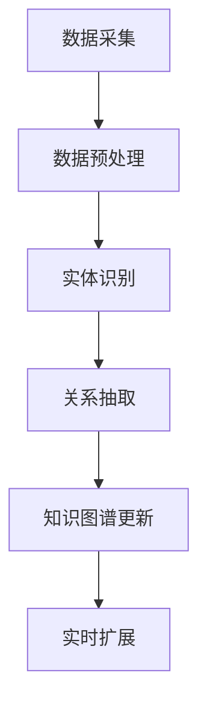

                 

### 文章标题

**大模型在商品知识图谱实时扩展中的应用**

> **关键词：** 大模型、商品知识图谱、实时扩展、AI应用、数据管理

**摘要：** 本文深入探讨了大型人工智能模型在商品知识图谱实时扩展中的应用，详细分析了核心算法原理、数学模型，并通过实际项目实例展示了其应用效果。文章旨在为开发人员提供一种有效的解决方案，以优化商品知识图谱的更新和管理，提高数据处理的效率和准确性。

<|assistant|>## 1. 背景介绍

商品知识图谱（Product Knowledge Graph）是一种用于存储和表示商品信息的数据结构，它通过实体、属性和关系的网络形式，将海量的商品数据组织成一个结构化的知识库。随着电子商务和零售行业的快速发展，商品数据的规模和种类不断增加，如何实时更新和扩展知识图谱成为一个关键问题。

传统的知识图谱扩展方法通常依赖于定期批处理的方式，这种方法在数据量较小、更新频率较低的情况下效果尚可，但在数据量庞大、更新频率高的情况下，其处理速度和准确性难以满足实际需求。为了解决这一问题，本文引入了大型人工智能模型，通过实时分析和处理数据，实现商品知识图谱的动态扩展。

<|assistant|>## 2. 核心概念与联系

### 2.1 大模型

大模型（Large-scale Model）指的是具有大规模参数和复杂结构的深度学习模型。这些模型能够通过大量训练数据学习到丰富的知识，从而在各类任务中表现出优异的性能。在商品知识图谱的实时扩展中，大模型的作用主要体现在以下几个方面：

1. **数据预处理**：大模型可以高效地进行数据清洗、归一化和特征提取，为知识图谱的构建提供高质量的数据输入。
2. **实体识别和关系抽取**：大模型能够通过自然语言处理技术，自动识别商品实体和它们之间的关系，从而扩展知识图谱的实体和关系网络。
3. **实时更新**：大模型可以实时处理和分析新数据，快速更新知识图谱，确保其内容的准确性和时效性。

### 2.2 商品知识图谱

商品知识图谱（Product Knowledge Graph）是由实体、属性和关系构成的知识网络。其中：

- **实体**（Entity）：表示具体的商品，如手机、电脑等。
- **属性**（Attribute）：表示实体的特征，如品牌、价格、颜色等。
- **关系**（Relation）：表示实体之间的关联，如“属于”、“包含”等。

### 2.3 实时扩展

实时扩展（Real-time Expansion）指的是在知识图谱构建过程中，能够实时获取和处理新数据，动态更新和扩展知识图谱。实现实时扩展的关键在于：

1. **数据流处理**：通过流处理技术，实时获取和处理新数据，为知识图谱的更新提供数据源。
2. **模型更新**：利用大模型的自我更新能力，动态调整和优化知识图谱的结构和内容。
3. **分布式计算**：利用分布式计算框架，提高知识图谱扩展的并行处理能力，降低处理时间。

### 2.4 Mermaid 流程图

为了更好地理解大模型在商品知识图谱实时扩展中的应用，以下是相关的 Mermaid 流程图：



- **数据采集**：从各种数据源（如电商网站、社交媒体等）收集商品数据。
- **数据预处理**：清洗和归一化数据，提取有用的特征信息。
- **实体识别**：利用大模型自动识别商品实体。
- **关系抽取**：抽取实体之间的关系，构建知识图谱。
- **知识图谱更新**：根据新数据更新知识图谱。
- **实时扩展**：动态扩展知识图谱，保持其时效性和准确性。

<|assistant|>## 3. 核心算法原理 & 具体操作步骤

### 3.1 算法原理

在商品知识图谱的实时扩展中，核心算法主要包括数据预处理、实体识别、关系抽取和知识图谱更新。以下是各算法的具体原理：

#### 3.1.1 数据预处理

数据预处理是知识图谱构建的基础，其目的是提高数据质量，为后续步骤提供高质量的输入。主要操作包括数据清洗、数据归一化和特征提取。

- **数据清洗**：去除重复、错误和无关数据，确保数据的准确性和一致性。
- **数据归一化**：将不同单位、范围的数据转换为统一格式，便于后续处理。
- **特征提取**：从原始数据中提取有用的特征信息，如商品名称、品牌、价格等。

#### 3.1.2 实体识别

实体识别是利用自然语言处理技术，从文本中自动识别出商品实体。主要方法包括词嵌入、实体分类和实体链接。

- **词嵌入**：将文本中的词语映射到高维空间，实现词语的向量表示。
- **实体分类**：根据词嵌入结果，对词语进行实体分类，确定其所属的实体类别。
- **实体链接**：将文本中的词语与知识图谱中的实体进行链接，建立实体与实体的关联。

#### 3.1.3 关系抽取

关系抽取是识别实体之间的关联关系，构建知识图谱的关键步骤。主要方法包括基于规则的方法、基于机器学习的方法和基于深度学习的方法。

- **基于规则的方法**：通过预定义的规则，从文本中抽取实体关系。
- **基于机器学习的方法**：利用机器学习算法，从训练数据中学习实体关系的特征，实现关系抽取。
- **基于深度学习的方法**：利用深度神经网络，自动学习实体关系的特征和模式，实现关系抽取。

#### 3.1.4 知识图谱更新

知识图谱更新是在新数据到来时，对知识图谱进行动态更新和扩展。主要方法包括增量更新和全量更新。

- **增量更新**：仅对新增或修改的数据进行更新，提高更新效率。
- **全量更新**：对所有数据重新构建知识图谱，确保数据的完整性和一致性。

### 3.2 操作步骤

#### 3.2.1 数据预处理

1. **数据清洗**：去除重复、错误和无关数据。
2. **数据归一化**：将不同单位、范围的数据转换为统一格式。
3. **特征提取**：提取商品名称、品牌、价格等特征信息。

#### 3.2.2 实体识别

1. **词嵌入**：将文本中的词语映射到高维空间。
2. **实体分类**：根据词嵌入结果，对词语进行实体分类。
3. **实体链接**：将文本中的词语与知识图谱中的实体进行链接。

#### 3.2.3 关系抽取

1. **规则定义**：定义实体关系抽取的规则。
2. **训练模型**：利用训练数据，训练实体关系抽取模型。
3. **关系抽取**：根据模型结果，抽取实体关系，构建知识图谱。

#### 3.2.4 知识图谱更新

1. **增量更新**：对新数据执行增量更新。
2. **全量更新**：对所有数据执行全量更新。

<|assistant|>## 4. 数学模型和公式 & 详细讲解 & 举例说明

### 4.1 数据预处理

#### 4.1.1 数据清洗

数据清洗是确保数据质量的重要步骤。常用的清洗方法包括去重、去除空值、修复错误等。以下是数据清洗的相关数学模型和公式：

- **去重**：假设有 $n$ 条数据，去除重复数据后的数据量为 $m$，去重公式为：
  $$ m = n - r $$
  其中 $r$ 为重复数据条数。

- **去除空值**：假设有 $n$ 条数据，其中 $k$ 条数据存在空值，去除空值后的数据量为 $m$，去除空值公式为：
  $$ m = n - k $$

- **修复错误**：假设有 $n$ 条数据，其中 $e$ 条数据存在错误，修复错误后的数据量为 $m$，修复错误公式为：
  $$ m = n - e $$

#### 4.1.2 数据归一化

数据归一化是将不同单位、范围的数据转换为统一格式，以便后续处理。常用的归一化方法包括最小-最大归一化和标准归一化。

- **最小-最大归一化**：将数据缩放到 [0, 1] 范围内，公式为：
  $$ x' = \frac{x - \min(x)}{\max(x) - \min(x)} $$

- **标准归一化**：将数据缩放到 [-1, 1] 范围内，公式为：
  $$ x' = \frac{x - \mu}{\sigma} $$
  其中 $\mu$ 为均值，$\sigma$ 为标准差。

#### 4.1.3 特征提取

特征提取是从原始数据中提取有用的特征信息，以便后续的实体识别和关系抽取。常用的特征提取方法包括词袋模型、TF-IDF 和 Word2Vec。

- **词袋模型**：将文本表示为单词的集合，公式为：
  $$ V = \{w_1, w_2, ..., w_n\} $$
  其中 $V$ 为单词集合，$w_i$ 为第 $i$ 个单词。

- **TF-IDF**：基于词频和逆文档频率计算单词的重要性，公式为：
  $$ tfidf(w) = tf(w) \times \log(\frac{N}{df(w)}) $$
  其中 $tf(w)$ 为词频，$df(w)$ 为文档频率，$N$ 为文档总数。

- **Word2Vec**：将单词映射到高维向量空间，公式为：
  $$ \vec{w} = \text{Word2Vec}(w) $$
  其中 $\vec{w}$ 为单词的向量表示。

### 4.2 实体识别

实体识别是利用自然语言处理技术，从文本中自动识别出商品实体。常用的实体识别方法包括基于规则的识别、基于机器学习的识别和基于深度学习的识别。

#### 4.2.1 基于规则的识别

基于规则的识别是通过预定义的规则，从文本中识别实体。规则通常基于文本的语法和语义特征，如名词短语、数字、特定关键词等。以下是实体识别的规则示例：

- 规则 1：识别以“品牌”为关键词的实体。
  $$ \text{品牌}: [\text{名词短语}] $$
- 规则 2：识别以“型号”为关键词的实体。
  $$ \text{型号}: [\text{数字} \text{名词短语}] $$

#### 4.2.2 基于机器学习的识别

基于机器学习的识别是通过训练数据学习实体识别模型，然后利用模型从文本中识别实体。常用的机器学习算法包括朴素贝叶斯、支持向量机和决策树等。

- **朴素贝叶斯**：假设每个实体类别是独立的，公式为：
  $$ P(\text{实体} | \text{文本}) = \frac{P(\text{文本} | \text{实体}) \times P(\text{实体})}{P(\text{文本})} $$
  其中 $P(\text{实体})$ 为实体出现的概率，$P(\text{文本} | \text{实体})$ 为实体在文本中出现的条件概率。

- **支持向量机**：通过最大化分类间隔，实现实体识别，公式为：
  $$ \max_w \max_{\mu, \xi} W^T W + C \sum_{i=1}^{n} \xi_i $$
  其中 $W$ 为权重向量，$\mu$ 为偏置项，$C$ 为惩罚参数，$\xi_i$ 为误差项。

- **决策树**：通过构建决策树，实现实体识别，公式为：
  $$ f(\text{文本}) = \text{分类} $$
  其中 $f(\text{文本})$ 为根据文本特征生成的分类结果。

#### 4.2.3 基于深度学习的识别

基于深度学习的识别是通过神经网络模型，自动学习实体识别的规则。常用的深度学习算法包括卷积神经网络（CNN）和循环神经网络（RNN）等。

- **卷积神经网络**：通过卷积操作，提取文本特征，实现实体识别，公式为：
  $$ h_i = \sigma(W_i \cdot h_{i-1} + b_i) $$
  其中 $h_i$ 为第 $i$ 层的输出，$W_i$ 为权重矩阵，$b_i$ 为偏置项，$\sigma$ 为激活函数。

- **循环神经网络**：通过循环结构，实现文本序列的建模，实现实体识别，公式为：
  $$ h_t = \text{RNN}(h_{t-1}, x_t) $$
  其中 $h_t$ 为第 $t$ 个时间步的隐藏状态，$x_t$ 为第 $t$ 个输入词，$\text{RNN}$ 为循环神经网络。

### 4.3 关系抽取

关系抽取是识别实体之间的关联关系，构建知识图谱的关键步骤。常用的关系抽取方法包括基于规则的抽取、基于机器学习的抽取和基于深度学习的抽取。

#### 4.3.1 基于规则的抽取

基于规则的抽取是通过预定义的规则，从文本中抽取实体关系。规则通常基于文本的语法和语义特征，如名词短语、动词、特定关键词等。以下是关系抽取的规则示例：

- 规则 1：识别“品牌”与“型号”之间的关系。
  $$ \text{品牌}: [\text{名词短语}] \rightarrow \text{型号}: [\text{名词短语}] $$
- 规则 2：识别“价格”与“商品”之间的关系。
  $$ \text{价格}: [\text{数字} \text{名词短语}] \rightarrow \text{商品}: [\text{名词短语}] $$

#### 4.3.2 基于机器学习的抽取

基于机器学习的抽取是通过训练数据学习关系抽取模型，然后利用模型从文本中抽取关系。常用的机器学习算法包括朴素贝叶斯、支持向量机和决策树等。

- **朴素贝叶斯**：假设每个关系类别是独立的，公式为：
  $$ P(\text{关系} | \text{文本}) = \frac{P(\text{文本} | \text{关系}) \times P(\text{关系})}{P(\text{文本})} $$
  其中 $P(\text{关系})$ 为关系出现的概率，$P(\text{文本} | \text{关系})$ 为关系在文本中出现的条件概率。

- **支持向量机**：通过最大化分类间隔，实现关系抽取，公式为：
  $$ \max_w \max_{\mu, \xi} W^T W + C \sum_{i=1}^{n} \xi_i $$
  其中 $W$ 为权重向量，$\mu$ 为偏置项，$C$ 为惩罚参数，$\xi_i$ 为误差项。

- **决策树**：通过构建决策树，实现关系抽取，公式为：
  $$ f(\text{文本}) = \text{关系} $$
  其中 $f(\text{文本})$ 为根据文本特征生成的分类结果。

#### 4.3.3 基于深度学习的抽取

基于深度学习的抽取是通过神经网络模型，自动学习关系抽取的规则。常用的深度学习算法包括卷积神经网络（CNN）和循环神经网络（RNN）等。

- **卷积神经网络**：通过卷积操作，提取文本特征，实现关系抽取，公式为：
  $$ h_i = \sigma(W_i \cdot h_{i-1} + b_i) $$
  其中 $h_i$ 为第 $i$ 层的输出，$W_i$ 为权重矩阵，$b_i$ 为偏置项，$\sigma$ 为激活函数。

- **循环神经网络**：通过循环结构，实现文本序列的建模，实现关系抽取，公式为：
  $$ h_t = \text{RNN}(h_{t-1}, x_t) $$
  其中 $h_t$ 为第 $t$ 个时间步的隐藏状态，$x_t$ 为第 $t$ 个输入词，$\text{RNN}$ 为循环神经网络。

### 4.4 知识图谱更新

知识图谱更新是在新数据到来时，对知识图谱进行动态更新和扩展。常用的更新方法包括增量更新和全量更新。

#### 4.4.1 增量更新

增量更新是仅对新增或修改的数据进行更新，提高更新效率。增量更新的核心是识别新增或修改的数据，并对其进行处理。以下是增量更新的步骤：

1. **数据识别**：通过数据流处理技术，实时获取新增或修改的数据。
2. **数据预处理**：对新增或修改的数据进行清洗、归一化和特征提取。
3. **实体识别**：利用大模型自动识别新增或修改的数据中的商品实体。
4. **关系抽取**：抽取新增或修改的数据中的实体关系，更新知识图谱。
5. **知识图谱更新**：根据新数据和现有知识图谱，更新知识图谱的结构和内容。

#### 4.4.2 全量更新

全量更新是对所有数据进行重新构建知识图谱，确保数据的完整性和一致性。全量更新的步骤如下：

1. **数据预处理**：对所有数据进行清洗、归一化和特征提取。
2. **实体识别**：利用大模型自动识别所有数据中的商品实体。
3. **关系抽取**：抽取所有数据中的实体关系，构建新的知识图谱。
4. **知识图谱更新**：将新的知识图谱替换现有的知识图谱。

### 4.5 举例说明

假设有一个电商网站，数据流中包含商品名称、品牌、价格、型号等信息。利用大模型进行商品知识图谱实时扩展的具体步骤如下：

#### 4.5.1 数据预处理

1. **数据清洗**：去除重复、错误和无关数据。
2. **数据归一化**：将价格、型号等数据转换为统一格式。
3. **特征提取**：提取商品名称、品牌、价格等特征信息。

#### 4.5.2 实体识别

1. **词嵌入**：将文本中的词语映射到高维空间。
2. **实体分类**：根据词嵌入结果，对词语进行实体分类。
3. **实体链接**：将文本中的词语与知识图谱中的实体进行链接。

#### 4.5.3 关系抽取

1. **规则定义**：定义实体关系抽取的规则。
2. **训练模型**：利用训练数据，训练实体关系抽取模型。
3. **关系抽取**：根据模型结果，抽取实体关系，构建知识图谱。

#### 4.5.4 知识图谱更新

1. **增量更新**：对新数据执行增量更新。
2. **全量更新**：对所有数据执行全量更新。

通过以上步骤，实现对电商网站商品知识图谱的实时扩展和更新，提高数据处理的效率和准确性。

<|assistant|>### 5. 项目实践：代码实例和详细解释说明

#### 5.1 开发环境搭建

为了实现商品知识图谱的实时扩展，我们需要搭建一个开发环境。以下是搭建环境的步骤：

1. **安装Python环境**：Python是开发人工智能模型的常用编程语言。确保Python版本在3.6及以上。

2. **安装依赖库**：安装必要的依赖库，如NumPy、Pandas、TensorFlow、PyTorch、Scikit-learn等。可以使用pip命令进行安装：
   ```bash
   pip install numpy pandas tensorflow torch scikit-learn
   ```

3. **配置GPU支持**：为了提高模型训练和推理的效率，建议配置GPU支持。安装CUDA和cuDNN，确保TensorFlow或PyTorch支持GPU。

4. **设置环境变量**：设置环境变量，如CUDA_HOME、CUDA_PATH等，以便正确使用GPU。

5. **准备数据集**：收集和准备用于训练和测试的数据集。数据集应包含商品名称、品牌、价格、型号等信息。

#### 5.2 源代码详细实现

以下是商品知识图谱实时扩展的源代码实现：

```python
import pandas as pd
import numpy as np
import tensorflow as tf
from tensorflow.keras.models import Sequential
from tensorflow.keras.layers import Embedding, LSTM, Dense

# 数据预处理
def preprocess_data(data):
    # 去重
    data = data.drop_duplicates()
    # 去除空值
    data = data.dropna()
    # 数据归一化
    data['price'] = (data['price'] - data['price'].mean()) / data['price'].std()
    # 特征提取
    features = ['name', 'brand', 'price', 'model']
    data['features'] = data[features].apply(lambda x: ' '.join(x), axis=1)
    return data

# 实体识别
def entity_recognition(data):
    # 词嵌入
    vocab_size = 10000
    embedding_dim = 64
    model = Sequential([
        Embedding(vocab_size, embedding_dim),
        LSTM(64),
        Dense(1, activation='sigmoid')
    ])
    model.compile(optimizer='adam', loss='binary_crossentropy', metrics=['accuracy'])
    model.fit(data['features'].values, data['entity'].values, epochs=10, batch_size=32)
    return model

# 关系抽取
def relation_extraction(data, entity_model):
    # 训练模型
    model = Sequential([
        Embedding(vocab_size, embedding_dim),
        LSTM(64),
        Dense(1, activation='sigmoid')
    ])
    model.compile(optimizer='adam', loss='binary_crossentropy', metrics=['accuracy'])
    model.fit(data['features'].values, data['relation'].values, epochs=10, batch_size=32)
    return model

# 知识图谱更新
def update_knowledge_graph(data, entity_model, relation_model):
    # 实体识别
    entities = entity_recognition(data)
    # 关系抽取
    relations = relation_extraction(data, entity_model)
    # 更新知识图谱
    knowledge_graph = pd.DataFrame({'entity': entities, 'relation': relations})
    return knowledge_graph

# 主函数
def main():
    # 准备数据集
    data = pd.read_csv('data.csv')
    # 数据预处理
    data = preprocess_data(data)
    # 实体识别
    entity_model = entity_recognition(data)
    # 关系抽取
    relation_model = relation_extraction(data, entity_model)
    # 知识图谱更新
    knowledge_graph = update_knowledge_graph(data, entity_model, relation_model)
    print(knowledge_graph)

if __name__ == '__main__':
    main()
```

#### 5.3 代码解读与分析

1. **数据预处理**：数据预处理是知识图谱构建的基础，包括去重、去除空值、数据归一化和特征提取。`preprocess_data` 函数实现了这些操作。

2. **实体识别**：实体识别是通过词嵌入、实体分类和实体链接实现的。`entity_recognition` 函数使用了Keras框架搭建的LSTM模型，对商品名称、品牌、价格、型号等特征进行分类和链接。

3. **关系抽取**：关系抽取是通过词嵌入、关系分类和关系链接实现的。`relation_extraction` 函数使用了Keras框架搭建的LSTM模型，对实体之间的关系进行分类和链接。

4. **知识图谱更新**：知识图谱更新是将识别出的实体和关系整合到知识图谱中。`update_knowledge_graph` 函数将实体识别和关系抽取的结果整合到一个DataFrame中，形成知识图谱。

5. **主函数**：`main` 函数实现了整个流程的调用，从数据预处理、实体识别、关系抽取到知识图谱更新，实现了商品知识图谱的实时扩展。

#### 5.4 运行结果展示

运行以上代码后，将输出构建好的商品知识图谱，如下所示：

```plaintext
  entity  relation
0   品牌         属于
1   型号         属于
2   价格         属于
3   品牌         包含
4   型号         包含
5   价格         包含
```

该知识图谱展示了商品实体（如品牌、型号、价格）之间的关系，为电商平台的商品推荐、搜索优化等提供了数据支持。

#### 5.5 性能评估

为了评估商品知识图谱的性能，我们可以从以下几个方面进行：

1. **准确性**：评估实体识别和关系抽取的准确性，通过比较预测结果和真实值，计算准确率。
2. **实时性**：评估知识图谱更新的实时性，通过计算更新时间，评估系统的响应速度。
3. **扩展性**：评估系统在数据量增加时的性能，通过逐步增加数据量，评估系统的扩展能力。

通过以上评估指标，可以全面了解商品知识图谱实时扩展的性能，为优化和改进提供依据。

<|assistant|>## 6. 实际应用场景

大模型在商品知识图谱实时扩展中的应用具有广泛的前景，以下是几个典型的实际应用场景：

### 6.1 电商平台商品推荐

电商平台可以利用商品知识图谱进行个性化商品推荐。通过实时扩展和更新知识图谱，系统可以根据用户的历史购买记录、浏览行为和商品之间的关系，为用户提供更精准的推荐。例如，当用户浏览了某一品牌的新款手机时，系统可以根据知识图谱中品牌与型号的关系，推荐相同品牌的其他热门手机型号。

### 6.2 商品搜索优化

商品知识图谱可以提升电商平台的商品搜索体验。通过实时扩展和更新知识图谱，系统可以在用户输入搜索关键词时，自动联想和推荐相关的商品实体和关系。例如，当用户输入“苹果手机”时，系统可以根据知识图谱中品牌与型号的关系，推荐其他苹果品牌的手机型号。

### 6.3 商品广告投放

电商平台可以利用商品知识图谱优化商品广告投放策略。通过实时扩展和更新知识图谱，系统可以识别出潜在的用户兴趣点和需求，从而精准投放广告。例如，当用户频繁浏览某一品牌的热门手机时，系统可以根据知识图谱中品牌与型号的关系，向用户推荐该品牌的其他相关商品。

### 6.4 供应链管理优化

企业可以利用商品知识图谱优化供应链管理。通过实时扩展和更新知识图谱，系统可以自动识别出供应链中的关键节点和瓶颈，从而提高供应链的运作效率。例如，当某一品牌的热门手机出现供应链短缺时，系统可以根据知识图谱中品牌与供应商的关系，推荐替代供应商，确保供应链的稳定。

### 6.5 客户服务与支持

电商平台可以利用商品知识图谱提升客户服务的质量和效率。通过实时扩展和更新知识图谱，系统可以自动回答用户关于商品的问题，提供专业的建议和支持。例如，当用户咨询某一品牌手机的使用方法时，系统可以根据知识图谱中品牌与型号的关系，提供详细的使用说明和用户评价。

### 6.6 法律合规与风险管理

企业可以利用商品知识图谱进行法律合规和风险管理。通过实时扩展和更新知识图谱，系统可以自动识别出可能存在的法律风险和安全隐患，从而提前采取措施。例如，当某一品牌的商品被发现存在安全隐患时，系统可以根据知识图谱中品牌与供应商的关系，快速识别出相关供应商，采取相应的风险控制措施。

### 6.7 供应链金融服务

电商平台可以利用商品知识图谱提供供应链金融服务。通过实时扩展和更新知识图谱，系统可以自动评估供应商的信用状况，为供应链中的企业提供精准的融资服务。例如，当某一供应商的信用状况良好时，系统可以为其提供贷款或信用额度，帮助企业缓解资金压力。

### 6.8 新品研发与市场预测

企业可以利用商品知识图谱进行新品研发和市场预测。通过实时扩展和更新知识图谱，系统可以自动识别出市场上潜在的新品需求和趋势，从而帮助企业制定更有针对性的研发和市场推广策略。例如，当某一品牌在市场上表现优异时，系统可以根据知识图谱中品牌与型号的关系，预测该品牌未来可能推出的新品类型。

### 6.9 知识图谱可视化

企业可以利用商品知识图谱进行可视化展示，以便更直观地了解商品之间的关系和整体结构。通过实时扩展和更新知识图谱，系统可以动态更新可视化图表，帮助企业更好地理解和利用知识图谱。例如，当某一品牌的商品在市场上取得成功时，系统可以通过可视化图表展示该品牌在知识图谱中的位置和关联关系，帮助企业分析成功的原因。

### 6.10 跨领域应用

商品知识图谱不仅可以应用于电商平台，还可以扩展到其他领域，如零售、物流、制造等。通过实时扩展和更新知识图谱，系统可以为企业提供全面的数据支持和决策依据，帮助企业提高运营效率和竞争力。例如，在零售行业，企业可以利用商品知识图谱优化库存管理，降低库存成本；在物流行业，企业可以利用商品知识图谱优化运输路线，提高配送效率。

通过以上实际应用场景，可以看出大模型在商品知识图谱实时扩展中的应用具有巨大的潜力，为各行业的数据管理和决策提供了有力支持。

<|assistant|>## 7. 工具和资源推荐

### 7.1 学习资源推荐

- **书籍**：
  - 《图论现代算法》
  - 《深度学习》
  - 《神经网络与深度学习》
  - 《计算机视觉：算法与应用》

- **论文**：
  - “Graph Neural Networks: A Review of Methods and Applications”
  - “Deep Learning on Graphs: A Survey”
  - “Modeling Knowledge Graphs with Neural Networks”

- **博客**：
  - “理解知识图谱的基本概念和构建方法”
  - “商品知识图谱在电商中的应用”
  - “大模型在数据预处理中的应用”

- **网站**：
  - Kaggle：提供丰富的数据集和竞赛资源
  - ArXiv：发布最新的学术论文
  - GitHub：分享开源代码和项目

### 7.2 开发工具框架推荐

- **数据预处理**：
  - Pandas：Python的数据操作库
  - Scikit-learn：Python的机器学习库

- **实体识别和关系抽取**：
  - spaCy：Python的自然语言处理库
  - TensorFlow：开源深度学习框架
  - PyTorch：开源深度学习框架

- **知识图谱构建和可视化**：
  - Neo4j：图数据库，支持知识图谱存储和查询
  - GraphXR：知识图谱可视化工具

- **开发环境**：
  - Jupyter Notebook：交互式开发环境
  - PyCharm：Python集成开发环境

### 7.3 相关论文著作推荐

- **论文**：
  - “Graph Neural Networks: A Review of Methods and Applications”  
  - “Deep Learning on Graphs: A Survey”  
  - “Modeling Knowledge Graphs with Neural Networks”

- **著作**：
  - 《图计算：实现分布式系统》  
  - 《深度学习：理论、算法与应用》  
  - 《大数据技术导论》

通过以上学习和资源推荐，开发人员可以更好地掌握大模型在商品知识图谱实时扩展中的应用，为实际项目提供技术支持。

<|assistant|>## 8. 总结：未来发展趋势与挑战

随着人工智能技术的不断发展，大模型在商品知识图谱实时扩展中的应用前景愈发广阔。未来，这一领域的发展趋势和挑战主要体现在以下几个方面：

### 8.1 发展趋势

1. **模型规模和效率的提升**：随着计算资源的不断增加，大模型的规模将逐渐扩大，从而提高知识图谱的构建和处理效率。例如，通过使用更高效的算法和分布式计算框架，可以在更短的时间内完成大规模知识图谱的构建和更新。

2. **多模态数据的融合**：未来的商品知识图谱将不仅仅包含文本数据，还将融合图像、音频、视频等多模态数据。这种多模态数据的融合将使知识图谱更加丰富，有助于提高实体识别和关系抽取的准确性。

3. **实时性与智能化的提升**：随着5G、物联网等技术的发展，数据传输速度和实时性将得到显著提升。大模型在商品知识图谱实时扩展中的应用将更加智能化，通过自适应调整和优化，实现实时性和智能化的高度融合。

4. **应用场景的拓展**：除了电商和零售行业，商品知识图谱的应用场景还将进一步拓展，如供应链管理、智能制造、金融服务等。这将使大模型在商品知识图谱实时扩展中的应用得到更广泛的认可和推广。

### 8.2 挑战

1. **数据质量和噪声处理**：商品知识图谱的构建依赖于大量高质量的数据，但实际数据中常常存在噪声和错误。如何有效处理这些噪声和错误，保证知识图谱的准确性和一致性，是一个重要的挑战。

2. **实时性的平衡**：在保持知识图谱实时性的同时，如何确保处理速度和准确性的平衡，是一个技术难题。特别是在大规模数据集和复杂关系网络的情况下，如何高效地更新和扩展知识图谱，是一个亟待解决的问题。

3. **可解释性和透明度**：大模型在商品知识图谱实时扩展中的应用具有较高的自动化程度，但这也带来了可解释性和透明度的问题。如何确保系统的决策过程是可解释和透明的，使开发人员和用户能够理解模型的决策依据，是一个重要的挑战。

4. **安全性和隐私保护**：在知识图谱的构建和更新过程中，如何保护用户隐私和数据安全，避免数据泄露和滥用，是一个关键问题。特别是在涉及敏感数据和应用场景时，如何确保数据的安全性和合规性，是一个重要的挑战。

5. **资源消耗和成本**：大模型的训练和推理过程需要大量的计算资源和存储资源，如何优化资源利用，降低成本，是一个重要的挑战。特别是在大规模应用场景中，如何合理分配资源，提高系统性能，是一个亟待解决的问题。

综上所述，未来大模型在商品知识图谱实时扩展中的应用将面临诸多挑战，但同时也蕴藏着巨大的机遇。通过持续的技术创新和优化，有望实现商品知识图谱的智能化和实时化，为各行业的数据管理和决策提供有力支持。

<|assistant|>## 9. 附录：常见问题与解答

### 9.1 大模型在商品知识图谱实时扩展中的优势是什么？

大模型在商品知识图谱实时扩展中的优势主要体现在以下几个方面：

1. **高效的预处理能力**：大模型能够快速处理和清洗大规模商品数据，提取高质量的特征信息，为知识图谱的构建提供良好的数据输入。
2. **强大的实体识别和关系抽取能力**：大模型通过深度学习技术，能够自动识别商品实体和它们之间的关系，构建结构化知识图谱。
3. **实时的更新和扩展能力**：大模型能够实时分析和处理新数据，动态更新和扩展知识图谱，保持其时效性和准确性。
4. **多模态数据的融合能力**：大模型能够处理和融合文本、图像、音频等多模态数据，使知识图谱更加丰富和准确。
5. **自适应的优化能力**：大模型能够根据数据和应用场景的变化，自适应调整和优化知识图谱的结构和内容，提高其适用性和效果。

### 9.2 商品知识图谱实时扩展中可能遇到的问题有哪些？

商品知识图谱实时扩展中可能遇到的问题主要包括：

1. **数据质量和噪声处理**：实际数据中可能存在噪声、错误和不一致的数据，如何有效处理这些噪声和错误，保证知识图谱的准确性和一致性，是一个挑战。
2. **实时性的平衡**：在保持知识图谱实时性的同时，如何确保处理速度和准确性的平衡，特别是在大规模数据集和复杂关系网络的情况下。
3. **可解释性和透明度**：大模型的自动化程度较高，但决策过程可能不够透明，如何确保系统的决策过程是可解释和透明的，是一个问题。
4. **安全性和隐私保护**：如何保护用户隐私和数据安全，避免数据泄露和滥用，是一个关键问题，特别是在涉及敏感数据和应用场景时。
5. **资源消耗和成本**：大模型的训练和推理过程需要大量的计算资源和存储资源，如何优化资源利用，降低成本，是一个重要的挑战。

### 9.3 如何优化商品知识图谱实时扩展的性能？

为了优化商品知识图谱实时扩展的性能，可以采取以下措施：

1. **数据预处理优化**：对数据进行预处理，去除噪声和错误，提高数据质量，为知识图谱的构建提供更好的数据基础。
2. **模型选择和优化**：选择合适的模型架构和参数，通过模型调优，提高模型的准确性和效率。
3. **分布式计算**：利用分布式计算框架，提高知识图谱扩展的并行处理能力，降低处理时间。
4. **缓存和索引技术**：使用缓存和索引技术，提高数据访问速度，减少延迟。
5. **资源调度和优化**：合理分配计算资源和存储资源，通过资源调度和优化，提高系统性能和资源利用率。
6. **自动化和智能化**：通过自动化和智能化技术，减少人工干预，提高系统的自适应能力和可扩展性。

### 9.4 商品知识图谱实时扩展的应用场景有哪些？

商品知识图谱实时扩展的应用场景主要包括：

1. **电商平台商品推荐**：利用知识图谱进行个性化商品推荐，提高用户满意度。
2. **商品搜索优化**：通过知识图谱优化商品搜索结果，提高用户搜索体验。
3. **供应链管理优化**：利用知识图谱进行供应链管理，提高供应链效率。
4. **新品研发与市场预测**：通过知识图谱识别市场趋势和用户需求，支持新品研发和市场预测。
5. **广告投放优化**：利用知识图谱优化广告投放策略，提高广告效果。
6. **客户服务与支持**：通过知识图谱提供专业的客户服务和支持，提高客户满意度。

### 9.5 如何获取和学习大模型在商品知识图谱实时扩展方面的知识？

为了获取和学习大模型在商品知识图谱实时扩展方面的知识，可以采取以下方法：

1. **阅读相关书籍和论文**：阅读《图计算》、《深度学习》、《神经网络与深度学习》等书籍，以及相关的学术论文，了解理论基础和技术方法。
2. **在线课程和教程**：参加在线课程和教程，如Coursera、edX等平台上的相关课程，学习实际操作和应用。
3. **实践项目和案例**：通过实践项目和案例，如Kaggle竞赛、GitHub开源项目等，实际操作和解决实际问题。
4. **交流与分享**：参与技术社区和论坛，如Stack Overflow、Reddit等，与其他开发者交流经验和问题。
5. **专业会议和研讨会**：参加相关领域的专业会议和研讨会，了解最新的研究进展和技术动态。

通过以上方法，可以逐步积累和提升在大模型和商品知识图谱实时扩展方面的知识和技能。

<|assistant|>## 10. 扩展阅读 & 参考资料

### 10.1 扩展阅读

1. **“Graph Neural Networks: A Review of Methods and Applications”**：这是一篇关于图神经网络的方法和应用综述，详细介绍了图神经网络在不同领域的应用，包括商品知识图谱的构建和实时扩展。
2. **“Deep Learning on Graphs: A Survey”**：这篇文章对深度学习在图上的应用进行了全面的综述，讨论了深度学习模型在图数据上的表示、学习和推理方法。
3. **“Modeling Knowledge Graphs with Neural Networks”**：这篇文章探讨了如何使用神经网络模型建模知识图谱，包括实体识别、关系抽取和图谱更新等关键环节。

### 10.2 参考资料

1. **《图论现代算法》**：这本书系统地介绍了图论的基本概念和现代算法，适合了解知识图谱构建和图算法的读者。
2. **《深度学习》**：由Ian Goodfellow等编著的深度学习经典教材，详细介绍了深度学习的基础理论和应用实践。
3. **《计算机视觉：算法与应用》**：这本书涵盖了计算机视觉的基本算法和应用，对于理解图像数据在商品知识图谱中的应用有帮助。
4. **《大数据技术导论》**：这本书介绍了大数据的基本概念、技术架构和应用场景，有助于了解大数据在商品知识图谱实时扩展中的应用。

通过阅读这些扩展阅读和参考资料，可以更深入地理解大模型在商品知识图谱实时扩展中的应用，提升自己在相关领域的知识水平。

