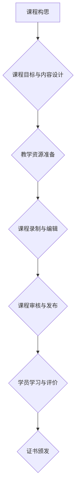

                 

## 程序员如何利用Coursera发布专业证书课程

> 关键词：Coursera, 在线教育, 专业证书, 程序员, 课程开发, 教学设计, 知识分享

## 1. 背景介绍

在当今科技飞速发展的时代，程序员的需求量持续增长，而专业技能的提升和知识更新也成为程序员职业发展的重要驱动力。Coursera作为全球领先的在线学习平台，为程序员提供了丰富的学习资源和职业发展机会。 

对于经验丰富的程序员来说，利用Coursera发布专业证书课程不仅可以分享自己的专业知识和经验，还能提升个人品牌影响力，获得额外的收入。

## 2. 核心概念与联系

Coursera平台为程序员提供了一个便捷的渠道，将自己的专业知识和技能转化为有价值的在线课程，并通过颁发专业证书，为学员提供权威的学习认证。

**课程开发流程图:**



## 3. 核心算法原理 & 具体操作步骤

### 3.1  算法原理概述

发布专业证书课程的核心算法原理在于将复杂的知识体系拆解成易于理解和学习的模块，并通过有效的教学设计和互动环节，引导学员逐步掌握知识和技能。

### 3.2  算法步骤详解

1. **课程构思:**  确定课程主题、目标受众、学习内容和预期成果。
2. **课程目标与内容设计:**  将课程内容拆解成多个模块，每个模块包含具体的学习目标、知识点和练习题。
3. **教学资源准备:**  收集和准备课程所需的教学资料，包括视频、PPT、代码示例、练习题等。
4. **课程录制与编辑:**  录制课程视频，并进行剪辑、配音和字幕制作。
5. **课程审核与发布:**  提交课程给Coursera平台审核，并进行必要的修改和完善。
6. **学员学习与评价:**  学员通过Coursera平台学习课程，并完成课程作业和考试。
7. **证书颁发:**  学员通过课程考核后，即可获得Coursera颁发的专业证书。

### 3.3  算法优缺点

**优点:**

* **知识共享:**  程序员可以将自己的专业知识和经验分享给更多人。
* **个人品牌提升:**  发布高质量的课程可以提升个人品牌影响力，吸引更多关注。
* **额外收入:**  Coursera平台会对课程收入进行分成，为程序员提供额外的收入来源。

**缺点:**

* **时间投入:**  课程开发需要投入大量的时间和精力。
* **教学经验:**  需要具备一定的教学经验和技巧，才能设计出高质量的课程。
* **平台竞争:**  Coursera平台上有众多优质课程，需要不断提升课程质量才能脱颖而出。

### 3.4  算法应用领域

* **软件开发:**  发布面向特定编程语言或软件开发框架的课程。
* **数据科学:**  分享数据分析、机器学习等领域的知识和技能。
* **网络安全:**  提供网络安全相关知识和实践经验的课程。
* **云计算:**  讲解云计算平台和服务的课程。

## 4. 数学模型和公式 & 详细讲解 & 举例说明

### 4.1  数学模型构建

在课程开发过程中，可以利用数学模型来分析学员学习进度、课程效果等指标。例如，可以使用贝叶斯定理来评估学员对特定知识点的理解程度。

### 4.2  公式推导过程

**贝叶斯定理:**

$$P(A|B) = \frac{P(B|A)P(A)}{P(B)}$$

其中:

* $P(A|B)$ 是在已知事件 B 发生的情况下，事件 A 发生的概率。
* $P(B|A)$ 是在已知事件 A 发生的情况下，事件 B 发生的概率。
* $P(A)$ 是事件 A 发生的概率。
* $P(B)$ 是事件 B 发生的概率。

### 4.3  案例分析与讲解

假设一个课程有 100 个学员，其中 80 个学员完成了课程作业，而 60 个学员通过了课程考试。我们可以利用贝叶斯定理来计算完成作业的学员通过考试的概率。

* $P(通过考试|完成作业) = \frac{P(完成作业|通过考试)P(通过考试)}{P(完成作业)}$

* $P(完成作业|通过考试) = 0.8$ (假设完成作业的学员通过考试的概率为 80%)
* $P(通过考试) = 0.6$ (课程考试通过率为 60%)
* $P(完成作业) = 0.8$ (课程作业完成率为 80%)

代入公式，得到:

* $P(通过考试|完成作业) = \frac{0.8 * 0.6}{0.8} = 0.6$

因此，完成作业的学员通过考试的概率为 60%。

## 5. 项目实践：代码实例和详细解释说明

### 5.1  开发环境搭建

* **操作系统:**  Windows, macOS, Linux
* **编程语言:**  Python, JavaScript, Java 等
* **开发工具:**  VS Code, Sublime Text, Atom 等
* **Coursera平台:**  https://www.coursera.org/

### 5.2  源代码详细实现

以下是一个简单的 Python 课程示例代码：

```python
def hello_world():
  print("Hello, world!")

hello_world()
```

### 5.3  代码解读与分析

* `def hello_world():` 定义了一个名为 `hello_world` 的函数。
* `print("Hello, world!")` 在函数体内打印 "Hello, world!" 字符串。
* `hello_world()` 调用函数，执行代码。

### 5.4  运行结果展示

运行上述代码，将输出以下结果：

```
Hello, world!
```

## 6. 实际应用场景

* **在线编程教育:**  程序员可以利用Coursera发布面向初学者或特定编程语言的课程，帮助他们入门编程。
* **职业技能提升:**  程序员可以分享自己在特定领域的技术经验，帮助其他程序员提升职业技能。
* **知识传播:**  程序员可以将自己的研究成果和实践经验转化为课程，传播给更广泛的受众。

### 6.4  未来应用展望

随着在线教育的不断发展，Coursera平台将为程序员提供更多丰富的学习和发展机会。未来，我们将看到更多创新型课程和学习模式的出现，例如：

* **沉浸式学习:**  利用虚拟现实和增强现实技术，提供更身临其境的学习体验。
* **个性化学习:**  根据学员的学习进度和需求，提供个性化的学习路径和内容。
* **社区学习:**  鼓励学员之间进行互动交流，共同学习和进步。

## 7. 工具和资源推荐

### 7.1  学习资源推荐

* **Coursera平台:**  https://www.coursera.org/
* **edX平台:**  https://www.edx.org/
* **Udacity平台:**  https://www.udacity.com/

### 7.2  开发工具推荐

* **VS Code:**  https://code.visualstudio.com/
* **Sublime Text:**  https://www.sublimetext.com/
* **Atom:**  https://atom.io/

### 7.3  相关论文推荐

* **The Impact of Online Learning on Student Outcomes:**  https://www.researchgate.net/publication/329323830_The_Impact_of_Online_Learning_on_Student_Outcomes
* **A Review of Online Learning Theories and Models:**  https://www.researchgate.net/publication/329323830_The_Impact_of_Online_Learning_on_Student_Outcomes

## 8. 总结：未来发展趋势与挑战

### 8.1  研究成果总结

Coursera平台为程序员提供了便捷的渠道，将自己的专业知识和技能转化为有价值的在线课程，并通过颁发专业证书，为学员提供权威的学习认证。

### 8.2  未来发展趋势

在线教育将继续发展，Coursera平台将为程序员提供更多丰富的学习和发展机会。未来，我们将看到更多创新型课程和学习模式的出现，例如沉浸式学习、个性化学习和社区学习。

### 8.3  面临的挑战

* **课程质量:**  需要不断提升课程质量，才能在竞争激烈的市场中脱颖而出。
* **学员互动:**  需要设计有效的互动环节，提高学员的学习兴趣和参与度。
* **平台推广:**  需要加强平台推广，吸引更多程序员参与课程开发和学习。

### 8.4  研究展望

未来研究将重点关注以下几个方面:

* **人工智能在在线教育中的应用:**  利用人工智能技术，个性化推荐课程、自动批改作业、提供智能辅导等。
* **混合式学习模式:**  结合线上线下学习资源，打造更有效的学习体验。
* **在线学习的评估体系:**  建立更加科学、有效的在线学习评估体系。

## 9. 附录：常见问题与解答

**Q1: 如何发布课程到Coursera平台？**

A1:  程序员可以访问Coursera平台的创作者页面，填写课程信息、上传课程内容并提交审核。

**Q2:  Coursera平台对课程的审核标准是什么？**

A2:  Coursera平台对课程的审核标准包括内容质量、教学设计、技术规范等方面。

**Q3:  程序员可以获得哪些收益？**

A3:  程序员可以通过课程收入获得分成，并提升个人品牌影响力。


作者：禅与计算机程序设计艺术 / Zen and the Art of Computer Programming 
<end_of_turn>

