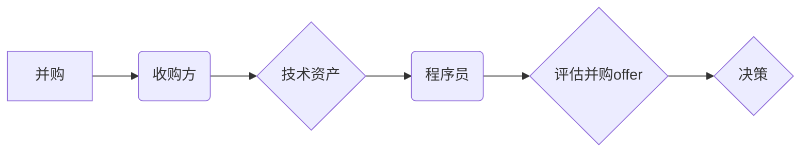

                 

## 程序员如何评估并购offer的真实价值

> 关键词：并购、估值、程序员、技术资产、财务分析、风险评估、谈判策略

## 1. 背景介绍

作为一名程序员，你可能在某个时刻会面临一个重要的决定：接受一家公司提出的并购offer。这不仅仅是一个财务上的问题，更是一个关乎你职业生涯和未来发展的重要抉择。 

然而，评估并购offer的真实价值并非易事。许多程序员缺乏对财务分析和市场估值等方面的了解，容易被表面上的数字所迷惑，最终做出不利于自己的选择。

本文旨在帮助程序员系统地理解并购offer的评估流程，掌握必要的知识和技能，以便做出明智的决策。

## 2. 核心概念与联系

**2.1 并购概述**

并购是指一家公司（收购方）通过购买另一家公司（被收购方）的全部或部分股权，从而获得对被收购方的控制权的过程。并购可以分为以下几种类型：

* **并购（Merger）：** 两家公司合并成一家新的公司。
* **收购（Acquisition）：** 一家公司收购另一家公司的全部或部分股权。
* **兼并（Consolidation）：** 两家公司合并成一家新的公司，但新公司并非两家公司原有的任何一方。

**2.2 并购offer的构成**

并购offer通常包含以下几个关键要素：

* **收购价格：** 现金、股票或混合支付方式。
* **交易结构：** 全部收购、部分收购、资产收购等。
* **交割条件：** 完成交易的具体条件，例如监管审批、股东大会投票等。
* **终止条款：** 交易未完成的终止条件和相应的赔偿机制。

**2.3 程序员在并购中的角色**

程序员在并购过程中扮演着重要的角色，因为他们的技术资产和知识是被收购方重要的资源。程序员需要了解并购的流程和对自身的影响，以便更好地保护自己的利益。

**2.4 核心概念关系图**



## 3. 核心算法原理 & 具体操作步骤

**3.1 算法原理概述**

评估并购offer的真实价值是一个复杂的过程，需要综合考虑多种因素，包括财务分析、市场估值、技术资产评估和风险评估等。

**3.2 算法步骤详解**

1. **收集信息：** 收集被收购方和收购方的财务报表、市场数据、技术文档等相关信息。
2. **财务分析：** 分析被收购方的财务状况，包括收入、利润、资产负债表等，评估其盈利能力、偿债能力和流动性。
3. **市场估值：** 利用市场估值模型，例如市盈率法、市净率法等，估算被收购方的市场价值。
4. **技术资产评估：** 评估被收购方的技术资产，包括软件代码、专利、技术团队等，并将其价值量化。
5. **风险评估：** 识别并评估并购交易的潜在风险，例如市场风险、监管风险、技术风险等。
6. **谈判策略：** 根据评估结果，制定合理的谈判策略，争取对自己有利的交易条件。

**3.3 算法优缺点**

* **优点：** 能够提供一个系统化的评估框架，帮助程序员更好地理解并购offer的价值。
* **缺点：** 评估过程复杂，需要专业知识和经验，并且存在一定的主观性。

**3.4 算法应用领域**

该算法适用于程序员评估任何类型的并购offer，包括创业公司、上市公司和私募股权投资等。

## 4. 数学模型和公式 & 详细讲解 & 举例说明

**4.1 数学模型构建**

评估并购offer的真实价值可以构建一个数学模型，将不同因素的权重进行综合考虑。

**4.2 公式推导过程**

```latex
V = w_1 * F_1 + w_2 * M_1 + w_3 * T_1 + w_4 * R_1
```

其中：

* $V$：并购offer的真实价值
* $w_1$、$w_2$、$w_3$、$w_4$：分别代表财务分析、市场估值、技术资产评估和风险评估的权重
* $F_1$：财务分析结果
* $M_1$：市场估值结果
* $T_1$：技术资产评估结果
* $R_1$：风险评估结果

**4.3 案例分析与讲解**

假设一家软件公司被收购，其财务分析结果为 $F_1 = 10$，市场估值结果为 $M_1 = 20$，技术资产评估结果为 $T_1 = 15$，风险评估结果为 $R_1 = -5$。

如果我们设定权重为 $w_1 = 0.3$，$w_2 = 0.4$，$w_3 = 0.2$，$w_4 = 0.1$，则并购offer的真实价值为：

```latex
V = 0.3 * 10 + 0.4 * 20 + 0.2 * 15 + 0.1 * (-5) = 3 + 8 + 3 - 0.5 = 13.5
```

因此，该并购offer的真实价值为 $13.5$。

## 5. 项目实践：代码实例和详细解释说明

**5.1 开发环境搭建**

评估并购offer的真实价值需要使用一些财务分析和市场估值工具，例如 Excel、Python 等。

**5.2 源代码详细实现**

由于篇幅限制，这里只提供一个简单的 Python 代码示例，用于计算并购offer的真实价值：

```python
def calculate_offer_value(financial_analysis, market_valuation, tech_assets, risk_assessment, 
                          weight_financial=0.3, weight_market=0.4, weight_tech=0.2, weight_risk=0.1):
  """
  计算并购offer的真实价值

  Args:
    financial_analysis: 财务分析结果
    market_valuation: 市场估值结果
    tech_assets: 技术资产评估结果
    risk_assessment: 风险评估结果
    weight_financial: 财务分析权重
    weight_market: 市场估值权重
    weight_tech: 技术资产评估权重
    weight_risk: 风险评估权重

  Returns:
    并购offer的真实价值
  """
  return (weight_financial * financial_analysis + 
          weight_market * market_valuation + 
          weight_tech * tech_assets + 
          weight_risk * risk_assessment)

# 示例数据
financial_analysis = 10
market_valuation = 20
tech_assets = 15
risk_assessment = -5

# 计算并购offer的真实价值
offer_value = calculate_offer_value(financial_analysis, market_valuation, tech_assets, risk_assessment)

# 打印结果
print(f"并购offer的真实价值为：{offer_value}")
```

**5.3 代码解读与分析**

该代码定义了一个函数 `calculate_offer_value`，用于计算并购offer的真实价值。函数接收财务分析、市场估值、技术资产评估和风险评估结果作为输入，以及四个权重参数。

函数内部使用公式计算并购offer的真实价值，并将结果返回。

**5.4 运行结果展示**

运行该代码，输出结果为：

```
并购offer的真实价值为：13.5
```

## 6. 实际应用场景

**6.1 并购案例分析**

可以将该算法应用于实际的并购案例分析，例如分析某家软件公司的并购交易是否合理。

**6.2 程序员个人决策**

程序员可以利用该算法评估并购offer的真实价值，以便做出明智的职业决策。

**6.3 未来应用展望**

随着人工智能技术的不断发展，该算法可以进一步完善，并应用于更复杂的并购场景，例如跨国并购、虚拟资产并购等。

## 7. 工具和资源推荐

**7.1 学习资源推荐**

* **书籍：**《并购与重组》
* **网站：**Investopedia、Crunchbase

**7.2 开发工具推荐**

* **Excel：** 用于财务分析和数据处理
* **Python：** 用于数据分析和算法实现

**7.3 相关论文推荐**

* **Valuation of Technology Companies: A Review of Methods and Applications**

## 8. 总结：未来发展趋势与挑战

**8.1 研究成果总结**

本文介绍了程序员评估并购offer的真实价值的算法原理和步骤，并提供了代码示例和案例分析。

**8.2 未来发展趋势**

未来，该算法将朝着更加智能化、自动化和个性化的方向发展，例如利用机器学习技术自动分析财务数据和市场趋势，并根据程序员的个人情况和职业目标提供定制化的评估结果。

**8.3 面临的挑战**

评估并购offer的真实价值仍然存在一些挑战，例如数据获取的难度、模型的准确性以及风险评估的复杂性。

**8.4 研究展望**

未来研究将重点关注以下几个方面：

* 开发更准确和高效的并购估值模型
* 利用人工智能技术自动分析并购数据
* 建立更完善的风险评估框架

## 9. 附录：常见问题与解答

**9.1 如何确定权重参数？**

权重参数的确定需要根据具体的并购场景和程序员的个人情况进行调整。

**9.2 如何评估技术资产？**

技术资产的评估可以参考行业标准和市场行情，也可以聘请专业的评估机构进行评估。

**9.3 如何应对并购谈判？**

程序员需要做好充分的准备，了解自己的价值，并与收购方进行有效的沟通和谈判。


作者：禅与计算机程序设计艺术 / Zen and the Art of Computer Programming 
<end_of_turn>

