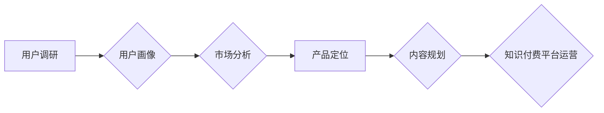

                 

## 程序员如何进行知识付费的用户调研

> 关键词：知识付费、用户调研、程序员、市场分析、产品定位、需求挖掘、付费用户

## 1. 背景介绍

知识付费市场近年来蓬勃发展，尤其是在科技领域，程序员群体作为技术创新的主力军，对学习新技术、提升技能的需求日益强烈。知识付费平台应运而生，为程序员提供各种在线课程、教程、书籍等学习资源。然而，知识付费市场竞争激烈，想要脱颖而出，吸引程序员付费学习，就需要深入了解用户的需求和痛点。

用户调研是知识付费平台成功运营的关键环节，它可以帮助平台了解目标用户的特征、学习习惯、付费意愿等信息，从而制定更精准的市场策略、产品定位和内容规划。

## 2. 核心概念与联系

**2.1 知识付费用户调研**

知识付费用户调研是指针对知识付费平台的用户群体进行系统性的调查研究，以了解他们的需求、行为、偏好等信息，为平台的运营和产品开发提供决策依据。

**2.2 用户画像**

用户画像是指对目标用户进行细致的描述，包括他们的年龄、性别、职业、收入、兴趣爱好、学习习惯、付费意愿等方面的信息。

**2.3 市场分析**

市场分析是指对知识付费市场进行全面的研究，包括市场规模、竞争格局、用户需求、发展趋势等方面的信息。

**2.4 产品定位**

产品定位是指根据用户调研和市场分析结果，确定知识付费平台的目标用户群体和核心产品价值，并制定相应的营销策略。

**2.5 内容规划**

内容规划是指根据用户需求和市场趋势，制定知识付费平台的课程体系、学习资源、更新频率等方面的策略。

**Mermaid 流程图**



## 3. 核心算法原理 & 具体操作步骤

**3.1 算法原理概述**

用户调研的核心算法原理是基于数据分析和统计学方法，通过收集和分析用户数据，挖掘用户需求和行为模式。常用的算法包括：

* **聚类算法:** 将用户根据他们的特征和行为进行分组，形成用户画像。
* **关联规则挖掘算法:** 发现用户行为之间的关联关系，例如哪些用户同时购买了哪些课程。
* **预测模型算法:** 根据历史数据预测用户的未来行为，例如用户的付费意愿。

**3.2 算法步骤详解**

1. **数据收集:** 收集用户相关数据，包括用户基本信息、学习行为、付费行为、反馈意见等。
2. **数据清洗:** 对收集到的数据进行清洗和处理，去除无效数据、缺失值等。
3. **数据分析:** 使用聚类算法、关联规则挖掘算法等对数据进行分析，挖掘用户需求和行为模式。
4. **用户画像构建:** 根据分析结果，构建用户画像，描述目标用户的特征和行为。
5. **市场分析:** 分析知识付费市场规模、竞争格局、用户需求等信息。
6. **产品定位:** 根据用户调研和市场分析结果，确定知识付费平台的目标用户群体和核心产品价值。
7. **内容规划:** 根据用户需求和市场趋势，制定知识付费平台的课程体系、学习资源、更新频率等方面的策略。

**3.3 算法优缺点**

* **优点:** 能够有效地挖掘用户需求和行为模式，为知识付费平台的运营和产品开发提供决策依据。
* **缺点:** 需要大量的用户数据作为支撑，数据分析和处理需要一定的技术能力。

**3.4 算法应用领域**

* **用户画像构建:** 了解用户的特征、行为、偏好等信息，为个性化推荐、精准营销提供支持。
* **市场分析:** 分析市场规模、竞争格局、用户需求等信息，为产品定位、市场策略制定提供参考。
* **内容规划:** 了解用户的学习需求和兴趣爱好，为课程体系、学习资源的开发提供方向。
* **付费预测:** 根据用户的学习行为和付费意愿，预测用户的付费可能性，为营销推广提供依据。

## 4. 数学模型和公式 & 详细讲解 & 举例说明

**4.1 数学模型构建**

用户调研中常用的数学模型包括：

* **贝叶斯定理:** 用于计算用户付费的概率，根据用户的学习行为、付费历史等信息进行预测。
* **回归模型:** 用于预测用户的学习时长、学习效果等指标，根据用户的学习行为、个人特征等信息进行建模。
* **聚类模型:** 用于将用户进行分组，根据用户的学习行为、兴趣爱好等信息进行聚类分析。

**4.2 公式推导过程**

* **贝叶斯定理:**

$$P(A|B) = \frac{P(B|A)P(A)}{P(B)}$$

其中：

* $P(A|B)$ 是在已知事件 B 发生的情况下，事件 A 发生的概率。
* $P(B|A)$ 是在已知事件 A 发生的情况下，事件 B 发生的概率。
* $P(A)$ 是事件 A 发生的概率。
* $P(B)$ 是事件 B 发生的概率。

**4.3 案例分析与讲解**

假设我们有一个知识付费平台，想要预测用户是否会付费学习某个课程。我们可以使用贝叶斯定理来计算用户的付费概率。

* $A$: 用户付费学习课程
* $B$: 用户观看课程的视频时长超过 30 分钟

我们可以根据历史数据收集以下信息：

* $P(B|A)$: 用户观看课程视频时长超过 30 分钟的概率，如果用户付费学习了课程。
* $P(A)$: 用户付费学习课程的概率。
* $P(B)$: 用户观看课程视频时长超过 30 分钟的概率。

然后，我们可以使用贝叶斯定理计算 $P(A|B)$，即在用户观看课程视频时长超过 30 分钟的情况下，用户付费学习课程的概率。

## 5. 项目实践：代码实例和详细解释说明

**5.1 开发环境搭建**

* Python 3.x 环境
* Jupyter Notebook 或 VS Code 等代码编辑器
* 数据分析库：Pandas, NumPy, Scikit-learn 等

**5.2 源代码详细实现**

```python
import pandas as pd
from sklearn.cluster import KMeans

# 加载用户数据
data = pd.read_csv('user_data.csv')

# 数据预处理
# ...

# 使用 KMeans 聚类算法进行用户画像构建
kmeans = KMeans(n_clusters=5)
data['cluster'] = kmeans.fit_predict(data[['age', 'income', 'learning_time']])

# 分析每个聚类的用户特征
for i in range(5):
    print(f'Cluster {i}:')
    print(data[data['cluster'] == i].describe())
```

**5.3 代码解读与分析**

* 代码首先加载用户数据，并进行必要的预处理，例如缺失值处理、数据标准化等。
* 然后使用 KMeans 聚类算法将用户进行分组，每个聚类代表一个用户画像。
* 最后，代码分析每个聚类的用户特征，例如年龄、收入、学习时间等，以便更好地了解不同类型的用户。

**5.4 运行结果展示**

运行代码后，会输出每个聚类的用户特征描述，例如平均年龄、平均收入、平均学习时间等。

## 6. 实际应用场景

**6.1 用户画像构建**

根据用户调研数据，构建不同类型的用户画像，例如：

* **初学者:** 年龄较年轻，学习经验不足，对基础知识需求较高。
* **进阶用户:** 有一定的编程经验，对特定技术领域有深入学习需求。
* **企业用户:** 为了提升团队技能，需要学习最新的技术趋势。

**6.2 产品定位**

根据用户画像，确定知识付费平台的目标用户群体和核心产品价值。例如，针对初学者，可以提供基础编程课程和入门教程；针对进阶用户，可以提供高级技术课程和实战项目。

**6.3 内容规划**

根据用户需求和市场趋势，制定知识付费平台的课程体系、学习资源、更新频率等方面的策略。例如，可以根据用户反馈，调整课程内容和难度，并定期更新新的课程和学习资源。

**6.4 未来应用展望**

随着人工智能技术的不断发展，用户调研将更加智能化和自动化。例如，可以使用机器学习算法自动分析用户数据，并生成更精准的用户画像。

## 7. 工具和资源推荐

**7.1 学习资源推荐**

* **书籍:** 《数据挖掘导论》、《机器学习实战》
* **在线课程:** Coursera, edX, Udemy 等平台上的数据分析和机器学习课程

**7.2 开发工具推荐**

* **Python:** 数据分析和机器学习的常用编程语言
* **Jupyter Notebook:** 用于数据分析和代码调试的交互式笔记本环境
* **Pandas:** 用于数据处理和分析的 Python 库
* **Scikit-learn:** 用于机器学习的 Python 库

**7.3 相关论文推荐**

* **K-Means Clustering Algorithm:** https://en.wikipedia.org/wiki/K-means_clustering
* **Bayesian Networks:** https://en.wikipedia.org/wiki/Bayesian_network

## 8. 总结：未来发展趋势与挑战

**8.1 研究成果总结**

用户调研是知识付费平台成功运营的关键环节，通过数据分析和算法模型，可以有效地挖掘用户需求和行为模式，为平台的运营和产品开发提供决策依据。

**8.2 未来发展趋势**

* **人工智能技术应用:** 使用机器学习算法自动分析用户数据，生成更精准的用户画像。
* **个性化推荐:** 根据用户的学习行为和偏好，提供个性化的课程推荐。
* **实时数据分析:** 实时监控用户行为，及时调整产品策略。

**8.3 面临的挑战**

* **数据质量:** 用户数据质量直接影响调研结果的准确性，需要保证数据的完整性和准确性。
* **算法模型:** 需要不断改进算法模型，提高预测准确率和分析深度。
* **隐私保护:** 用户数据隐私保护是重要的伦理问题，需要采取相应的措施保障用户隐私安全。

**8.4 研究展望**

未来，用户调研将更加智能化、个性化和自动化，为知识付费平台提供更精准的决策支持，推动知识付费市场的发展。

## 9. 附录：常见问题与解答

**9.1 如何收集用户数据？**

可以通过以下方式收集用户数据：

* 用户注册信息
* 学习行为记录
* 课程评价和反馈
* 问卷调查

**9.2 如何进行数据分析？**

可以使用数据分析工具和技术，例如：

* **统计学方法:** 计算用户特征的平均值、标准差等指标。
* **聚类算法:** 将用户进行分组，形成用户画像。
* **关联规则挖掘算法:** 发现用户行为之间的关联关系。

**9.3 如何保证用户数据隐私安全？**

*  anonymize 用户数据，去除个人识别信息。
* 使用加密技术保护用户数据。
* 明确用户数据使用协议，获得用户的同意。


作者：禅与计算机程序设计艺术 / Zen and the Art of Computer Programming 
<end_of_turn>

