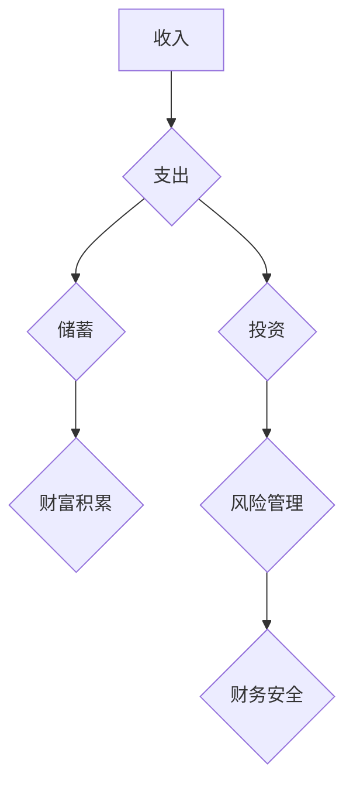

                 

## 程序员如何避免金钱陷阱

> 关键词：程序员，理财，投资，风险管理，财务规划，财富积累，开源节流，心态调整

## 1. 背景介绍

程序员作为科技时代不可或缺的职业，拥有着相对较高的收入水平和职业发展前景。然而，高收入并不意味着财富自由，许多程序员在面对金钱时容易陷入各种陷阱，导致财务状况不稳定甚至陷入困境。

程序员容易陷入金钱陷阱的原因多种多样：

* **收入波动性:**  一些程序员的收入可能受项目周期和市场需求影响，存在较大波动。
* **消费观念:**  部分程序员容易追求物质享受，过度消费，缺乏理财意识。
* **投资风险:**  一些程序员缺乏投资知识，盲目跟风投资，容易遭受损失。
* **缺乏财务规划:**  许多程序员没有制定合理的财务规划，导致资金使用不当，无法有效积累财富。

## 2. 核心概念与联系

程序员的财务状况与收入、支出、投资、风险管理等多个方面息息相关。 

**Mermaid 流程图:**



**核心概念:**

* **收入:** 程序员的主要收入来源包括薪资、项目报酬、兼职收入等。
* **支出:** 程序员的支出包括生活开销、娱乐消费、教育培训等。
* **储蓄:** 将一部分收入存入银行或其他安全场所，以备不时之需。
* **投资:** 将资金投入到股票、基金、房产等资产中，以获取收益。
* **风险管理:**  识别和评估投资风险，采取措施降低风险，保护资金安全。
* **财务规划:** 制定合理的财务目标，并制定相应的计划和策略，以实现财务目标。

## 3. 核心算法原理 & 具体操作步骤

**3.1 算法原理概述**

程序员理财的核心算法可以概括为“开源节流，合理投资”。

* **开源:**  提高收入，可以通过提升技能、寻找更高薪资的工作、接外包项目等方式增加收入。
* **节流:**  控制支出，可以通过制定预算、减少不必要的消费、提高生活效率等方式降低支出。
* **合理投资:**  根据自身风险承受能力和投资目标，选择合适的投资方式，分散投资风险，实现财富增长。

**3.2 算法步骤详解**

1. **记录收入和支出:** 使用记账软件或笔记本记录每天的收入和支出，了解资金流向。
2. **制定预算:**  根据收入和支出情况，制定合理的预算，分配资金用于生活、储蓄、投资等不同方面。
3. **建立储蓄习惯:**  将一部分收入定期存入储蓄账户，形成良好的储蓄习惯。
4. **学习投资知识:**  阅读书籍、参加课程、咨询专业人士，学习投资知识，了解不同的投资方式和风险。
5. **选择合适的投资方式:**  根据自身风险承受能力和投资目标，选择合适的投资方式，例如股票、基金、债券、房产等。
6. **分散投资风险:**  不要把所有资金投入到单一资产中，分散投资风险，降低投资损失。
7. **定期评估投资组合:**  定期评估投资组合的收益和风险，根据市场变化和自身情况进行调整。

**3.3 算法优缺点**

* **优点:**  简单易行，易于理解和实施。
* **缺点:**  需要持续的自我管理和自律，容易受到市场波动和个人情绪的影响。

**3.4 算法应用领域**

该算法适用于所有程序员，无论收入水平或投资经验如何。

## 4. 数学模型和公式 & 详细讲解 & 举例说明

**4.1 数学模型构建**

程序员的财务状况可以用以下数学模型来表示：

* **资产 (A):**  程序员拥有的所有财产，包括现金、存款、投资资产等。
* **负债 (L):**  程序员需要偿还的债务，包括贷款、信用卡债务等。
* **净资产 (N):**  资产减去负债，即 A - L。

**4.2 公式推导过程**

净资产增长率 (R) 可以用以下公式表示：

```latex
R = (A_t - A_{t-1}) / A_{t-1}
```

其中：

*  $A_t$ 是在时间 t 的资产
*  $A_{t-1}$ 是在时间 t-1 的资产

**4.3 案例分析与讲解**

假设程序员 A 在年初拥有 100,000 元资产，并在一年内增加了 20,000 元资产，同时还清了 5,000 元债务。

*  $A_t = 120,000$ 元
*  $A_{t-1} = 100,000$ 元
*  $L_t = L_{t-1} - 5,000$ 元

则程序员 A 的净资产增长率为：

```latex
R = (120,000 - 100,000) / 100,000 = 0.2 = 20%
```

## 5. 项目实践：代码实例和详细解释说明

**5.1 开发环境搭建**

程序员可以使用 Python 语言和 Pandas 库来实现财务管理工具。

**5.2 源代码详细实现**

```python
import pandas as pd

# 创建一个空的 DataFrame 来存储财务数据
data = pd.DataFrame(columns=['日期', '收入', '支出', '备注'])

# 添加财务数据
data.loc[0] = ['2023-01-01', 10000, 5000, '工资']
data.loc[1] = ['2023-01-02', 0, 2000, '吃饭']
data.loc[2] = ['2023-01-03', 0, 1000, '交通']

# 计算总收入和总支出
total_income = data['收入'].sum()
total_expense = data['支出'].sum()

# 打印结果
print(f'总收入: {total_income}')
print(f'总支出: {total_expense}')
```

**5.3 代码解读与分析**

这段代码首先创建了一个 Pandas DataFrame 来存储财务数据，然后添加了一些示例数据。最后，代码计算了总收入和总支出，并打印结果。

**5.4 运行结果展示**

```
总收入: 10000
总支出: 7000
```

## 6. 实际应用场景

程序员可以利用财务管理工具来跟踪收入和支出，制定预算，分析财务状况，并做出更理性的财务决策。

**6.1 财务状况分析**

程序员可以通过分析收入和支出情况，了解自己的财务状况，识别潜在的财务风险。

**6.2 预算制定和管理**

程序员可以使用财务管理工具制定预算，并跟踪预算执行情况，确保资金使用合理。

**6.3 投资决策支持**

程序员可以通过分析财务状况和风险承受能力，做出更合理的投资决策。

**6.4 未来应用展望**

随着人工智能和机器学习技术的进步，财务管理工具将更加智能化和个性化，能够提供更精准的财务建议和风险预警。

## 7. 工具和资源推荐

**7.1 学习资源推荐**

* **书籍:** 《理财入门》、《投资者的必修课》、《富爸爸穷爸爸》
* **课程:** 网易云课堂、Coursera、Udemy 等平台上的理财课程
* **网站:** 

**7.2 开发工具推荐**

* **记账软件:**  记账本、Money Manager、Expensify 等
* **预算管理工具:**  Mint、YNAB、Personal Capital 等
* **投资平台:**  支付宝、微信理财、券商APP 等

**7.3 相关论文推荐**

* **程序员理财行为研究**
* **程序员投资风险管理**
* **人工智能在财务管理中的应用**

## 8. 总结：未来发展趋势与挑战

**8.1 研究成果总结**

程序员理财是一个重要的议题，需要程序员具备良好的理财意识和技能。通过开源节流、合理投资等方法，程序员可以有效管理财务，实现财富积累。

**8.2 未来发展趋势**

随着科技的发展，程序员理财工具将更加智能化和个性化，能够提供更精准的财务建议和风险预警。

**8.3 面临的挑战**

程序员理财面临着信息不对称、风险意识薄弱、投资知识缺乏等挑战。

**8.4 研究展望**

未来研究可以关注程序员理财行为的个性化分析、人工智能在程序员理财中的应用、程序员理财风险管理等方面。

## 9. 附录：常见问题与解答

**9.1 如何制定合理的预算？**

制定合理的预算需要根据自己的收入、支出情况和财务目标进行规划。可以使用 50/30/20 法则，将收入分配到必要支出、 discretionary spending 和储蓄/投资。

**9.2 如何选择合适的投资方式？**

选择合适的投资方式需要根据自身的风险承受能力、投资目标和时间期限进行考虑。可以咨询专业人士，了解不同的投资方式和风险收益特征。

**9.3 如何避免投资风险？**

投资风险是不可避免的，但可以通过分散投资、控制投资比例、定期评估投资组合等方式降低风险。

**9.4 如何培养良好的理财习惯？**

培养良好的理财习惯需要坚持记录收入和支出、制定预算、定期评估财务状况、学习理财知识等。


作者：禅与计算机程序设计艺术 / Zen and the Art of Computer Programming 
<end_of_turn>

