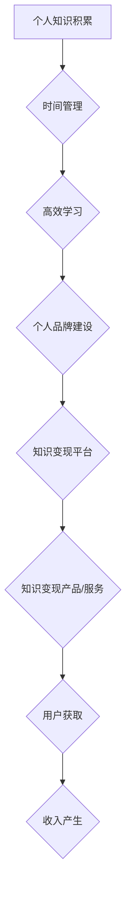

                 

## 程序员的知识变现时间管理

> 关键词：知识变现、时间管理、程序员、效率提升、个人品牌、技术博客、开源项目、课程开发、咨询服务

## 1. 背景介绍

在当今科技飞速发展的时代，程序员作为数字时代的核心力量，拥有着巨大的知识和技能价值。然而，如何将自身的技术能力转化为经济效益，有效地管理时间，并打造个人品牌，成为许多程序员面临的共同挑战。

传统的程序员工作模式往往以项目为中心，时间被项目进度和需求所支配。这种模式虽然能够带来稳定的收入，但缺乏主动性和可持续性。随着技术的不断更新迭代，程序员需要不断学习新知识，提升自身技能，才能保持竞争力。

知识变现，是指将个人知识、技能和经验转化为经济价值的过程。对于程序员而言，知识变现可以采取多种形式，例如：

* **技术博客写作：**分享技术经验、撰写技术文章，积累粉丝，获得广告收入或赞助。
* **开源项目开发：**开发开源软件，积累贡献，提升个人知名度，吸引雇主或合作机会。
* **课程开发：**将自身技术知识录制成课程，通过在线平台销售，获得被动收入。
* **咨询服务：**为企业或个人提供技术咨询服务，解决技术难题，获得咨询费。

## 2. 核心概念与联系

知识变现的核心在于将个人知识资产转化为有价值的产品或服务，并通过有效的营销和推广，触达目标用户。

**时间管理**是知识变现的关键要素之一。程序员需要合理规划时间，专注于高价值的任务，并避免时间浪费。

**个人品牌建设**是知识变现的基石。程序员需要打造自己的个人品牌，提升自身知名度和影响力，吸引更多用户关注和支持。

**以下是一个简单的流程图，展示了知识变现与时间管理的关系：**



## 3. 核心算法原理 & 具体操作步骤

### 3.1  算法原理概述

时间管理的核心算法是**时间分配算法**，其目的是根据任务重要性和紧急程度，合理分配时间，提高工作效率。

常见的**时间分配算法**包括：

* **艾森豪威尔矩阵法：**将任务按照重要性和紧急程度进行分类，并制定不同的处理策略。
* **番茄工作法：**将工作时间划分为25分钟的间隔，并在每个间隔结束后进行5分钟的休息，提高专注力。
* **帕累托法则：**认为80%的结果来自于20%的努力，因此需要优先处理最重要的事情。

### 3.2  算法步骤详解

**以艾森豪威尔矩阵法为例，其具体操作步骤如下：**

1. 列出所有待办事项。
2. 将任务按照重要性和紧急程度进行分类，分为四个象限：
    * **重要且紧急：**立即处理。
    * **重要但不紧急：**安排时间处理。
    * **紧急但不重要：**委托他人处理。
    * **不重要不紧急：**删除或忽略。
3. 根据分类结果，制定不同的处理策略，并合理分配时间。

### 3.3  算法优缺点

**艾森豪威尔矩阵法的优点：**

* 简单易懂，易于实施。
* 可以帮助程序员优先处理重要任务，提高工作效率。

**艾森豪威尔矩阵法的缺点：**

* 难以准确判断任务的重要性与紧急程度。
* 对于一些重复性任务，难以有效分类。

### 3.4  算法应用领域

时间分配算法广泛应用于程序员的个人时间管理、项目管理、团队协作等领域。

## 4. 数学模型和公式 & 详细讲解 & 举例说明

### 4.1  数学模型构建

时间管理可以抽象为一个数学模型，其中：

* **T** 代表总时间。
* **W** 代表工作时间。
* **R** 代表休息时间。
* **E** 代表效率。

**数学模型：**

$$T = W + R$$

$$E = \frac{W}{T}$$

### 4.2  公式推导过程

**效率**的计算公式可以推导如下：

$$E = \frac{W}{T} = \frac{W}{W+R}$$

### 4.3  案例分析与讲解

假设一个程序员每天有8小时的时间，其中工作时间为6小时，休息时间为2小时。

根据公式，该程序员的效率为：

$$E = \frac{6}{8} = 0.75$$

这意味着该程序员在工作时间内完成了80%的任务。

## 5. 项目实践：代码实例和详细解释说明

### 5.1  开发环境搭建

为了更好地进行知识变现，程序员需要搭建一个合适的开发环境。

* **博客平台：**可以选择WordPress、Medium、GitHub Pages等平台搭建个人博客。
* **开源项目托管平台：**可以选择GitHub、GitLab、Bitbucket等平台托管开源项目。
* **在线课程平台：**可以选择Udemy、Coursera、Skillshare等平台发布在线课程。

### 5.2  源代码详细实现

以下是一个简单的Python代码示例，用于计算程序员的工作效率：

```python
def calculate_efficiency(work_hours, total_hours):
  """
  计算程序员的工作效率。

  Args:
    work_hours: 工作时间（小时）。
    total_hours: 总时间（小时）。

  Returns:
    工作效率（0-1之间）。
  """
  if total_hours == 0:
    return 0
  return work_hours / total_hours

# 获取工作时间和总时间
work_hours = float(input("请输入工作时间（小时）："))
total_hours = float(input("请输入总时间（小时）："))

# 计算工作效率
efficiency = calculate_efficiency(work_hours, total_hours)

# 打印结果
print(f"您的工作效率为：{efficiency:.2f}")
```

### 5.3  代码解读与分析

该代码首先定义了一个名为`calculate_efficiency`的函数，该函数接受工作时间和总时间作为参数，并返回工作效率。

然后，程序获取用户输入的工作时间和总时间，并调用`calculate_efficiency`函数计算工作效率。最后，程序打印出计算结果。

### 5.4  运行结果展示

当用户输入工作时间为6小时，总时间为8小时时，程序将输出以下结果：

```
您的工作效率为：0.75
```

## 6. 实际应用场景

### 6.1  技术博客写作

程序员可以通过技术博客分享技术经验、撰写技术文章，积累粉丝，获得广告收入或赞助。

### 6.2  开源项目开发

程序员可以通过开发开源软件，积累贡献，提升个人知名度，吸引雇主或合作机会。

### 6.3  课程开发

程序员可以通过将自身技术知识录制成课程，通过在线平台销售，获得被动收入。

### 6.4  咨询服务

程序员可以通过为企业或个人提供技术咨询服务，解决技术难题，获得咨询费。

## 7. 工具和资源推荐

### 7.1  学习资源推荐

* **在线学习平台：**Coursera、Udemy、edX、Khan Academy
* **技术博客：**Hacker News、Medium、Stack Overflow
* **开源社区：**GitHub、GitLab、Bitbucket

### 7.2  开发工具推荐

* **代码编辑器：**VS Code、Sublime Text、Atom
* **版本控制系统：**Git
* **项目管理工具：**Trello、Jira、Asana

### 7.3  相关论文推荐

* **时间管理研究：**Eisenhower Matrix, Pomodoro Technique, Pareto Principle
* **知识变现研究：**The Sharing Economy, Platform Capitalism, Digital Entrepreneurship

## 8. 总结：未来发展趋势与挑战

### 8.1  研究成果总结

随着科技的不断发展，程序员的知识变现方式将更加多样化，效率也将不断提升。

### 8.2  未来发展趋势

* **人工智能技术的应用：**人工智能将帮助程序员更高效地管理时间，并提供更个性化的知识变现服务。
* **虚拟现实和增强现实技术的应用：**虚拟现实和增强现实技术将为程序员提供新的知识变现平台和机会。
* **区块链技术的应用：**区块链技术将为程序员提供更安全、透明的知识变现机制。

### 8.3  面临的挑战

* **知识产权保护：**如何有效保护程序员的知识产权，防止知识被盗用，是需要解决的关键问题。
* **平台竞争：**随着知识变现平台的不断涌现，程序员需要不断提升自身竞争力，才能在平台中脱颖而出。
* **技术更新迭代：**程序员需要不断学习新技术，提升自身技能，才能保持竞争力。

### 8.4  研究展望

未来，研究者将继续探索新的知识变现模式，并开发更有效的工具和技术，帮助程序员更好地实现知识变现，提升自身价值。

## 9. 附录：常见问题与解答

### 9.1  如何提高工作效率？

* **使用时间分配算法：**例如艾森豪威尔矩阵法、番茄工作法等。
* **避免时间浪费：**例如减少社交媒体使用时间、避免多任务处理等。
* **保持专注：**例如使用专注力训练软件、创造安静的工作环境等。

### 9.2  如何打造个人品牌？

* **建立个人网站或博客：**分享技术经验、撰写技术文章，积累粉丝。
* **积极参与开源项目：**积累贡献，提升个人知名度。
* **参加技术会议和活动：**与同行交流，拓展人脉。

### 9.3  如何进行知识变现？

* **技术博客写作：**分享技术经验，获得广告收入或赞助。
* **开源项目开发：**积累贡献，吸引雇主或合作机会。
* **课程开发：**录制技术课程，通过在线平台销售。
* **咨询服务：**为企业或个人提供技术咨询服务。


作者：禅与计算机程序设计艺术 / Zen and the Art of Computer Programming 
<end_of_turn>

