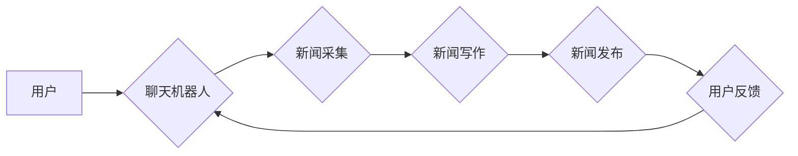

                 

## 聊天机器人新闻业：人工智能新闻采集和写作

> 关键词：聊天机器人、新闻采集、新闻写作、人工智能、自然语言处理、机器学习、深度学习

## 1. 背景介绍

新闻业正处于数字化转型和智能化升级的关键时期。传统新闻采集和写作模式面临着人力成本高、效率低、信息更新速度慢等挑战。而人工智能（AI）技术的快速发展为新闻业带来了新的机遇。

聊天机器人，作为AI技术的代表，凭借其强大的自然语言处理（NLP）能力，在新闻业的应用前景广阔。它可以自动采集新闻信息、生成新闻稿件、进行新闻编辑和校对，极大地提高新闻生产效率，降低成本，并为用户提供更个性化、实时化的新闻服务。

## 2. 核心概念与联系

### 2.1 聊天机器人

聊天机器人是一种能够与人类进行自然语言交互的智能系统。它通常基于规则、统计模型或深度学习算法，能够理解用户的意图，并生成相应的回复。

### 2.2 新闻采集

新闻采集是指从各种信息来源收集新闻信息的过程。传统新闻采集主要依赖人工搜索和筛选，效率低下。而AI驱动的新闻采集可以利用机器学习算法自动识别和提取新闻内容，并根据用户需求进行过滤和排序。

### 2.3 新闻写作

新闻写作是指根据采集到的新闻信息，用文字进行组织和表达的过程。AI驱动的新闻写作可以利用自然语言生成模型自动生成新闻稿件，并根据新闻类型和风格进行调整。

**核心概念与联系流程图**



## 3. 核心算法原理 & 具体操作步骤

### 3.1 算法原理概述

聊天机器人新闻业的核心算法主要包括：

* **自然语言处理（NLP）算法：** 用于理解和处理人类语言，包括文本分类、情感分析、关键词提取等。
* **机器学习（ML）算法：** 用于训练模型，识别新闻信息和生成新闻稿件。常见的ML算法包括支持向量机（SVM）、决策树、随机森林等。
* **深度学习（DL）算法：** 用于更复杂的NLP任务，例如机器翻译、文本摘要、对话生成等。常见的DL算法包括循环神经网络（RNN）、长短期记忆网络（LSTM）、生成对抗网络（GAN）等。

### 3.2 算法步骤详解

**新闻采集算法步骤：**

1. **数据获取：** 从互联网、数据库、API等各种来源获取新闻数据。
2. **数据预处理：** 对获取到的数据进行清洗、格式化、分词等预处理操作。
3. **特征提取：** 利用NLP算法提取新闻文本的关键特征，例如关键词、主题、情感等。
4. **新闻分类：** 根据提取的特征，将新闻数据进行分类，例如新闻类型、时效性、重要性等。
5. **信息筛选：** 根据用户需求，对分类后的新闻数据进行筛选，过滤掉不感兴趣的信息。

**新闻写作算法步骤：**

1. **新闻结构分析：** 利用NLP算法分析新闻文本的结构，例如标题、正文、摘要等。
2. **内容生成：** 根据新闻结构和内容，利用机器学习或深度学习模型生成新闻稿件。
3. **风格调整：** 根据新闻类型和目标读者，对生成的新闻稿件进行风格调整，例如语言简洁、准确、客观等。
4. **语法校对：** 利用语法检查工具对生成的新闻稿件进行语法校对，确保其准确性和流畅性。

### 3.3 算法优缺点

**优点：**

* **提高效率：** 自动化新闻采集和写作流程，大幅提高新闻生产效率。
* **降低成本：** 减少人工成本，降低新闻生产成本。
* **个性化服务：** 根据用户需求，提供个性化新闻内容和服务。
* **实时更新：** 可以实时采集和生成新闻信息，满足用户对新闻的及时性需求。

**缺点：**

* **缺乏创造力：** AI生成的新闻稿件可能缺乏原创性和深度思考。
* **信息准确性：** AI模型的训练数据可能存在偏差，导致生成的新闻信息存在误差。
* **伦理问题：** AI驱动的新闻生产可能引发伦理问题，例如信息操控、隐私泄露等。

### 3.4 算法应用领域

* **新闻门户网站：** 自动采集和生成新闻稿件，提高新闻更新速度和效率。
* **社交媒体平台：** 自动生成新闻摘要和推荐，增强用户体验。
* **企业新闻发布：** 自动生成公司新闻稿件，提高发布效率。
* **个性化新闻服务：** 根据用户兴趣和偏好，提供个性化新闻内容。

## 4. 数学模型和公式 & 详细讲解 & 举例说明

### 4.1 数学模型构建

新闻采集和写作算法通常基于统计模型或深度学习模型。

**统计模型：**

* **贝叶斯分类器：** 用于新闻分类，根据新闻文本的特征计算其属于不同类别概率。

$$P(C_i|x) = \frac{P(x|C_i)P(C_i)}{P(x)}$$

其中：

* $P(C_i|x)$：新闻文本 $x$ 属于类别 $C_i$ 的概率。
* $P(x|C_i)$：类别 $C_i$ 下新闻文本 $x$ 的概率。
* $P(C_i)$：类别 $C_i$ 的先验概率。
* $P(x)$：新闻文本 $x$ 的概率。

**深度学习模型：**

* **循环神经网络（RNN）：** 用于文本生成和理解，能够捕捉文本序列中的长距离依赖关系。

* **生成对抗网络（GAN）：** 用于生成高质量的文本，由生成器和判别器两部分组成，通过对抗训练生成逼真的文本。

### 4.2 公式推导过程

**贝叶斯分类器的公式推导：**

根据贝叶斯定理，我们可以得到新闻文本 $x$ 属于类别 $C_i$ 的概率：

$$P(C_i|x) = \frac{P(x|C_i)P(C_i)}{P(x)}$$

其中：

* $P(x|C_i)$：类别 $C_i$ 下新闻文本 $x$ 的概率，可以使用朴素贝叶斯假设进行计算。
* $P(C_i)$：类别 $C_i$ 的先验概率，可以通过训练数据统计得到。
* $P(x)$：新闻文本 $x$ 的概率，可以使用贝叶斯公式进行计算。

### 4.3 案例分析与讲解

**新闻分类案例：**

假设我们有一个新闻数据集，包含体育、财经、科技等不同类型的新闻。我们可以使用贝叶斯分类器对新闻进行分类。

首先，我们需要提取新闻文本的关键特征，例如关键词、主题、情感等。然后，我们可以根据训练数据计算每个类别下特征的概率分布。

当我们遇到一个新的新闻文本时，我们可以根据其特征计算其属于不同类别的概率，并选择概率最高的类别作为其分类结果。

## 5. 项目实践：代码实例和详细解释说明

### 5.1 开发环境搭建

* **操作系统：** Linux、macOS、Windows
* **编程语言：** Python
* **深度学习框架：** TensorFlow、PyTorch
* **NLP库：** NLTK、spaCy、Gensim

### 5.2 源代码详细实现

```python
# 导入必要的库
import nltk
from nltk.corpus import stopwords
from sklearn.feature_extraction.text import TfidfVectorizer
from sklearn.naive_bayes import MultinomialNB

# 下载停用词列表
nltk.download('stopwords')

# 定义新闻分类函数
def classify_news(news_text):
    # 1. 数据预处理
    # 移除停用词、标点符号等
    stop_words = set(stopwords.words('english'))
    processed_text = ' '.join([word for word in nltk.word_tokenize(news_text) if word.lower() not in stop_words and word.isalnum()])

    # 2. 特征提取
    vectorizer = TfidfVectorizer()
    features = vectorizer.fit_transform([processed_text])

    # 3. 模型训练
    # 使用朴素贝叶斯分类器
    classifier = MultinomialNB()
    classifier.fit(features, labels)

    # 4. 分类预测
    prediction = classifier.predict(features)
    return prediction[0]

# 示例用法
news_text = "Apple Inc. announced today that it will be releasing its new iPhone 15 on September 12th."
category = classify_news(news_text)
print(f"News category: {category}")
```

### 5.3 代码解读与分析

* **数据预处理：** 移除停用词、标点符号等，提高文本的质量。
* **特征提取：** 使用TF-IDF算法提取文本的关键特征，例如词频、重要性等。
* **模型训练：** 使用朴素贝叶斯分类器训练模型，将新闻文本与类别进行关联。
* **分类预测：** 根据训练好的模型，对新的新闻文本进行分类预测。

### 5.4 运行结果展示

运行上述代码，可以得到新闻文本的分类结果，例如“科技”。

## 6. 实际应用场景

### 6.1 新闻门户网站

* 自动采集新闻信息，例如财经、体育、科技等，并根据用户兴趣进行分类和推荐。
* 自动生成新闻摘要和标题，提高用户阅读体验。
* 自动校对新闻稿件，确保其准确性和流畅性。

### 6.2 社交媒体平台

* 自动生成新闻摘要和推荐，增强用户体验。
* 自动识别和过滤虚假新闻，维护平台信息安全。
* 自动生成新闻评论和回复，提高用户互动。

### 6.3 企业新闻发布

* 自动生成公司新闻稿件，提高发布效率。
* 自动翻译新闻稿件，方便海外传播。
* 自动分析新闻稿件的舆情趋势，帮助企业进行危机公关。

### 6.4 未来应用展望

* **更个性化、智能化的新闻服务：** 根据用户的阅读习惯、兴趣偏好等信息，提供更精准、更个性化的新闻内容和服务。
* **多模态新闻体验：** 将文本、图像、音频、视频等多种媒体形式融合，提供更丰富的新闻体验。
* **新闻事实核查和反虚假新闻：** 利用AI技术识别和过滤虚假新闻，维护新闻的真实性和可信度。

## 7. 工具和资源推荐

### 7.1 学习资源推荐

* **书籍：**
    * 《深度学习》
    * 《自然语言处理》
    * 《机器学习实战》
* **在线课程：**
    * Coursera
    * edX
    * Udacity

### 7.2 开发工具推荐

* **编程语言：** Python
* **深度学习框架：** TensorFlow、PyTorch
* **NLP库：** NLTK、spaCy、Gensim

### 7.3 相关论文推荐

* **BERT：** Devlin et al. (2018)
* **GPT-3：** Brown et al. (2020)
* **XLNet：** Yang et al. (2019)

## 8. 总结：未来发展趋势与挑战

### 8.1 研究成果总结

聊天机器人新闻业的应用前景广阔，已经取得了一定的研究成果。

* **新闻采集：** AI驱动的新闻采集可以自动识别和提取新闻信息，提高效率和准确性。
* **新闻写作：** AI可以生成高质量的新闻稿件，并根据新闻类型和风格进行调整。
* **新闻个性化：** AI可以根据用户的兴趣和偏好，提供个性化的新闻服务。

### 8.2 未来发展趋势

* **更智能化的新闻生成：** 利用更先进的深度学习算法，生成更原创、更具深度思考的新闻内容。
* **多模态新闻体验：** 将文本、图像、音频、视频等多种媒体形式融合，提供更丰富的新闻体验。
* **新闻事实核查和反虚假新闻：** 利用AI技术识别和过滤虚假新闻，维护新闻的真实性和可信度。

### 8.3 面临的挑战

* **数据质量问题：** AI模型的训练数据可能存在偏差，导致生成的新闻信息存在误差。
* **伦理问题：** AI驱动的新闻生产可能引发伦理问题，例如信息操控、隐私泄露等。
* **创造力问题：** AI生成的新闻稿件可能缺乏原创性和深度思考。

### 8.4 研究展望

未来，聊天机器人新闻业的研究方向将集中在以下几个方面：

* **提高AI模型的准确性和可靠性：** 通过改进训练数据、算法模型等，提高AI模型的准确性和可靠性。
* **解决AI伦理问题：** 制定相应的伦理规范和法律法规，规范AI驱动的新闻生产。
* **增强AI模型的创造力和深度思考能力：** 研究更先进的深度学习算法，赋予AI模型更强的创造力和深度思考能力。


## 9. 附录：常见问题与解答

**Q1：聊天机器人新闻业会取代人类记者吗？**

A1：聊天机器人新闻业可以提高新闻生产效率，但不会完全取代人类记者。人类记者仍然需要进行深度调查、采访和分析，为读者提供更深入、更全面的新闻报道。

**Q2：AI生成的新闻稿件是否准确可靠？**

A2：AI生成的新闻稿件需要经过人工审核和校对，才能保证其准确性和可靠性。

**Q3：聊天机器人新闻业会引发哪些伦理问题？**

A3：聊天机器人新闻业可能引发信息操控、隐私泄露、算法偏见等伦理问题。需要制定相应的伦理规范和法律法规，规范AI驱动的新闻生产。


作者：禅与计算机程序设计艺术 / Zen and the Art of Computer Programming<end_of_turn>

