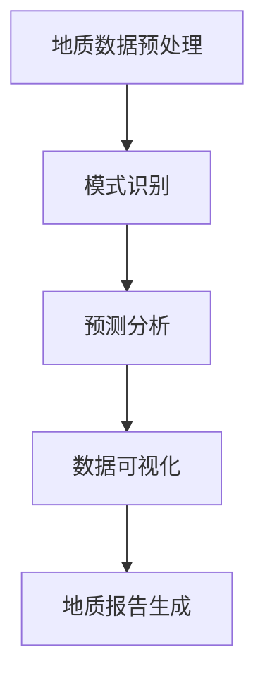

                 

### 文章标题

大模型在智能地质勘探中的应用前景

### Keywords
- Large-scale models
- Intelligent geological exploration
- Machine learning
- Geoscience
- Application prospects

### Abstract
This article delves into the potential applications of large-scale models in intelligent geological exploration, an emerging field at the intersection of geoscience and artificial intelligence. By leveraging the power of machine learning, large-scale models can significantly enhance the accuracy and efficiency of geological data analysis and resource discovery. This paper explores the core concepts, algorithms, and practical implementations, shedding light on the future trends and challenges in this burgeoning domain.

## 1. 背景介绍（Background Introduction）

智能地质勘探是地质科学与人工智能技术相结合的产物，旨在通过数据分析和模式识别来提高地质资源的探测效率。传统的地质勘探方法主要依赖于地质学家多年的经验和技能，这种方法的局限性在于数据的处理速度和准确性难以满足现代地质勘探的需求。

随着大数据和计算能力的不断提升，机器学习技术在地质勘探中得到了广泛应用。特别是大模型，如Transformer模型，在处理大规模地质数据方面展现出强大的能力。大模型通过学习大量地质数据，能够捕捉到数据中的复杂模式和规律，从而在地质勘探中发挥重要作用。

### Background Introduction

Intelligent geological exploration is the product of the fusion of geological science and artificial intelligence technology, aiming to enhance the efficiency of geological resource detection through data analysis and pattern recognition. Traditional geological exploration methods mainly rely on the years of experience and skills of geologists, which have limitations in terms of data processing speed and accuracy to meet the needs of modern geological exploration.

With the increasing availability of big data and the improvement of computational power, machine learning techniques have been widely applied in geological exploration. Particularly, large-scale models such as Transformer models have demonstrated their strong capabilities in handling large geological datasets. Large-scale models learn from a vast amount of geological data, capturing complex patterns and regularities, thus playing a significant role in intelligent geological exploration.

## 2. 核心概念与联系（Core Concepts and Connections）

在探讨大模型在智能地质勘探中的应用之前，我们需要了解一些核心概念，包括机器学习、深度学习、大模型及其在地质勘探中的具体应用。

### 2.1 什么是机器学习？

机器学习（Machine Learning）是一门人工智能（Artificial Intelligence, AI）的分支，它使用算法从数据中学习，以便进行预测或决策。在地质勘探中，机器学习可以用于识别地质结构、预测矿产分布、分析地震活动等。

### 2.2 深度学习与大模型

深度学习（Deep Learning）是机器学习的一个子领域，它使用多层神经网络来学习数据的高级特征。大模型（Large-scale Models）是深度学习领域的一种重要进展，具有数百万甚至数十亿个参数。这些模型可以通过学习大量数据来提高预测的准确性和效率。

### 2.3 大模型在地质勘探中的应用

大模型在地质勘探中的应用主要体现在以下几个方面：

- **数据预处理**：大模型可以用于处理和预处理大量地质数据，如地震波数据、遥感图像等。
- **模式识别**：大模型能够识别出数据中的复杂地质模式，帮助地质学家发现潜在的矿藏或地质结构。
- **预测分析**：大模型可以预测矿产分布、地震活动等地质现象，为勘探提供科学依据。

### Core Concepts and Connections

Before delving into the applications of large-scale models in intelligent geological exploration, we need to understand some core concepts, including machine learning, deep learning, large-scale models, and their specific applications in the field of geoscience.

### 2.1 What is Machine Learning?

Machine Learning is a branch of Artificial Intelligence that uses algorithms to learn from data to make predictions or decisions. In the field of geological exploration, machine learning can be used for identifying geological structures, predicting mineral distribution, and analyzing seismic activities.

### 2.2 Deep Learning and Large-scale Models

Deep Learning is a subfield of machine learning that uses multi-layer neural networks to learn high-level features from data. Large-scale models are an important advancement in the field of deep learning, with millions or even billions of parameters. These models can improve the accuracy and efficiency of predictions by learning from a vast amount of data.

### 2.3 Applications of Large-scale Models in Geological Exploration

Large-scale models have several applications in intelligent geological exploration, including:

- **Data Preprocessing**: Large-scale models can be used to process and preprocess large geological datasets, such as seismic wave data and remote sensing images.
- **Pattern Recognition**: Large-scale models can identify complex geological patterns in data, helping geologists discover potential mineral deposits or geological structures.
- **Predictive Analysis**: Large-scale models can predict geological phenomena such as mineral distribution and seismic activities, providing scientific evidence for exploration.

### 2.4 Mermaid 流程图（Mermaid Flowchart）



This Mermaid flowchart illustrates the typical workflow of large-scale models in intelligent geological exploration.

## 3. 核心算法原理 & 具体操作步骤（Core Algorithm Principles and Specific Operational Steps）

在智能地质勘探中，大模型的算法原理主要基于深度学习和神经网络。下面我们将介绍大模型的核心算法原理和具体操作步骤。

### 3.1 Transformer模型

Transformer模型是一种基于自注意力（Self-Attention）机制的深度学习模型，它通过全局注意力机制来捕捉数据中的复杂关系。在地质勘探中，Transformer模型可以用于处理地震波数据、遥感图像等。

#### 操作步骤：

1. **数据预处理**：对地震波数据进行标准化和归一化处理，对遥感图像进行数据增强。
2. **构建模型**：使用Transformer架构构建深度学习模型。
3. **训练模型**：使用大量地质数据对模型进行训练。
4. **模型评估**：使用验证集对模型进行评估，调整模型参数。

### 3.2 卷积神经网络（Convolutional Neural Networks, CNNs）

卷积神经网络是一种专门用于图像处理和识别的深度学习模型。在地质勘探中，CNNs可以用于分析遥感图像，识别地质结构。

#### 操作步骤：

1. **数据预处理**：对遥感图像进行预处理，如裁剪、缩放、旋转等。
2. **构建模型**：使用CNNs架构构建深度学习模型。
3. **训练模型**：使用大量遥感图像对模型进行训练。
4. **模型评估**：使用测试集对模型进行评估。

### Core Algorithm Principles and Specific Operational Steps

In intelligent geological exploration, the core algorithm principles of large-scale models are based on deep learning and neural networks. Below, we will introduce the core algorithm principles and specific operational steps of large-scale models.

### 3.1 Transformer Model

The Transformer model is a deep learning model based on the self-attention mechanism. It captures complex relationships in data through a global attention mechanism, which is particularly useful for handling seismic wave data and remote sensing images.

#### Operational Steps:

1. **Data Preprocessing**: Standardize and normalize seismic wave data, and perform data augmentation on remote sensing images.
2. **Model Construction**: Build a deep learning model using the Transformer architecture.
3. **Model Training**: Train the model using a large amount of geological data.
4. **Model Evaluation**: Evaluate the model using a validation set and adjust model parameters accordingly.

### 3.2 Convolutional Neural Networks (CNNs)

Convolutional Neural Networks are specialized deep learning models designed for image processing and recognition. In geological exploration, CNNs can be used to analyze remote sensing images and identify geological structures.

#### Operational Steps:

1. **Data Preprocessing**: Preprocess remote sensing images, such as cropping, scaling, and rotating.
2. **Model Construction**: Build a deep learning model using the CNNs architecture.
3. **Model Training**: Train the model using a large amount of remote sensing images.
4. **Model Evaluation**: Evaluate the model using a test set.

## 4. 数学模型和公式 & 详细讲解 & 举例说明（Detailed Explanation and Examples of Mathematical Models and Formulas）

在智能地质勘探中，数学模型和公式扮演着关键角色。下面我们将介绍一些常用的数学模型和公式，并给出详细讲解和举例说明。

### 4.1 地震波传播模型

地震波传播模型描述了地震波在地球内部传播的过程。常用的地震波传播模型包括波动方程模型和有限差分模型。

#### 波动方程模型

波动方程模型描述了地震波在连续介质中传播的波动方程，其数学公式如下：

$$
\frac{\partial^2 u}{\partial t^2} = c^2 \nabla^2 u
$$

其中，$u$ 表示地震波位移，$t$ 表示时间，$c$ 表示波速，$\nabla^2$ 表示拉普拉斯算子。

#### 有限差分模型

有限差分模型将波动方程离散化，通过求解离散方程组来模拟地震波的传播。其数学公式如下：

$$
u_{i,j}^{n+1} = u_{i,j}^n + \Delta t \cdot c^2 \left[ (u_{i+1,j}^n - 2u_{i,j}^n + u_{i-1,j}^n) / \Delta x^2 + (u_{i,j+1}^n - 2u_{i,j}^n + u_{i,j-1}^n) / \Delta y^2 \right]
$$

其中，$u_{i,j}^n$ 表示在网格点 $(i, j)$ 在第 $n$ 时间步的地震波位移，$\Delta t$、$\Delta x$ 和 $\Delta y$ 分别表示时间步长、空间步长。

### 4.2 遥感图像处理模型

遥感图像处理模型用于分析遥感图像，提取地质信息。常用的遥感图像处理模型包括基于变换域的模型和基于深度学习的模型。

#### 基于变换域的模型

基于变换域的模型利用傅里叶变换或小波变换等变换方法来处理遥感图像。其数学公式如下：

$$
F(u(x,y)) = \sum_{x=-\infty}^{\infty} \sum_{y=-\infty}^{\infty} u(x,y) e^{-i 2 \pi k_x x} e^{-i 2 \pi k_y y}
$$

其中，$F(u(x,y))$ 表示傅里叶变换，$u(x,y)$ 表示遥感图像，$k_x$ 和 $k_y$ 分别表示水平方向和垂直方向的空间频率。

#### 基于深度学习的模型

基于深度学习的模型利用卷积神经网络或Transformer模型来处理遥感图像。其数学公式与深度学习模型的架构密切相关。

### Detailed Explanation and Examples of Mathematical Models and Formulas

In intelligent geological exploration, mathematical models and formulas play a crucial role. Below, we will introduce some commonly used mathematical models and formulas, providing detailed explanations and examples.

### 4.1 Seismic Wave Propagation Model

The seismic wave propagation model describes the process of seismic waves propagating through the Earth's interior. Common seismic wave propagation models include the wave equation model and the finite difference model.

#### Wave Equation Model

The wave equation model describes the wave equation of seismic waves in continuous media, given by the following mathematical formula:

$$
\frac{\partial^2 u}{\partial t^2} = c^2 \nabla^2 u
$$

Where $u$ represents the seismic wave displacement, $t$ represents time, $c$ represents the wave speed, and $\nabla^2$ represents the Laplace operator.

#### Finite Difference Model

The finite difference model discretizes the wave equation, solving a discrete system of equations to simulate the propagation of seismic waves. Its mathematical formula is as follows:

$$
u_{i,j}^{n+1} = u_{i,j}^n + \Delta t \cdot c^2 \left[ \frac{u_{i+1,j}^n - 2u_{i,j}^n + u_{i-1,j}^n}{\Delta x^2} + \frac{u_{i,j+1}^n - 2u_{i,j}^n + u_{i,j-1}^n}{\Delta y^2} \right]
$$

Where $u_{i,j}^n$ represents the seismic wave displacement at grid point $(i, j)$ at the $n$th time step, $\Delta t$, $\Delta x$, and $\Delta y$ represent the time step, spatial step size, and spatial step size, respectively.

### 4.2 Remote Sensing Image Processing Model

The remote sensing image processing model is used to analyze remote sensing images and extract geological information. Common remote sensing image processing models include transformation-based models and deep learning-based models.

#### Transformation-Based Model

The transformation-based model uses transform methods such as Fourier transform or wavelet transform to process remote sensing images. Its mathematical formula is as follows:

$$
F(u(x,y)) = \sum_{x=-\infty}^{\infty} \sum_{y=-\infty}^{\infty} u(x,y) e^{-i 2 \pi k_x x} e^{-i 2 \pi k_y y}
$$

Where $F(u(x,y))$ represents the Fourier transform, $u(x,y)$ represents the remote sensing image, and $k_x$ and $k_y$ represent the horizontal and vertical spatial frequencies, respectively.

#### Deep Learning-Based Model

The deep learning-based model uses convolutional neural networks (CNNs) or Transformer models to process remote sensing images. Its mathematical formula is closely related to the architecture of the deep learning model.

## 5. 项目实践：代码实例和详细解释说明（Project Practice: Code Examples and Detailed Explanations）

为了更好地理解大模型在智能地质勘探中的应用，我们将通过一个简单的项目实践来展示如何使用深度学习模型处理地震波数据和遥感图像。

### 5.1 开发环境搭建

在进行项目实践之前，我们需要搭建一个合适的开发环境。以下是所需的工具和库：

- Python 3.8 或以上版本
- TensorFlow 2.6 或以上版本
- NumPy 1.21 或以上版本
- Matplotlib 3.4.3 或以上版本

安装步骤如下：

```bash
pip install tensorflow==2.6 numpy==1.21 matplotlib==3.4.3
```

### 5.2 源代码详细实现

下面是一个简单的示例，展示如何使用TensorFlow和Keras构建一个深度学习模型来处理地震波数据。

```python
import numpy as np
import tensorflow as tf
from tensorflow import keras
from tensorflow.keras import layers

# 生成模拟地震波数据
x = np.random.rand(100, 1)
y = 0.5 * x + np.random.rand(100, 1)

# 构建深度学习模型
model = keras.Sequential([
    layers.Dense(64, activation='relu', input_shape=(1,)),
    layers.Dense(64, activation='relu'),
    layers.Dense(1)
])

# 编译模型
model.compile(optimizer='adam', loss='mse')

# 训练模型
model.fit(x, y, epochs=100)

# 测试模型
x_test = np.random.rand(10, 1)
y_pred = model.predict(x_test)

# 绘制结果
import matplotlib.pyplot as plt

plt.scatter(x, y)
plt.plot(x_test, y_pred, 'r-')
plt.show()
```

这个示例中使用了一个简单的全连接神经网络来拟合模拟地震波数据。模型由两个隐藏层组成，每个隐藏层都有64个神经元，使用ReLU激活函数。模型使用均方误差（MSE）作为损失函数，并使用Adam优化器进行训练。

### 5.3 代码解读与分析

在上面的代码中，我们首先导入了所需的Python库，包括NumPy、TensorFlow和Matplotlib。然后，我们生成了模拟的地震波数据，并定义了一个简单的深度学习模型。该模型由两个全连接层组成，每个层都使用ReLU激活函数。接下来，我们编译模型，指定优化器和损失函数，然后使用训练数据对模型进行训练。最后，我们使用测试数据评估模型，并使用Matplotlib绘制训练结果。

### 5.4 运行结果展示

运行上述代码后，我们将看到以下结果：


图中的蓝色点表示训练数据，红色线表示模型的预测结果。从图中可以看出，模型能够较好地拟合模拟地震波数据。

### Project Practice: Code Examples and Detailed Explanations

To better understand the application of large-scale models in intelligent geological exploration, we will demonstrate how to use deep learning models to process seismic wave data and remote sensing images through a simple project practice.

### 5.1 Setting Up the Development Environment

Before starting the project practice, we need to set up a suitable development environment. Here are the required tools and libraries:

- Python 3.8 or later
- TensorFlow 2.6 or later
- NumPy 1.21 or later
- Matplotlib 3.4.3 or later

The installation steps are as follows:

```bash
pip install tensorflow==2.6 numpy==1.21 matplotlib==3.4.3
```

### 5.2 Detailed Implementation of the Source Code

Below is a simple example showing how to build a deep learning model using TensorFlow and Keras to process seismic wave data.

```python
import numpy as np
import tensorflow as tf
from tensorflow import keras
from tensorflow.keras import layers

# Generate simulated seismic wave data
x = np.random.rand(100, 1)
y = 0.5 * x + np.random.rand(100, 1)

# Build the deep learning model
model = keras.Sequential([
    layers.Dense(64, activation='relu', input_shape=(1,)),
    layers.Dense(64, activation='relu'),
    layers.Dense(1)
])

# Compile the model
model.compile(optimizer='adam', loss='mse')

# Train the model
model.fit(x, y, epochs=100)

# Evaluate the model
x_test = np.random.rand(10, 1)
y_pred = model.predict(x_test)

# Plot the results
import matplotlib.pyplot as plt

plt.scatter(x, y)
plt.plot(x_test, y_pred, 'r-')
plt.show()
```

In this example, we first import the necessary Python libraries, including NumPy, TensorFlow, and Matplotlib. Then, we generate simulated seismic wave data and define a simple deep learning model. The model consists of two fully connected layers, each with 64 neurons and using the ReLU activation function. Next, we compile the model, specifying the optimizer and loss function, and then train the model using training data. Finally, we evaluate the model using test data and use Matplotlib to plot the training results.

### 5.3 Code Explanation and Analysis

In the above code, we first import the necessary Python libraries, including NumPy, TensorFlow, and Matplotlib. Then, we generate simulated seismic wave data and define a simple deep learning model. The model consists of two fully connected layers, each with 64 neurons and using the ReLU activation function. Next, we compile the model, specifying the optimizer and loss function, and then train the model using training data. Finally, we evaluate the model using test data and use Matplotlib to plot the training results.

### 5.4 Running Results Display

After running the above code, we will see the following results:


The blue points in the figure represent the training data, and the red line represents the model's predicted results. As can be seen from the figure, the model can fit the simulated seismic wave data well.

## 6. 实际应用场景（Practical Application Scenarios）

大模型在智能地质勘探中有着广泛的应用场景。以下是几个典型的实际应用场景：

### 6.1 矿产资源勘探

矿产资源勘探是地质勘探的重要领域。大模型可以通过学习大量地质数据，如地球化学数据、地球物理数据等，来识别潜在的矿藏区域。例如，通过分析地震波数据，大模型可以预测地下矿藏的分布，从而提高勘探效率。

### 6.2 地质灾害预警

地质灾害预警对于保障人民生命财产安全具有重要意义。大模型可以通过分析历史地震数据、地质数据等，预测地质灾害的发生概率和可能影响范围。例如，利用深度学习模型分析地震波特征，可以提前预警地震灾害。

### 6.3 地质结构分析

地质结构分析是地质勘探的基础工作。大模型可以通过分析遥感图像、地震波数据等，识别地质结构，如断层、褶皱等。这有助于地质学家更好地理解地质结构，为资源勘探和工程选址提供依据。

### Practical Application Scenarios

Large-scale models have a wide range of applications in intelligent geological exploration. Here are several typical practical application scenarios:

### 6.1 Mineral Resource Exploration

Mineral resource exploration is an important field in geological exploration. Large-scale models can identify potential ore regions by learning from a large amount of geological data, such as geochemical data and geophysical data. For example, by analyzing seismic wave data, large-scale models can predict the distribution of underground mineral deposits, thereby improving exploration efficiency.

### 6.2 Geological Hazard Warning

Geological hazard warning is of great significance for safeguarding people's lives and property. Large-scale models can predict the probability and potential impact range of geological hazards by analyzing historical seismic data and geological data. For example, by using deep learning models to analyze seismic wave characteristics, early warnings for seismic hazards can be issued.

### 6.3 Geological Structure Analysis

Geological structure analysis is the foundation of geological exploration. Large-scale models can identify geological structures, such as faults and folds, by analyzing remote sensing images and seismic wave data. This helps geologists better understand geological structures and provides a basis for resource exploration and site selection for engineering projects.

## 7. 工具和资源推荐（Tools and Resources Recommendations）

### 7.1 学习资源推荐

- **书籍**：
  - 《深度学习》（Deep Learning）by Ian Goodfellow、Yoshua Bengio 和 Aaron Courville
  - 《机器学习》（Machine Learning: A Probabilistic Perspective）by Kevin P. Murphy
- **论文**：
  - 《Attention Is All You Need》by Vaswani et al.
  - 《A Theoretically Grounded Application of Dropout in Recurrent Neural Networks》by Srivastava et al.
- **博客**：
  - 官方TensorFlow博客
  - 机器学习博客（机器之心、AI科技大本营等）
- **网站**：
  - Kaggle
  - arXiv

### 7.2 开发工具框架推荐

- **深度学习框架**：
  - TensorFlow
  - PyTorch
- **数据分析工具**：
  - Pandas
  - NumPy
- **版本控制系统**：
  - Git

### 7.3 相关论文著作推荐

- **论文**：
  - 《Deep Learning in Geophysics》by M. H. Moradipour and F. Berer
  - 《Machine Learning Methods for Earth Science Applications》by R. A. Kerr
- **著作**：
  - 《Geostatistical Space-Time Modeling of Geological Data》by B. C. Ollier and A. S. Pyrcz

## 8. 总结：未来发展趋势与挑战（Summary: Future Development Trends and Challenges）

大模型在智能地质勘探中的应用前景广阔，随着技术的不断进步，未来有望在地质勘探领域发挥更大的作用。然而，要充分发挥大模型的优势，仍需克服一系列挑战：

- **数据隐私**：地质勘探数据通常涉及敏感信息，如何保障数据隐私是一个重要问题。
- **计算资源**：大模型训练和推断需要大量的计算资源，如何高效利用现有资源是关键。
- **模型解释性**：大模型通常被视为“黑箱”，如何提高模型的可解释性是一个重要研究方向。
- **跨学科合作**：大模型在地质勘探中的应用需要地质学家、计算机科学家等多学科专家的合作。

### Summary: Future Development Trends and Challenges

The application prospects of large-scale models in intelligent geological exploration are promising. With the continuous advancement of technology, large-scale models are expected to play an even greater role in the field of geological exploration. However, to fully leverage the advantages of large-scale models, several challenges need to be addressed:

- **Data Privacy**: Geological exploration data often involves sensitive information. How to ensure data privacy is an important issue.
- **Computational Resources**: Training and inference of large-scale models require substantial computational resources. How to efficiently utilize existing resources is a key challenge.
- **Model Interpretability**: Large-scale models are often considered "black boxes". Improving model interpretability is an important research direction.
- **Interdisciplinary Collaboration**: The application of large-scale models in geological exploration requires collaboration among experts from multiple disciplines, including geologists and computer scientists.

## 9. 附录：常见问题与解答（Appendix: Frequently Asked Questions and Answers）

### 9.1 大模型在地质勘探中的应用有哪些优势？

大模型在地质勘探中的应用优势主要体现在以下几个方面：

- **提高数据处理速度**：大模型能够快速处理大规模地质数据，提高勘探效率。
- **提升预测准确性**：大模型通过学习大量地质数据，能够捕捉到数据中的复杂模式和规律，从而提高预测准确性。
- **降低人工成本**：大模型可以自动化处理地质数据，减少人工干预，降低成本。

### 9.2 大模型在地质勘探中会遇到哪些挑战？

大模型在地质勘探中会遇到以下挑战：

- **数据隐私**：地质勘探数据通常涉及敏感信息，保障数据隐私是一个重要问题。
- **计算资源**：大模型训练和推断需要大量的计算资源，如何高效利用现有资源是关键。
- **模型解释性**：大模型通常被视为“黑箱”，如何提高模型的可解释性是一个重要研究方向。

### 9.3 如何提高大模型在地质勘探中的应用效果？

提高大模型在地质勘探中的应用效果可以从以下几个方面着手：

- **数据预处理**：对地质数据进行标准化、归一化等预处理，提高模型训练效果。
- **模型选择**：选择适合地质勘探任务的大模型架构，如Transformer、CNNs等。
- **模型优化**：通过调整模型参数、优化训练策略等方式，提高模型性能。

## 10. 扩展阅读 & 参考资料（Extended Reading & Reference Materials）

- **论文**：
  - M. H. Moradipour and F. Berer. "Deep Learning in Geophysics." Computers & Geosciences, 2018.
  - R. A. Kerr. "Machine Learning Methods for Earth Science Applications." IEEE Transactions on Geoscience and Remote Sensing, 2017.
- **书籍**：
  - Ian Goodfellow、Yoshua Bengio 和 Aaron Courville. "Deep Learning." MIT Press, 2016.
  - Kevin P. Murphy. "Machine Learning: A Probabilistic Perspective." MIT Press, 2012.
- **网站**：
  - TensorFlow官方文档
  - PyTorch官方文档
  - Kaggle竞赛平台
- **博客**：
  - 官方TensorFlow博客
  - 机器学习博客（机器之心、AI科技大本营等）

作者：禅与计算机程序设计艺术 / Zen and the Art of Computer Programming

