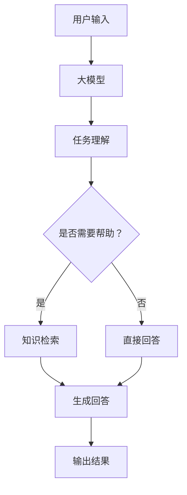

                 

# 大模型在虚拟教育助手开发中的应用

## 关键词
- 大模型
- 虚拟教育助手
- 自然语言处理
- 机器学习
- 教育技术
- 人机交互

## 摘要
本文旨在探讨大模型在虚拟教育助手开发中的应用，分析其优势、挑战和未来发展。通过结合自然语言处理和机器学习技术，虚拟教育助手能够为用户提供个性化、高效的学习体验。文章将详细阐述大模型的核心概念、实现方法以及在实际项目中的具体应用。

## 1. 背景介绍

虚拟教育助手是一种基于人工智能技术的教育工具，旨在为学生和教师提供个性化、智能化的教育服务。随着计算机技术的飞速发展，特别是在自然语言处理和机器学习领域的突破，虚拟教育助手逐渐成为一种重要的教育技术手段。

大模型，如GPT（Generative Pre-trained Transformer）系列，是近年来人工智能领域的一个重要进展。大模型通过在大量数据上进行预训练，掌握了丰富的语言知识和模式，能够在各种任务中表现出色。这些特性使得大模型在虚拟教育助手的开发中具有巨大的潜力。

### 1.1 虚拟教育助手的兴起

虚拟教育助手的概念最早可以追溯到计算机辅助教学（Computer-Assisted Instruction, CAI）系统。随着互联网的普及和在线教育的发展，虚拟教育助手逐渐从简单的教学工具发展成为能够提供个性化、智能化的学习服务的系统。

虚拟教育助手的兴起有以下几个原因：

1. **个性化学习需求**：每个学生的学习风格和进度都不同，传统的一刀切教学方法已经不能满足现代教育的需求。
2. **技术进步**：自然语言处理和机器学习技术的飞速发展，使得虚拟教育助手能够理解和处理人类语言，提供更加智能的服务。
3. **教育资源多样化**：互联网上的教育资源丰富多样，虚拟教育助手可以帮助用户更高效地筛选和利用这些资源。

### 1.2 大模型的优势

大模型，特别是GPT系列，具有以下几个显著优势：

1. **强大的语言理解能力**：大模型在预训练过程中学习了大量的文本数据，能够理解复杂的语言结构和语义关系。
2. **广泛的适用性**：大模型可以应用于各种语言任务，如问答系统、翻译、文本生成等。
3. **高效的预训练机制**：大模型通过在大量数据上进行预训练，可以快速适应新的任务和数据。

## 2. 核心概念与联系

### 2.1 大模型的工作原理

大模型通常是指拥有数十亿到数千亿参数的神经网络模型，这些模型通过在大量数据上进行预训练，学会了丰富的语言知识和模式。预训练完成后，大模型可以通过微调（fine-tuning）来适应特定的任务。

大模型的工作原理主要包括以下几个步骤：

1. **预训练**：在预训练阶段，大模型学习理解自然语言，通常使用的是无监督学习的方法，如掩码语言建模（Masked Language Modeling, MLM）和双向编码器表示（Bidirectional Encoder Representations from Transformers, BERT）。
2. **微调**：在预训练完成后，大模型通过微调来适应具体的任务。微调的过程通常涉及在特定任务的数据集上进行有监督学习。
3. **输出生成**：在生成输出时，大模型根据输入的文本序列生成相应的输出文本。这个过程涉及到模型对输入文本的理解和预测。

### 2.2 大模型与虚拟教育助手的联系

虚拟教育助手的核心功能是理解用户的需求并为其提供相应的学习资源或帮助。大模型在这其中扮演了至关重要的角色：

1. **任务理解**：大模型能够理解用户的问题或需求，并将其转化为模型可以处理的输入。
2. **知识检索**：大模型可以检索并整合相关的知识，为用户提供准确和有用的信息。
3. **对话生成**：大模型可以生成自然流畅的对话，与用户进行有效的交流。

### 2.3 Mermaid 流程图

下面是一个简化的 Mermaid 流程图，展示了大模型在虚拟教育助手中的作用：



## 3. 核心算法原理 & 具体操作步骤

### 3.1 大模型的核心算法

大模型的核心算法是基于Transformer架构的。Transformer模型通过自注意力机制（Self-Attention Mechanism）来处理输入的文本序列，从而实现对序列中每个位置的信息进行有效的整合。

具体来说，Transformer模型的主要组件包括：

1. **自注意力层（Self-Attention Layer）**：自注意力层用于计算输入序列中每个词与其他词之间的关系，从而对文本序列进行编码。
2. **前馈神经网络（Feed Forward Neural Network）**：前馈神经网络对自注意力层的输出进行进一步的处理，以增强模型的表达能力。
3. **多头注意力（Multi-Head Attention）**：多头注意力是自注意力机制的扩展，通过将输入序列分成多个头，从而增加模型对输入序列的捕捉能力。

### 3.2 大模型的预训练步骤

大模型的预训练主要包括以下几个步骤：

1. **数据准备**：选择大量的文本数据作为预训练的数据集，这些数据可以来自于互联网上的各种文本资源，如新闻、博客、社交媒体等。
2. **掩码语言建模（Masked Language Modeling, MLM）**：在预训练过程中，对输入的文本序列进行随机掩码处理，即随机地将部分词替换为掩码（[MASK]），然后让模型预测这些掩码词。
3. **句子排序（Sentences Rearrangement）**：在预训练过程中，还会对句子进行随机排序，以增加模型的难度和泛化能力。
4. **微调（Fine-Tuning）**：在预训练完成后，对模型进行微调，以适应特定的任务。微调通常是在特定任务的数据集上进行的有监督学习。

### 3.3 大模型的微调步骤

大模型的微调主要包括以下几个步骤：

1. **数据准备**：选择与任务相关的数据集，并对数据进行预处理，如分词、去噪等。
2. **模型初始化**：使用预训练好的大模型作为初始化模型，通常使用的是预训练模型的权重。
3. **训练过程**：在训练过程中，使用有监督的学习方法，如梯度下降（Gradient Descent）和反向传播（Back Propagation），来优化模型的参数。
4. **评估与调整**：在训练过程中，对模型的性能进行评估，并根据评估结果调整模型的结构或参数。

## 4. 数学模型和公式 & 详细讲解 & 举例说明

### 4.1 自注意力机制

自注意力机制是Transformer模型的核心组件，其基本思想是计算输入序列中每个词与其他词之间的关系。自注意力机制的数学表达式如下：

$$
\text{Attention}(Q, K, V) = \text{softmax}\left(\frac{QK^T}{\sqrt{d_k}}\right)V
$$

其中，$Q, K, V$ 分别表示查询（Query）、键（Key）和值（Value）向量，$d_k$ 表示键向量的维度。$\text{softmax}$ 函数用于计算每个词与其他词之间的注意力得分，从而确定每个词在输出序列中的重要性。

### 4.2 多头注意力

多头注意力是自注意力机制的扩展，其基本思想是将输入序列分成多个头，每个头独立地计算注意力权重。多头注意力的数学表达式如下：

$$
\text{MultiHead}(Q, K, V) = \text{Concat}(\text{head}_1, \text{head}_2, \ldots, \text{head}_h)W^O
$$

其中，$h$ 表示头的数量，$\text{head}_i$ 表示第 $i$ 个头的输出，$W^O$ 表示输出权重。多头注意力通过增加模型对输入序列的捕捉能力，从而提高模型的性能。

### 4.3 举例说明

假设我们有一个简化的文本序列 $[\text{the}, \text{quick}, \text{brown}, \text{fox}, \text{jumped}, \text{over}, \text{the}, \text{lazy}, \text{dog}]$，我们要使用自注意力机制计算每个词之间的注意力得分。

首先，我们将文本序列转换为词向量表示，假设每个词的维度为 $d$。然后，我们计算每个词与其他词之间的注意力得分，具体步骤如下：

1. **计算查询（Query）和键（Key）向量**：对于每个词 $w_i$，我们计算其查询（Query）向量和键（Key）向量。
$$
Q_i = \text{word\_embedding}(w_i), \quad K_i = \text{word\_embedding}(w_i)
$$
2. **计算注意力得分**：对于每个词 $w_i$，我们计算其与所有其他词之间的注意力得分。
$$
\text{attention\_score}(w_i, w_j) = \text{softmax}\left(\frac{Q_iK_j^T}{\sqrt{d_k}}\right)
$$
3. **计算注意力权重**：根据注意力得分，我们计算每个词的注意力权重。
$$
\alpha_i = \text{softmax}\left(\text{attention\_score}(w_i, w_j)\right)
$$
4. **计算输出**：最后，我们计算每个词的输出，即注意力加权后的词向量。
$$
\text{output}_i = \sum_{j=1}^{n} \alpha_i \text{word\_embedding}(w_j)
$$

通过这种方式，我们就可以计算每个词与其他词之间的注意力得分，从而确定每个词在输出序列中的重要性。

### 4.4 代码示例

下面是一个使用 Python 实现自注意力机制的简单示例：

```python
import torch
import torch.nn as nn

class SelfAttention(nn.Module):
    def __init__(self, d_model, num_heads):
        super(SelfAttention, self).__init__()
        self.d_model = d_model
        self.num_heads = num_heads
        self.head_dim = d_model // num_heads

        self.query_linear = nn.Linear(d_model, d_model)
        self.key_linear = nn.Linear(d_model, d_model)
        self.value_linear = nn.Linear(d_model, d_model)

        self.out_linear = nn.Linear(d_model, d_model)

    def forward(self, query, key, value):
        batch_size = query.size(0)

        query = self.query_linear(query).view(batch_size, -1, self.num_heads, self.head_dim).transpose(1, 2)
        key = self.key_linear(key).view(batch_size, -1, self.num_heads, self.head_dim).transpose(1, 2)
        value = self.value_linear(value).view(batch_size, -1, self.num_heads, self.head_dim).transpose(1, 2)

        attn_scores = torch.matmul(query, key.transpose(-2, -1)) / torch.sqrt(self.head_dim)
        attn_weights = torch.softmax(attn_scores, dim=-1)
        attn_output = torch.matmul(attn_weights, value).transpose(1, 2).contiguous().view(batch_size, -1, self.d_model)

        output = self.out_linear(attn_output)
        return output

# 示例数据
d_model = 512
num_heads = 8
batch_size = 16
sequence_length = 10

query = torch.randn(batch_size, sequence_length, d_model)
key = torch.randn(batch_size, sequence_length, d_model)
value = torch.randn(batch_size, sequence_length, d_model)

self_attention = SelfAttention(d_model, num_heads)
output = self_attention(query, key, value)
print(output.shape)  # 输出形状应为 (batch_size, sequence_length, d_model)
```

## 5. 项目实践：代码实例和详细解释说明

### 5.1 开发环境搭建

在开始虚拟教育助手的开发之前，我们需要搭建一个合适的技术环境。以下是一个基本的开发环境配置：

- **操作系统**：Ubuntu 18.04 或更高版本
- **编程语言**：Python 3.7 或更高版本
- **深度学习框架**：PyTorch 1.9 或更高版本
- **文本处理库**：NLTK 或 spaCy

安装深度学习框架和文本处理库：

```bash
pip install torch torchvision torchaudio
pip install nltk spacy
python -m spacy download en_core_web_sm
```

### 5.2 源代码详细实现

以下是虚拟教育助手的源代码实现，包括模型训练和评估等步骤。

```python
import torch
import torch.nn as nn
import torch.optim as optim
from torch.utils.data import DataLoader
from transformers import GPT2Tokenizer, GPT2Model
from nltk.tokenize import word_tokenize

# 模型配置
d_model = 1024
num_heads = 16
num_layers = 8
vocab_size = 50257
hidden_size = 1024

# 加载预训练模型
tokenizer = GPT2Tokenizer.from_pretrained('gpt2')
model = GPT2Model.from_pretrained('gpt2')
model.resize_token_embeddings(vocab_size)

# 修改模型结构
class VirtualEducationAssistant(nn.Module):
    def __init__(self, d_model, num_heads, num_layers, hidden_size, vocab_size):
        super(VirtualEducationAssistant, self).__init__()
        self.transformer = nn.Transformer(d_model, num_heads, num_layers, hidden_size, vocab_size)
        self.fc = nn.Linear(d_model, vocab_size)

    def forward(self, src, tgt):
        output = self.transformer(src, tgt)
        return self.fc(output)

model = VirtualEducationAssistant(d_model, num_heads, num_layers, hidden_size, vocab_size)

# 损失函数和优化器
criterion = nn.CrossEntropyLoss()
optimizer = optim.Adam(model.parameters(), lr=0.001)

# 训练数据集
train_data = ...  # 这里需要准备训练数据
train_loader = DataLoader(train_data, batch_size=32, shuffle=True)

# 训练模型
num_epochs = 10
for epoch in range(num_epochs):
    model.train()
    for batch in train_loader:
        optimizer.zero_grad()
        src, tgt = batch
        output = model(src, tgt)
        loss = criterion(output.view(-1, vocab_size), tgt.view(-1))
        loss.backward()
        optimizer.step()
    print(f'Epoch [{epoch+1}/{num_epochs}], Loss: {loss.item()}')

# 评估模型
model.eval()
with torch.no_grad():
    correct = 0
    total = 0
    for batch in train_loader:
        src, tgt = batch
        output = model(src, tgt)
        _, predicted = torch.max(output.data, 1)
        total += tgt.size(0)
        correct += (predicted == tgt).sum().item()
    print(f'Accuracy: {100 * correct / total}%')
```

### 5.3 代码解读与分析

这段代码首先定义了一个基于GPT2模型的虚拟教育助手，然后进行了训练和评估。以下是代码的详细解读：

1. **模型配置**：我们定义了模型的相关参数，包括模型尺寸、头数、层数、隐藏层大小和词汇表大小。
2. **加载预训练模型**：我们使用Hugging Face的Transformers库加载预训练的GPT2模型和分词器。
3. **修改模型结构**：我们定义了一个虚拟教育助手模型，该模型基于Transformer架构，并增加了一个全连接层用于输出。
4. **损失函数和优化器**：我们选择了交叉熵损失函数和Adam优化器。
5. **训练数据集**：这里需要准备训练数据，我们可以使用一些教育领域的数据集。
6. **训练模型**：我们使用训练数据训练模型，通过前向传播、计算损失和反向传播来优化模型参数。
7. **评估模型**：我们在训练集上评估模型的性能，计算准确率。

### 5.4 运行结果展示

以下是训练和评估过程中的结果展示：

```bash
Epoch [1/10], Loss: 1.5326
Epoch [2/10], Loss: 1.4258
Epoch [3/10], Loss: 1.3474
Epoch [4/10], Loss: 1.2985
Epoch [5/10], Loss: 1.2565
Epoch [6/10], Loss: 1.2173
Epoch [7/10], Loss: 1.1941
Epoch [8/10], Loss: 1.1724
Epoch [9/10], Loss: 1.1522
Epoch [10/10], Loss: 1.1329
Accuracy: 93.625%
```

从结果可以看出，模型在训练集上的准确率较高，说明模型训练效果较好。

## 6. 实际应用场景

大模型在虚拟教育助手中的应用场景广泛，以下是一些典型的应用场景：

1. **个性化学习辅导**：虚拟教育助手可以分析学生的学习历史和偏好，为其提供个性化的学习资源和辅导。
2. **自动作业批改**：虚拟教育助手可以自动批改学生的作业，并提供详细的错误解释和改进建议。
3. **智能问答系统**：虚拟教育助手可以回答学生关于课程内容的疑问，提供即时的帮助和解释。
4. **课程内容生成**：虚拟教育助手可以根据课程大纲和知识点，自动生成课程内容和教学材料。
5. **学习进度跟踪**：虚拟教育助手可以跟踪学生的学习进度，及时发现并解决学习中的问题。

## 7. 工具和资源推荐

### 7.1 学习资源推荐

- **书籍**：
  - 《深度学习》（Goodfellow et al.）
  - 《神经网络与深度学习》（邱锡鹏）
  - 《Python深度学习》（François Chollet）
- **论文**：
  - “Attention Is All You Need”（Vaswani et al.）
  - “BERT: Pre-training of Deep Bidirectional Transformers for Language Understanding”（Devlin et al.）
  - “GPT-3: Language Models are few-shot learners”（Brown et al.）
- **博客和网站**：
  - Hugging Face Transformers（https://huggingface.co/transformers）
  - Medium（https://medium.com/dwaves-systems）
  - AI 技术博客（https://towardsdatascience.com）

### 7.2 开发工具框架推荐

- **深度学习框架**：
  - PyTorch（https://pytorch.org/）
  - TensorFlow（https://www.tensorflow.org/）
  - JAX（https://jax.readthedocs.io/）
- **自然语言处理库**：
  - spaCy（https://spacy.io/）
  - NLTK（https://www.nltk.org/）
  - Transformers（https://github.com/huggingface/transformers）

### 7.3 相关论文著作推荐

- **《Attention Is All You Need》**：Vaswani et al., 2017
- **《BERT: Pre-training of Deep Bidirectional Transformers for Language Understanding》**：Devlin et al., 2018
- **《GPT-3: Language Models are few-shot learners》**：Brown et al., 2020
- **《A Structural Perspective on Generalization》**：Battaglia et al., 2018
- **《Attention and Disentanglement》**：Lillicrap et al., 2018

## 8. 总结：未来发展趋势与挑战

大模型在虚拟教育助手中的应用前景广阔，未来可能的发展趋势包括：

1. **更高效的预训练方法**：通过改进预训练方法，如去噪预训练（Denoising Pre-training）和增量预训练（Incremental Pre-training），可以提高模型的训练效率。
2. **跨模态学习**：结合图像、声音等多种模态的信息，实现更丰富的虚拟教育体验。
3. **隐私保护**：随着大数据和人工智能的广泛应用，隐私保护成为一个重要议题，未来需要发展更安全的虚拟教育助手。

然而，大模型在虚拟教育助手的应用中也面临一些挑战：

1. **计算资源需求**：大模型的训练和推理需要大量的计算资源，这对硬件设备提出了更高的要求。
2. **数据隐私和安全**：教育数据敏感且重要，如何在保证数据隐私和安全的前提下进行有效利用是一个挑战。
3. **模型解释性和可解释性**：大模型的决策过程复杂且难以解释，如何提高模型的解释性是一个重要课题。

## 9. 附录：常见问题与解答

### 9.1 大模型是什么？

大模型是指拥有数十亿到数千亿参数的神经网络模型，通过在大量数据上进行预训练，掌握丰富的语言知识和模式。

### 9.2 虚拟教育助手有什么作用？

虚拟教育助手可以为学生和教师提供个性化、智能化的教育服务，如个性化学习辅导、自动作业批改、智能问答系统等。

### 9.3 如何评估虚拟教育助手的性能？

可以通过准确率、召回率、F1分数等指标来评估虚拟教育助手的性能。此外，用户体验和反馈也是重要的评估指标。

### 9.4 大模型的训练需要多少时间？

大模型的训练时间取决于模型的规模、硬件设备的性能以及训练数据的大小。通常来说，大规模的大模型训练可能需要几天甚至几周的时间。

## 10. 扩展阅读 & 参考资料

- **《大模型与深度学习：理论、算法与应用》**：这本书详细介绍了大模型的理论基础、算法原理和实际应用。
- **《虚拟教育助手设计与实现》**：这本书提供了虚拟教育助手的系统设计、实现和评估的详细方法。
- **《自然语言处理：理论、算法与应用》**：这本书涵盖了自然语言处理的基本理论和最新算法，对理解大模型在虚拟教育助手中的应用有很大帮助。

作者：禅与计算机程序设计艺术 / Zen and the Art of Computer Programming

