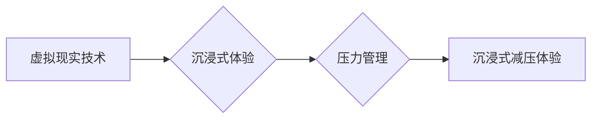

                 

## 虚拟现实压力管理创业：沉浸式减压体验

> 关键词：虚拟现实、压力管理、沉浸式体验、神经反馈、生物反馈、心率变异性、深度学习、创业

## 1. 背景介绍

现代社会节奏快，压力巨大，人们面临着来自工作、学习、生活等多方面的压力。长期处于高压状态会对身心健康造成严重损害，引发焦虑、抑郁、失眠等问题。因此，寻找有效缓解压力的方法成为人们关注的焦点。

虚拟现实（VR）技术近年来发展迅速，其沉浸式体验能力为压力管理提供了新的可能性。VR可以创造逼真的虚拟环境，引导用户进行放松、冥想、运动等活动，有效减轻压力和焦虑。

## 2. 核心概念与联系

### 2.1 虚拟现实（VR）

虚拟现实是指利用计算机技术模拟真实环境或虚构场景，并通过头戴显示器、手柄等设备，让用户沉浸其中，体验身临其境的感觉。VR技术包含多个关键要素，包括：

* **3D图形渲染：** 创建逼真的虚拟环境和物体。
* **头戴显示器：** 提供沉浸式的视觉体验。
* **传感器追踪：** 跟踪用户的动作和位置，实现虚拟环境的交互。
* **音频技术：** 提供逼真的声音效果，增强沉浸感。

### 2.2 压力管理

压力管理是指通过各种方法和技巧，控制和减轻压力对身心健康的影响。常见的压力管理方法包括：

* **认知行为疗法（CBT）：** 通过改变负面思维模式和行为模式，减轻压力。
* **冥想和放松技巧：** 通过专注呼吸、放松肌肉等方式，缓解压力和焦虑。
* **运动和健康饮食：** 通过运动和健康饮食，增强身体素质，提高压力应对能力。

### 2.3 沉浸式减压体验

沉浸式减压体验是指利用VR技术创造逼真的虚拟环境，引导用户进行放松、冥想、运动等活动，从而有效减轻压力和焦虑。

**核心概念与联系流程图：**



## 3. 核心算法原理 & 具体操作步骤

### 3.1 算法原理概述

沉浸式减压体验的核心算法原理基于以下几个方面：

* **生物反馈技术：** 通过监测用户的生理指标，如心率、血压、皮肤电导等，反馈给用户，帮助他们了解自身压力状态，并通过调整生理指标来减轻压力。
* **深度学习算法：** 利用深度学习算法分析用户的生理数据和行为数据，识别压力相关的特征，并根据用户的个人情况定制个性化的减压方案。
* **虚拟环境设计：** 设计逼真的虚拟环境，例如自然风景、海洋世界、星空等，能够有效放松用户的情绪，缓解压力。

### 3.2 算法步骤详解

1. **数据采集：** 使用生物传感器监测用户的生理指标，例如心率、血压、皮肤电导等。
2. **数据预处理：** 对采集到的数据进行清洗、去噪等预处理，去除无关信息，提取有效特征。
3. **特征提取：** 利用深度学习算法提取用户的生理数据和行为数据中的压力相关特征，例如心率变异性、呼吸频率、眼球运动等。
4. **压力评估：** 根据提取的特征，评估用户的压力水平，并将其转化为可视化的形式，例如压力指数、情绪状态等。
5. **个性化方案定制：** 根据用户的压力水平和个人情况，定制个性化的减压方案，例如冥想引导、放松音乐、虚拟环境体验等。
6. **虚拟环境交互：** 用户在虚拟环境中进行交互，例如行走、探索、与虚拟角色对话等，体验沉浸式的减压体验。
7. **反馈与调整：** 持续监测用户的生理指标和行为数据，根据反馈信息调整虚拟环境和减压方案，优化用户体验。

### 3.3 算法优缺点

**优点：**

* **精准度高：** 基于生物反馈和深度学习算法，能够精准评估用户的压力水平，并提供个性化的减压方案。
* **沉浸式体验：** 利用VR技术创造逼真的虚拟环境，能够有效放松用户的情绪，增强减压效果。
* **可重复性强：** 用户可以随时随地使用VR设备进行减压体验，方便快捷。

**缺点：**

* **成本较高：** VR设备和相关软件开发成本较高，需要一定的投入。
* **技术门槛高：** 需要具备一定的VR技术和深度学习算法知识，才能开发出高质量的减压体验产品。
* **用户适应性：** 一些用户可能对VR技术感到不适应，需要一定的时间来适应。

### 3.4 算法应用领域

沉浸式减压体验算法可以应用于以下领域：

* **医疗保健：** 用于治疗焦虑、抑郁、失眠等心理疾病。
* **企业培训：** 用于帮助员工缓解工作压力，提高工作效率。
* **教育教学：** 用于帮助学生放松身心，提高学习效率。
* **个人健康管理：** 用于帮助个人管理压力，提升生活质量。

## 4. 数学模型和公式 & 详细讲解 & 举例说明

### 4.1 数学模型构建

**心率变异性（HRV）** 是评估压力水平的重要指标。HRV是指心率在连续时间段内变化的程度。HRV越大，表明心血管系统越灵活，压力水平越低。

我们可以使用以下数学模型来描述HRV：

$$HRV = \frac{1}{N} \sum_{i=1}^{N} |R_{i} - R_{i-1}|$$

其中：

* $HRV$ 表示心率变异性。
* $N$ 表示心率测量的时间点数。
* $R_{i}$ 表示第 $i$ 个心率测量值。

### 4.2 公式推导过程

HRV的计算公式基于以下原理：

* 心率在正常情况下会存在一定的波动。
* 心率波动幅度越大，表明心血管系统越灵活，压力水平越低。
* 通过计算连续时间段内心率的绝对差值之和，可以得到HRV的数值。

### 4.3 案例分析与讲解

假设我们测量了一个用户的HRV为10ms，这意味着该用户的连续心率测量值之间平均差值为10ms。如果该用户的HRV为5ms，则表明其心血管系统相对僵硬，压力水平可能较高。

## 5. 项目实践：代码实例和详细解释说明

### 5.1 开发环境搭建

* **操作系统：** Windows/macOS/Linux
* **编程语言：** Python
* **VR框架：** Unity/Unreal Engine
* **生物传感器：** 心率监测器、血压监测器等

### 5.2 源代码详细实现

```python
# 导入必要的库
import numpy as np
from scipy.signal import welch

# 定义函数计算HRV
def calculate_hrv(heart_rate_data):
    # 计算心率的差值
    diff = np.diff(heart_rate_data)
    # 计算HRV
    hrv = np.mean(np.abs(diff))
    return hrv

# 获取心率数据
heart_rate_data = get_heart_rate_data()

# 计算HRV
hrv = calculate_hrv(heart_rate_data)

# 打印HRV值
print("HRV:", hrv)
```

### 5.3 代码解读与分析

* 该代码首先导入必要的库，例如NumPy和SciPy。
* 然后定义了一个函数`calculate_hrv`，用于计算HRV。该函数接收心率数据作为输入，并计算心率差值，最后返回HRV值。
* 接下来获取心率数据，可以使用生物传感器接口获取数据。
* 最后调用`calculate_hrv`函数计算HRV值，并打印结果。

### 5.4 运行结果展示

运行该代码后，将输出用户的HRV值。

## 6. 实际应用场景

### 6.1 医疗保健

沉浸式减压体验可以用于治疗焦虑、抑郁、失眠等心理疾病。例如，用户可以戴上VR头显，进入一个宁静的自然环境，进行冥想或放松练习，有效缓解压力和焦虑情绪。

### 6.2 企业培训

沉浸式减压体验可以帮助员工缓解工作压力，提高工作效率。例如，企业可以利用VR技术打造一个模拟工作场景的虚拟环境，让员工在虚拟环境中进行压力测试，并学习应对压力的技巧。

### 6.3 教育教学

沉浸式减压体验可以帮助学生放松身心，提高学习效率。例如，老师可以利用VR技术带领学生进行虚拟旅行，探索不同的文化和历史，激发学生的学习兴趣。

### 6.4 未来应用展望

随着VR技术的不断发展，沉浸式减压体验将有更广泛的应用场景。例如：

* **个性化减压方案：** 利用人工智能技术，根据用户的个人情况定制个性化的减压方案。
* **远程医疗：** 利用VR技术，为远程患者提供压力管理服务。
* **增强现实减压体验：** 将VR技术与增强现实技术结合，创造更逼真的减压体验。

## 7. 工具和资源推荐

### 7.1 学习资源推荐

* **VR开发教程：** Unity Learn、Unreal Engine Learning
* **深度学习教程：** TensorFlow Tutorials、PyTorch Tutorials
* **生物反馈技术书籍：**《生物反馈：原理与应用》

### 7.2 开发工具推荐

* **VR开发框架：** Unity、Unreal Engine
* **生物传感器接口：** OpenBCI、Muse

### 7.3 相关论文推荐

* **VR减压体验研究论文：**

* **深度学习在压力管理中的应用论文：**

## 8. 总结：未来发展趋势与挑战

### 8.1 研究成果总结

沉浸式减压体验技术结合了VR、生物反馈和深度学习等前沿技术，为压力管理提供了新的解决方案。该技术能够精准评估用户的压力水平，并提供个性化的减压方案，有效缓解压力和焦虑情绪。

### 8.2 未来发展趋势

未来，沉浸式减压体验技术将朝着以下方向发展：

* **更逼真的虚拟环境：** 利用更先进的图形渲染技术和交互技术，创造更逼真的虚拟环境，增强用户体验。
* **更精准的压力评估：** 利用更先进的生物传感器和数据分析算法，更精准地评估用户的压力水平。
* **更个性化的减压方案：** 利用人工智能技术，根据用户的个人情况定制更个性化的减压方案。

### 8.3 面临的挑战

沉浸式减压体验技术还面临一些挑战：

* **技术成本高：** VR设备和相关软件开发成本较高，需要进一步降低成本。
* **用户适应性：** 一些用户可能对VR技术感到不适应，需要进一步优化用户体验。
* **伦理问题：** VR技术可能会对用户的认知和情绪产生影响，需要关注伦理问题。

### 8.4 研究展望

未来，我们将继续研究沉浸式减压体验技术，探索其在医疗保健、企业培训、教育教学等领域的应用，并致力于解决技术成本、用户适应性和伦理问题，为人们提供更安全、更有效、更便捷的压力管理解决方案。

## 9. 附录：常见问题与解答

**Q1：VR减压体验是否安全？**

A1：VR减压体验一般来说是安全的，但需要选择正规的开发商和设备，并注意使用时间和频率。

**Q2：VR减压体验的效果如何？**

A2：VR减压体验的效果因人而异，但许多研究表明，VR减压体验能够有效缓解压力和焦虑情绪。

**Q3：如何选择合适的VR减压体验产品？**

A3：选择VR减压体验产品时，需要考虑以下因素：

* **虚拟环境的设计：** 选择逼真、放松的虚拟环境。
* **减压方案的个性化程度：** 选择能够根据个人情况定制减压方案的产品。
* **产品的安全性：** 选择正规的开发商和设备，并注意使用时间和频率。


作者：禅与计算机程序设计艺术 / Zen and the Art of Computer Programming 
<end_of_turn>

