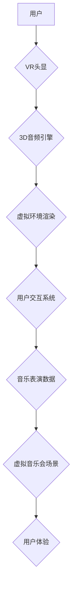

                 

## 虚拟现实音乐会创业：沉浸式音乐体验

> 关键词：虚拟现实、音乐会、沉浸式体验、3D音频、实时渲染、用户交互、区块链、元宇宙

## 1. 背景介绍

音乐作为一种跨越文化和语言的艺术形式，一直以来都能够激发人们的情感共鸣。随着虚拟现实 (VR) 技术的快速发展，虚拟现实音乐会应运而生，为音乐爱好者提供了一种全新的沉浸式体验。 

传统的音乐会形式存在着诸多局限性，例如场地限制、距离问题、票价昂贵等。而虚拟现实音乐会则能够突破这些限制，让用户无论身处何地，都能身临其境地感受音乐的魅力。 

## 2. 核心概念与联系

虚拟现实音乐会的核心概念是将音乐表演和观众的互动体验融合在一起，创造出一个逼真的虚拟环境，让用户仿佛置身于真实的音乐会现场。

**2.1 核心概念**

* **虚拟现实 (VR):** 利用计算机技术模拟真实环境，并通过头戴式显示器和手柄等设备，让用户沉浸其中。
* **沉浸式体验 (Immersive Experience):**  指用户能够完全融入虚拟环境，并与之互动，产生身临其境的感觉。
* **3D 音频 (3D Audio):** 利用空间音频技术，模拟真实环境中的声音传播特性，让用户能够感知声音的方向和距离。
* **实时渲染 (Real-time Rendering):**  指在实时场景中生成图像，让虚拟环境能够动态变化，并与用户的动作互动。
* **用户交互 (User Interaction):**  指用户能够与虚拟环境进行互动，例如移动、旋转、选择等。

**2.2 架构流程图**



## 3. 核心算法原理 & 具体操作步骤

**3.1 算法原理概述**

虚拟现实音乐会的核心算法主要包括：

* **3D音频渲染算法:**  模拟声音在虚拟空间中的传播特性，让用户能够感知声音的方向和距离。
* **实时渲染算法:**  实时生成虚拟环境的图像，并根据用户的动作进行动态变化。
* **用户交互算法:**  处理用户的输入指令，并将其转化为虚拟环境中的动作。

**3.2 算法步骤详解**

1. **3D音频渲染:**

    * 将音乐信号分解成多个声道，并根据声道的定位信息，计算每个声道的音量和延迟。
    * 利用头戴式显示器的传感器数据，计算用户的头部方向和位置。
    * 根据用户的头部方向和位置，调整每个声道的音量和延迟，模拟声音在虚拟空间中的传播特性。

2. **实时渲染:**

    * 将虚拟音乐会场景的模型和材质数据加载到渲染引擎中。
    * 根据用户的视角和位置，计算场景中每个对象的可见性。
    * 利用光照计算和阴影算法，渲染出逼真的场景图像。
    * 根据用户的动作，更新场景中对象的运动状态和姿态。

3. **用户交互:**

    * 接收用户的输入指令，例如手柄的运动、按钮的点击等。
    * 将用户的输入指令转化为虚拟环境中的动作，例如移动、旋转、选择等。
    * 根据用户的动作，更新虚拟环境的状态和交互逻辑。

**3.3 算法优缺点**

* **优点:**

    * 能够提供沉浸式的音乐体验，让用户仿佛置身于真实的音乐会现场。
    * 突破了传统的音乐会场地和距离限制，让更多人能够享受音乐的魅力。
    * 可以根据用户的喜好定制虚拟音乐会场景和音乐曲目。

* **缺点:**

    * 目前VR技术还处于发展阶段，设备价格昂贵，普及率较低。
    * 虚拟音乐会场景的构建和渲染需要强大的计算能力，对硬件要求较高。
    * 虚拟音乐会缺乏真实的肢体互动和情感共鸣，难以完全替代真实的音乐会体验。

**3.4 算法应用领域**

* 音乐表演和演出
* 音乐教育和培训
* 音乐创作和制作
* 音乐游戏和娱乐

## 4. 数学模型和公式 & 详细讲解 & 举例说明

**4.1 数学模型构建**

虚拟现实音乐会的核心数学模型主要包括：

* **3D空间坐标系:**  用于描述虚拟音乐会场景中的物体位置和方向。
* **声音传播模型:**  用于模拟声音在虚拟空间中的传播特性，例如反射、折射、衰减等。
* **用户交互模型:**  用于描述用户与虚拟环境的交互方式，例如手柄运动、按钮点击等。

**4.2 公式推导过程**

* **声音传播模型:**

    * 声波传播速度: $v = 343 m/s$ (空气中)
    * 声波传播距离: $d = vt$ (t为传播时间)
    * 声波衰减: $I = I_0 * 10^{-αd}$ (I为接收到的声强，$I_0$为源声强，α为衰减系数)

* **用户交互模型:**

    * 用户手柄运动: $v = \frac{Δx}{Δt}$ (v为速度，Δx为位移，Δt为时间)
    * 用户按钮点击: $t = t_0 + Δt$ (t为点击时间，$t_0$为初始时间，Δt为点击延迟)

**4.3 案例分析与讲解**

假设用户在虚拟音乐会场景中，距离舞台5米，舞台上有一个扬声器播放音乐。

* 根据声音传播模型，我们可以计算出用户接收到的声强。
* 根据用户手柄运动模型，我们可以计算出用户在虚拟场景中的移动速度。
* 根据用户按钮点击模型，我们可以计算出用户点击虚拟场景中的按钮的时间。

## 5. 项目实践：代码实例和详细解释说明

**5.1 开发环境搭建**

* 操作系统: Windows/macOS/Linux
* 编程语言: C++/C#/Python
* VR引擎: Unity/Unreal Engine
* 3D音频引擎: Wwise/FMOD

**5.2 源代码详细实现**

```c++
// 3D音频渲染示例代码 (Unity)

using UnityEngine;

public class AudioRenderer : MonoBehaviour
{
    public AudioSource audioSource;
    public Transform listener;

    void Update()
    {
        // 计算声音方向
        Vector3 direction = listener.position - transform.position;

        // 设置声音方向
        audioSource.transform.forward = direction;

        // 设置声音音量
        float distance = Vector3.Distance(listener.position, transform.position);
        float volume = 1f / (distance * distance);
        audioSource.volume = volume;
    }
}
```

**5.3 代码解读与分析**

* 该代码示例演示了如何使用Unity引擎实现3D音频渲染。
* `audioSource`变量指向虚拟音乐会场景中的音频源。
* `listener`变量指向用户的头戴式显示器。
* `Update()`函数在每一帧更新音频源的方向和音量。
* `Vector3.Distance()`函数计算用户与音频源之间的距离。
* `audioSource.volume`属性设置音频源的音量。

**5.4 运行结果展示**

运行该代码后，用户能够感受到声音的方向和距离变化，仿佛置身于真实的音乐会现场。

## 6. 实际应用场景

**6.1 音乐表演和演出**

虚拟现实音乐会能够突破传统的场地限制，让音乐家能够在虚拟空间中进行表演，并与全球观众互动。

**6.2 音乐教育和培训**

虚拟现实音乐会能够为音乐学生提供沉浸式的学习体验，让他们能够更直观地理解音乐理论和演奏技巧。

**6.3 音乐创作和制作**

虚拟现实音乐会能够为音乐制作人提供新的创作工具，让他们能够在虚拟空间中进行音乐实验和创作。

**6.4 未来应用展望**

* **元宇宙音乐会:**  将虚拟现实音乐会与元宇宙概念结合，构建一个虚拟世界，让用户能够在其中自由地探索、互动和体验音乐。
* **个性化音乐体验:**  根据用户的喜好和需求，定制虚拟音乐会场景和音乐曲目，提供更加个性化的音乐体验。
* **跨界融合:**  将虚拟现实音乐会与其他艺术形式结合，例如舞蹈、戏剧、绘画等，创造出更加丰富多彩的艺术体验。

## 7. 工具和资源推荐

**7.1 学习资源推荐**

* **书籍:**

    * 《虚拟现实技术》
    * 《3D音频技术》
    * 《Unity游戏开发入门》

* **在线课程:**

    * Coursera: 虚拟现实开发
    * Udemy: 3D音频编程
    * Unity Learn: Unity游戏开发教程

**7.2 开发工具推荐**

* **VR引擎:** Unity/Unreal Engine
* **3D音频引擎:** Wwise/FMOD
* **编程语言:** C++/C#/Python

**7.3 相关论文推荐**

* **沉浸式音乐体验的虚拟现实技术研究**
* **基于3D音频的虚拟现实音乐会系统设计**
* **虚拟现实音乐会用户交互模型研究**

## 8. 总结：未来发展趋势与挑战

**8.1 研究成果总结**

虚拟现实音乐会技术已经取得了显著的进展，能够提供沉浸式的音乐体验，并打破了传统的音乐会场地和距离限制。

**8.2 未来发展趋势**

* **技术进步:**  VR技术将继续发展，设备价格将更加亲民，普及率将不断提高。
* **内容丰富:**  虚拟音乐会场景和音乐曲目将更加丰富多样，满足不同用户的需求。
* **交互体验:**  用户与虚拟环境的交互方式将更加丰富，例如手势识别、眼动追踪等。

**8.3 面临的挑战**

* **技术瓶颈:**  虚拟现实音乐会技术仍然面临着一些技术瓶颈，例如渲染性能、交互体验等。
* **成本问题:**  虚拟音乐会场景的构建和渲染需要强大的计算能力，成本较高。
* **用户接受度:**  部分用户对虚拟现实技术还存在着心理障碍，需要进一步的推广和教育。

**8.4 研究展望**

未来，虚拟现实音乐会技术将继续发展，并与其他技术融合，例如人工智能、区块链等，创造出更加智能、交互性和沉浸式的音乐体验。


## 9. 附录：常见问题与解答

**9.1 Q: 虚拟现实音乐会需要什么样的硬件设备？**

A: 虚拟现实音乐会需要头戴式显示器、手柄和电脑等硬件设备。

**9.2 Q: 虚拟现实音乐会体验如何？**

A: 虚拟现实音乐会能够提供沉浸式的音乐体验，让用户仿佛置身于真实的音乐会现场。

**9.3 Q: 虚拟现实音乐会有什么应用场景？**

A: 虚拟现实音乐会能够应用于音乐表演、音乐教育、音乐创作等领域。


作者：禅与计算机程序设计艺术 / Zen and the Art of Computer Programming 
<end_of_turn>

