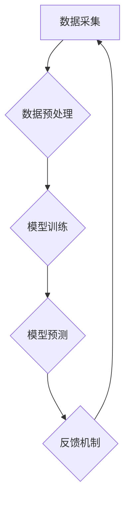

                 

## 虚拟进化：AI驱动的数字生态系统

> 关键词：人工智能、数字生态系统、虚拟进化、机器学习、深度学习、模拟进化、算法优化、数据驱动

### 1. 背景介绍

数字时代，信息爆炸和计算能力的飞速发展催生了全新的技术范式——数字生态系统。数字生态系统是指由各种数字资源、平台、应用和用户组成的复杂网络，其核心特征是开放、协同、自组织和持续演进。而人工智能（AI）作为数字生态系统的重要驱动力，正在深刻地改变着其形态和功能。

传统的生态系统是自然界中通过生物进化和自然选择形成的复杂网络，其演化过程遵循着一定的规律和机制。虚拟进化则借鉴了这些自然规律，将AI技术应用于模拟和加速数字生态系统的演化过程。通过算法优化、数据驱动和反馈机制，虚拟进化可以帮助数字生态系统更加高效、智能和适应性强。

### 2. 核心概念与联系

**2.1 数字生态系统**

数字生态系统是一个由数字资源、平台、应用和用户组成的复杂网络，其核心特征是开放、协同、自组织和持续演进。

* **开放性:** 数字生态系统鼓励外部参与和贡献，打破了传统封闭的生态圈。
* **协同性:** 数字生态系统中的各方通过数据共享、合作开发和共同利用资源，实现互利共赢。
* **自组织性:** 数字生态系统中的个体和组件通过相互作用和反馈机制，自发地形成新的结构和功能。
* **持续演进性:** 数字生态系统在不断地吸收新信息、学习新知识和适应新环境，不断进化和完善。

**2.2 虚拟进化**

虚拟进化是指利用人工智能技术模拟和加速数字生态系统的演化过程。其核心思想是借鉴自然进化中的机制，通过算法优化、数据驱动和反馈机制，引导数字生态系统朝着更优化的方向发展。

**2.3 AI驱动的虚拟进化**

AI技术是虚拟进化不可或缺的驱动力，它为模拟和优化数字生态系统提供了强大的工具和手段。

* **机器学习:** 可以从海量数据中学习数字生态系统的规律和模式，并根据这些规律预测未来的发展趋势。
* **深度学习:** 可以构建更复杂的模型，模拟更精细的生态系统交互和演化过程。
* **强化学习:** 可以训练智能代理，使其能够在数字生态系统中做出最优决策，并推动生态系统的进化。

**2.4  核心架构**



### 3. 核心算法原理 & 具体操作步骤

**3.1 算法原理概述**

虚拟进化算法通常基于自然进化中的机制，例如遗传算法、模拟退火算法和粒子群算法等。这些算法通过模拟生物的遗传、变异和选择过程，不断优化数字生态系统的结构和功能。

**3.2 算法步骤详解**

1. **初始化:** 创建初始的数字生态系统模型，包括各种数字资源、平台、应用和用户。
2. **评估:** 对初始模型进行评估，衡量其性能和适应性。
3. **选择:** 根据评估结果，选择性能较好的个体进行繁殖。
4. **交叉:** 将选中的个体进行交叉操作，产生新的个体。
5. **变异:** 对新的个体进行变异操作，引入新的特性和可能性。
6. **反馈:** 将新的个体反馈到数字生态系统中，观察其表现和影响。
7. **迭代:** 重复上述步骤，直到达到预设的进化目标。

**3.3 算法优缺点**

* **优点:** 能够有效地探索和发现新的解决方案，并适应不断变化的环境。
* **缺点:** 算法的复杂度较高，需要大量的计算资源和时间。

**3.4 算法应用领域**

* **网络优化:** 优化网络拓扑结构、路由算法和资源分配。
* **软件开发:** 自动生成代码、优化软件架构和提高软件性能。
* **金融市场:** 预测市场趋势、优化投资策略和管理风险。
* **医疗保健:** 发现新的药物、诊断疾病和个性化治疗。

### 4. 数学模型和公式 & 详细讲解 & 举例说明

**4.1 数学模型构建**

虚拟进化算法通常基于数学模型来描述数字生态系统的演化过程。这些模型可以包括：

* **个体模型:** 描述个体在生态系统中的属性和行为。
* **交互模型:** 描述个体之间相互作用的规则和机制。
* **环境模型:** 描述生态系统外部环境的影响因素。

**4.2 公式推导过程**

例如，我们可以使用一个简单的数学模型来描述个体在生态系统中的适应度：

$$
fitness = \frac{contribution}{cost}
$$

其中：

* **fitness:** 个体的适应度
* **contribution:** 个体对生态系统贡献的价值
* **cost:** 个体对生态系统带来的成本

**4.3 案例分析与讲解**

假设我们有一个数字生态系统，其中个体代表不同的应用程序。每个应用程序的贡献值取决于其用户数量和活跃度，而成本值取决于其资源消耗和维护成本。

我们可以使用上述公式来计算每个应用程序的适应度，并选择适应度最高的应用程序进行繁殖和变异。通过不断迭代这个过程，我们可以引导数字生态系统朝着更优化的方向发展，例如：

* 鼓励开发更受欢迎、更具价值的应用程序。
* 减少资源消耗和维护成本。
* 提高生态系统的整体效率和稳定性。

### 5. 项目实践：代码实例和详细解释说明

**5.1 开发环境搭建**

虚拟进化项目通常需要使用Python语言和相关的库，例如NumPy、Scikit-learn和TensorFlow等。

**5.2 源代码详细实现**

```python
import numpy as np

# 定义个体模型
class Individual:
    def __init__(self, genes):
        self.genes = genes
        self.fitness = 0

    def calculate_fitness(self):
        # 计算个体的适应度
        pass

# 定义种群
class Population:
    def __init__(self, size, genes_length):
        self.size = size
        self.genes_length = genes_length
        self.individuals = [Individual(np.random.randint(0, 2, size=genes_length)) for _ in range(size)]

    def evolve(self):
        # 选择、交叉、变异
        pass

# 主程序
if __name__ == "__main__":
    population = Population(size=100, genes_length=10)
    for generation in range(100):
        population.evolve()
        # 打印当前代最优个体的适应度
        print(f"Generation {generation}: Best fitness = {max(individual.fitness for individual in population.individuals)}")
```

**5.3 代码解读与分析**

这段代码实现了基本的虚拟进化算法。

* `Individual`类代表一个个体，包含基因和适应度值。
* `Population`类代表一个种群，包含多个个体。
* `evolve()`方法模拟了选择、交叉和变异过程。

**5.4 运行结果展示**

运行这段代码后，我们可以观察到种群的适应度随着迭代次数的增加而不断提高。

### 6. 实际应用场景

**6.1 网络优化**

虚拟进化算法可以用于优化网络拓扑结构、路由算法和资源分配。例如，可以训练一个智能代理，使其能够根据网络流量和负载情况，动态调整网络路由，从而提高网络效率和可靠性。

**6.2 软件开发**

虚拟进化算法可以用于自动生成代码、优化软件架构和提高软件性能。例如，可以训练一个智能代理，使其能够根据软件需求和性能指标，自动生成最优的代码结构和算法。

**6.3 金融市场**

虚拟进化算法可以用于预测市场趋势、优化投资策略和管理风险。例如，可以训练一个智能代理，使其能够分析市场数据和交易历史，预测未来的市场走势，并制定相应的投资策略。

**6.4 未来应用展望**

随着人工智能技术的不断发展，虚拟进化算法将在更多领域得到应用，例如：

* **医疗保健:** 发现新的药物、诊断疾病和个性化治疗。
* **教育:** 个性化学习路径和智能辅导系统。
* **环境保护:** 优化资源利用和环境治理策略。

### 7. 工具和资源推荐

**7.1 学习资源推荐**

* **书籍:**
    * 《进化算法》
    * 《人工智能：现代方法》
* **在线课程:**
    * Coursera上的《机器学习》
    * edX上的《人工智能导论》

**7.2 开发工具推荐**

* **Python:** 广泛用于人工智能开发，拥有丰富的库和工具。
* **NumPy:** 用于数值计算和数组操作。
* **Scikit-learn:** 用于机器学习算法的实现和应用。
* **TensorFlow:** 用于深度学习模型的开发和训练。

**7.3 相关论文推荐**

* **《A Survey of Evolutionary Algorithms for Feature Selection》**
* **《Deep Reinforcement Learning for Robotics》**

### 8. 总结：未来发展趋势与挑战

**8.1 研究成果总结**

虚拟进化算法在模拟和加速数字生态系统的演化过程中取得了显著的成果，为解决复杂问题提供了新的思路和方法。

**8.2 未来发展趋势**

未来，虚拟进化算法将朝着以下方向发展：

* **更复杂的模型:** 建立更复杂的数学模型，模拟更精细的生态系统交互和演化过程。
* **更强大的算法:** 开发更强大的算法，提高虚拟进化效率和精度。
* **更广泛的应用:** 将虚拟进化算法应用于更多领域，解决更复杂的问题。

**8.3 面临的挑战**

虚拟进化算法也面临着一些挑战：

* **计算复杂度:** 虚拟进化算法的计算复杂度较高，需要大量的计算资源和时间。
* **模型准确性:** 建立准确的数学模型是虚拟进化算法的关键，但现实世界是复杂的，难以完全建模。
* **伦理问题:** 虚拟进化算法的应用可能引发一些伦理问题，例如算法偏见和数据隐私。

**8.4 研究展望**

未来，我们需要继续探索虚拟进化算法的潜力，克服其面临的挑战，并将其应用于更多领域，为人类社会创造更大的价值。

### 9. 附录：常见问题与解答

**9.1 如何选择合适的虚拟进化算法？**

选择合适的虚拟进化算法取决于具体的应用场景和需求。例如，对于网络优化问题，可以选择遗传算法；对于软件开发问题，可以选择粒子群算法。

**9.2 如何评估虚拟进化算法的性能？**

虚拟进化算法的性能可以通过适应度、收敛速度和解的质量等指标来评估。

**9.3 如何解决虚拟进化算法的计算复杂度问题？**

可以采用并行计算、启发式算法和近似算法等方法来降低虚拟进化算法的计算复杂度。


作者：禅与计算机程序设计艺术 / Zen and the Art of Computer Programming 
<end_of_turn>

