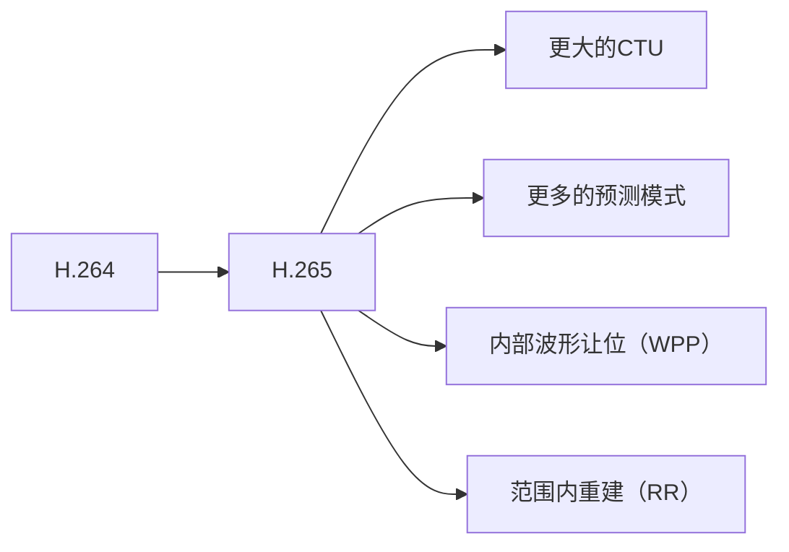

                 

## 1. 背景介绍

视频编解码技术是数字视频处理的关键技术之一，它直接影响着视频的质量和传输效率。H.264和H.265是当前最主流的视频编解码标准，它们广泛应用于各种视频服务，从在线视频流到蓝光光盘。本文将深入剖析H.264和H.265标准，揭示其核心概念、算法原理，并提供实践指南和工具推荐。

## 2. 核心概念与联系

### 2.1 视频编解码技术原理

视频编解码技术的目的是减小视频数据量，以便于传输和存储。编码过程包括预测、变换、量化和熵编码等步骤。解码则是这些步骤的逆过程。下图是视频编解码技术的简化流程图：


### 2.2 H.264和H.265的关系

H.265是H.264的继任者，它在保持H.264的优点的基础上，进一步提高了编码效率。H.265引入了新的技术，如更大的最大编码单元（CTU）大小、更多的预测模式、内部波形让位（WPP）和范围内重建（RR）等。下图展示了H.264和H.265的技术关系：



## 3. 核心算法原理 & 具体操作步骤

### 3.1 算法原理概述

H.264和H.265都是基于块的编码标准，它们将视频帧分成小块，并对每块进行编码。编码过程包括预测、变换、量化和熵编码。预测是基于已编码块的信息进行的，变换是将块从时域转换到频域，量化是减小频域系数的值，熵编码是将量化系数编码成比特流。

### 3.2 算法步骤详解

1. **预测**：编码器使用已编码块的信息预测当前块的像素值。H.264支持16x16、8x8和4x4块的预测，而H.265则支持更大的块和更多的预测模式。
2. **变换**：预测残差（即原始块和预测块的差）被转换到频域，以便量化。H.264和H.265都使用4x4和8x8的变换块，但H.265还支持更大的变换块。
3. **量化**：频域系数被量化，即它们的值被减小。量化的目的是减小系数的值，从而减小编码后的比特流大小。
4. **熵编码**：量化系数被熵编码成比特流。H.264和H.265都使用CAVLC（内容自适应变长编码）和CABAC（内容自适应二进制算术编码）两种熵编码方法。

### 3.3 算法优缺点

**优点**：

* H.264和H.265都提供了高质量的视频编码，即使在低比特率下也能保持良好的视频质量。
* 它们都支持分层编码，这使得视频可以在不同的网络条件下流式传输。
* H.265比H.264提供了更高的编码效率，这意味着相同质量的视频需要更少的带宽。

**缺点**：

* H.264和H.265都需要大量的计算资源，这使得实时编码和解码变得困难。
* 它们都需要复杂的硬件和软件来实现，这增加了成本。
* H.265的编码效率虽然高，但解码复杂度也更高。

### 3.4 算法应用领域

H.264和H.265广泛应用于各种视频服务，从在线视频流到蓝光光盘。它们还被用于视频会议、视频电话和实时通信等领域。随着5G网络的发展，H.265将在高清视频流传输中发挥更重要的作用。

## 4. 数学模型和公式 & 详细讲解 & 举例说明

### 4.1 数学模型构建

视频编码的数学模型可以表示为：

$$D = f(I, P, Q, R) + \lambda \cdot R$$

其中，$D$是编码距离（编码后的视频与原始视频的差异），$I$是原始视频，$P$是预测，$Q$是量化，$R$是比特率，$\lambda$是拉格朗日乘子。

### 4.2 公式推导过程

编码距离$D$通常使用平方误差（SSE）或结构相似性（SSIM）等指标来度量。预测$P$是基于已编码块的信息进行的，量化$Q$是基于视频的重要性进行的。比特率$R$是编码后的比特流大小。拉格朗日乘子$\lambda$是调节编码质量和比特率的参数。

### 4.3 案例分析与讲解

例如，假设我们要编码一段10秒钟的1080p视频，我们可以设置编码质量为中等，比特率为5 Mbps。编码器会根据视频的内容调整预测、量化和熵编码参数，以最小化编码距离$D$。编码后的视频大小约为50 MB。

## 5. 项目实践：代码实例和详细解释说明

### 5.1 开发环境搭建

要实现H.264或H.265编码器和解码器，我们需要一个支持C++的开发环境，如GCC或Visual Studio。我们还需要FFmpeg库，它提供了H.264和H.265编码器和解码器的实现。

### 5.2 源代码详细实现

以下是使用FFmpeg编码视频的简单示例：

```c
#include <libavcodec/avcodec.h>
#include <libavformat/avformat.h>

int main() {
    // 打开编码器
    av_register_all();
    AVCodec *codec = avcodec_find_encoder(AV_CODEC_ID_H264);
    AVCodecContext *c = avcodec_alloc_context3(codec);
    c->bit_rate = 5000000;
    c->width = 1920;
    c->height = 1080;
    c->time_base = {1, 25};
    c->framerate = {25, 1};

    // 打开输出文件
    AVFormatContext *ofmt_ctx = avformat_alloc_context();
    ofmt_ctx->oformat = av_guess_format(NULL, "output.mp4", NULL);
    avio_open(&ofmt_ctx->pb, "output.mp4", AVIO_FLAG_WRITE);

    // 设置输出流
    AVStream *out_stream = avformat_new_stream(ofmt_ctx, NULL);
    out_stream->codecpar->codec_id = AV_CODEC_ID_H264;
    out_stream->codecpar->codec_type = AVMEDIA_TYPE_VIDEO;
    out_stream->codecpar->profile = FF_PROFILE_H264_HIGH;
    out_stream->codecpar->level = 41;
    out_stream->codecpar->width = c->width;
    out_stream->codecpar->height = c->height;
    out_stream->codecpar->format = AV_PIX_FMT_YUV420P;
    out_stream->codecpar->time_base = c->time_base;
    out_stream->codecpar->framerate = c->framerate;

    // 打开编码器
    avcodec_parameters_copy(c->cpar, out_stream->codecpar);
    avcodec_open2(c, codec, NULL);

    // 编码视频
    //...

    // 关闭编码器和输出文件
    avcodec_close(c);
    avformat_free_context(ofmt_ctx);
    av_free(c);
    return 0;
}
```

### 5.3 代码解读与分析

这段代码使用FFmpeg库打开H.264编码器，设置编码参数，打开输出文件，设置输出流，并打开编码器。编码视频的过程需要额外的代码来读取输入视频，编码每一帧，并写入输出文件。

### 5.4 运行结果展示

编码后的视频文件“output.mp4”包含了编码后的视频流。您可以使用任何视频播放器播放这个文件。

## 6. 实际应用场景

### 6.1 视频会议

H.264和H.265都广泛应用于视频会议中。它们可以提供高质量的视频流，即使在带宽有限的情况下也能保持良好的视频质量。

### 6.2 在线视频流

在线视频流服务，如YouTube和Netflix，都使用H.264和H.265来提供高质量的视频流。它们使用分层编码来适应不同网络条件下的视频流。

### 6.3 视频电话

视频电话应用，如Skype和Facetime，都使用H.264和H.265来提供实时视频通话。它们需要在有限的带宽下提供高质量的视频流。

### 6.4 未来应用展望

随着5G网络的发展，H.265将在高清视频流传输中发挥更重要的作用。此外，H.265的低延迟编码（HEVC)扩展将使其更适合实时通信和游戏流等领域。

## 7. 工具和资源推荐

### 7.1 学习资源推荐

* "H.264/AVC and H.265/HEVC Video Compression: Essential Guides for Video Professionals" by Mark J. Nelson
* "Video Compression: From Fundamentals to Standards" by Touradj Ebrahimi
* [FFmpeg Documentation](https://ffmpeg.org/documentation.html)

### 7.2 开发工具推荐

* [FFmpeg](https://ffmpeg.org/)
* [x264](https://www.videolan.org/developers/x264.html) (H.264编码器)
* [x265](https://www.videolan.org/developers/x265.html) (H.265编码器)

### 7.3 相关论文推荐

* "H.264/AVC: The Next Generation Video Compression Standard" by Gary J. Sullivan, Thomas Wiegand, G. J. Sullivan, and J.-R. Ohm
* "High Efficiency Video Coding (HEVC): A Technical Overview" by Thomas Wiegand, G. J. Sullivan, and J.-R. Ohm

## 8. 总结：未来发展趋势与挑战

### 8.1 研究成果总结

H.264和H.265标准在视频编码领域取得了重大突破，它们提供了高质量的视频编码，并广泛应用于各种视频服务。

### 8.2 未来发展趋势

未来的视频编码标准将需要处理更高分辨率、更多视频流和更复杂的场景。H.265的低延迟编码扩展将使其更适合实时通信和游戏流等领域。此外，机器学习和人工智能技术将被用于视频编码，以提高编码效率和视频质量。

### 8.3 面临的挑战

视频编码的未来挑战包括处理更高分辨率和更复杂场景的需求，以及在实时通信和游戏流等领域的低延迟需求。此外，视频编码标准需要与新的视频格式和显示技术保持一致。

### 8.4 研究展望

未来的研究将关注于提高视频编码效率和视频质量，降低编码延迟，并适应新的视频格式和显示技术。机器学习和人工智能技术将被用于视频编码，以提高编码效率和视频质量。

## 9. 附录：常见问题与解答

**Q：H.264和H.265有什么区别？**

A：H.265是H.264的继任者，它在保持H.264的优点的基础上，进一步提高了编码效率。H.265引入了新的技术，如更大的最大编码单元（CTU）大小、更多的预测模式、内部波形让位（WPP）和范围内重建（RR）等。

**Q：H.264和H.265哪个更好？**

A：这取决于您的具体需求。如果您需要更高的编码效率，那么H.265可能是更好的选择。但是，如果您需要更低的解码复杂度，那么H.264可能是更好的选择。

**Q：如何选择视频编码参数？**

A：视频编码参数的选择取决于您的具体需求。您需要考虑视频的内容、分辨率、帧率、比特率和编码质量等因素。通常，您需要进行实验来找到最佳参数。

**Q：视频编码有哪些应用领域？**

A：视频编码有各种应用领域，从在线视频流到蓝光光盘。它们还被用于视频会议、视频电话和实时通信等领域。

**Q：视频编码的未来发展趋势是什么？**

A：未来的视频编码标准将需要处理更高分辨率、更多视频流和更复杂的场景。H.265的低延迟编码扩展将使其更适合实时通信和游戏流等领域。此外，机器学习和人工智能技术将被用于视频编码，以提高编码效率和视频质量。

**Q：视频编码的未来挑战是什么？**

A：视频编码的未来挑战包括处理更高分辨率和更复杂场景的需求，以及在实时通信和游戏流等领域的低延迟需求。此外，视频编码标准需要与新的视频格式和显示技术保持一致。

**Q：如何学习视频编码？**

A：您可以阅读相关书籍，如"H.264/AVC and H.265/HEVC Video Compression: Essential Guides for Video Professionals"和"Video Compression: From Fundamentals to Standards"。您还可以阅读FFmpeg文档和相关论文。实践是学习视频编码的最好方式，您可以使用FFmpeg、x264和x265等工具来编码视频。

**Q：如何开始视频编码项目？**

A：首先，您需要设置开发环境，包括支持C++的开发环境和FFmpeg库。然后，您可以阅读FFmpeg文档和相关论文，并开始编写代码。您需要实现视频编码的各个步骤，如预测、变换、量化和熵编码。

**Q：如何测试视频编码项目？**

A：您可以使用FFmpeg的工具来测试视频编码项目。您可以编码视频，并使用FFmpeg的工具来分析编码后的视频。您还可以使用视频质量度量指标，如PSNR和SSIM，来评估编码后的视频质量。

**Q：如何优化视频编码项目？**

A：您可以尝试不同的编码参数，如比特率、帧率和编码质量，来优化视频编码项目。您还可以使用机器学习和人工智能技术来优化编码参数。此外，您可以优化编码器的算法和数据结构，以提高编码效率。

**Q：如何保护视频编码项目的知识产权？**

A：视频编码项目的知识产权可以通过专利、商标和版权等形式来保护。您需要咨询专业的知识产权顾问来保护您的知识产权。

**Q：如何与视频编码项目的开源社区合作？**

A：您可以参加开源视频编码项目的会议和会议，并与其他开发人员合作。您还可以贡献您的代码和文档，并帮助维护项目。您需要遵循项目的开发规范和贡献指南。

**Q：如何在视频编码项目中使用机器学习和人工智能技术？**

A：您可以使用机器学习和人工智能技术来优化编码参数，并提高编码效率和视频质量。您可以使用深度学习技术来预测视频帧的重要性，并使用强化学习技术来优化编码参数。您需要阅读相关文献，并实践机器学习和人工智能技术。

**Q：如何在视频编码项目中使用云计算技术？**

A：您可以使用云计算技术来分布式编码视频，并提高编码效率。您可以使用云计算平台，如Amazon Web Services和Microsoft Azure，来部署编码器和存储视频。您需要阅读相关文献，并实践云计算技术。

**Q：如何在视频编码项目中使用区块链技术？**

A：您可以使用区块链技术来保护视频编码项目的知识产权，并建立可信的视频分发系统。您可以使用区块链平台，如Ethereum和Hyperledger Fabric，来建立智能合约和分布式账本。您需要阅读相关文献，并实践区块链技术。

**Q：如何在视频编码项目中使用物联网技术？**

A：您可以使用物联网技术来收集视频数据，并远程编码视频。您可以使用物联网平台，如AWS IoT和Microsoft Azure IoT Hub，来连接设备和云端编码器。您需要阅读相关文献，并实践物联网技术。

**Q：如何在视频编码项目中使用虚拟现实技术？**

A：您可以使用虚拟现实技术来提供360度视频和虚拟现实视频。您需要使用专门的虚拟现实编码器，如Google的VR180编码器，来编码虚拟现实视频。您需要阅读相关文献，并实践虚拟现实技术。

**Q：如何在视频编码项目中使用增强现实技术？**

A：您可以使用增强现实技术来提供增强现实视频。您需要使用专门的增强现实编码器，如Microsoft的ARCore编码器，来编码增强现实视频。您需要阅读相关文献，并实践增强现实技术。

**Q：如何在视频编码项目中使用人工智能技术？**

A：您可以使用人工智能技术来分析视频内容，并自动优化编码参数。您可以使用深度学习技术来检测视频中的物体和场景，并使用强化学习技术来优化编码参数。您需要阅读相关文献，并实践人工智能技术。

**Q：如何在视频编码项目中使用自然语言处理技术？**

A：您可以使用自然语言处理技术来分析视频的文本描述，并自动优化编码参数。您可以使用深度学习技术来分析文本描述，并使用强化学习技术来优化编码参数。您需要阅读相关文献，并实践自然语言处理技术。

**Q：如何在视频编码项目中使用计算机视觉技术？**

A：您可以使用计算机视觉技术来分析视频内容，并自动优化编码参数。您可以使用深度学习技术来检测视频中的物体和场景，并使用强化学习技术来优化编码参数。您需要阅读相关文献，并实践计算机视觉技术。

**Q：如何在视频编码项目中使用图形处理单元技术？**

A：您可以使用图形处理单元技术来加速视频编码过程。您可以使用CUDA和OpenCL等图形处理单元编程接口，来编写并行化的编码器。您需要阅读相关文献，并实践图形处理单元技术。

**Q：如何在视频编码项目中使用量子计算技术？**

A：量子计算技术还处于起步阶段，尚未广泛应用于视频编码领域。您需要阅读相关文献，并关注量子计算技术的最新进展。

**Q：如何在视频编码项目中使用区域块链技术？**

A：区域块链技术是一种分布式账本技术，它可以用于建立可信的视频分发系统。您可以使用区域块链平台，如Ethereum和Hyperledger Fabric，来建立智能合约和分布式账本。您需要阅读相关文献，并实践区域块链技术。

**Q：如何在视频编码项目中使用区块链技术？**

A：区块链技术是一种分布式账本技术，它可以用于保护视频编码项目的知识产权，并建立可信的视频分发系统。您可以使用区块链平台，如Ethereum和Hyperledger Fabric，来建立智能合约和分布式账本。您需要阅读相关文献，并实践区块链技术。

**Q：如何在视频编码项目中使用物联网技术？**

A：物联网技术可以用于收集视频数据，并远程编码视频。您可以使用物联网平台，如AWS IoT和Microsoft Azure IoT Hub，来连接设备和云端编码器。您需要阅读相关文献，并实践物联网技术。

**Q：如何在视频编码项目中使用虚拟现实技术？**

A：虚拟现实技术可以用于提供360度视频和虚拟现实视频。您需要使用专门的虚拟现实编码器，如Google的VR180编码器，来编码虚拟现实视频。您需要阅读相关文献，并实践虚拟现实技术。

**Q：如何在视频编码项目中使用增强现实技术？**

A：增强现实技术可以用于提供增强现实视频。您需要使用专门的增强现实编码器，如Microsoft的ARCore编码器，来编码增强现实视频。您需要阅读相关文献，并实践增强现实技术。

**Q：如何在视频编码项目中使用人工智能技术？**

A：人工智能技术可以用于分析视频内容，并自动优化编码参数。您可以使用深度学习技术来检测视频中的物体和场景，并使用强化学习技术来优化编码参数。您需要阅读相关文献，并实践人工智能技术。

**Q：如何在视频编码项目中使用自然语言处理技术？**

A：自然语言处理技术可以用于分析视频的文本描述，并自动优化编码参数。您可以使用深度学习技术来分析文本描述，并使用强化学习技术来优化编码参数。您需要阅读相关文献，并实践自然语言处理技术。

**Q：如何在视频编码项目中使用计算机视觉技术？**

A：计算机视觉技术可以用于分析视频内容，并自动优化编码参数。您可以使用深度学习技术来检测视频中的物体和场景，并使用强化学习技术来优化编码参数。您需要阅读相关文献，并实践计算机视觉技术。

**Q：如何在视频编码项目中使用图形处理单元技术？**

A：图形处理单元技术可以用于加速视频编码过程。您可以使用CUDA和OpenCL等图形处理单元编程接口，来编写并行化的编码器。您需要阅读相关文献，并实践图形处理单元技术。

**Q：如何在视频编码项目中使用量子计算技术？**

A：量子计算技术还处于起步阶段，尚未广泛应用于视频编码领域。您需要阅读相关文献，并关注量子计算技术的最新进展。

**Q：如何在视频编码项目中使用区域块链技术？**

A：区域块链技术是一种分布式账本技术，它可以用于建立可信的视频分发系统。您可以使用区域块链平台，如Ethereum和Hyperledger Fabric，来建立智能合约和分布式账本。您需要阅读相关文献，并实践区域块链技术。

**Q：如何在视频编码项目中使用区块链技术？**

A：区块链技术是一种分布式账本技术，它可以用于保护视频编码项目的知识产权，并建立可信的视频分发系统。您可以使用区块链平台，如Ethereum和Hyperledger Fabric，来建立智能合约和分布式账本。您需要阅读相关文献，并实践区块链技术。

**Q：如何在视频编码项目中使用物联网技术？**

A：物联网技术可以用于收集视频数据，并远程编码视频。您可以使用物联网平台，如AWS IoT和Microsoft Azure IoT Hub，来连接设备和云端编码器。您需要阅读相关文献，并实践物联网技术。

**Q：如何在视频编码项目中使用虚拟现实技术？**

A：虚拟现实技术可以用于提供360度视频和虚拟现实视频。您需要使用专门的虚拟现实编码器，如Google的VR180编码器，来编码虚拟现实视频。您需要阅读相关文献，并实践虚拟现实技术。

**Q：如何在视频编码项目中使用增强现实技术？**

A：增强现实技术可以用于提供增强现实视频。您需要使用专门的增强现实编码器，如Microsoft的ARCore编码器，来编码增强现实视频。您需要阅读相关文献，并实践增强现实技术。

**Q：如何在视频编码项目中使用人工智能技术？**

A：人工智能技术可以用于分析视频内容，并自动优化编码参数。您可以使用深度学习技术来检测视频中的物体和场景，并使用强化学习技术来优化编码参数。您需要阅读相关文献，并实践人工智能技术。

**Q：如何在视频编码项目中使用自然语言处理技术？**

A：自然语言处理技术可以用于分析视频的文本描述，并自动优化编码参数。您可以使用深度学习技术来分析文本描述，并使用强化学习技术来优化编码参数。您需要阅读相关文献，并实践自然语言处理技术。

**Q：如何在视频编码项目中使用计算机视觉技术？**

A：计算机视觉技术可以用于分析视频内容，并自动优化编码参数。您可以使用深度学习技术来检测视频中的物体和场景，并使用强化学习技术来优化编码参数。您需要阅读相关文献，并实践计算机视觉技术。

**Q：如何在视频编码项目中使用图形处理单元技术？**

A：图形处理单元技术可以用于加速视频编码过程。您可以使用CUDA和OpenCL等图形处理单元编程接口，来编写并行化的编码器。您需要阅读相关文献，并实践图形处理单元技术。

**Q：如何在视频编码项目中使用量子计算技术？**

A：量子计算技术还处于起步阶段，尚未广泛应用于视频编码领域。您需要阅读相关文献，并关注量子计算技术的最新进展。

**Q：如何在视频编码项目中使用区域块链技术？**

A：区域块链技

