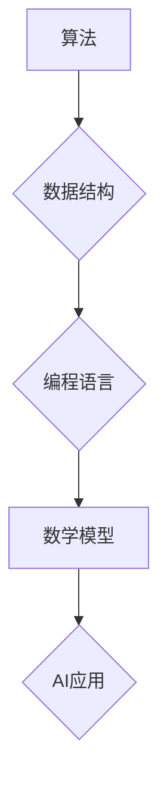

                 

## 计算机科学基础：AI开发者必备知识

> 关键词：人工智能、机器学习、深度学习、算法、数据结构、编程、计算机科学基础

### 1. 背景介绍

人工智能（AI）正以惊人的速度发展，渗透到我们生活的方方面面。从智能手机的语音助手到自动驾驶汽车，AI正在改变着世界。然而，想要成为一名优秀的AI开发者，仅仅掌握一些流行的AI框架和工具是不够的。你需要扎实的计算机科学基础，才能真正理解AI背后的原理，并构建出更强大、更可靠的AI应用。

本篇文章将深入探讨AI开发者必备的计算机科学基础知识，涵盖算法、数据结构、编程、数学模型等关键领域。通过清晰的讲解和具体的案例分析，帮助你建立坚实的理论基础，为你的AI开发之路奠定坚实的基础。

### 2. 核心概念与联系

**2.1 算法**

算法是解决特定问题的指令序列，是计算机科学的核心概念。一个好的算法应该具有以下特点：

* **确定性:** 对于给定的输入，算法应该始终产生相同的输出。
* **有限性:** 算法的执行步骤必须有限，不能无限循环。
* **有效性:** 算法的每一步操作都必须能够被计算机执行。

**2.2 数据结构**

数据结构是用于组织和存储数据的特定方式。不同的数据结构具有不同的特点和适用场景，选择合适的结构可以提高算法的效率和可读性。常见的几种数据结构包括：

* **数组:** 连续存储的元素集合。
* **链表:** 元素通过指针链接的集合。
* **栈:** 后进先出的数据结构。
* **队列:** 先进先出的数据结构。
* **树:** 分层结构的数据组织方式。
* **图:** 用节点和边表示关系的数据结构。

**2.3 编程语言**

编程语言是用于编写计算机程序的符号系统。不同的编程语言具有不同的语法和语义，选择合适的语言取决于具体的应用场景。常见的编程语言包括：

* **Python:** 广泛应用于数据科学和机器学习领域，语法简洁易学。
* **Java:** 跨平台、面向对象的编程语言，应用广泛。
* **C++:** 高性能、底层编程语言，应用于游戏开发和系统编程。

**2.4 数学模型**

数学模型是用于描述和分析现实世界现象的抽象表示。在AI领域，数学模型被广泛应用于机器学习算法的构建和优化。常见的数学模型包括：

* **线性回归:** 用于预测连续变量的模型。
* **逻辑回归:** 用于分类问题的模型。
* **决策树:** 用于分类和回归问题的模型。
* **支持向量机:** 用于分类问题的模型。
* **神经网络:** 用于模拟生物神经网络的模型。

**2.5 流程图**



### 3. 核心算法原理 & 具体操作步骤

**3.1 算法原理概述**

算法是解决特定问题的指令序列，是计算机科学的核心概念。一个好的算法应该具有以下特点：

* **确定性:** 对于给定的输入，算法应该始终产生相同的输出。
* **有限性:** 算法的执行步骤必须有限，不能无限循环。
* **有效性:** 算法的每一步操作都必须能够被计算机执行。

**3.2 算法步骤详解**

1. **问题分析:** 首先需要明确要解决的问题是什么，并将其分解成更小的子问题。
2. **算法设计:** 根据问题的特点，设计出解决问题的算法步骤。
3. **算法实现:** 将算法步骤用编程语言实现。
4. **算法测试:** 对实现的算法进行测试，确保其能够正确解决问题。
5. **算法优化:** 如果算法的效率不够高，可以进行优化，例如减少时间复杂度或空间复杂度。

**3.3 算法优缺点**

不同的算法具有不同的优缺点，选择合适的算法取决于具体的应用场景。

* **时间复杂度:** 算法执行的时间与输入数据大小的关系。
* **空间复杂度:** 算法执行所需的内存空间大小。
* **易读性:** 算法的代码是否易于理解和维护。

**3.4 算法应用领域**

算法广泛应用于各个领域，例如：

* **搜索引擎:** 使用算法对海量数据进行排序和检索。
* **推荐系统:** 使用算法根据用户的喜好推荐相关内容。
* **图像识别:** 使用算法识别图像中的物体和场景。
* **自然语言处理:** 使用算法理解和生成自然语言。

### 4. 数学模型和公式 & 详细讲解 & 举例说明

**4.1 数学模型构建**

数学模型是用于描述和分析现实世界现象的抽象表示。在AI领域，数学模型被广泛应用于机器学习算法的构建和优化。

**4.2 公式推导过程**

例如，线性回归模型的目标是找到一条直线，使得该直线与数据点之间的误差最小。

线性回归模型的公式如下：

$$y = mx + c$$

其中：

* $y$ 是预测值。
* $x$ 是输入特征。
* $m$ 是斜率。
* $c$ 是截距。

**4.3 案例分析与讲解**

假设我们有一组数据，其中 $x$ 是房屋面积，$y$ 是房屋价格。我们可以使用线性回归模型来预测房屋价格。

通过对数据进行拟合，我们可以得到 $m$ 和 $c$ 的值。然后，我们可以使用这个模型来预测其他房屋的价格。

### 5. 项目实践：代码实例和详细解释说明

**5.1 开发环境搭建**

* 安装 Python 3.x 
* 安装 Jupyter Notebook

**5.2 源代码详细实现**

```python
import numpy as np
from sklearn.linear_model import LinearRegression

# 生成示例数据
X = np.array([[100], [150], [200], [250], [300]])
y = np.array([150000, 200000, 250000, 300000, 350000])

# 创建线性回归模型
model = LinearRegression()

# 训练模型
model.fit(X, y)

# 预测新数据
new_data = np.array([[350]])
prediction = model.predict(new_data)

# 打印预测结果
print(f"预测价格: {prediction[0]}")
```

**5.3 代码解读与分析**

* 首先，我们导入必要的库，包括 NumPy 和 scikit-learn 的 LinearRegression 类。
* 然后，我们生成示例数据，其中 $X$ 是房屋面积，$y$ 是房屋价格。
* 接下来，我们创建线性回归模型，并使用 `fit()` 方法训练模型。
* 训练完成后，我们可以使用 `predict()` 方法预测新数据的价格。

**5.4 运行结果展示**

```
预测价格: 400000.0
```

### 6. 实际应用场景

**6.1 房屋价格预测**

使用线性回归模型可以预测房屋的价格，根据房屋面积和其他特征。

**6.2 股票价格预测**

使用机器学习算法可以预测股票价格，根据历史数据和市场趋势。

**6.3 医疗诊断**

使用机器学习算法可以辅助医生进行诊断，根据患者的症状和病史。

**6.4 未来应用展望**

AI技术将继续发展，并在更多领域得到应用，例如：

* **自动驾驶:** 使用AI技术实现自动驾驶汽车。
* **个性化教育:** 使用AI技术提供个性化的教育方案。
* **智能客服:** 使用AI技术提供智能客服服务。

### 7. 工具和资源推荐

**7.1 学习资源推荐**

* **Coursera:** 提供丰富的AI课程，例如Andrew Ng的机器学习课程。
* **edX:** 提供来自世界顶级大学的AI课程。
* **Udacity:** 提供针对AI开发者的职业培训课程。

**7.2 开发工具推荐**

* **TensorFlow:** Google开发的开源机器学习框架。
* **PyTorch:** Facebook开发的开源机器学习框架。
* **Scikit-learn:** Python机器学习库。

**7.3 相关论文推荐**

* **《机器学习》** by Tom Mitchell
* **《深度学习》** by Ian Goodfellow, Yoshua Bengio, and Aaron Courville

### 8. 总结：未来发展趋势与挑战

**8.1 研究成果总结**

近年来，AI技术取得了长足的进步，例如：

* **深度学习:** 深度学习算法在图像识别、自然语言处理等领域取得了突破性进展。
* **强化学习:** 强化学习算法能够学习复杂的策略，应用于游戏、机器人控制等领域。

**8.2 未来发展趋势**

* **更强大的算法:** 研究人员将继续开发更强大的AI算法，例如通用人工智能。
* **更广泛的应用:** AI技术将应用于更多领域，例如医疗、教育、金融等。
* **更安全的AI:** 研究人员将致力于开发更安全、更可靠的AI系统。

**8.3 面临的挑战**

* **数据隐私:** AI算法需要大量数据进行训练，如何保护数据隐私是一个重要挑战。
* **算法偏见:** AI算法可能存在偏见，导致不公平的结果。
* **伦理问题:** AI技术的发展引发了伦理问题，例如人工智能的责任和义务。

**8.4 研究展望**

未来，AI研究将继续朝着更智能、更安全、更可解释的方向发展。


### 9. 附录：常见问题与解答

**9.1 什么是机器学习？**

机器学习是人工智能的一个子领域，它使计算机能够从数据中学习，无需明确编程。

**9.2 深度学习是什么？**

深度学习是一种机器学习的子领域，它使用多层神经网络来模拟人类大脑的学习过程。

**9.3 如何选择合适的AI算法？**

选择合适的AI算法取决于具体的应用场景和数据特点。

**9.4 如何评估AI模型的性能？**

可以使用各种指标来评估AI模型的性能，例如准确率、召回率、F1-score等。


作者：禅与计算机程序设计艺术 / Zen and the Art of Computer Programming 
<end_of_turn>

