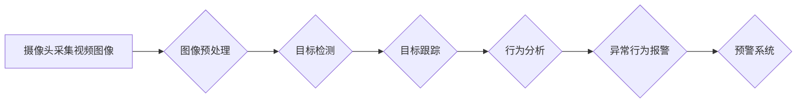

                 

## 计算机视觉在安防系统中的应用：智能监控与预警

> 关键词：计算机视觉、安防系统、智能监控、预警、目标检测、图像识别、深度学习、机器学习

## 1. 背景介绍

随着社会发展和科技进步，安防需求日益增长。传统安防系统主要依靠人工监控，存在着效率低、成本高、易疲劳等问题。计算机视觉技术作为人工智能的重要分支，凭借其强大的图像识别、分析和处理能力，为安防系统带来了革命性的变革。

计算机视觉技术在安防系统中的应用，主要体现在以下几个方面：

* **智能监控：** 利用摄像头采集的视频图像，自动识别和跟踪目标，实时监控人员和车辆的移动轨迹，并对异常行为进行报警。
* **预警系统：** 通过对视频图像进行分析，识别潜在的危险事件，例如火灾、爆炸、入侵等，并及时发出预警，帮助安全人员快速响应。
* **身份识别：** 利用人脸识别、指纹识别等技术，对人员进行身份验证，提高安防系统的安全性。
* **行为分析：** 对视频图像进行行为分析，识别人员的异常行为，例如徘徊、聚集、争吵等，帮助安全人员及时发现潜在的威胁。

## 2. 核心概念与联系

### 2.1 计算机视觉

计算机视觉是指赋予计算机“看”的能力，使其能够理解和解释图像和视频信息。它涵盖了图像处理、图像识别、目标检测、场景理解等多个领域。

### 2.2 安防系统

安防系统是指用于保护人员、财产和信息安全的系统。传统的安防系统主要依靠物理安全措施和人工监控，而现代安防系统则越来越依赖于智能化技术，例如计算机视觉、生物识别、网络安全等。

### 2.3 智能监控与预警

智能监控是指利用计算机视觉技术，对视频图像进行自动分析和处理，实现对目标的实时监控和异常行为的识别。预警系统则是在智能监控的基础上，对潜在的危险事件进行识别和预警，帮助安全人员及时采取措施。

**核心概念与架构流程图**



## 3. 核心算法原理 & 具体操作步骤

### 3.1 算法原理概述

计算机视觉在安防系统中的应用主要依赖于以下核心算法：

* **目标检测：** 识别视频图像中的人员、车辆等目标，并确定其位置和大小。
* **目标跟踪：** 对检测到的目标进行跟踪，记录其运动轨迹。
* **行为分析：** 对目标的运动轨迹和行为特征进行分析，识别异常行为。

这些算法通常基于深度学习技术，例如卷积神经网络（CNN）。

### 3.2 算法步骤详解

**目标检测算法步骤：**

1. **图像预处理：** 对采集到的视频图像进行预处理，例如调整亮度、对比度、去除噪声等，以提高目标检测的准确性。
2. **特征提取：** 利用CNN等深度学习模型，从图像中提取目标的特征信息。
3. **目标分类：** 将提取到的特征信息与预先训练好的分类模型进行比较，识别目标的类别。
4. **目标定位：** 利用回归算法，预测目标在图像中的位置和大小。

**目标跟踪算法步骤：**

1. **目标初始化：** 在视频图像中检测到目标后，对其进行初始化，例如确定其边界框和特征描述符。
2. **目标匹配：** 在后续帧中，利用目标的特征描述符和运动模型，匹配目标的位置。
3. **目标更新：** 根据目标的运动轨迹，更新目标的边界框和特征描述符。

**行为分析算法步骤：**

1. **行为特征提取：** 对目标的运动轨迹、姿态、速度等特征进行提取。
2. **行为模式识别：** 利用机器学习算法，识别目标的行为模式，例如行走、奔跑、停留、聚集等。
3. **异常行为检测：** 将目标的行为特征与预先定义的正常行为模式进行比较，识别异常行为。

### 3.3 算法优缺点

**目标检测算法：**

* **优点：** 准确率高，能够识别多种类型的目标。
* **缺点：** 计算量大，实时性较差。

**目标跟踪算法：**

* **优点：** 可以跟踪目标的运动轨迹，提高识别精度。
* **缺点：** 对目标的初始检测精度要求较高，容易受到遮挡和运动模糊的影响。

**行为分析算法：**

* **优点：** 可以识别更复杂的异常行为，例如入侵、攻击等。
* **缺点：** 需要大量的训练数据，算法复杂度较高。

### 3.4 算法应用领域

目标检测、目标跟踪和行为分析算法广泛应用于安防系统、交通监控、医疗诊断、工业自动化等领域。

## 4. 数学模型和公式 & 详细讲解 & 举例说明

### 4.1 数学模型构建

目标检测算法通常使用**目标检测框（bounding box）**来表示目标的位置和大小。目标检测框可以用四个坐标值来描述：左上角的x和y坐标，以及右下角的x和y坐标。

**目标检测框的数学模型：**

```latex
bbox = (x_min, y_min, x_max, y_max)
```

其中：

* $x_{min}$：目标左上角的x坐标
* $y_{min}$：目标左上角的y坐标
* $x_{max}$：目标右下角的x坐标
* $y_{max}$：目标右下角的y坐标

### 4.2 公式推导过程

目标检测算法的目标是找到最佳的目标检测框，即与真实目标位置和大小最接近的框。常用的目标检测算法使用**损失函数**来衡量目标检测框与真实目标之间的误差。

**常见的损失函数包括：**

* **边界框损失函数：** 计算目标检测框与真实目标框之间的位置和大小误差。
* **分类损失函数：** 计算目标检测结果与真实目标类别之间的误差。

**损失函数的公式：**

```latex
Loss = \alpha \cdot L_{bbox} + (1-\alpha) \cdot L_{class}
```

其中：

* $L_{bbox}$：边界框损失函数
* $L_{class}$：分类损失函数
* $\alpha$：权重参数，用于平衡边界框损失和分类损失的贡献

### 4.3 案例分析与讲解

假设我们使用目标检测算法对一张包含一辆汽车的图像进行检测。

* **真实目标框：** (100, 100, 200, 200)
* **预测目标框：** (90, 95, 210, 195)

我们可以使用边界框损失函数计算这两个框之间的误差，并根据误差值调整目标检测模型的参数，使其能够预测更准确的目标框。

## 5. 项目实践：代码实例和详细解释说明

### 5.1 开发环境搭建

为了实现计算机视觉在安防系统中的应用，我们需要搭建一个开发环境。

* **操作系统：** Linux 或 Windows
* **编程语言：** Python
* **深度学习框架：** TensorFlow 或 PyTorch
* **计算机视觉库：** OpenCV

### 5.2 源代码详细实现

以下是一个使用 TensorFlow 和 OpenCV 实现目标检测的简单代码示例：

```python
import tensorflow as tf
import cv2

# 加载预训练的目标检测模型
model = tf.keras.models.load_model('object_detection_model.h5')

# 打开摄像头
cap = cv2.VideoCapture(0)

while True:
    # 读取摄像头图像
    ret, frame = cap.read()

    # 对图像进行预处理
    frame = cv2.resize(frame, (300, 300))
    frame = frame / 255.0

    # 使用目标检测模型进行预测
    predictions = model.predict(frame[None, ...])

    # 绘制目标检测框
    for prediction in predictions[0]:
        if prediction[2] > 0.5:
            x_min, y_min, x_max, y_max = prediction[3:7] * frame.shape[1], prediction[7:11] * frame.shape[0]
            cv2.rectangle(frame, (int(x_min), int(y_min)), (int(x_max), int(y_max)), (0, 255, 0), 2)

    # 显示图像
    cv2.imshow('Object Detection', frame)

    # 按键退出
    if cv2.waitKey(1) & 0xFF == ord('q'):
        break

# 释放资源
cap.release()
cv2.destroyAllWindows()
```

### 5.3 代码解读与分析

* **加载预训练模型：** 代码首先加载一个预训练的目标检测模型，该模型已经经过训练，能够识别多种类型的目标。
* **打开摄像头：** 代码使用 OpenCV 库打开摄像头，获取实时视频流。
* **图像预处理：** 代码对摄像头获取的图像进行预处理，例如调整大小、归一化等，以提高目标检测的准确性。
* **目标检测：** 代码使用目标检测模型对预处理后的图像进行预测，得到目标的检测结果。
* **绘制目标检测框：** 代码根据目标检测结果，在图像上绘制目标检测框，并标注目标的类别和置信度。
* **显示图像：** 代码使用 OpenCV 库显示处理后的图像，并等待用户按键退出。

### 5.4 运行结果展示

运行该代码后，将会在窗口中显示实时视频流，并对视频流中的目标进行检测和标注。

## 6. 实际应用场景

### 6.1 交通监控

计算机视觉技术可以用于监控交通状况，识别违规行为，例如闯红灯、超速行驶等，提高交通安全。

### 6.2 人员管理

计算机视觉技术可以用于人员管理，例如识别员工身份，记录人员进出时间，提高人员安全和管理效率。

### 6.3 智慧城市

计算机视觉技术可以用于智慧城市建设，例如监控公共场所安全，识别垃圾分类情况，提高城市管理水平。

### 6.4 未来应用展望

随着计算机视觉技术的不断发展，其在安防系统中的应用将会更加广泛和深入。例如：

* **更准确的目标检测和跟踪：** 利用更先进的深度学习算法，提高目标检测和跟踪的准确性和实时性。
* **更智能的行为分析：** 利用机器学习算法，识别更复杂的异常行为，例如欺诈、攻击等。
* **更安全的身份识别：** 利用生物识别技术，例如人脸识别、指纹识别等，提高身份识别的安全性。
* **更全面的预警系统：** 利用多传感器融合技术，构建更全面的预警系统，能够识别和预警各种类型的安全威胁。

## 7. 工具和资源推荐

### 7.1 学习资源推荐

* **书籍：**
    * 《深度学习》 - Ian Goodfellow, Yoshua Bengio, Aaron Courville
    * 《计算机视觉：算法与应用》 - Richard Szeliski
* **在线课程：**
    * Coursera: Deep Learning Specialization
    * Udacity: Computer Vision Nanodegree
* **博客和论坛：**
    * OpenCV 官方博客
    * TensorFlow 官方博客
    * PyTorch 官方博客

### 7.2 开发工具推荐

* **深度学习框架：** TensorFlow, PyTorch
* **计算机视觉库：** OpenCV, Dlib
* **数据标注工具：** LabelImg, VGG Image Annotator

### 7.3 相关论文推荐

* **目标检测：**
    * You Only Look Once: Unified, Real-Time Object Detection - Redmon et al.
    * Faster R-CNN: Towards Real-Time Object Detection with Region Proposal Networks - Ren et al.
* **目标跟踪：**
    * SiamRPN++: Tracking with Siamese Networks -  Bertinetto et al.
    * DeepSORT: Simple Online and Realtime Tracking with a Deep Association Metric - Bewley et al.
* **行为分析：**
    * Human Activity Recognition Using Deep Learning - Anguita et al.
    * A Survey on Human Activity Recognition Using Wearable Sensors - Ronao et al.

## 8. 总结：未来发展趋势与挑战

### 8.1 研究成果总结

计算机视觉技术在安防系统中的应用取得了显著的成果，例如目标检测、目标跟踪、行为分析等算法的精度和效率不断提高，为安防系统提供了强大的技术支撑。

### 8.2 未来发展趋势

未来，计算机视觉技术在安防系统中的应用将会更加智能化、自动化和个性化。例如：

* **更智能的预警系统：** 利用人工智能技术，构建更智能的预警系统，能够识别和预警各种类型的安全威胁，并提供更精准的预警信息。
* **更个性化的安防服务：** 利用用户行为数据，提供更个性化的安防服务，例如针对不同用户的安全需求，定制不同的安防方案。
* **更安全的隐私保护：** 利用隐私保护技术，确保计算机视觉技术在安防系统中的应用，能够保护用户的隐私安全。

### 8.3 面临的挑战

计算机视觉技术在安防系统中的应用也面临着一些挑战，例如：

* **数据标注问题：** 计算机视觉算法需要大量的标注数据进行训练，数据标注工作耗时费力，成本较高。
* **算法鲁棒性问题：** 现有的计算机视觉算法对光照、角度、遮挡等因素比较敏感，鲁棒性较差。
* **隐私安全问题：** 计算机视觉技术可能会收集和处理用户的个人信息，需要采取有效的措施保护用户的隐私安全。

### 8.4 研究展望

未来，我们需要继续加强对计算机视觉技术的研发，解决上述挑战，推动计算机视觉技术在安防系统中的应用更加广泛和深入。

## 9. 附录：常见问题与解答

**常见问题：**

* **计算机视觉技术在安防系统中的应用有哪些？**

**解答：** 计算机视觉技术在安防系统中的应用包括智能监控、预警系统、身份识别、行为分析等。

* **计算机视觉技术有哪些优势？**

**解答：** 计算机视觉技术具有自动化、实时性、准确性等优势，能够提高安防系统的效率和安全性。

* **计算机视觉技术有哪些挑战？**

**解答：** 计算机视觉技术面临着数据标注问题、算法鲁棒性问题、隐私安全问题等挑战。

* **如何学习计算机视觉技术？**

**解答：** 可以通过阅读书籍、在线课程、博客等方式学习计算机视觉技术。

* **有哪些计算机视觉工具和资源推荐？**

**解答：** 推荐使用 TensorFlow, PyTorch, OpenCV 等深度学习框架和计算机视觉库，以及 LabelImg, VGG Image Annotator 等数据标注工具。


作者：禅与计算机程序设计艺术 / Zen and the Art of Computer Programming<end_of_turn>

