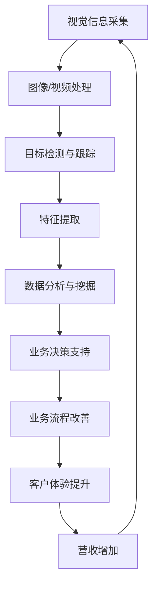

                 

## 1. 背景介绍

在当今数字化转型的大背景下，零售业正在经历着前所未有的变革。计算机视觉技术的发展，为零售业带来了新的机遇和挑战。本文将深入探讨计算机视觉在零售业中的创新应用，展示其在改善零售业务流程、提高客户体验和增加营收方面的巨大潜力。

## 2. 核心概念与联系

计算机视觉是一门旨在使计算机能够理解和分析视觉信息的学科。在零售业中，计算机视觉技术的核心是将视觉信息转化为有用的数据，从而帮助零售商更好地理解和管理他们的业务。下图是计算机视觉在零售业中的核心概念和联系的 Mermaid 流程图。



## 3. 核心算法原理 & 具体操作步骤

### 3.1 算法原理概述

计算机视觉在零售业中的应用涉及多种算法，包括目标检测、特征提取和数据分析。其中，目标检测是最关键的步骤，它旨在从视觉信息中检测出感兴趣的目标，如商品、人员或车辆。

### 3.2 算法步骤详解

1. **视觉信息采集**：使用摄像头或其他传感器采集商店内的图像或视频数据。
2. **图像/视频处理**：对采集的视频数据进行预处理，如去噪、增强等，以提高图像质量。
3. **目标检测与跟踪**：使用目标检测算法（如YOLO、Faster R-CNN等）检测图像中的目标，并跟踪其位置。
4. **特征提取**：提取目标的特征，如颜色、形状、纹理等，以便于后续的数据分析。
5. **数据分析与挖掘**：使用机器学习算法（如K-Means、SVM等）对提取的特征进行分析，从而获取有用的业务洞察。
6. **业务决策支持**：将业务洞察转化为可行的业务决策，如调整库存、优化布局等。
7. **业务流程改善**：根据决策调整零售业务流程，以提高效率和客户满意度。
8. **客户体验提升**：通过改善业务流程，提高客户体验，如提供更好的购物环境、个性化推荐等。
9. **营收增加**：最终，通过改善业务流程和提高客户体验，增加零售商的营收。

### 3.3 算法优缺点

**优点**：

* 提高了业务效率和准确性
* 提供了实时的业务洞察
* 降低了人工成本

**缺点**：

* 算法准确性受图像质量和光线条件的影响
* 需要大量的数据标注，以训练目标检测和特征提取算法
* 存在隐私保护和数据安全的挑战

### 3.4 算法应用领域

计算机视觉在零售业中的应用领域包括：

* 商品管理：库存监控、商品陈列检查等
* 安全管理：入侵检测、异常行为检测等
* 客户管理：客流量统计、客户行为分析等
* 运营管理：店铺布局优化、营业时间调整等

## 4. 数学模型和公式 & 详细讲解 & 举例说明

### 4.1 数学模型构建

在计算机视觉中，目标检测通常使用盒式模型表示目标的位置。盒式模型由目标的左上角坐标（x，y）和宽度（w）和高度（h）组成。目标检测算法的目标是预测这些参数。

### 4.2 公式推导过程

给定一张图像I，目标检测算法的目标是预测N个盒式模型{b<sub>i</sub>} = (x<sub>i</sub>, y<sub>i</sub>, w<sub>i</sub>, h<sub>i</sub>)，其中i = 1,..., N。目标检测算法通常使用回归方法预测这些参数。假设目标检测算法使用线性回归，则预测的盒式模型可以表示为：

$$
b_i = f(Wx + b) + t
$$

其中，f是激活函数，W和b是回归模型的权重和偏置，t是回归模型的偏移量，x是输入图像的特征向量。

### 4.3 案例分析与讲解

例如，在商品管理中，目标检测算法可以用于检测商店货架上的商品。目标检测算法首先需要训练，以学习商品的特征。在训练过程中，算法会接收大量的带标签的图像，这些图像包含商品的图像和对应的盒式模型。算法会学习这些图像的特征，并使用这些特征预测盒式模型。一旦算法训练完成，它就可以用于检测新图像中的商品。

## 5. 项目实践：代码实例和详细解释说明

### 5.1 开发环境搭建

要实现计算机视觉在零售业中的应用，需要搭建一个开发环境。推荐使用Python作为开发语言，并安装以下库：

* OpenCV：用于图像处理
* TensorFlow或PyTorch：用于构建和训练目标检测模型
* NumPy：用于数值计算
* Pandas：用于数据分析

### 5.2 源代码详细实现

以下是使用YOLOv3目标检测算法检测商品的示例代码：

```python
import cv2
import numpy as np

# Load YOLOv3 model
net = cv2.dnn.readNet("yolov3.weights", "yolov3.cfg")

# Set up the input layer
layer_names = net.getLayerNames()
output_layers = [layer_names[i[0] - 1] for i in net.getUnconnectedOutLayers()]

# Load image
img = cv2.imread("image.jpg")

# Create 4D blob from image
blob = cv2.dnn.blobFromImage(img, 0.00392, (416, 416), (0, 0, 0), True, crop=False)

# Pass blob through the network to get the detections
net.setInput(blob)
outs = net.forward(output_layers)

# Process detections
class_ids = []
confidences = []
boxes = []
for out in outs:
    for detection in out:
        scores = detection[5:]
        class_id = np.argmax(scores)
        confidence = scores[class_id]
        if confidence > 0.5:
            # Object detected
            center_x = int(detection[0] * 416)
            center_y = int(detection[1] * 416)
            width = int(detection[2] * 416)
            height = int(detection[3] * 416)

            # Calculate the top-left coordinates
            x = int(center_x - width / 2)
            y = int(center_y - height / 2)

            boxes.append([x, y, width, height])
            confidences.append(float(confidence))
            class_ids.append(class_id)

# Draw bounding boxes on the image
indexes = cv2.dnn.NMSBoxes(boxes, confidences, 0.5, 0.4)
font = cv2.FONT_HERSHEY_PLAIN
for i in range(len(boxes)):
    if i in indexes:
        x, y, w, h = boxes[i]
        label = str(classes[class_ids[i]])
        cv2.rectangle(img, (x, y), (x + w, y + h), (0, 255, 0), 2)
        cv2.putText(img, label, (x, y + 30), font, 3, (0, 255, 0), 2)

# Show the image
cv2.imshow("Image", img)
cv2.waitKey(0)
cv2.destroyAllWindows()
```

### 5.3 代码解读与分析

上述代码使用YOLOv3目标检测算法检测图像中的商品。首先，代码加载预训练的YOLOv3模型。然后，代码创建一个4D blob从图像中，并将其传递给模型以获取检测结果。代码然后处理检测结果，并绘制边界框和标签在图像上。

### 5.4 运行结果展示

运行上述代码后，将显示一张带有边界框和标签的图像。边界框表示检测到的商品，标签表示商品的类别。

## 6. 实际应用场景

### 6.1 商品管理

计算机视觉技术可以用于监控商店货架上的商品。目标检测算法可以检测商品的位置和数量，从而帮助零售商及时发现库存短缺或过剩。此外，计算机视觉技术还可以检查商品陈列是否符合要求，从而帮助零售商维护良好的商店环境。

### 6.2 安全管理

计算机视觉技术可以用于监控商店内的安全情况。目标检测算法可以检测入侵者或异常行为，从而帮助零售商及时发现和预防安全威胁。此外，计算机视觉技术还可以用于人脸识别，从而帮助零售商识别可疑顾客。

### 6.3 客户管理

计算机视觉技术可以用于统计商店内的客流量和客户行为。目标检测算法可以检测顾客的位置和数量，从而帮助零售商优化店铺布局和营业时间。此外，计算机视觉技术还可以用于客户行为分析，从而帮助零售商提供个性化的购物体验。

### 6.4 未来应用展望

随着计算机视觉技术的不断发展，其在零售业中的应用将变得更加广泛和深入。未来，计算机视觉技术将与其他技术（如物联网、人工智能等）结合，为零售业带来更多的创新应用。例如，计算机视觉技术可以与物联网结合，实现智能库存管理；计算机视觉技术可以与人工智能结合，实现个性化的购物推荐。

## 7. 工具和资源推荐

### 7.1 学习资源推荐

* 计算机视觉在零售业中的应用：<https://www.retaildive.com/news/retail-computer-vision-applications/>
* 计算机视觉技术简介：<https://www.analyticsinsight.net/computer-vision-technology-explained/>
* 目标检测算法介绍：<https://towardsdatascience.com/object-detection-algorithms-explained-9dd6233947c5>

### 7.2 开发工具推荐

* OpenCV：<https://opencv.org/>
* TensorFlow：<https://www.tensorflow.org/>
* PyTorch：<https://pytorch.org/>

### 7.3 相关论文推荐

* "Retail Computer Vision: A Survey"：<https://ieeexplore.ieee.org/document/8924651>
* "Computer Vision in Retail: A Review"：<https://link.springer.com/chapter/10.1007/978-981-15-6012-5_10>

## 8. 总结：未来发展趋势与挑战

### 8.1 研究成果总结

本文介绍了计算机视觉在零售业中的创新应用，展示了其在改善零售业务流程、提高客户体验和增加营收方面的巨大潜力。本文还介绍了计算机视觉技术的核心概念和算法原理，并提供了项目实践的示例代码。

### 8.2 未来发展趋势

未来，计算机视觉技术在零售业中的应用将变得更加广泛和深入。计算机视觉技术将与其他技术（如物联网、人工智能等）结合，为零售业带来更多的创新应用。此外，计算机视觉技术还将与云计算结合，实现实时的业务洞察和决策支持。

### 8.3 面临的挑战

然而，计算机视觉技术在零售业中的应用也面临着挑战。首先，计算机视觉技术的准确性受图像质量和光线条件的影响。其次，计算机视觉技术需要大量的数据标注，以训练目标检测和特征提取算法。最后，计算机视觉技术存在隐私保护和数据安全的挑战。

### 8.4 研究展望

未来的研究将关注计算机视觉技术在零售业中的更广泛和深入的应用。研究将关注计算机视觉技术与其他技术的结合，以实现更智能和个性化的零售业务。此外，研究还将关注计算机视觉技术的准确性、数据标注和隐私保护等挑战。

## 9. 附录：常见问题与解答

**Q1：计算机视觉技术在零售业中的优势是什么？**

**A1：计算机视觉技术在零售业中的优势包括提高业务效率和准确性、提供实时的业务洞察和降低人工成本等。**

**Q2：计算机视觉技术在零售业中的应用领域有哪些？**

**A2：计算机视觉技术在零售业中的应用领域包括商品管理、安全管理、客户管理和运营管理等。**

**Q3：计算机视觉技术的准确性受哪些因素影响？**

**A3：计算机视觉技术的准确性受图像质量和光线条件的影响。**

**Q4：如何解决计算机视觉技术的数据标注挑战？**

**A4：可以使用自动标注工具或人工标注服务来解决计算机视觉技术的数据标注挑战。**

**Q5：如何保护计算机视觉技术中的隐私？**

**A5：可以使用匿名化、去标识化和差分隐私等技术来保护计算机视觉技术中的隐私。**

## 作者：禅与计算机程序设计艺术 / Zen and the Art of Computer Programming

