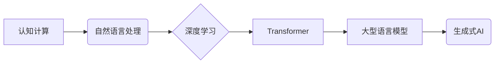

                 

## 认知计算新纪元：LLM改变信息处理模式

> 关键词：大型语言模型 (LLM)、认知计算、自然语言处理 (NLP)、深度学习、Transformer、生成式AI、信息处理

### 1. 背景介绍

信息时代，海量数据涌现，如何高效地处理和理解信息成为当今科技发展的重要课题。传统的信息处理模式主要依赖于规则和结构化数据，难以应对复杂、非结构化的文本信息。近年来，随着深度学习技术的飞速发展，大型语言模型 (LLM) 应运而生，为认知计算领域带来了革命性的变革。

LLM 是一种基于深度学习的强大人工智能模型，能够理解和生成人类语言。它们通过训练海量文本数据，学习语言的语法、语义和上下文关系，从而具备强大的文本处理能力，例如文本生成、翻译、摘要、问答等。

### 2. 核心概念与联系

**2.1 认知计算**

认知计算旨在模拟人类的认知过程，包括感知、理解、推理和决策等。它试图构建能够像人类一样学习、思考和解决问题的智能系统。

**2.2 自然语言处理 (NLP)**

NLP 是人工智能的一个分支，致力于使计算机能够理解、处理和生成人类语言。它涵盖了文本分析、机器翻译、语音识别等多个领域。

**2.3 深度学习**

深度学习是一种机器学习的子领域，利用多层神经网络来模拟人类大脑的学习过程。它能够从海量数据中自动学习特征，并进行复杂的模式识别和预测。

**2.4 Transformer**

Transformer 是深度学习中一种新的网络架构，其核心是注意力机制，能够有效地捕捉文本序列中的长距离依赖关系。它在自然语言处理领域取得了突破性的进展，成为 LLM 的基础架构。

**2.5 大型语言模型 (LLM)**

LLM 是训练于海量文本数据的大型深度学习模型，拥有数十亿甚至数千亿个参数。它们能够表现出强大的语言理解和生成能力，并应用于各种自然语言处理任务。

**2.6 生成式AI**

生成式AI 是一种能够生成新内容的 AI，例如文本、图像、音频等。LLM 是生成式AI 的重要组成部分，能够生成高质量、逼真的文本内容。

**Mermaid 流程图**



### 3. 核心算法原理 & 具体操作步骤

**3.1 算法原理概述**

LLM 的核心算法是基于 Transformer 架构的深度神经网络。它通过多层编码器和解码器结构，学习文本序列的上下文关系和语义信息。

**3.2 算法步骤详解**

1. **数据预处理:** 将文本数据进行清洗、分词、标记等预处理操作，使其能够被模型理解。
2. **编码器:** 将输入文本序列编码成向量表示，捕捉文本的语义信息和上下文关系。
3. **解码器:** 根据编码后的向量表示，生成目标文本序列。
4. **损失函数:** 使用交叉熵损失函数衡量模型预测结果与真实结果之间的差异。
5. **反向传播:** 利用梯度下降算法优化模型参数，降低损失函数的值。
6. **训练与评估:** 通过训练数据训练模型，并使用验证数据评估模型性能。

**3.3 算法优缺点**

**优点:**

* 强大的文本理解和生成能力
* 能够捕捉长距离依赖关系
* 可迁移性强，可应用于多种 NLP 任务

**缺点:**

* 训练成本高，需要海量数据和计算资源
* 容易受到训练数据偏差的影响
* 解释性差，难以理解模型的决策过程

**3.4 算法应用领域**

* 文本生成：小说、诗歌、剧本等
* 机器翻译：将一种语言翻译成另一种语言
* 文本摘要：提取文本的关键信息
* 问答系统：回答用户提出的问题
* 对话系统：与用户进行自然语言对话

### 4. 数学模型和公式 & 详细讲解 & 举例说明

**4.1 数学模型构建**

LLM 的数学模型主要基于 Transformer 架构，其核心是注意力机制。注意力机制允许模型关注输入序列中与当前任务相关的部分，从而提高模型的理解能力。

**4.2 公式推导过程**

注意力机制的计算公式如下：

$$
Attention(Q, K, V) = softmax(\frac{QK^T}{\sqrt{d_k}})V
$$

其中：

* $Q$：查询矩阵
* $K$：键矩阵
* $V$：值矩阵
* $d_k$：键向量的维度
* $softmax$：softmax 函数

**4.3 案例分析与讲解**

假设我们有一个句子 "我爱吃苹果"，想要计算 "吃" 这个词的注意力权重。

* $Q$：包含 "吃" 词的查询向量
* $K$：包含所有词的键向量
* $V$：包含所有词的价值向量

通过计算 $QK^T$，得到每个词与 "吃" 词之间的相似度。然后使用 softmax 函数将相似度转换为注意力权重，权重越高表示与 "吃" 词相关性越强。

**举例说明:**

如果 "苹果" 的注意力权重最高，则表示 "吃" 这个词与 "苹果" 相关性最强。

### 5. 项目实践：代码实例和详细解释说明

**5.1 开发环境搭建**

* Python 3.7+
* PyTorch 或 TensorFlow
* CUDA 和 cuDNN

**5.2 源代码详细实现**

```python
import torch
import torch.nn as nn

class Transformer(nn.Module):
    def __init__(self, vocab_size, embedding_dim, num_heads, num_layers):
        super(Transformer, self).__init__()
        self.embedding = nn.Embedding(vocab_size, embedding_dim)
        self.transformer_layers = nn.ModuleList([
            nn.TransformerEncoderLayer(embedding_dim, num_heads)
            for _ in range(num_layers)
        ])

    def forward(self, x):
        x = self.embedding(x)
        for layer in self.transformer_layers:
            x = layer(x)
        return x
```

**5.3 代码解读与分析**

* `embedding`: 将单词转换为向量表示
* `transformer_layers`: 多层 Transformer Encoder 层，用于捕捉文本序列的上下文关系
* `forward`: 模型的输入和输出流程

**5.4 运行结果展示**

使用训练好的模型，可以进行文本生成、机器翻译等任务。

### 6. 实际应用场景

**6.1 文本生成**

LLM 可以用于生成各种文本内容，例如小说、诗歌、剧本等。例如，OpenAI 的 GPT-3 模型可以生成高质量的创意写作内容。

**6.2 机器翻译**

LLM 可以用于将一种语言翻译成另一种语言。例如，Google 的 Transformer 模型在机器翻译任务中取得了突破性的进展。

**6.3 文本摘要**

LLM 可以用于提取文本的关键信息，生成简洁的文本摘要。例如，BART 模型可以用于生成新闻文章的摘要。

**6.4 未来应用展望**

LLM 的应用场景还在不断扩展，未来可能应用于：

* 个性化教育
* 医疗诊断
* 法律文本分析
* 代码生成

### 7. 工具和资源推荐

**7.1 学习资源推荐**

* **书籍:**

    * 《深度学习》
    * 《自然语言处理》
    * 《Transformer 详解》

* **在线课程:**

    * Coursera: 深度学习
    * edX: 自然语言处理
    * fast.ai: 深度学习

**7.2 开发工具推荐**

* **PyTorch:** 深度学习框架
* **TensorFlow:** 深度学习框架
* **Hugging Face Transformers:** 预训练 Transformer 模型库

**7.3 相关论文推荐**

* 《Attention Is All You Need》
* 《BERT: Pre-training of Deep Bidirectional Transformers for Language Understanding》
* 《GPT-3: Language Models are Few-Shot Learners》

### 8. 总结：未来发展趋势与挑战

**8.1 研究成果总结**

LLM 的发展取得了显著成果，在文本理解和生成方面展现出强大的能力。

**8.2 未来发展趋势**

* 模型规模进一步扩大
* 训练数据质量提升
* 算法效率优化
* 跨模态理解

**8.3 面临的挑战**

* 数据偏差和公平性问题
* 解释性和可信度问题
* 安全性和隐私问题

**8.4 研究展望**

未来研究将重点关注解决上述挑战，构建更安全、更可靠、更可解释的 LLM。

### 9. 附录：常见问题与解答

**9.1 如何训练一个 LLM？**

训练一个 LLM 需要海量文本数据、强大的计算资源和专业的机器学习知识。

**9.2 如何评估 LLM 的性能？**

LLM 的性能可以通过各种指标评估，例如困惑度、BLEU 分数、ROUGE 分数等。

**9.3 LLM 的应用有哪些？**

LLM 的应用场景广泛，包括文本生成、机器翻译、文本摘要、问答系统等。


作者：禅与计算机程序设计艺术 / Zen and the Art of Computer Programming 
<end_of_turn>

