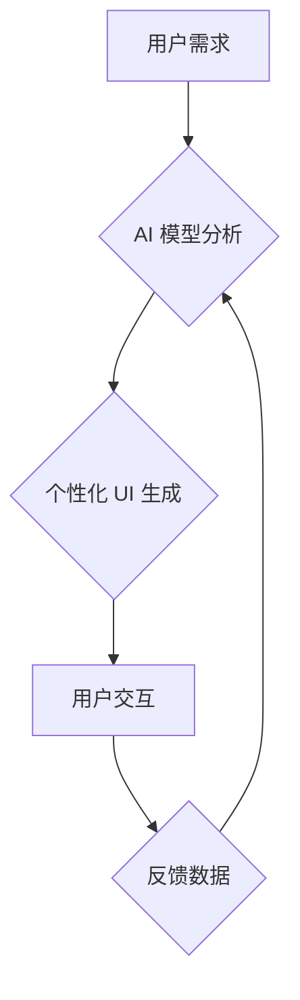

                 

## AI 时代的用户界面设计：简洁与有效性

> 关键词：人工智能、用户界面设计、简洁性、有效性、交互设计、自然语言处理、机器学习、用户体验

### 1. 背景介绍

随着人工智能 (AI) 技术的飞速发展，它正在深刻地改变着我们与数字世界的交互方式。AI 驱动的应用程序和服务日益普及，从智能语音助手到个性化推荐系统，无处不在。然而，随着 AI 功能的不断增强，用户界面 (UI) 设计面临着新的挑战和机遇。传统的 UI 设计理念可能无法满足 AI 时代用户的需求，因此，我们需要重新思考如何设计简洁、有效、易于理解和使用的 AI 驱动的用户界面。

### 2. 核心概念与联系

**2.1  AI 驱动的 UI 设计**

AI 驱动的 UI 设计是指利用人工智能技术来增强用户界面，使其更加智能、个性化和用户友好。AI 可以帮助我们实现以下功能：

* **自然语言交互:** 通过自然语言处理 (NLP) 技术，用户可以使用自然语言与应用程序进行交互，例如语音输入、文本聊天等。
* **个性化定制:** AI 可以根据用户的行为、偏好和历史数据，个性化定制 UI 元素，例如推荐内容、调整布局、提供个性化提示等。
* **预测性设计:** AI 可以预测用户的需求和行为，并提前提供相关信息或功能，例如智能补全、预先加载内容等。
* **上下文感知:** AI 可以感知用户的上下文环境，例如时间、地点、设备等，并根据上下文调整 UI 的显示内容和交互方式。

**2.2  简洁与有效性**

简洁与有效性是 AI 时代 UI 设计的两大核心原则。

* **简洁:**  AI 驱动的 UI 应该尽量简洁明了，避免信息过载和复杂的操作流程。用户应该能够快速理解 UI 的功能和操作方式。
* **有效性:**  AI 驱动的 UI 应该能够有效地帮助用户完成任务，提高用户体验和效率。

**2.3  Mermaid 流程图**



### 3. 核心算法原理 & 具体操作步骤

**3.1  算法原理概述**

AI 驱动的 UI 设计通常涉及以下核心算法：

* **自然语言处理 (NLP):** 用于理解和处理用户的自然语言输入，例如语音识别、文本分析、意图识别等。
* **机器学习 (ML):** 用于训练 AI 模型，使其能够学习用户行为模式、偏好和需求，并根据这些模式进行个性化定制。
* **深度学习 (DL):** 一种更高级的机器学习算法，能够处理更复杂的数据和任务，例如图像识别、语音合成等。

**3.2  算法步骤详解**

1. **数据收集:** 收集用户行为数据、偏好数据、上下文环境数据等。
2. **数据预处理:** 对收集到的数据进行清洗、转换、格式化等处理，使其能够被 AI 模型使用。
3. **模型训练:** 使用机器学习算法训练 AI 模型，使其能够理解用户需求、预测用户行为、个性化定制 UI 元素等。
4. **模型评估:** 对训练好的 AI 模型进行评估，测试其准确率、效率等指标。
5. **模型部署:** 将训练好的 AI 模型部署到实际应用环境中，并与用户界面进行集成。
6. **持续优化:** 持续收集用户反馈数据，并根据反馈数据对 AI 模型进行优化和改进。

**3.3  算法优缺点**

**优点:**

* **个性化定制:** AI 可以根据用户的需求和偏好进行个性化定制，提高用户体验。
* **预测性设计:** AI 可以预测用户的需求和行为，并提前提供相关信息或功能，提高效率。
* **智能交互:** AI 可以支持自然语言交互，使用户体验更加便捷。

**缺点:**

* **数据依赖:** AI 算法需要大量的数据进行训练，否则其性能会下降。
* **算法复杂性:** 训练和部署 AI 模型需要一定的技术难度。
* **伦理问题:** AI 驱动的 UI 设计可能涉及到隐私、公平性等伦理问题。

**3.4  算法应用领域**

AI 驱动的 UI 设计应用于各个领域，例如：

* **智能家居:** 智能音箱、智能家居控制系统等。
* **电商平台:** 个性化商品推荐、智能客服等。
* **医疗保健:** 智能诊断系统、个性化医疗方案等。
* **教育:** 智能学习平台、个性化教学辅导等。

### 4. 数学模型和公式 & 详细讲解 & 举例说明

**4.1  数学模型构建**

在 AI 驱动的 UI 设计中，可以使用数学模型来描述用户行为、预测用户需求等。例如，可以使用贝叶斯网络来建模用户对不同功能的需求概率，可以使用马尔科夫链来建模用户在 UI 中的导航路径。

**4.2  公式推导过程**

例如，可以使用以下公式来计算用户对某个功能的需求概率：

$$P(F|U) = \frac{P(U|F)P(F)}{P(U)}$$

其中：

* $P(F|U)$ 是用户对功能 $F$ 的需求概率，给定用户 $U$ 的特征。
* $P(U|F)$ 是用户 $U$ 拥有特征 $F$ 的概率。
* $P(F)$ 是功能 $F$ 出现的概率。
* $P(U)$ 是用户 $U$ 出现的概率。

**4.3  案例分析与讲解**

例如，假设我们有一个电商平台，想要预测用户对某个商品的需求概率。我们可以收集用户浏览历史、购买记录、评分等数据，并使用贝叶斯网络模型来计算用户对该商品的需求概率。

### 5. 项目实践：代码实例和详细解释说明

**5.1  开发环境搭建**

* Python 3.x
* TensorFlow 或 PyTorch
* Jupyter Notebook

**5.2  源代码详细实现**

```python
# 使用 TensorFlow 建立一个简单的推荐系统模型
import tensorflow as tf

# 定义模型结构
model = tf.keras.Sequential([
    tf.keras.layers.Embedding(input_dim=10000, output_dim=64),
    tf.keras.layers.Flatten(),
    tf.keras.layers.Dense(1, activation='sigmoid')
])

# 编译模型
model.compile(optimizer='adam', loss='binary_crossentropy', metrics=['accuracy'])

# 训练模型
model.fit(x_train, y_train, epochs=10)

# 预测用户对商品的需求概率
predictions = model.predict(x_test)
```

**5.3  代码解读与分析**

* 该代码示例使用 TensorFlow 库构建了一个简单的推荐系统模型。
* 模型输入是用户历史浏览记录，输出是用户对商品的需求概率。
* 模型使用 Embedding 层将用户历史记录转换为向量表示，然后使用 Dense 层进行分类。
* 模型使用 Adam 优化器、二元交叉熵损失函数和准确率作为评估指标进行训练。

**5.4  运行结果展示**

训练完成后，我们可以使用模型预测用户对商品的需求概率。例如，如果用户历史记录包含了“手机”、“电脑”、“耳机”等关键词，那么模型可能会预测用户对“笔记本电脑”的需求概率较高。

### 6. 实际应用场景

**6.1  智能客服**

AI 驱动的聊天机器人可以理解用户的自然语言问题，并提供智能的回复，例如回答常见问题、提供产品信息、预约服务等。

**6.2  个性化推荐**

AI 可以根据用户的行为数据、偏好数据等，个性化推荐商品、内容、服务等，提高用户体验和转化率。

**6.3  智能搜索**

AI 可以理解用户的搜索意图，并提供更精准、更相关的搜索结果，例如语音搜索、图像搜索等。

**6.4  未来应用展望**

AI 驱动的 UI 设计将更加智能、个性化和用户友好。例如，未来可能会出现：

* **身临其境的交互体验:** 利用 VR/AR 技术，打造更加身临其境的交互体验。
* **情感感知:** AI 可以感知用户的 emosi，并根据情绪调整 UI 的显示内容和交互方式。
* **跨平台协作:** AI 可以帮助用户在不同平台之间无缝协作，例如手机、电脑、智能设备等。

### 7. 工具和资源推荐

**7.1  学习资源推荐**

* **书籍:**
    * 《深度学习》
    * 《机器学习实战》
    * 《自然语言处理入门》
* **在线课程:**
    * Coursera: 深度学习、机器学习
    * edX: 自然语言处理、人工智能
* **开源项目:**
    * TensorFlow
    * PyTorch
    * spaCy

**7.2  开发工具推荐**

* **Python:** 广泛用于 AI 开发
* **Jupyter Notebook:** 用于代码编写、数据分析和可视化
* **TensorFlow/PyTorch:** 深度学习框架
* **spaCy:** 自然语言处理库

**7.3  相关论文推荐**

* **Attention Is All You Need**
* **BERT: Pre-training of Deep Bidirectional Transformers for Language Understanding**
* **Generative Adversarial Networks**

### 8. 总结：未来发展趋势与挑战

**8.1  研究成果总结**

AI 驱动的 UI 设计取得了显著的进展，例如自然语言交互、个性化定制、预测性设计等功能已经应用于各种领域。

**8.2  未来发展趋势**

未来 AI 驱动的 UI 设计将更加智能、个性化和用户友好，例如：

* **情感感知:** AI 可以感知用户的 emosi，并根据情绪调整 UI 的显示内容和交互方式。
* **身临其境:** 利用 VR/AR 技术，打造更加身临其境的交互体验。
* **跨平台协作:** AI 可以帮助用户在不同平台之间无缝协作。

**8.3  面临的挑战**

* **数据隐私:** AI 算法需要大量的数据进行训练，如何保护用户数据隐私是一个重要的挑战。
* **算法公平性:** AI 算法可能会存在偏见，导致不公平的结果，需要确保算法的公平性。
* **用户信任:** 用户需要信任 AI 驱动的 UI 设计，需要建立用户对 AI 的信任机制。

**8.4  研究展望**

未来研究方向包括：

* **开发更加安全、可靠、可解释的 AI 算法。**
* **设计更加人性化、用户友好的 AI 驱动的 UI。**
* **探索 AI 驱动的 UI 设计在更多领域的应用。**

### 9. 附录：常见问题与解答

**9.1  Q: AI 驱动的 UI 设计会取代传统的 UI 设计吗？**

**A:** AI 驱动的 UI 设计可以增强传统的 UI 设计，但不会完全取代它。传统的 UI 设计仍然需要设计师的创意和审美能力，而 AI 算法可以帮助设计师更高效地完成 UI 设计工作。

**9.2  Q: 如何评估 AI 驱动的 UI 设计的效果？**

**A:** 可以使用用户体验测试、A/B 测试等方法来评估 AI 驱动的 UI 设计的效果。

**9.3  Q: 如何确保 AI 驱动的 UI 设计的安全性？**

**A:** 需要采取措施保护用户数据隐私，并确保 AI 算法的可靠性和安全性。


作者：禅与计算机程序设计艺术 / Zen and the Art of Computer Programming 
<end_of_turn>

