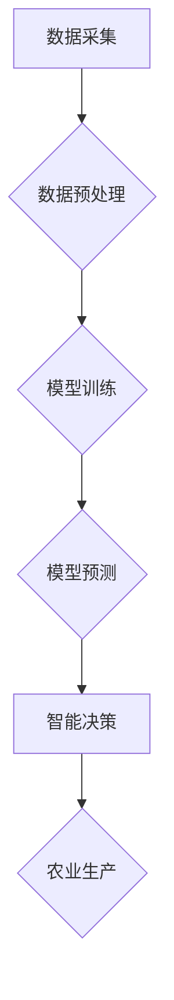

                 

## AIGC推动智慧农业升级

> 关键词：AIGC, 智慧农业, 机器学习, 深度学习, 计算机视觉, 自然语言处理, 数据分析

## 1. 背景介绍

农业是人类文明的基石，也是全球经济的重要支柱。然而，传统农业面临着诸多挑战，例如资源短缺、环境污染、气候变化、劳动力不足等。这些挑战制约着农业生产效率和可持续发展。

近年来，人工智能（AI）技术蓬勃发展，为农业发展带来了新的机遇。AI技术的应用可以帮助农民提高生产效率、降低生产成本、改善产品质量，并促进农业的可持续发展。其中，AIGC（人工智能生成内容）作为AI技术的最新成果，在智慧农业领域展现出巨大的潜力。

## 2. 核心概念与联系

AIGC是指利用人工智能技术自动生成各种文本、图像、音频、视频等内容。在智慧农业领域，AIGC可以应用于多个环节，例如：

* **田间管理：** 利用计算机视觉技术识别作物病虫害、预测产量、优化施肥和灌溉方案。
* **农产品加工：** 利用自然语言处理技术分析市场需求，自动生成农产品销售文案和营销方案。
* **农业决策支持：** 利用数据分析技术挖掘农业生产数据，为农民提供精准的决策建议。

**AIGC在智慧农业中的应用架构**



## 3. 核心算法原理 & 具体操作步骤

### 3.1  算法原理概述

AIGC在智慧农业中的应用主要依赖于以下核心算法：

* **机器学习：** 用于从农业生产数据中学习规律，建立预测模型。常见的机器学习算法包括支持向量机、决策树、随机森林、神经网络等。
* **深度学习：** 用于处理复杂的数据，例如图像、语音、文本等。深度学习算法可以自动提取数据特征，提高预测精度。
* **计算机视觉：** 用于识别和分析图像，例如识别作物病虫害、识别作物生长阶段等。
* **自然语言处理：** 用于处理文本数据，例如分析市场需求、生成农产品销售文案等。

### 3.2  算法步骤详解

以作物病虫害识别为例，AIGC在智慧农业中的具体操作步骤如下：

1. **数据采集：** 收集作物病虫害的图像数据，并进行标注，例如标记病虫害类型、病虫害严重程度等。
2. **数据预处理：** 对图像数据进行预处理，例如图像裁剪、图像增强、图像归一化等。
3. **模型训练：** 利用深度学习算法，例如卷积神经网络（CNN），对预处理后的图像数据进行训练，建立作物病虫害识别的模型。
4. **模型预测：** 将新采集的作物图像输入到训练好的模型中，模型会输出病虫害类型和严重程度的预测结果。
5. **智能决策：** 根据模型的预测结果，为农民提供相应的决策建议，例如喷洒农药、更换作物品种等。

### 3.3  算法优缺点

**优点：**

* **自动化程度高：** AIGC可以自动完成数据分析、模型训练、预测等环节，提高农业生产效率。
* **精准度高：** AIGC算法可以从海量数据中学习规律，提高预测精度。
* **可扩展性强：** AIGC算法可以应用于多种农业场景，例如田间管理、农产品加工、农业决策支持等。

**缺点：**

* **数据依赖性强：** AIGC算法需要大量高质量的数据进行训练，数据质量直接影响算法性能。
* **算法复杂度高：** AIGC算法的训练和部署需要强大的计算能力和技术支持。
* **伦理风险：** AIGC算法的应用可能带来一些伦理风险，例如数据隐私泄露、算法偏见等。

### 3.4  算法应用领域

AIGC算法在智慧农业领域的应用领域非常广泛，例如：

* **作物病虫害识别：** 利用计算机视觉技术识别作物病虫害，帮助农民及时采取防治措施。
* **作物产量预测：** 利用机器学习算法预测作物产量，帮助农民合理安排生产计划。
* **精准施肥：** 利用传感器数据和机器学习算法，精准施肥，提高肥料利用率，减少环境污染。
* **智能灌溉：** 利用传感器数据和机器学习算法，智能控制灌溉，提高水资源利用效率。
* **农产品质量检测：** 利用计算机视觉技术检测农产品质量，提高农产品品质。
* **农业决策支持：** 利用数据分析技术，为农民提供精准的决策建议。

## 4. 数学模型和公式 & 详细讲解 & 举例说明

### 4.1  数学模型构建

在AIGC驱动的智慧农业中，常用的数学模型包括：

* **线性回归模型：** 用于预测连续变量，例如作物产量。
* **逻辑回归模型：** 用于预测分类变量，例如作物病虫害类型。
* **支持向量机模型：** 用于分类和回归问题，具有较好的泛化能力。
* **神经网络模型：** 用于处理复杂的数据，例如图像、语音、文本等。

### 4.2  公式推导过程

以线性回归模型为例，其目标是找到一条直线，使得预测值与实际值之间的误差最小。

**线性回归模型公式：**

$$y = wx + b$$

其中：

* $y$ 是预测值
* $x$ 是输入变量
* $w$ 是权重系数
* $b$ 是偏置项

**损失函数：**

$$L = \frac{1}{n} \sum_{i=1}^{n} (y_i - \hat{y}_i)^2$$

其中：

* $n$ 是样本数量
* $y_i$ 是实际值
* $\hat{y}_i$ 是预测值

**梯度下降算法：**

$$w = w - \alpha \frac{\partial L}{\partial w}$$

$$b = b - \alpha \frac{\partial L}{\partial b}$$

其中：

* $\alpha$ 是学习率

### 4.3  案例分析与讲解

假设我们想要预测小麦产量，输入变量是土壤湿度，输出变量是小麦产量。我们可以收集小麦产量和土壤湿度的历史数据，利用线性回归模型进行训练。

训练完成后，我们可以将新的土壤湿度数据输入到模型中，得到小麦产量的预测值。

## 5. 项目实践：代码实例和详细解释说明

### 5.1  开发环境搭建

AIGC驱动的智慧农业项目可以使用Python语言进行开发。需要安装以下软件：

* Python 3.x
* TensorFlow 或 PyTorch 深度学习框架
* OpenCV 图像处理库
* NLTK 自然语言处理库

### 5.2  源代码详细实现

以下是一个简单的作物病虫害识别的代码示例，使用TensorFlow框架：

```python
import tensorflow as tf

# 加载预训练的卷积神经网络模型
model = tf.keras.applications.MobileNetV2(weights='imagenet')

# 定义输入层
input_tensor = tf.keras.Input(shape=(224, 224, 3))

# 使用预训练模型进行特征提取
features = model(input_tensor)

# 添加全连接层
output_layer = tf.keras.layers.Dense(10, activation='softmax')(features)

# 创建模型
model = tf.keras.Model(inputs=input_tensor, outputs=output_layer)

# 编译模型
model.compile(optimizer='adam', loss='categorical_crossentropy', metrics=['accuracy'])

# 训练模型
model.fit(train_data, train_labels, epochs=10)

# 预测模型
predictions = model.predict(test_data)
```

### 5.3  代码解读与分析

* 代码首先加载预训练的MobileNetV2模型，该模型已经训练好了图像特征提取能力。
* 然后定义输入层，指定图像尺寸为224x224像素，颜色通道为3。
* 使用预训练模型提取图像特征，并将特征输入到全连接层。
* 全连接层输出10个类别，每个类别对应一种病虫害类型。
* 使用softmax激活函数将输出值转换为概率分布，表示每种病虫害类型的置信度。
* 最后编译模型，使用Adam优化器、交叉熵损失函数和准确率作为评估指标。

### 5.4  运行结果展示

训练完成后，可以使用测试数据对模型进行评估，并查看模型的准确率。

## 6. 实际应用场景

AIGC在智慧农业领域的应用场景非常广泛，例如：

* **精准农业：** 利用AIGC技术，可以实现精准施肥、精准灌溉、精准病虫害防治等，提高农业生产效率和资源利用率。
* **智能农业：** 利用AIGC技术，可以实现无人驾驶农业机械、智能温室管理、智能农产品加工等，降低农业生产成本和劳动强度。
* **可持续农业：** 利用AIGC技术，可以实现农业环境监测、农业资源管理、农业碳排放监测等，促进农业的可持续发展。

### 6.4  未来应用展望

未来，AIGC技术将更加深入地应用于智慧农业领域，例如：

* **个性化农业：** 根据不同的作物品种、种植环境、市场需求等，提供个性化的农业生产方案。
* **农业风险管理：** 利用AIGC技术，预测农业生产风险，帮助农民做好风险防范和应对措施。
* **农业金融服务：** 利用AIGC技术，为农民提供更加精准的农业金融服务，例如农业保险、农业贷款等。

## 7. 工具和资源推荐

### 7.1  学习资源推荐

* **在线课程：** Coursera、edX、Udacity 等平台提供人工智能、机器学习、深度学习等方面的在线课程。
* **书籍：** 《深度学习》、《机器学习实战》、《Python机器学习》等书籍。
* **博客和论坛：** TensorFlow、PyTorch、Kaggle 等平台的博客和论坛，可以学习到最新的AIGC技术和应用案例。

### 7.2  开发工具推荐

* **Python：** AIGC开发的常用编程语言。
* **TensorFlow：** 开源深度学习框架。
* **PyTorch：** 开源深度学习框架。
* **OpenCV：** 图像处理库。
* **NLTK：** 自然语言处理库。

### 7.3  相关论文推荐

* **《Attention Is All You Need》:** 介绍了Transformer模型，该模型在自然语言处理领域取得了突破性进展。
* **《ImageNet Classification with Deep Convolutional Neural Networks》:** 介绍了AlexNet模型，该模型在图像识别领域取得了突破性进展。
* **《Generative Adversarial Networks》:** 介绍了GAN模型，该模型可以生成逼真的图像、文本、音频等内容。

## 8. 总结：未来发展趋势与挑战

### 8.1  研究成果总结

AIGC技术在智慧农业领域的应用取得了显著成果，例如：

* **提高了农业生产效率：** AIGC技术可以自动化完成许多农业生产任务，例如田间管理、农产品加工等，提高了农业生产效率。
* **降低了农业生产成本：** AIGC技术可以帮助农民节省人力、物力、财力，降低了农业生产成本。
* **改善了农产品质量：** AIGC技术可以帮助农民提高农产品品质，例如精准施肥、精准病虫害防治等。

### 8.2  未来发展趋势

未来，AIGC技术在智慧农业领域的应用将更加广泛和深入，例如：

* **更加智能化的农业生产：** AIGC技术将更加智能化，能够根据不同的农业场景，提供更加个性化的生产方案。
* **更加精准的农业服务：** AIGC技术将更加精准，能够为农民提供更加精准的农业服务，例如农业保险、农业贷款等。
* **更加可持续的农业发展：** AIGC技术将促进农业的可持续发展，例如农业环境监测、农业资源管理等。

### 8.3  面临的挑战

AIGC技术在智慧农业领域的应用也面临着一些挑战，例如：

* **数据质量问题：** AIGC算法需要大量高质量的数据进行训练，而农业生产数据往往存在不完整、不准确、格式不统一等问题。
* **算法复杂度问题：** AIGC算法的训练和部署需要强大的计算能力和技术支持，这对一些小型农业企业来说是一个挑战。
* **伦理风险问题：** AIGC算法的应用可能带来一些伦理风险，例如数据隐私泄露、算法偏见等。

### 8.4  研究展望

未来，需要进一步研究以下问题：

* 如何提高农业生产数据的质量和可用性。
* 如何开发更加高效、易于部署的AIGC算法。
* 如何解决AIGC算法的伦理风险问题。


## 9. 附录：常见问题与解答

**Q1：AIGC技术与传统农业管理有什么区别？**

**A1：** 传统农业管理主要依靠人工经验和传统技术，而AIGC技术利用人工智能算法，可以自动化完成许多农业生产任务，提高效率和精准度。

**Q2：AIGC技术在智慧农业中的应用有哪些？**

**A2：** AIGC技术在智慧农业中的应用非常广泛，例如作物病虫害识别、作物产量预测、精准施肥、智能灌溉、农产品质量检测等。

**Q3：AIGC技术有哪些挑战？**

**A3：** AIGC技术在智慧农业领域的应用也面临着一些挑战，例如数据质量问题、算法复杂度问题、伦理风险问题等。

**Q4：未来AIGC技术在智慧农业领域的发展趋势是什么？**

**A4：** 未来，AIGC技术将更加智能化、精准化、可持续化，为农业生产提供更加全面的解决方案。


作者：禅与计算机程序设计艺术 / Zen and the Art of Computer Programming<end_of_turn>

