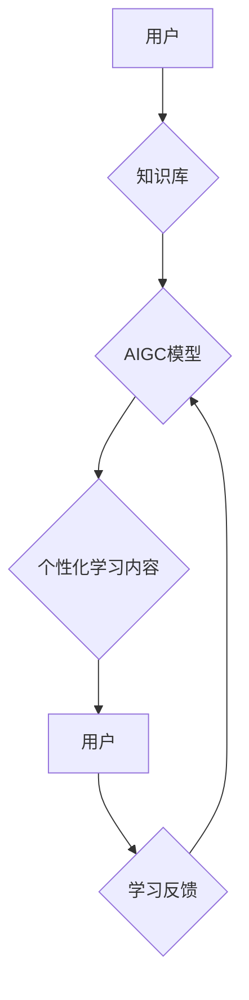

                 

## AIGC重塑在线教育行业

> 关键词：AIGC、在线教育、人工智能、自然语言处理、机器学习、个性化学习、智能辅导

## 1. 背景介绍

在线教育近年来发展迅速，成为教育领域的重要组成部分。随着互联网技术的不断发展和普及，在线教育平台数量不断增加，课程内容也更加丰富多样。然而，传统在线教育模式仍然存在一些问题，例如：

* **教学内容单一化:**  传统的在线课程往往采用一刀切的教学模式，难以满足不同学生个性化的学习需求。
* **缺乏互动性:**  传统的在线课程缺乏与教师和同学的实时互动，学习体验较为单调。
* **学习效果难以评估:**  传统的在线课程缺乏对学生学习效果的实时评估和反馈机制，难以及时发现学生学习上的困难。

人工智能（AI）技术的快速发展为在线教育带来了新的机遇。AIGC（人工智能生成内容）作为AI技术的应用之一，能够自动生成高质量的教育内容，并根据学生的学习情况进行个性化定制，从而有效解决传统在线教育模式的痛点。

## 2. 核心概念与联系

AIGC在在线教育领域的应用主要围绕着以下几个核心概念：

* **自然语言处理（NLP）：**  AIGC系统需要理解和生成自然语言，NLP技术在此扮演着至关重要的角色。
* **机器学习（ML）：**  AIGC系统需要从海量数据中学习，并根据学习到的知识生成新的内容，ML技术在此提供支持。
* **知识图谱（KG）：**  AIGC系统需要对知识进行组织和存储，KG技术可以帮助AIGC系统构建知识体系，并进行知识推理和关联。
* **个性化学习：**  AIGC系统可以根据学生的学习情况和需求，定制个性化的学习内容和学习路径。

**AIGC在在线教育中的应用架构**



## 3. 核心算法原理 & 具体操作步骤

### 3.1  算法原理概述

AIGC在在线教育中的核心算法主要包括：

* **文本生成算法:**  用于生成各种类型的教育内容，例如文章、习题、讲解视频等。常见的文本生成算法包括GPT、BERT、T5等。
* **知识问答算法:**  用于回答学生提出的问题，并提供相关知识信息。常见的知识问答算法包括检索式问答、生成式问答等。
* **个性化推荐算法:**  用于根据学生的学习情况和兴趣，推荐个性化的学习内容和学习路径。常见的个性化推荐算法包括协同过滤、内容过滤等。

### 3.2  算法步骤详解

以文本生成算法为例，其具体操作步骤如下：

1. **数据预处理:**  收集和清洗教育相关的文本数据，并进行分词、词性标注等预处理操作。
2. **模型训练:**  使用训练数据训练文本生成模型，例如GPT模型。
3. **文本生成:**  根据用户的输入，例如学习主题、知识点等，利用训练好的模型生成相应的教育内容。
4. **内容评估:**  对生成的教育内容进行评估，例如语法正确性、逻辑性、准确性等，并进行必要的修改和完善。

### 3.3  算法优缺点

**优点:**

* **自动化生成内容:**  AIGC可以自动生成高质量的教育内容，节省教师的时间和精力。
* **个性化学习体验:**  AIGC可以根据学生的学习情况和需求，定制个性化的学习内容和学习路径，提高学习效率。
* **降低教育成本:**  AIGC可以帮助降低教育成本，使优质教育资源更加普及。

**缺点:**

* **内容质量控制:**  AIGC生成的教育内容需要经过严格的质量控制，确保其准确性和可靠性。
* **伦理问题:**  AIGC的应用可能会引发一些伦理问题，例如数据隐私、知识产权等。
* **技术门槛:**  AIGC技术的应用需要一定的技术门槛，需要专业的技术人员进行开发和维护。

### 3.4  算法应用领域

AIGC在在线教育领域的应用领域非常广泛，例如：

* **智能辅导:**  AIGC可以为学生提供个性化的学习辅导，帮助学生解决学习上的困难。
* **自动批改作业:**  AIGC可以自动批改学生的作业，并提供相应的反馈。
* **生成学习资源:**  AIGC可以生成各种类型的学习资源，例如习题、案例、视频等。
* **个性化学习路径:**  AIGC可以根据学生的学习情况和兴趣，推荐个性化的学习路径。

## 4. 数学模型和公式 & 详细讲解 & 举例说明

### 4.1  数学模型构建

AIGC的文本生成模型通常基于深度学习框架，例如Transformer模型。Transformer模型的核心是注意力机制，它可以帮助模型捕捉文本中的长距离依赖关系。

**注意力机制公式:**

$$
Attention(Q, K, V) = \frac{exp(Q \cdot K^T / \sqrt{d_k})}{exp(Q \cdot K^T / \sqrt{d_k})} \cdot V
$$

其中：

* $Q$：查询矩阵
* $K$：键矩阵
* $V$：值矩阵
* $d_k$：键向量的维度

### 4.2  公式推导过程

注意力机制的公式通过计算查询向量与键向量的点积，并将其归一化，从而得到每个键向量的权重。权重最高的键向量对应的值向量被选取作为输出，从而实现对文本中相关信息的关注。

### 4.3  案例分析与讲解

例如，在生成一个关于“人工智能”的文章时，注意力机制可以帮助模型关注与“人工智能”相关的关键词，并根据这些关键词生成相关的句子和段落。

## 5. 项目实践：代码实例和详细解释说明

### 5.1  开发环境搭建

AIGC项目开发环境通常需要包含以下软件：

* Python编程语言
* TensorFlow或PyTorch深度学习框架
* CUDA和cuDNN GPU加速库
* Git版本控制系统

### 5.2  源代码详细实现

以下是一个简单的AIGC文本生成代码示例，使用GPT模型进行训练和生成文本：

```python
from transformers import GPT2LMHeadModel, GPT2Tokenizer

# 加载预训练模型和词典
model_name = "gpt2"
tokenizer = GPT2Tokenizer.from_pretrained(model_name)
model = GPT2LMHeadModel.from_pretrained(model_name)

# 输入文本
input_text = "人工智能是一种"

# 生成文本
input_ids = tokenizer.encode(input_text, return_tensors="pt")
output = model.generate(input_ids, max_length=50)

# 解码文本
generated_text = tokenizer.decode(output[0], skip_special_tokens=True)

# 打印生成文本
print(generated_text)
```

### 5.3  代码解读与分析

这段代码首先加载预训练的GPT2模型和词典。然后，将输入文本编码成模型可以理解的格式。最后，使用模型生成文本，并解码成可读文本。

### 5.4  运行结果展示

运行这段代码后，会输出一个关于“人工智能”的续写文本。

## 6. 实际应用场景

AIGC在在线教育领域的实际应用场景非常广泛，例如：

* **智能问答系统:**  AIGC可以构建智能问答系统，帮助学生解答学习上的疑问。
* **个性化学习平台:**  AIGC可以根据学生的学习情况和兴趣，定制个性化的学习内容和学习路径。
* **自动生成学习资源:**  AIGC可以自动生成各种类型的学习资源，例如习题、案例、视频等。
* **在线考试辅助:**  AIGC可以帮助学生进行在线考试准备，提供模拟考试和错题分析等功能。

### 6.4  未来应用展望

未来，AIGC在在线教育领域的应用将会更加广泛和深入，例如：

* **虚拟教学助手:**  AIGC可以构建虚拟教学助手，为学生提供一对一辅导和学习指导。
* **沉浸式学习体验:**  AIGC可以帮助构建沉浸式学习体验，例如虚拟现实和增强现实学习场景。
* **跨语言教育:**  AIGC可以帮助实现跨语言教育，让更多学生能够获得优质的教育资源。

## 7. 工具和资源推荐

### 7.1  学习资源推荐

* **斯坦福大学CS224N自然语言处理课程:**  https://web.stanford.edu/class/cs224n/
* **HuggingFace Transformers库文档:**  https://huggingface.co/docs/transformers/index

### 7.2  开发工具推荐

* **TensorFlow:**  https://www.tensorflow.org/
* **PyTorch:**  https://pytorch.org/

### 7.3  相关论文推荐

* **Attention Is All You Need:**  https://arxiv.org/abs/1706.03762
* **BERT: Pre-training of Deep Bidirectional Transformers for Language Understanding:**  https://arxiv.org/abs/1810.04805

## 8. 总结：未来发展趋势与挑战

### 8.1  研究成果总结

AIGC在在线教育领域的应用取得了显著的成果，例如：

* 自动生成高质量的教育内容
* 提供个性化的学习体验
* 降低教育成本

### 8.2  未来发展趋势

未来，AIGC在在线教育领域的应用将会更加智能化、个性化和多元化。

* **更强大的模型:**  未来将会出现更强大的AIGC模型，能够生成更加高质量和多样化的教育内容。
* **更精准的个性化:**  AIGC将会更加精准地根据学生的学习情况和需求，提供个性化的学习内容和学习路径。
* **更丰富的应用场景:**  AIGC将会应用于更多的在线教育场景，例如虚拟现实和增强现实学习场景。

### 8.3  面临的挑战

AIGC在在线教育领域的应用也面临一些挑战：

* **内容质量控制:**  AIGC生成的教育内容需要经过严格的质量控制，确保其准确性和可靠性。
* **伦理问题:**  AIGC的应用可能会引发一些伦理问题，例如数据隐私、知识产权等。
* **技术门槛:**  AIGC技术的应用需要一定的技术门槛，需要专业的技术人员进行开发和维护。

### 8.4  研究展望

未来，需要进一步研究AIGC在在线教育领域的应用，解决其面临的挑战，并探索其更大的潜力。

## 9. 附录：常见问题与解答

**常见问题:**

* AIGC生成的教育内容是否准确可靠？
* AIGC是否会取代教师？
* AIGC的应用会引发哪些伦理问题？

**解答:**

* AIGC生成的教育内容需要经过严格的质量控制，但并不完全准确可靠。
* AIGC不会取代教师，而是可以帮助教师提高教学效率，并提供更个性化的学习体验。
* AIGC的应用可能会引发数据隐私、知识产权等伦理问题，需要引起重视并进行相应的规制。


作者：禅与计算机程序设计艺术 / Zen and the Art of Computer Programming 
<end_of_turn>

