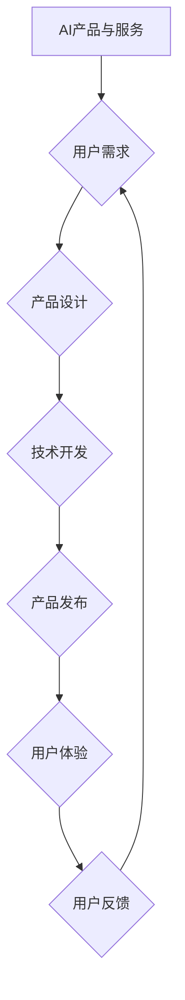

                 

## AI产品与服务的圈子：自我消化需求，拓展非AI用户群体

> 关键词：人工智能、AI产品、AI服务、用户需求、非AI用户、市场拓展、产品设计、技术落地

### 1. 背景介绍

人工智能（AI）技术近年来发展迅速，已渗透到生活的方方面面。从智能语音助手到自动驾驶汽车，AI产品和服务正在改变着我们的生活方式。然而，尽管AI技术取得了显著进展，但其应用场景仍然主要集中在技术领域和特定行业，真正面向大众的AI产品和服务仍处于发展初期。

当前，AI产品和服务面临着以下挑战：

* **用户需求消化不足:**  许多AI产品和服务缺乏清晰的用户需求，难以满足用户的实际需求。
* **技术门槛高:**  许多AI产品和服务的技术门槛较高，普通用户难以理解和使用。
* **数据隐私和安全问题:**  AI产品和服务需要大量的数据进行训练和运行，这引发了用户对数据隐私和安全的担忧。
* **伦理和社会影响问题:**  AI技术的快速发展也带来了一些伦理和社会影响问题，例如算法偏见、工作岗位替代等。

为了更好地推动AI技术的普及和应用，我们需要关注以下几个方面：

* **深入了解用户需求:**  通过用户调研、数据分析等方式，深入了解用户的真实需求，并将其转化为具体的AI产品和服务。
* **降低技术门槛:**  采用更易于理解和使用的技术方案，降低AI产品的技术门槛，使其更易于大众使用。
* **保障数据隐私和安全:**  采取有效的措施保障用户数据的隐私和安全，建立用户信任。
* **关注伦理和社会影响:**  积极探讨AI技术的伦理和社会影响问题，制定相应的规范和政策，引导AI技术健康发展。

### 2. 核心概念与联系

**2.1 AI产品与服务**

AI产品和服务是指利用人工智能技术开发的软件产品和服务，其核心功能是通过机器学习、自然语言处理等技术，模拟人类智能，为用户提供智能化体验。

**2.2 用户需求**

用户需求是指用户对AI产品和服务的期望和要求，包括功能需求、性能需求、体验需求等。

**2.3 非AI用户群体**

非AI用户群体是指对AI技术不熟悉或不了解的用户，他们可能对AI产品的功能和价值缺乏认知，也可能对AI技术的安全性、隐私性等方面存在担忧。

**2.4 拓展非AI用户群体**

拓展非AI用户群体是指通过产品设计、营销推广等方式，让更多非AI用户了解和使用AI产品和服务。

**2.5  AI产品与服务的圈子**

AI产品与服务的圈子是指围绕AI产品和服务展开的生态系统，包括AI技术开发者、产品经理、设计师、营销人员、用户等。

**Mermaid 流程图**



### 3. 核心算法原理 & 具体操作步骤

**3.1 算法原理概述**

在拓展非AI用户群体方面，我们可以利用一些核心算法原理，例如：

* **推荐算法:**  根据用户的历史行为和偏好，推荐他们可能感兴趣的AI产品和服务。
* **自然语言处理 (NLP):**  利用NLP技术，使AI产品和服务能够更好地理解用户的自然语言输入，并提供更精准的响应。
* **机器学习 (ML):**  通过机器学习算法，AI产品和服务能够不断学习和改进，提供更个性化的体验。

**3.2 算法步骤详解**

以推荐算法为例，其具体操作步骤如下：

1. **数据收集:**  收集用户的历史行为数据，例如浏览记录、购买记录、评价记录等。
2. **数据预处理:**  对收集到的数据进行清洗、转换、编码等预处理操作，使其能够被算法模型所理解。
3. **模型训练:**  选择合适的推荐算法模型，并利用预处理后的数据进行模型训练。
4. **模型评估:**  对训练好的模型进行评估，并根据评估结果进行模型调优。
5. **推荐结果输出:**  将训练好的模型应用于新的用户数据，生成推荐结果并输出给用户。

**3.3 算法优缺点**

推荐算法的优点在于能够根据用户的个性化需求提供精准的推荐，提高用户体验。但其缺点也包括：

* **数据依赖性强:**  推荐算法的准确性依赖于数据的质量和数量。
* **冷启动问题:**  对于新用户或新产品，由于缺乏历史数据，推荐算法难以给出准确的推荐。
* **推荐偏差问题:**  如果训练数据存在偏差，可能会导致推荐结果出现偏差。

**3.4 算法应用领域**

推荐算法广泛应用于电商、社交媒体、视频平台等领域，例如：

* **商品推荐:**  根据用户的浏览和购买历史，推荐他们可能感兴趣的商品。
* **内容推荐:**  根据用户的阅读和观看历史，推荐他们可能感兴趣的内容。
* **用户匹配:**  根据用户的兴趣和属性，推荐他们可能合适的合作伙伴。

### 4. 数学模型和公式 & 详细讲解 & 举例说明

**4.1 数学模型构建**

推荐算法通常采用基于用户的协同过滤模型，其核心思想是：

* **用户相似度:**  根据用户的历史行为数据，计算用户之间的相似度。
* **物品相似度:**  根据用户的历史行为数据，计算物品之间的相似度。
* **推荐策略:**  根据用户的相似度和物品相似度，预测用户对物品的评分或偏好，并推荐相应的物品。

**4.2 公式推导过程**

用户相似度可以使用余弦相似度公式计算：

$$
\text{相似度}(u_i, u_j) = \frac{\sum_{k=1}^{n} r_{i,k} \cdot r_{j,k}}{\sqrt{\sum_{k=1}^{n} r_{i,k}^2} \cdot \sqrt{\sum_{k=1}^{n} r_{j,k}^2}}
$$

其中：

* $u_i$ 和 $u_j$ 表示两个用户。
* $r_{i,k}$ 和 $r_{j,k}$ 表示用户 $u_i$ 和 $u_j$ 对物品 $k$ 的评分。
* $n$ 表示物品总数。

**4.3 案例分析与讲解**

假设有两个用户 $u_1$ 和 $u_2$，他们对三部电影的评分如下：

| 电影 | $u_1$ | $u_2$ |
|---|---|---|
| 电影 A | 5 | 4 |
| 电影 B | 3 | 5 |
| 电影 C | 4 | 3 |

根据上述评分数据，我们可以计算用户 $u_1$ 和 $u_2$ 的余弦相似度：

$$
\text{相似度}(u_1, u_2) = \frac{5 \cdot 4 + 3 \cdot 5 + 4 \cdot 3}{\sqrt{5^2 + 3^2 + 4^2} \cdot \sqrt{4^2 + 5^2 + 3^2}} = 0.75
$$

该结果表明，用户 $u_1$ 和 $u_2$ 的兴趣偏好有一定的相似性。

### 5. 项目实践：代码实例和详细解释说明

**5.1 开发环境搭建**

为了实现推荐算法，我们可以使用 Python 语言和相应的库，例如：

* **Scikit-learn:**  用于机器学习算法的实现。
* **Pandas:**  用于数据处理和分析。
* **NumPy:**  用于数值计算。

**5.2 源代码详细实现**

```python
import pandas as pd
from sklearn.metrics.pairwise import cosine_similarity

# 加载用户评分数据
ratings_data = pd.read_csv('ratings.csv')

# 计算用户之间的余弦相似度
user_similarity = cosine_similarity(ratings_data)

# 获取用户 $u_1$ 的相似用户
similar_users = user_similarity[0].argsort()[:-6:-1]

# 推荐给用户 $u_1$ 的电影
recommended_movies = ratings_data.iloc[similar_users, :].mean().sort_values(ascending=False)

# 打印推荐结果
print(recommended_movies)
```

**5.3 代码解读与分析**

该代码首先加载用户评分数据，然后使用 Scikit-learn 库的 `cosine_similarity` 函数计算用户之间的余弦相似度。

接着，代码获取用户 $u_1$ 的相似用户，并根据这些相似用户的评分数据，计算出推荐给用户 $u_1$ 的电影。

最后，代码打印出推荐结果。

**5.4 运行结果展示**

运行该代码后，会输出一个包含电影名称和评分的列表，该列表代表着推荐给用户 $u_1$ 的电影。

### 6. 实际应用场景

**6.1 电商平台**

电商平台可以利用推荐算法，根据用户的浏览和购买历史，推荐他们可能感兴趣的商品，提高用户购买率。

**6.2 社交媒体平台**

社交媒体平台可以利用推荐算法，根据用户的兴趣和好友关系，推荐他们可能感兴趣的内容，提高用户活跃度。

**6.3 视频平台**

视频平台可以利用推荐算法，根据用户的观看历史和偏好，推荐他们可能感兴趣的视频，提高用户观看时长。

**6.4 未来应用展望**

随着人工智能技术的不断发展，推荐算法将应用于更多领域，例如：

* **个性化教育:**  根据学生的学习进度和兴趣，推荐个性化的学习内容。
* **医疗保健:**  根据患者的病史和症状，推荐合适的医疗方案。
* **金融服务:**  根据用户的财务状况和风险偏好，推荐合适的理财产品。

### 7. 工具和资源推荐

**7.1 学习资源推荐**

* **Coursera:**  提供人工智能和机器学习相关的在线课程。
* **edX:**  提供人工智能和机器学习相关的在线课程。
* **Udacity:**  提供人工智能和机器学习相关的在线课程和项目。

**7.2 开发工具推荐**

* **TensorFlow:**  开源的机器学习框架。
* **PyTorch:**  开源的机器学习框架。
* **Scikit-learn:**  用于机器学习算法的 Python 库。

**7.3 相关论文推荐**

* **Collaborative Filtering for Implicit Feedback Datasets**
* **Matrix Factorization Techniques for Recommender Systems**
* **Deep Learning for Recommender Systems**

### 8. 总结：未来发展趋势与挑战

**8.1 研究成果总结**

近年来，AI产品和服务的圈子取得了显著进展，推荐算法等核心算法不断发展，并应用于越来越多的领域。

**8.2 未来发展趋势**

未来，AI产品和服务的圈子将朝着以下几个方向发展：

* **更个性化:**  AI产品和服务将更加注重用户的个性化需求，提供更精准的推荐和体验。
* **更智能化:**  AI产品和服务将更加智能化，能够更好地理解用户的需求，并提供更有效的解决方案。
* **更融合化:**  AI产品和服务将更加融合化，与其他技术和服务相结合，提供更丰富的体验。

**8.3 面临的挑战**

AI产品和服务的圈子也面临着一些挑战：

* **数据安全和隐私保护:**  AI产品和服务需要大量的数据进行训练和运行，如何保障用户数据的安全和隐私是一个重要的挑战。
* **算法公平性和可解释性:**  AI算法可能会存在偏差，导致不公平的结果，如何提高算法的公平性和可解释性是一个重要的研究方向。
* **伦理和社会影响:**  AI技术的快速发展也带来了一些伦理和社会影响问题，例如算法偏见、工作岗位替代等，需要引起重视和探讨。

**8.4 研究展望**

未来，我们需要继续加强对AI产品和服务的研发和应用，并积极应对其带来的挑战，推动AI技术更好地服务于人类社会。


### 9. 附录：常见问题与解答

**9.1 如何提高推荐算法的准确性？**

* 提高数据质量和数量。
* 选择更合适的推荐算法模型。
* 进行模型调优和评估。

**9.2 如何解决推荐算法的冷启动问题？**

* 利用用户画像和内容特征进行推荐。
* 采用协同过滤算法的改进方法，例如基于物品的协同过滤。
* 利用用户的行为数据进行预测。

**9.3 如何保障用户数据的安全和隐私？**

* 使用加密技术保护用户数据。
* 采用匿名化技术处理用户数据。
* 明确用户数据的使用范围和权限。


作者：禅与计算机程序设计艺术 / Zen and the Art of Computer Programming 
<end_of_turn>

